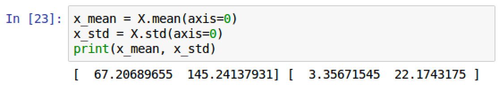

Creating a Neural Network in Spark
------------------------------------------------------

In this lab, the following recipes will be covered:


-   Creating a dataframe in PySpark
-   Manipulating columns in a PySpark dataframe
-   Converting a PySpark dataframe into an array
-   Visualizing the array in a scatterplot
-   Setting up weights and biases for input into the neural network
-   Normalizing the input data for the neural network
-   Validating array for optimal neural network performance
-   Setting up the activation function with sigmoid
-   Creating the sigmoid derivative function
-   Calculating the cost function in a neural network
-   Predicting gender based on height and weight
-   Visualizing prediction scores


Introduction
------------------------------

Much of this course will focus on building deep learning algorithms with
libraries in Python, such as TensorFlow and Keras. While these libraries
are helpful to build deep neural networks without getting deep into the
calculus and linear algebra of deep learning, this lab will do a
deep dive into building a simple neural network in PySpark to make a
gender prediction based on height and weight. One of the best ways to
understand the foundation of neural networks is to build a model from
scratch, without any of the popular deep learning libraries. Once the
foundation for a neural network framework is established, understanding
and utilizing some of the more popular deep neural network libraries
will become much simpler.


Creating a dataframe in PySpark
-------------------------------------------------

dataframes will serve as the framework for
any and all data that will be used in
building deep learning models. Similar to the `pandas` library
with Python, PySpark has its own built-in functionality to create a
dataframe.


### Getting ready

There are several ways to create a dataframe in Spark. One common way is
by importing a `.txt`, `.csv`, or `.json`
file. Another method is to manually enter fields and rows of data into
the PySpark dataframe, and while the process can be a bit tedious, it is
helpful, especially when dealing with a small dataset. To predict gender
based on height and weight, this lab will build a dataframe manually
in PySpark. The dataset used is as follows:


### How to do it\...

When working with PySpark, a
`SparkSession` must first be imported and
initialized before any dataframe creation can
occur:

1.  Import a `SparkSession` using the following script:

```
from pyspark.sql import SparkSession
```


2.  Configure a`SparkSession`:

```
spark = SparkSession.builder \
         .master("local") \
         .appName("Neural Network Model") \
         .config("spark.executor.memory", "6gb") \
         .getOrCreate()
sc = spark.sparkContext
```


3.  In this situation, the `SparkSession``appName`
    has been named `Neural Network Model` and `6gb`
    has been assigned to the session memory. 


### How it works\...

This section explains how we create our Spark cluster and configure our
first dataframe.

1.  In Spark, we use `.master()` to specify whether we will
    run our jobs on a distributed cluster or locally.  For the purposes
    of this lab and the remaining labs, we will be executing
    Spark locally with one worker thread as specified with
    `.master('local')`.  This is fine for testing and
    development purposes as we are doing in this lab; however, we
    may run into performance issues if we deployed this to production. 
    In production, it is recommended to use
    `.master('local[*]')` to set Spark to run on as many
    worker nodes that are available locally as possible. If we had 3
    cores on our machine and we wanted to set our node count to match
    that, we would then specify `.master('local[3]')`. 


2.  The `dataframe` variable, `df`, is first created
    by inserting the row values for each column and then by inserting the column header
    names using the following script:

```
df = spark.createDataFrame([('Male', 67, 150), # insert column values
                            ('Female', 65, 135),
                            ('Female', 68, 130),
                            ('Male', 70, 160),
                            ('Female', 70, 130),
                            ('Male', 69, 174),
                            ('Female', 65, 126),
                            ('Male', 74, 188),
                            ('Female', 60, 110),
                            ('Female', 63, 125),
                            ('Male', 70, 173),
                            ('Male', 70, 145),
                            ('Male', 68, 175),
                            ('Female', 65, 123),
                            ('Male', 71, 145),
                            ('Male', 74, 160),
                            ('Female', 64, 135),
                            ('Male', 71, 175),
                            ('Male', 67, 145),
                            ('Female', 67, 130),
                            ('Male', 70, 162),
                            ('Female', 64, 107),
                            ('Male', 70, 175),
                            ('Female', 64, 130),
                            ('Male', 66, 163),
                            ('Female', 63, 137),
                            ('Male', 65, 165),
                            ('Female', 65, 130),
                            ('Female', 64, 109)], 
                           ['gender', 'height','weight']) # insert header values
```


3.  In PySpark, the `show()` function gives the
    ability to preview the **`top 20 rows`**,
    as seen in the following screenshot when
    using the preceding script:


### There\'s more\...

The `.show()` functionality defaults to 20 rows if not
explicitly stated.  If we only wanted to show the first 5 rows of a
dataframe, we would need to explicitly state it as seen in the following
script: `df.show(5)`.

### See also

In order to learn more about SparkSQL, dataframes, functions, and data
sets in PySpark, visit the following website:

<https://spark.apache.org/docs/latest/sql-programming-guide.html>


Manipulating columns in a PySpark dataframe
-------------------------------------------------------------

The dataframe is almost complete; however, there is one issue that
requires addressing before building the
neural network. Rather than keeping
the gender value as a string, it is better to convert the value to a
numeric integer for calculation purposes, which will become more evident
as this lab progresses.


### Getting ready

This section will require  importing the following:


-   `from pyspark.sql import functions`


### How to do it\...

This section walks through the steps for the string conversion to a
numeric value in the dataframe:


-   Female \--\> 0 
-   Male \--\> 1


1.  Convert a column value inside of a dataframe requires
    importing `functions`:

```
from pyspark.sql import functions
```


2.  Next, modify the `gender` column to a numeric value using
    the following script:

```
df = df.withColumn('gender',functions.when(df['gender']=='Female',0).otherwise(1))
```


3.  Finally, reorder the columns so that `gender` is the last
    column in the dataframe using the following script:

```
df = df.select('height', 'weight', 'gender')
```


### How it works\...

This section explains how the manipulation of
the dataframe is applied.

1.  `functions from pyspark.sql` have several useful logic
    applications that can be used to apply
    if-then transformations to columns in a Spark dataframe.  In our
    case, we are converting `Female` t0 0 and `Male`
    to 1.
2.  The function to convert to numeric is applied to the Spark dataframe
    using the `.withColumn()` transformation. 
3.  The `.select()` feature for a Spark dataframe functions
    like traditional SQL by selecting the columns in the order and
    manner requested.
4.  A final preview of the dataframe will display the updated dataset,
    as seen in the following screenshot:


### There\'s more\...

In addition to the `withColumn()` method for a dataframe,
there is also the `withColumnRenamed()` method, which is used
for renaming columns in a dataframe.


Converting a PySpark dataframe to an array
------------------------------------------------------------

In order to form the building blocks of the
neural network, the PySpark dataframe must be
converted into an array. Python has a very powerful library,
`numpy`, that makes working with arrays simple.


### Getting ready

The `numpy` library should be already available with the
installation of the `anaconda3` Python package. However, if
for some reason the `numpy` library is not available, it can
be installed using the following command at the terminal:


`pip install` or `sudo pip install` will confirm
whether the requirements are already satisfied by using the requested
library:

```
import numpy as np
```


### How to do it\...

This section walks through the steps to convert the dataframe into an
array:

1.  View the data collected from the dataframe using the following
    script:

```
df.select("height", "weight", "gender").collect()
```


2.  Store the values from the collection into an array
    called `data_array` using the following script:

```
data_array =  np.array(df.select("height", "weight", "gender").collect())
```


3.  Execute the following script to access the first row of the array:

```
data_array[0]
```


4.  Similarly, execute the following script to access the final row of
    the array:

```
data_array[28]
```


### How it works\...

This section explains how the dataframe is
converted into an array:

1.  The output of our dataframe can be collected using
    `collect()` and viewed as seen in the following
    screenshot:


2.  The dataframe is converted into an
    array and the output of the array from
    that script can be seen in the following screenshot:


3.  Any set of `height`, `weight`,
    and `gender` values can be accessed by referencing the
    index of the array. The array has a shape of **`(29,3)`** with a
    length of 29 elements, and each element is composed of three items.
    While the length is 29, the index starts at `[0]` and ends
    at `[28]`.  The outputs for the shape of the array as well
    as the first and last rows of the array can be seen in the following
    screenshot:


4.  The first and last values of the array can be compared with the
    original dataframe to confirm that the values and order have not
    changed as a result of the conversion.


### There\'s more\...

In addition to viewing the data points in an array, it is also useful to
retrieve the minimum and maximum points of each feature in an array:

1.  To retrieve the minimum and maximum values for `height`,
    `weight`, and `gender`, the following script can
    be used:

```
print(data_array.max(axis=0))
print(data_array.min(axis=0))
```


2.  The output from the script can be seen in the following screenshot:


The maximum `height` is `74` inches and minimum
`height` is `60` inches. The maximum weight is
`188` lbs, while the minimum weight is `107` lbs.
The minimum and maximum values for gender are not as relevant, as we
have assigned them numeric values of `0` and `1`. 

### See also

To learn more about numpy, visit the following website:

[www.numpy.org](http://www.numpy.org/)


Visualizing an array in a scatterplot
-------------------------------------------------------

The goal of the neural network that will be
developed in this lab is to predict the
gender of an individual if the `height` and `weight`
are known. A powerful method for understanding the relationship between
`height`, `weight`, and `gender` is by
visualizing the data points feeding the neural network. This can be done
with the popular Python visualization library `matplotlib`.


### Getting ready

As was the case with `numpy`, `matplotlib` should be
available with the installation of the anaconda3 Python package.
However, if for some reason`matplotlib` is not available, it
can be installed using the following command at the terminal:


`pip install` or`sudo pip install` will confirm the
requirements are already satisfied by using the requested library.

### How to do it\...

This section walks through the steps to visualize an
array through a scatterplot.

1.  Import the `matplotlib` library and configure the library
    to visualize plots inside of the Jupyter notebook using the
    following script:

```
 import matplotlib.pyplot as plt
 %matplotlib inline
```


2.  Next, determine the minimum and maximum values of
    the [*x*] and y-axes of the scatterplot using the `min()` and `max()`
    functions from `numpy`, as seen in the following script:

```
min_x = data_array.min(axis=0)[0]-10
max_x = data_array.max(axis=0)[0]+10
min_y = data_array.min(axis=0)[1]-10
max_y = data_array.max(axis=0)[1]+10
```


3.  Execute the following script to plot
    the`height`and`weight`for
    each`gender`:

```
# formatting the plot grid, scales, and figure size
plt.figure(figsize=(9, 4), dpi= 75)
plt.axis([min_x,max_x,min_y,max_y])
plt.grid()
for i in range(len(data_array)):
    value = data_array[i]
    # assign labels values to specific matrix elements
    gender = value[2]
    height = value[0]
    weight = value[1]

    # filter data points by gender
    a = plt.scatter(height[gender==0],weight[gender==0], marker 
      = 'x', c= 'b', label = 'Female')
    b = plt.scatter(height[gender==1],weight[gender==1], marker 
      = 'o', c= 'b', label = 'Male')

   # plot values, title, legend, x and y axis
   plt.title('Weight vs Height by Gender')
   plt.xlabel('Height (in)')
   plt.ylabel('Weight (lbs)')
   plt.legend(handles=[a,b])
```


### How it works\...

This section explains how an array is plotted
as a scatterplot:

1.  The `matplotlib` library is imported into the Jupyter
    notebook and the `matplotlib` libraryis configured to plot
    visualizations inline in the cells of the Jupyter notebook
2.  The minimum and maximum values of the x and y-axes are determined to
    size up our plot and give us an optimal looking graph.  The output
    of the script can be seen in the following screenshot:


3.  A `10`-point pixel buffer has been added to each axis to ensure all data points are captured
    without being cut off.

4.  A loop is created to iterate through each row of values and plot the
    `weight` versus the `height`.

5.  Additionally, a different style point is assigned to the
    `Female gender`, `x`, and the
    `Male gender`, `o`.


6.  The output of the script to plot the
    **`Weight vs Height by Gender`** can be seen in the
    following screenshot:


### There\'s more\...

The scatterplot gives a quick and easy visual interpretation of what is
going on with the data. There is an apparent divide between the
upper-right quadrant and the lower-left quadrant of the scatterplot. All
of the data points above 140 lbs indicate a `Male gender`,
with all of the data points below that belong to the
`Female gender`, as seen in the following screenshot:


This scatterplot will help confirm what is to be expected when picking a
random height and weight to predict the outcome of the gender when the
neural network is created later on in this lab.

### See also

To learn more about `matplotlib`, visit the
following website:

[www.matplotlib.org](http://www.matplotlib.org/)


Setting up weights and biases for input into the neural network
---------------------------------------------------------------------------------

The framework in PySpark and the data are now complete. It is time to
move on to building the neural network.
Regardless of the complexity of the neural
network, the development follows a similar path:

1.  Input data
2.  Add the weights and biases
3.  Sum the product of the data and weights


4.  Apply an activation function
5.  Evaluate the output and compare it to the desired outcome


This section will focus on setting the weights that create the input
which feeds into the activation function.


### Getting ready

A cursory understanding of the building blocks of a simple
neural network is helpful in understanding
this section and the rest of the lab.  Each neural network has inputs and outputs.  In our case, the inputs are
the height and weight of the individuals and the output is the gender. 
In order to get to the output, the inputs are multiplied with values
(also known as weights: w1 and w2) and then a bias (b) is added to the
end.  This equation is known as the summation function, z, and is given
the following equation:

z = (input1) x (w1) + (input2) x (w2) + b

The weights and the bias are initially just random generated values that
can be performed with `numpy`. The weights will literally add
weight to inputs by increasing or decreasing their impact on the output.
The bias will serve a slightly different role in that it will shift the
baseline of the summation (z) upwards or downwards, depending on what is
needed to meet the prediction. Each value of z is then converted into a
predicted value between 0 and 1 through an activation function.  The
activation function is a converter that gives us a value that we can
convert into a binary output (male/female). The predicted output is then
compared with the actual output.  Initially, the difference between the
predicted and actual output will be large as the weights will be random
when first starting out.  However, a process known as backpropagation is
used to minimize the difference between the actual and the predicted
using a technique known as gradient descent.  Once we settle on a
negligible difference between the actual and predicted, we store the
values of w1, w2, and b for the neural network.

### How to do it\...

This section walks through the steps to set up the weights and bias of
the neural network.

1.  Set the randomness of the value generator using the following
    script:

```
np.random.seed(12345)
```


2.  Set the weights and biases using the following script:

```
w1 = np.random.randn()
w2 = np.random.randn()
b= np.random.randn()
```


### How it works\...

This section explains how the weights and bias are initialized for use
in later parts of this lab:

1.  The weights are generated randomly
    using `numpy`, and a random seed is set to ensure the same
    random numbers are generated each time
2.  The weights will be assigned a generic variable
    of `w1` and `w2`
3.  The bias is also generated randomly using `numpy` and a
    random seed is set to maintain the same random numbers is generated
    each time
4.  The bias will be assigned a generic variable of `b`
5.  The values are inserted into a summation function, `z`,
    which populates an initial score that will feed into another
    function, the activation function, to be discussed later on in this
    lab
6.  At the moment, all three variables are completely random.  The output of `w1`, `w2`,
    and `b` can be seen in the following screenshot:


### There\'s more\...

Ultimately, the goal is to get a predicted output that matches the
actual output. Summing the product of the weights and the values helps
achieve part of this process. Therefore, a random input of
`0.5` and `0.5` would have a summation output of the
following:

```
z = 0.5 * w1 + 0.5 * w2 + b 
```


Or it would have the following output with our current random values for
our weights, `w1` and `w2`:

```
z = 0.5 * (-0.2047) + 0.5 * (0.47894) + (-0.51943) = -7.557
```


The variable `z` is assigned as the product summation of the
weights with the data points. Currently, the weights and biases are
completely random. However, as mentioned earlier in the section, through
a process called backpropagation[*,*] using gradient descent,
the weights will be tweaked until a more desirable outcome is
determined. Gradient descent is simply the process of identifying the
optimal values for our weights that will give us the best prediction
output with the least amount of error.  The process of identifying the
optimal values involves identifying the local minimum of a function.
Gradient descent will be discussed later on in this lab.

### See also

In order to learn more about weights and biases in an
artificial neural network, visit the
following website:

<https://en.wikipedia.org/wiki/Artificial_neuron>


Normalizing the input data for the neural network
-------------------------------------------------------------------

Neural networks work more efficiently when the inputs are normalized. This minimizes
the magnitude of a particular input affecting the overall outcome over
other potential inputs that have lower values of magnitude. This section
will normalize the `height` and `weight` inputs of
the current individuals.


### Getting ready

The normalization of input values requires obtaining the mean and
standard deviation of those values for the final calculation.

### How to do it\...

This section walks through the steps to normalize the height and weight.

1.  Slice the array into inputs and outputs
    using the following script:

```
X = data_array[:,:2]
y = data_array[:,2]
```


2.  The mean and the standard deviation can be calculated across the 29
    individuals using the following script:

```
x_mean = X.mean(axis=0)
x_std = X.std(axis=0)
```


3.  Create a normalization function to normalize `X` using the
    following script:

```
 def normalize(X):
     x_mean = X.mean(axis=0)
     x_std = X.std(axis=0)
     X = (X - X.mean(axis=0))/X.std(axis=0)
     return X
```


### How it works\...

This section explains how the height and weight are normalized.

1.  The `data_array` matrix is split into two matrices:

    1.  `X` is composed of the height and the weight
    2.  `y` is composed of the gender


3.  The output of both arrays can be seen in the following screenshot:


4.  The `X` component is the input and is the only part that
    will undergo the normalization process.
    The [*y*] component, or the gender, will be disregarded
    for the moment. The normalization process
    involves extracting the mean and standard deviation of both
    inputs for all 29 individuals. The output
    of the mean and standard deviations for the height and weight can be
    seen in the following screenshot:





5.  The mean of the height is \~**`67`** inches and the standard
    deviation of the height is \~**`3.4`** inches. The mean of the
    weight is \~**`145`** lbs and the standard deviation of the weight
    is \~**`22`** lbs.


6.  Once they are extracted, the inputs are
    normalized using the following equation:
    `X_norm = (X - X_mean)/X_std`.

7.  The`X`array is normalized using the Python
    function`normalize()`and the`X`array is now
    assigned to the values of the newly minted normalized set, as seen
    in the following screenshot:


### See also

In order to learn more about normalization in
statistics, visit the following website:

<https://en.wikipedia.org/wiki/Normalization_(statistics)>


Validating array for optimal neural network performance
-------------------------------------------------------------------------

A little bit of validation goes a long way in ensuring that our array is normalized for
optimal performance within our upcoming neural network.  


### Getting ready

This section will require a bit of `numpy` magic using the
`numpy.stack()` function.

### How to do it\...

The following steps walk through validating that our array has been
normalized.

1.  Execute the following step to print the mean and standard deviation
    of array inputs:

```
print('standard deviation')
print(round(X[:,0].std(axis=0),0))
print('mean')
print(round(X[:,0].mean(axis=0),0))
```


2.  Execute the following script to combine height, weight, and gender
    into one array, `data_array`:

```
data_array = np.column_stack((X[:,0], X[:,1],y))
```


### How it works\...

This section explains how the array is validated and constructed for
optimal future use within the neural network.

1.  The new `mean` of the height should be 0 and
    the `standard deviation` should be 1. This can be seen in
    the following screenshot:


2.  This is confirmation of a normalized dataset, as it includes a mean
    of 0 and a standard deviation of 1.
3.  The original `data_array` is no longer useful for a neural
    network because it contains the original, non-normalized, input
    values for `height`, `weight`,
    and `gender`.
4.  Nonetheless, with a little bit
    of `numpy` magic, `data_array` can be
    restructured to include the
    normalized `height` and `weight`, along
    with `gender`.  This is done
    with`numpy.stack()`.   The output of the new
    array,`data_array`, can be seen in the following
    screenshot:


### There\'s more\...

Our array is now all set.  Our inputs for height and weight are
normalized and our output for gender is labeled as 0 or 1.

### See also

To learn more about
`numpy.stack()`, visit the following website:

<https://docs.scipy.org/doc/numpy/reference/generated/numpy.stack.html>


Setting up the activation function with sigmoid
-----------------------------------------------------------------

An activation function is used in a neural network to help determine the output, whether it is a yes or no,
true or false, or in our case 0 or 1 (male/female).  At this point, the
inputs have been normalized and have been
summed with the weights and bias: `w1`, `w2`, and
`b`. However, the weights and bias are completely random at
the moment and are not optimized to produce a predicted output that
matches the actual output. The missing link in building the predicted
outcome resides with the activation or `sigmoid` function,
which is shown in the following diagram:


If the number that is produced out of the
summation is very small, it will produce an activation of 0. Likewise,
if the number produced out of the summation is quite large, it will
produce an activation of 1. This function is
useful because it restricts the output to a binary outcome, which is
quite useful for classification. The consequences of these outputs will
be discussed and clarified in the remainder of this lab.


### Getting ready

The `sigmoid` function is similar to the logistic regression
function in that it computes a probabilistic outcome between 0 and 1.
Additionally, it gives a range of everything in -between. Therefore, a
condition could be set to associate any value greater than 0.5 to 1 and
less than 0.5 to 0.

### How to do it\...

This section walks through the steps of creating and plotting a sigmoid
function with sample data.

1.  Create the `sigmoid` function using a Python function, as
    seen in the following script:

```
def sigmoid(input):
  return 1/(1+np.exp(-input))
```


2.  Create sample `x` values for the `sigmoid` curve
    using the following script:

```
X = np.arange(-10,10,1)
```


3.  Additionally, create sample `y` values for
    the `sigmoid` curve using the following script:

```
Y = sigmoid(X)
```


4.  Plot the `x` and `y` values for these points
    using the following script:

```
plt.figure(figsize=(6, 4), dpi= 75)
plt.axis([-10,10,-0.25,1.2])
plt.grid()
plt.plot(X,Y)
plt.title('Sigmoid Function')
plt.show()
```


### How it works\...

This section explains the mathematics behind
the sigmoid function.

1.  The `sigmoid` function is a specialized version of the
    logistic regression used for
    classification. The calculation of the logistic regression is
    expressed with the following formula:


2.  The variables for the logistic regression function stand for the
    following:
    
    -   [*L*] stands the maximum value of the function
    -   [*k*] stands for the steepness of the curve
    -    [*x~midpoint~*] stands for the midpoint value of the
        function

3.  Since the `sigmoid` function has a steepness of value 1, a
    midpoint of 0, and a maximum value of 1, it produces the following
    function:


4.  We can plot a general sigmoid function with x-values ranging from -5
    to 5, and y-values ranging from 0 to 1 as seen in the following
    screenshot:


5.  We created our own `sigmoid` function with Python and
    plotted it using sample data between
    `-10` and `10`.  Our plot looks very similar to
    the previous general sigmoid plot.  The
    output of our `sigmoid` function can be seen in the
    following screenshot:


### See also

In order to learn more about the origin of
the `sigmoid` function, visit the following website:

<https://en.wikipedia.org/wiki/Sigmoid_function>

Creating the sigmoid derivative function
----------------------------------------------------------

The sigmoid function is a unique function where the value of the derivative of the sigmoid function includes the value
of the sigmoid function.  You may be asking what\'s the big deal. 
However, since the sigmoid function is already calculated it allows for
simpler and more efficient processing when performing backpropagation
over many layers.  Additionally, it is the derivative of the sigmoid
function that is used in the calculation to derive the optimal
`w1`, `w2`, and `b` values to derive the
most accurate predicted output. 


### Getting ready

A cursory understanding of derivatives from calculus will assist in
understanding the sigmoid derivative function.

### How to do it\...

This section walks through the steps to create a sigmoid derivative
function.

1.  Just like the `sigmoid` function, create the derivative of
    the `sigmoid` function can with Python using the following
    script:

```
def sigmoid_derivative(x):
    return sigmoid(x) * (1-sigmoid(x))
```


2.  Plot the derivative of the `sigmoid` function alongside
    the original `sigmoid` function using the following
    script:

```
plt.figure(figsize=(6, 4), dpi= 75)
plt.axis([-10,10,-0.25,1.2])
plt.grid()
X = np.arange(-10,10,1)
Y = sigmoid(X)
Y_Prime = sigmoid_derivative(X)
c=plt.plot(X, Y, label="Sigmoid",c='b')
d=plt.plot(X, Y_Prime, marker=".", label="Sigmoid Derivative", c='b')
plt.title('Sigmoid vs Sigmoid Derivative')
plt.xlabel('X')
plt.ylabel('Y')
plt.legend()
plt.show()
```


### How it works\...

This section explains the math behind the derivative of the
sigmoid function along with the logic to
create the derivative of the sigmoid function with Python.

1.  The neural network will require the derivative of
    the `sigmoid` function to predict an accurate output
    for `gender`. The derivative of
    the `sigmoid` function is calculated using the following
    formula:


2.  We can then create the derivative of the sigmoid function,
    `sigmoid_derivate()`, using the original sigmoid function,
    `sigmoid()`, in Python. We can plot both functions side by
    side as seen in the following screenshot:


3.  **`Sigmoid Derivative`** tracks the slope of the original
    **`Sigmoid`** function. Early on in the plot, when the slope of the
    **`Sigmoid`** is completely horizontal, the **`Sigmoid Derivative`**
    is also **`0.0`**.  The same holds true for **`Sigmoid`** when the
    value is approaching 1 as the slope is also almost completely
    horizontal. The peak value of the slope of **`Sigmoid`** is at the
    midpoint of the x-axis. Consequently, this is also the peak value of
    **`Sigmoid Derivative`**.


### See also

To get a deeper dive into derivatives, visit the
following website:

<https://www.khanacademy.org/math/calculus-home/taking-derivatives-calc>


Calculating the cost function in a neural network
-------------------------------------------------------------------

At this point, it is time to bring together all of the
parts highlighted earlier on in the lab
to calculate the cost function, which will be
used by the neural network to determine how well the predicted outcome
matched the original or actual outcome, given the 29 individual data
points that are currently available. The purpose of the cost function is
to identify the difference between the actual value and the predicted
value.  Gradient descent is then used to either increase or decrease the
values for `w1`, `w2`, and `b` to decrease
the value of the cost function and ultimately achieve our goal of
deriving a predicted value that matches the actual value.


### Getting ready

The formula for the cost function is the following:

cost(x)=(predicted-actual)^2^

If the cost function looks familiar, it\'s because it is really just
another way of minimizing the squared difference between the actual
output and the prediction. The purpose of gradient descent or
backpropagation in a neural network is to minimize the cost function
until the value is close to 0. At that point, the weights and bias
(`w1`, `w2`, and `b`) will no longer be
random insignificant values generated by `numpy`, but actual
significant weights contributing to a neural network model.

### How to do it\...

This section walks through the steps to calculate the
cost function.

1.  Set a  learning rate value of `0.1` to
    incrementally change the weights and bias
    until a final output is selected using the following script:

```
learningRate = 0.1
```


2.  Initiate a Python list called `allCosts` using the
    following script. 

```
allCosts = []
```


3.  Create a `for` loop that will iterate through 100,000
    scenarios using the following script:


4.  Plot the cost values collected over the
    100,000 iterations using the following
    script:

```
plt.plot(all_costs)
plt.title('Cost Value over 100,000 iterations')
plt.xlabel('Iteration')
plt.ylabel('Cost Value')
plt.show()
```


5.  The final values of the weights and bias can be viewed using the
    following script:

```
print('The final values of w1, w2, and b')
print('---------------------------------')
print('w1 = {}'.format(w1))
print('w2 = {}'.format(w2))
print('b = {}'.format(b))
```


### How it works\...

This section explains how the cost function is used to generate weights
and bias.

1.  A `for` loop will be implemented that will perform
    gradient descent on the weights and bias to tweak the values until
    the cost function gets close to 0.
2.  The loop will iterate over the cost function 100,000 times. Each
    time, a random value
    for `height` and `weight` from the 29
    individuals is selected.
3.   A summation value, `z`, is calculated from the
    random `height` and `weight`, and the input is
    used to calculate a `predictedGender` score with
    the `sigmoid` function.
4.  The cost function is calculated and added to a list that tracks all
    cost functions through the 100,000 iterations, `allCosts`.
5.  A series of partial derivatives is calculated with respect to the
    summation value (`z`) as well as
    the `cost` function (`cost`).
6.  These calculations are ultimately used to update the weights and
    bias with respect to the cost function until they
    (`w1`, `w2`, and `b`) return a value
    that is close to 0 for the cost function over the 100,000
    iterations.
7.  Ultimately, the goal is for the values to be decreasing for the cost
    function as the iterations increase.  The output of the cost
    function values over the 100,000 iterations can be seen in the
    following screenshot:


8.  Over the course of the iterations, the cost value dropped from
    \~0.45 to \~0.01.
9.  Additionally, we can view the final output for the values
    of `w1`, `w2`, and `b` that produced
    the lowest value of the cost function as seen in the following
    screenshot:


### There\'s more\...

The ability to test the final values of the weights and bias
is now available to compute how well the cost function worked to compute
a predicted and how it compared to the actual score.

The following script will create a loop through each individual and
calculate a predicted gender score based on the weights (`w1`,
`w2`) and the bias (`b`):

```
for i in range(len(data_array)):
    random_individual = data_array[i]
    height = random_individual[0]
    weight = random_individual[1]
    z = height*w1 + weight*w2 + b
    predictedGender=sigmoid(z)
    print("Individual #{} actual score: {} predicted score:                           {}".format(i+1,random_individual[2],predictedGender))
```


The output of the script can be seen in the following screenshot:


All 29 of the actual scores approximately match the predicted scores
when rounded. While this is good for confirming the model produced
matching results on the training data, ultimately, the test will be to
determine whether the model can make accurate gender predictions on new
individuals introduced to it.

### See also

In order to learn more about minimizing cost functions or squared
(difference) error functions using gradient
descent, visit the following site:

<https://en.wikipedia.org/wiki/Gradient_descent>


Predicting gender based on height and weight
--------------------------------------------------------------

A predictive model is only useful if it can
actually predict based on new information. This is the case with a
simple logistic or linear regression, or a more complex neural network
model.


### Getting ready

This is where the fun begins. The only requirements for this
section are to pull sample data points for
both male and female individuals and use their height and weight values
to measure the accuracy of the model created in the previous section.

### How to do it\...

This section walks through the steps to predict gender based on height
and weight.

1.  Create a Python function called `input_normalize` to input
    new values for `height` and `weight` and output
    a normalized height and weight, as seen in the following script:

```
def input_normalize(height, weight):
    inputHeight = (height - x_mean[0])/x_std[0]
    inputWeight = (weight - x_mean[1])/x_std[1]
    return inputHeight, inputWeight
```


2.  Assign a variable called `score` to the function for the
    values of `70` inches for
    the `height` and `180` lbs for
    the `weight`, as seen in the following script:

```
score = input_normalize(70, 180)
```


3.  Create another Python function, called `predict_gender`,
    to output a probability score, `gender_score`, between 0
    and 1, as well as a gender description, by applying the summation
    with `w1`, `w2`, and `b` as well as
    the `sigmoid` function, as seen in the following script:

```
def predict_gender(raw_score):
    gender_summation = raw_score[0]*w1 + raw_score[1]*w2 + b
    gender_score = sigmoid(gender_summation)
    if gender_score <= 0.5:
        gender = 'Female'
    else:
        gender = 'Male'
    return gender, gender_score
```


### How it works\...

This section explains how new inputs for height and weight are used to
generate a prediction score for gender.

1.  A function is created to input new height and weight values and
    convert the actual values to normalized height and weight values
    called `inputHeight` and `inputWeight`
2.  A variable, `score`, is used to store the normalized
    values and another function, `predictGender`, is created
    to input the score values and output a gender score and description
    based on the values of `w1`, `w2`,
    and `b` that were created in the previous section.  These
    values have already been pre-adjusted using gradient descent to
    tweak the values and minimize the `cost` function.
3.  Applying the `score` value to
    the `predict_gender` function should reveal the
    **`gender`** description and **`score`**, as seen in the following
    screenshot:


4.  It appears that the specifications of `70` inches
    in `height` and `180` lbs
    in `weight` is a high predictor (99.999%) for **`Male`**.
5.  Another test for `50` inches in `height` and
    `150` lbs in `weight` will likely reveal a
    different gender, as seen in the following screenshot:


6.  Similarly, this input produces a very low score from
    the `sigmoid` function (0.00000000839) indicating that
    these features are closely associated with
    the `Female` gender.


### See also

In order to learn more about testing, training, and validation data
sets, visit the following website:

<https://en.wikipedia.org/wiki/Training,_test,_and_validation_sets>


Visualizing prediction scores
-----------------------------------------------

While we can individually predict the gender
based on an individual with a certain height and weight, the entire
dataset can be graphed and scored using every data point to determine
whether the output is going to score a female or a male.


### Getting ready

There are no dependencies required for this section.

### How to do it\...

This section walks through the steps to visualize all of the predicted
points in a graph.

1.  Compute the minimum and maximum points of the graph  using the
    following script:

```
x_min = min(data_array[:,0])-0.1
x_max = max(data_array[:,0])+0.1
y_min = min(data_array[:,1])-0.1
y_max = max(data_array[:,1])+0.1
increment= 0.05

print(x_min, x_max, y_min, y_max)
```


2.  Generate [*x*] and [*y*] values in increments
    of 0.05 units and then create an array called `xy_data`,
    as seen in the following script:

```
x_data= np.arange(x_min, x_max, increment)
y_data= np.arange(y_min, y_max, increment)
xy_data = [[x_all, y_all] for x_all in x_data for y_all in y_data]
```


3.  Finally, a similar script to that used earlier in the
    lab is used to generate a gender
    score and populate a graph, as seen in the following script:

```
for i in range(len(xy_data)):
    data = (xy_data[i])
    height = data[0]
    weight = data[1] 
    z_new = height*w1 + weight*w2 + b
    predictedGender_new=sigmoid(z_new)
    # print(height, weight, predictedGender_new)
    ax = plt.scatter(height[predictedGender_new<=0.5],
            weight[predictedGender_new<=0.5],     
            marker = 'o', c= 'r', label = 'Female')    
    bx = plt.scatter(height[predictedGender_new > 0.5],
            weight[predictedGender_new>0.5], 
            marker = 'o', c= 'b', label = 'Male') 
    # plot values, title, legend, x and y axis
    plt.title('Weight vs Height by Gender')
    plt.xlabel('Height (in)')
    plt.ylabel('Weight (lbs)')
    plt.legend(handles=[ax,bx])
```


### How it works\...

This section explains how the data points are created to generate
prediction values that will be graphed.

1.  The minimum and maximum values of the graph are computed based on
    the array values. The output of the script can be seen in the
    following screenshot:


2.  We generate x and y values for each data point within the
    minimum and maximum values within 0.05
    increments and then run each (x,y) point into the prediction score
    to plot the values.  The **`Female`** gender score is assigned a red
    color and the **`Male`** gender score is assigned a blue color as
    seen in the following screenshot:


3.  The graph shows the cutoff between the gender scores depending on
    the `height` and `weight` selected.
