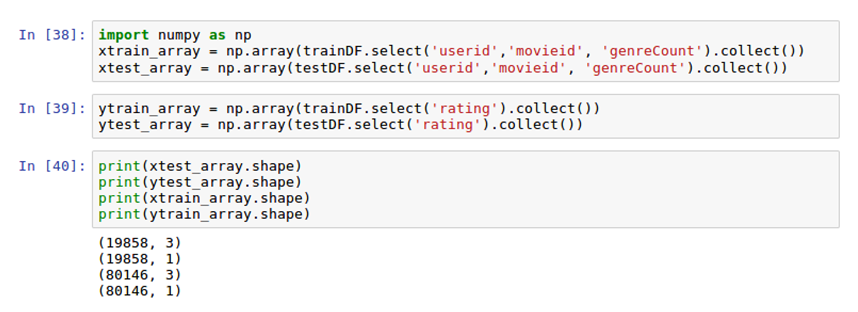

Chapter 12. Creating a Movie Recommendation Engine with Keras
----------------------------------------------------------------------

The following recipes will be covered in this lab:


-   Downloading MovieLens datasets
-   Manipulating and merging the MovieLens datasets
-   Exploring the MovieLens datasets
-   Preparing dataset for the deep learning pipeline
-   Applying the deep learning pipeline with Keras
-   Evaluating the recommendation engine\'s accuracy

Downloading MovieLens datasets
------------------------------------------------

There is a great research lab center that
began in 1992 in Minneapolis, MN called **GroupLens**,
which focuses on recommendation engines and has
graciously put together millions of rows of data over several years from
the MovieLens website. We will use its dataset as our data source for
training our recommendation engine model.


### Getting ready

The MovieLens dataset is housed and maintained by GroupLens on the
following website:

<https://grouplens.org/datasets/movielens/>.

It is important to note that the dataset we will use will come directly
from their website and not from a third-party intermediary or
repository. Additionally, there are two different datasets that are
available for us to query:


-   Recommended for new research
-   Recommended for education and development

The purpose of using this dataset is purely for educational purposes, so
we will download the data from the **`education and development`**
section of the website. The educational data still contains a
significant number of rows for our model, as it contains 100,000
ratings, as seen in the following screenshot:


Additionally, this dataset has information regarding over 600 anonymous
users collected over a period of several years between 1/9/1995 and
3/31/2015. The dataset was last updated in
October 2017.


### Note

F Maxwell Harper and Joseph A Konstan, 2015. [*The MovieLens Datasets:
History and Context*]. ACM **Transactions on Interactive
Intelligent Systems** (**TiiS**) 5, 4, Article 19
(December 2015), 19 pages. DOI:<http://dx.doi.org/10.1145/2827872>


### How to do it\...

This section will cover downloading and unzipping the MovieLens dataset:

1.  Download the research version of the smaller MovieLens dataset,
    which is available for public download at the following
    website: <https://grouplens.org/datasets/movielens/latest/>.


 

2.  Download the `ZIP` file called
    `ml-latest-small.zip` to one of our local folders, as seen
    in in the following screenshot:


3.  When `ml-latest-small.zip` is downloaded and unzipped, the
    following four files should be extracted:

    1.  `links.csv`
    2.  `movies.csv`
    3.  `ratings.csv`
    4.  `tags.csv`

4.  Execute the following script to begin our
    `SparkSession`:

```
spark = SparkSession.builder \
         .master("local") \
         .appName("RecommendationEngine") \
         .config("spark.executor.memory", "6gb") \
         .getOrCreate()
```


5.  Confirm the following six files are available for access by
    executing the following script:

```
import os
os.listdir('ml-latest-small/')
```


6.  Load each dataset into a Spark dataframe using the following script:

```
movies = spark.read.format('com.databricks.spark.csv')\
            .options(header='true', inferschema='true')\
            .load('ml-latest-small/movies.csv')
tags = spark.read.format('com.databricks.spark.csv')\
            .options(header='true', inferschema='true')\
            .load('ml-latest-small/tags.csv')
links = spark.read.format('com.databricks.spark.csv')\
            .options(header='true', inferschema='true')\
            .load('ml-latest-small/links.csv')
ratings = spark.read.format('com.databricks.spark.csv')\
            .options(header='true', inferschema='true')\
            .load('ml-latest-small/ratings.csv')
```


7.  Confirm the row counts for each dataset by executing the following
    script:

```
print('The number of rows in movies dataset is {}'.format(movies.toPandas().shape[0]))
print('The number of rows in ratings dataset is {}'.format(ratings.toPandas().shape[0]))
print('The number of rows in tags dataset is {}'.format(tags.toPandas().shape[0]))
print('The number of rows in links dataset is {}'.format(links.toPandas().shape[0]))
```


### How it works\...

This section will focus on explaining the fields in each of the datasets
available in the MovieLens 100K dataset. Take a look at these steps:

1.  The datasets are all available in the zipped file,
    `ml-latest-small.zip`, where the `ratings.csv`
    dataset will serve as the pseudo-fact table of our data, since it
    has transactions for each movie that is rated. The dataset,
    `ratings`, has the four column names shown in the
    following screenshot:


2.  The dataset shows the **`rating`** selected by each **`userId`**
    over the course of their time, from the earliest rating to the
    latest rating. The range of a **`rating`** can vary from 0.5 to 5.0
    stars, as seen by `userId = 1` in the following
    screenshot:


3.  The `tags` dataset contains a **`tag`** column that
    contains a specific word or phrase used by that user to describe a
    specific **`movieId`** at a specific **`timestamp`**. As can be seen
    in the following screenshot, **`userId``15`** was not particularly
    fond of **`Sandra Bulluck`** in one of her movies:


4.  The `movies` dataset is primarily a lookup table for the
    genre of films that have ratings. There are 19 unique **`genres`**
    that can be associated with a film; however, it is important to note
    that a film can be affiliated with more than one genre at a time, as
    seen in the following screenshot:


5.   The final dataset is the `links` dataset, which
    also functions as a lookup table. It
    connects movies from MovieLens to data available for those same
    movies on popular film database sites
    such as [http://www.imdb.com](http://www.imdb.com/), as well
    as [https://www.themoviedb.org](https://www.themoviedb.org/).
    Links to IMDB are under the column called **`imdbId,`** and links to
    the MovieDB are under the column called **`tmdbId`**, as seen in the
    following screenshot:


6.  Before we finish, it is always a good idea to confirm that we are
    truly experiencing the expected row counts from all of the datasets.
    This helps to ensure that we did not encounter any issues with
    uploading the files to the notebook. We should expect to see around
    100k rows for the **`ratings`** dataset, as seen in the following
    screenshot:


### There\'s more\...

While we are not going to use the 20 million-row dataset version of
MovieLens for this lab, you could elect to use it for this
recommendation engine. You will still have the same four datasets, but
with much more data, especially for the `ratings` dataset. If
you choose to go with this approach, the full zipped dataset can be
downloaded from the following website:

<http://files.grouplens.org/datasets/movielens/ml-latest.zip>

### See also

To learn more about the metadata behind the MovieLens dataset used in
this lab, visit the following website:

<http://files.grouplens.org/datasets/movielens/ml-latest-small-README.html>

To learn more about the history and context
of the MovieLens dataset used in this
lab, visit the following website:

<https://www.slideshare.net/maxharp3r/the-movielens-datasets-history-and-context>

To learn more about [*The Netflix
Prize*], visit the following website:

<https://www.netflixprize.com/>

Manipulating and merging the MovieLens datasets
-----------------------------------------------------------------

We currently have four separate datasets that
we are working with, but ultimately we would
like to get it down to a single dataset. This lab will focus on
pairing down our datasets to one.


### Getting ready

This section will not require any import of PySpark libraries but a
background in SQL joins will come in handy, as we will explore multiple
approaches to joining dataframes.

### How to do it\...

This section will walk through the following steps for joining
dataframes in PySpark:

1.  Execute the following script to rename all field names in
    `ratings`, by appending a `_1` to the end of the
    name:

```
for i in ratings.columns:
     ratings = ratings.withColumnRenamed(i, i+'_1') 
```


2.  Execute the following script to `inner join` the
    `movies` dataset to the `ratings` dataset,
    creating a new table called `temp1`:

```
temp1 = ratings.join(movies, ratings.movieId_1 == movies.movieId, how = 'inner')
```


3.  Execute the following script to inner join the `temp1`
    dataset to the `links` dataset, creating a new table
    called `temp2`:

```
temp2 = temp1.join(links, temp1.movieId_1 == links.movieId, how = 'inner')
```


4.  Create our final combined dataset, `mainDF`, by
    left-joining `temp2` to `tags` using the
    following script:

```
mainDF = temp2.join(tags, (temp2.userId_1 == tags.userId) & (temp2.movieId_1 == tags.movieId), how = 'left')
```


5.  Select only the columns needed for our final `mainDF`
    dataset by executing the following script:

```
mainDF = mainDF.select('userId_1',
                       'movieId_1',
                       'rating_1',
                       'title', 
                       'genres', 
                       'imdbId',
                       'tmdbId', 
                       'timestamp_1').distinct()
```


### How it works\...

This section will walk through our design process for joining tables
together as well as which final columns will be kept:

1.  As was mentioned in the previous section, the **`ratings`**
    dataframe will serve as our fact table, since it contains all the
    main transactions of ratings for each user over time. The columns in
    **`ratings`** will be used in each subsequent join with the other
    three tables, and to maintain a uniqueness of the columns, we will
    attach a \_1 to the end of each column name, as seen in the
    following screenshot:


2.  We can now join the three lookup tables to the **`ratings`** table.
    The first two joins to**`ratings`** are **`inner`** joins, as the
    row counts for **`temp1`** and **`temp2`** are still **`100,004`**
    rows. The third join to **`ratings`** from **`tags`** needs to be an
    **`outer`** join to avoid dropping rows. Additionally, the join
    needs to be applied to both **`movieId`** as well as **`userId,`**
    as a tag is unique to both a specific user and a specific movie at
    any given time. The row counts for the three tables **`temp1`**,
    **`temp2`**, and **`mainDF`** can be seen in the following
    screenshot:


### Note

Often times when working with joins between datasets, we encounter three
types of joins: inner, left, and right. An inner join will only produce
a result set when both join keys are available from dataset 1 and
dataset 2. A left join will produce all of the rows from dataset 1 and
only the rows with matching keys from dataset 2. A right join will
produce all of the rows from dataset 2 and only the rows from the
matching keys from dataset 1. Later on in this section, we will explore
SQL joins within Spark.


3.  It is interesting to note that our newly
    created dataset, **`mainDF`**, has
    **`100,441`** rows, instead of the **`100,004`** rows that are in
    the original dataset for **`ratings,`** as well as **`temp1`** and
    **`temp2`**. There are 437 ratings that have more than one tag
    associated with them. Additionally, we can see that the majority of
    **`ratings_1`** have a **`null`** **`tag`** value affiliated with
    them, as seen in the following screenshot:


4.  We have accumulated additional duplicative columns that will no
    longer be needed. There are 14 columns in total, as seen in the
    following screenshot:


5.  Additionally, we have determined that the **`tags`** field is
    relatively useless as it has over 99k null values. Therefore, we
    will use the `select()` function on the dataframe to pull
    in only the eight columns that we will use for our recommendation
    engine. We can then confirm that our final new dataframe,
    **`mainDF`**, has the correct amount of rows, **`100,004`**, as seen
    in the following screenshot:


### There\'s more\...

While we did do our joins using functions within a Spark dataframe using
PySpark, we could have also done it by registering the dataframes as
temporary tables and then joining them using
`sqlContext.sql()`:

1.  First, we would register each of our datasets as temporary views
    using `creatorReplaceTempView()`, as seen in the following
    script:

```
movies.createOrReplaceTempView('movies_')
links.createOrReplaceTempView('links_')
ratings.createOrReplaceTempView('ratings_')
```


2.  Next, we would write our SQL script just as we would do with any
    other relational database using the `sqlContext.sql()`
    function, as seen in the following script:

```
mainDF_SQL = \
sqlContext.sql(
"""
    select
    r.userId_1
    ,r.movieId_1
    ,r.rating_1
    ,m.title
    ,m.genres
    ,l.imdbId
    ,l.tmdbId
    ,r.timestamp_1
    from ratings_ r

    inner join movies_ m on 
    r.movieId_1 = m.movieId
    inner join links_ l on 
    r.movieId_1 = l.movieId
"""
)
```


3.  Finally, we can profile the new
    dataframe, **`mainDF_SQL`**, and observe
    that it looks the same as our other dataframe, **`mainDF`**, while
    also keeping the exact same row count, as seen in the following
    screenshot:


### See also

To learn more about SQL programming within Spark, visit
the following website:

<https://spark.apache.org/docs/latest/sql-programming-guide.html>

Exploring the MovieLens datasets
--------------------------------------------------

Before any modeling takes place, it is
important to get familiar with the source dataset and perform some
exploratory data analysis.


### Getting ready

We will import the following library to assist with visualizing and
exploring the MovieLens dataset: `matplotlib`.

### How to do it\...

This section will walk through the steps to analyze the movie ratings in
the MovieLens database:

1.  Retrieve some summary statistics on the `rating_1` column
    by executing the following script:

```
mainDF.describe('rating_1').show
```


2.  Build a histogram of the distribution of ratings by executing the
    following script:

```
import matplotlib.pyplot as plt
%matplotlib inline

mainDF.select('rating_1').toPandas().hist(figsize=(16, 6), grid=True)
plt.title('Histogram of Ratings')
plt.show()
```


3.  Execute the following script to view the values of the histogram in
    a spreadsheet dataframe:

```
mainDF.groupBy(['rating_1']).agg({'rating_1':'count'})\
 .withColumnRenamed('count(rating_1)', 'Row Count').orderBy(["Row Count"],ascending=False)\
 .show()
```


4.  A unique count of user selections of ratings can be stored as a
    dataframe, `userId_frequency`, by executing the following
    script:

```
userId_frequency = mainDF.groupBy(['userId_1']).agg({'rating_1':'count'})\
         .withColumnRenamed('count(rating_1)', '# of Reviews').orderBy(["# of             Reviews"],ascending=False)
```


5.  Plot a histogram of `userID_frequency` using the following
    script:

```
userId_frequency.select('# of Reviews').toPandas().hist(figsize=(16, 6), grid=True)
plt.title('Histogram of User Ratings')
plt.show()
```


### How it works\...

This section will discuss how the ratings and user activities are
distributed in the MovieLens database. Take a look at these steps:

1.  We can see that the average movie rating made by a user is
    approximately 3.5, as seen in the following screenshot:


2.  Even though the average rating is 3.54, we can see that the
    histogram shows that the median rating is 4, which indicates that
    the user ratings are heavily skewed towards higher ratings, as seen
    in the following screenshot:


3.  Another look at the data behind the
    histogram shows that users select **`4.0`** most frequently,
    followed by **`3.0,`** and then **`5.0`**. Additionally, it is
    interesting to note that users are more likely to give ratings that
    are at the 0.0 level and not at the 0.5 level, as seen in the
    following screenshot:


4.  We can look at the distribution of user selection of ratings and see
    that some users are very active in expressing their opinions on the
    films they\'ve seen. This is the case with anonymous user
    **`547`** who has posted **`2391`** ratings, as seen in the
    following screenshot:


5.  However, when we look at the distribution of users making rating
    selections, we do see that while there are some instances of users
    making over a thousand selections on their own, the overwhelming
    majority of users have made less than 250 selections, as seen in the
    following screenshot:


6.  The distribution of the histogram is the previous screenshot is in a
    long-tail format which indicates that the majority of the
    occurrences are away from the center of the histogram. This is an
    indication that the overwhelming majority of ratings are defined by
    a few users.


### There\'s more\...

There are features that the `pyspark` dataframe that are
similar to those of the `pandas` dataframe and can perform
some summary statistics on specific columns.

In `pandas`, we perform summary statistics using the following
script: `dataframe['column'].describe()`.

In `pyspark`, we perform summary
statistics using the following script:
`dataframe.describe('column').show()`.

### See also

To learn more about the `describe()` function in PySpark,
visit the following
website:<http://spark.apache.org/docs/2.1.0/api/python/pyspark.sql.html#pyspark.sql.DataFrame.describe>

Preparing dataset for the deep learning pipeline
------------------------------------------------------------------

We are now ready to prepare our dataset to be
fed into the deep learning model that we will
build in Keras.


### Getting ready

While preparing the dataset for `Keras` we will import the
following libraries into our notebook:


-   `import pyspark.sql.functions as F`
-   `import numpy as np`
-   `from pyspark.ml.feature import StringIndexer`
-   `import keras.utils`


### How to do it\...

This section walks through the following steps to prepare the dataset
for the deep learning pipeline:

1.  Execute the following script to clean up the column names:

```
mainDF = mainDF.withColumnRenamed('userId_1', 'userid')
mainDF = mainDF.withColumnRenamed('movieId_1', 'movieid')
mainDF = mainDF.withColumnRenamed('rating_1', 'rating')
mainDF = mainDF.withColumnRenamed('timestamp_1', 'timestamp')
mainDF = mainDF.withColumnRenamed('imdbId', 'imdbid')
mainDF = mainDF.withColumnRenamed('tmdbId', 'tmdbid')
```


2.  The `rating` column is currently divided into 0.5
    increments. Tweak the ratings to be rounded to a whole integer using
    the following script:

```
import pyspark.sql.functions as F
mainDF = mainDF.withColumn("rating", F.round(mainDF["rating"], 0))
```


3.  Convert the `genres` column from a string to an index with
    a name of `genreCount` based on the frequency of the
    `genres` labels as seen in the following script:

```
from pyspark.ml.feature import StringIndexer
string_indexer = StringIndexer(inputCol="genres", outputCol="genreCount")
mainDF = string_indexer.fit(mainDF).transform(mainDF)
```


4.  Pair down our dataframe using the following script:

```
mainDF = mainDF.select('rating', 'userid', 'movieid', 'imdbid', 'tmdbid', 'timestamp', 'genreCount')
```


5.  Split `mainDF` into a training and testing set for
    model-training purposes, using the following script:

```
trainDF, testDF = mainDF.randomSplit([0.8, 0.2], seed=1234)
```


6.  Convert our two Spark dataframes, `trainDF` and
    `testDF`, into four `numpy` arrays for
    consumption within our deep learning model using the following
    script:

```
import numpy as np

xtrain_array = np.array(trainDF.select('userid','movieid', 'genreCount').collect())
xtest_array = np.array(testDF.select('userid','movieid', 'genreCount').collect())

ytrain_array = np.array(trainDF.select('rating').collect())
ytest_array = np.array(testDF.select('rating').collect()
```


7.  Convert both `ytrain_array` and `ytest_array`
    into one-hot encoded labels, `ytrain_OHE` and
    `ytest_OHE`, using the following script:

```
import keras.utils as u
ytrain_OHE = u.to_categorical(ytrain_array)
ytest_OHE = u.to_categorical(ytest_array)
```


### How it works\...

This section explains how we prepare the dataset for the deep learning
pipeline:

1.  For ease of use inside the deep learning pipeline, it is best to
    clean up the column names and the order of the columns before the
    pipeline receives the data. After renaming the column headers, we
    can view the updated columns, as seen in the following script:


2.  A bit of manipulation is performed on the
    `ratings` column to round up
    values of 0.5 increments to the next-highest whole number. This will
    assist when we are doing our multi-class classification within Keras
    to group `ratings` into six categories, instead of 11
    categories.


 

3.  To consume the movie genre types into the deep learning model
    within, we need to convert the string values of `genres`
    into a numeric label. The most frequent genres type will get a value
    of 0, and the values increase for the next most frequent- type. In
    the following screenshot, we can see that **`Good Will Hunting`**
    has two **`genres`** associated with it (**`Drama | Romance`**), and
    that is the fourth most-frequent **`genreCount,`** with a value of
    **`3.0`**:


4.  The **`genres`** column is no longer needed for the deep model, as
    it will be replaced by the **`genreCount`** column, as seen in the
    following screenshot:


5.  Our main dataframe, **`mainDF`**, is split into a **`trainDF`** and
    **`testDF`** for modeling, training, and evaluation purposes, using
    an 80/20 split. The row count for all three dataframes can be seen
    in the following screenshot:


6.  Data is passed into a Keras deep learning model, using matrices
    instead of dataframes. Therefore, our training and testing
    dataframes are converted into numpy arrays and split out into
    [*x*] and [*y*]. The features selected for
    `xtrain_array` and `xtest_array` are
    **`userid`**, **`movieid`**, and **`genreCount`**. These are the
    only features that will we will use to determine what a potential
    rating will be for a user. We are dropping `imdbid` and
    `tmdbid`, as they are directly tied to the
    `movieid` and therefore will not provide any additional
    value. `timestamp` will be removed to filter out any bias
    associated with frequency of voting. Finally,
    `ytest_array` and `ytrain_array` will contain
    the label value for rating. The `shape` of all four arrays
    can be seen in the
    following screenshot:





### There\'s more\...

While `ytrain_array` and `ytest_array` are both
labels in a matrix format, they are not ideally encoded for deep
learning. Since this is technically a classification model that we are
building we need to encode our labels in a manner for them to be
understood by the model. This means that our ratings of 0 through 5
should be encoded as 0 or 1 values, based on their value elements.
Therefore, if a rating received the highest value of 5, it should be
encoded as \[0,0,0,0,0,1\]. The first position is reserved for 0, and
the sixth position is reserved for 1, indicating a value of 5. We can
make this conversion using `keras.utils` and convert our
categorical variables to one-hot encoded variables. In doing this, the
shape of our training label is converted
from **`(80146,1)`** to **`(80146,6)`** as seen in the following
screenshot:


### See also

To learn more about `keras.utils` visit the following
website: <https://keras.io/utils/>

Applying the deep learning model with Keras
-------------------------------------------------------------

At this point, we are ready to apply Keras to
our data.


### Getting ready

We will be using the following from Keras:


-   `from keras.models import Sequential`
-   `from keras.layers import Dense, Activation`


### How to do it\...

This section walks through the following steps to apply a deep learning
model, using Keras on our dataset:

1.  Import the following libraries to build a `Sequential`
    model from `keras`, using the following script:

```
from keras.models import Sequential
from keras.layers import Dense, Activation
```


2.  Configure the `Sequential` model from `keras`,
    using the following script:

```
model = Sequential()
model.add(Dense(32, activation='relu', input_dim=xtrain_array.shape[1]))
model.add(Dense(10, activation='relu'))
model.add(Dense(ytrain_OHE.shape[1], activation='softmax'))
model.compile(optimizer='adam', loss='categorical_crossentropy', metrics=['accuracy'])
```


3.  We `fit` and train the model and store the results to a
    variable called `accuracy_history`, using the following
    script:

```
accuracy_history = model.fit(xtrain_array, ytrain_OHE, epochs=20, batch_size=32)
```


### How it works\...

This section explains the configuration of the Keras model that is
applied to the dataset to predict a rating based on the features
selected.

1.  In Keras, a `Sequential` model is simply a linear
    combination of layers, which are the following: `Dense` is
    used to define the layer types to a fully-connected layer within a
    deep neural network. Finally, `Activation` is used to
    convert the inputs from the features into an output that can be used
    as a prediction. There are many types of activation functions that
    can be used in a neural network; however, for this lab, we will
    go with `relu` and `softmax`.


 

2.  The `Sequential` model is configured to include
    three `Dense` layers:

    1.  The first layer has `input_dim` set to the number of
        features from `xtrain_array`. The `shape`
        feature pulls in the value of 3, using
        `xtrain_array.shape[1]`. Additionally, the first layer
        is set to have `32` neurons in the first layer of the
        neural network. Finally, the three input parameters are
        activated using the `relu` activation function. Only
        the first layer requires an explicit definition of the input
        dimensions. This is not required in subsequent layers, as they
        will be able to infer the number of dimensions from the previous
        layer.
    2.  The second layer in the `Sequential` model has
        `10` neurons in the neural network along with an
        activation function set to `relu`. Rectified linear
        units are used early on in the neural network process because
        they are effective during the training process. This is due to
        the simplicity of the equation as any value less than 0 is
        thrown out, which is not the case with other activation
        functions.
    3.  The third and final layer of the `Sequential` model
        requires six outputs based on every possible scenario of a
        rating from 0 to 5. This requires setting the output to the
        value of `ytrain_OHE.shape[1]`. The output is
        generated using a `softmax` function which is often
        the case at the end of a neural network, as it is very useful
        for classification purposes. At this point, we are looking to
        classify a value between 0 and 5.
    4.  Once the layers are specified, we must `compile` the
        model.
    5.  We optimize the model using `adam`, which stands for
        **Adaptive Moment Estimation**. Optimizers are great
        for configuring the learning rate of the gradient descent that
        the model uses to tweak and update the weights of the neural
        network. `adam` is a popular optimizer, as it is said
        to combine some of the best features from other common
        optimizers.
    6.  Our loss function is set to `categorical_crossentroy`,
        which is often used when looking to predict a multi-class
        classification. The loss function evaluates the performance of
        the model as it is being trained.

3.  We train the model using the training
    features, `xtrain_array`, and the training labels `ytrain_OHE`. The model is trained over
    20 **`epochs,`** each time with a **`batch_size`** set to **`32`**.
    The model output for `accuracy` and `loss` over
    each epoch are captured in a variable called
    `accuracy_history` and can be viewed as seen in the
    following screenshot:


### There\'s more\...

While we can print out the **`loss`** and **`accuracy`** scores over
each epoch, it is always better to visualize both outputs over each of
the 20 epochs. We can plot both by using the following script:

```
plt.plot(accuracy_history.history['acc'])
plt.title('Accuracy vs. Epoch')
plt.xlabel('Epoch')
plt.ylabel('Accuracy')
plt.show()

plt.plot(accuracy_history.history['loss'])
plt.title('Loss vs. Epoch')
plt.xlabel('Epoch')
plt.ylabel('Loss')
plt.show()
```


The output of the script can be seen in the following screenshot:


It appears that after the second epoch, both
the loss and accuracy are stabilized in the
model.

### See also

To learn more about getting started with the `Sequential`
model from `keras`, visit the following
website: <https://keras.io/getting-started/sequential-model-guide/>.


Evaluating the recommendation engine\'s accuracy
------------------------------------------------------------------

We can now calculate the accuracy rate of our
deep learning model built on Keras.


### Getting ready

Evaluating a `Sequential` model for accuracy requires using
the `model.evaluate()` function within Keras.

### How to do it\...

We can simply calculate the accuracy score, `accuracy_rate`,
by executing the following script:

```
score = model.evaluate(xtest_array, ytest_OHE, batch_size=128)
accuracy_rate = score[1]*100
print('accuracy is {}%'.format(round(accuracy_rate,2)))
```


### How it works\...

Our model performance is based on evaluating our test features,
`xtest_array`, with our test labels, `ytest_OHE`. We
can use `model.evaluate()` and set the `batch_size`
for evaluation at `128` elements. We can see that our accuracy
is around 39%, as seen in the following screenshot:


This means that we are able to determine the rating by a user between 0
and 5 and at nearly a 39% accuracy rate.

### See also

To learn more about model performance with Keras metrics, visit the
following website:

<https://keras.io/metrics/>
