Image Classification with TensorFlow on Spark
------------------------------------------------------------------

The following recipes will be covered in this lab:


-   Downloading 30 images each of Messi and Ronaldo
-   Configuring PySpark installation with deep learning packages
-   Loading images onto PySpark dataframes
-   Understanding transfer learning
-   Creating a pipeline for image classification training
-   Evaluating model performance
-   Fine-tuning model parameters

Introduction
------------------------------

Over the last couple of years, image recognition software has become
increasingly in demand. It is not a coincidence that this demand has
coincided with the advancements of big data storage. Google Photos,
Facebook, and Apple all utilize image classification software to tag
photos for their users. Much of the image recognition software used by
these companies are powered by deep learning models built on top of
popular libraries such as TensorFlow. This lab extends the technique
of deep learning by leveraging the training of one set of images to the
learning or recognition of another set of images. This concept is
referred to as transfer learning. In this lab, we will focus on
leveraging transfer learning to recognize the top two football players
in the world:

1.  Lionel Messi
2.  Cristiano Ronaldo


Take a look at this photo:


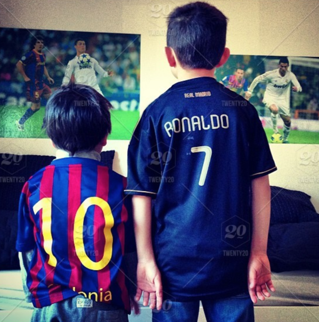


Downloading 30 images each of Messi and Ronaldo
-----------------------------------------------------------------

Before any classification of images can take
place, we must first download images of our footballers from the web.


### Getting ready

There are several add-ons to browsers that download images in bulk.
Since Ubuntu comes pre-installed with Mozilla Firefox as a browser, we
will use it as our browser of choice to install a bulk image downloader
extension.

### How to do it\...

The following section explains how to download images in bulk. Take a
look at these steps:

1.  Visit the following website for
    downloading and installing Firefox add-ons:


<https://addons.mozilla.org/en-US/firefox/>

2.  Search for and select the **`Download all Images`** add-on, as seen
    in the following screenshot:


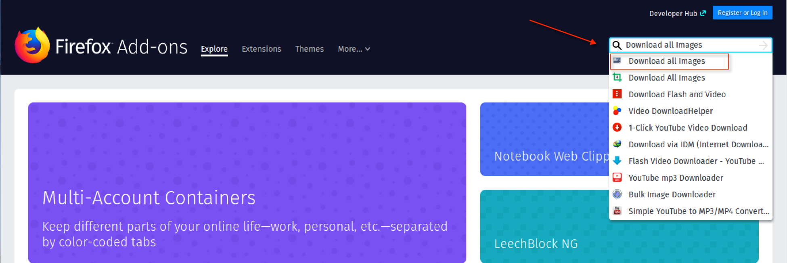


3.  This will take us to the installation page. At which point,
    select **`Add to Firefox`**, as seen in the following screenshot:


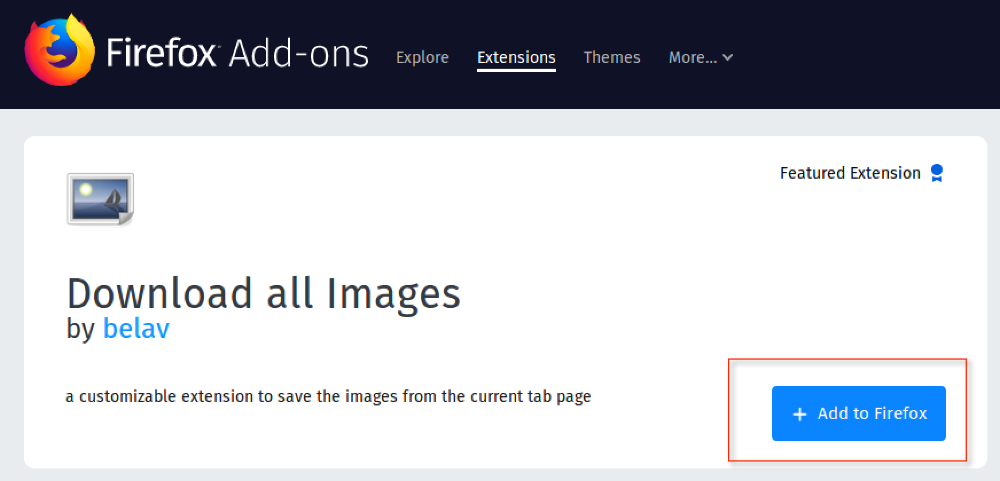


4.  Confirm your installation, as this add-on will require permission to
    access your browser\'s download history, access your data for all
    websites, and send you notifications.
5.  Once that is complete, you should see a small picture icon for
    **`Download all Images`** on the upper right-hand side of your
    browser, as seen in the following screenshot:


6.  We are now ready to begin downloading images of our footballers,
    using the newly added extension for Firefox. We can visit many
    different websites to download images from, such
    as [https://www.google.com](https://www.google.com/). For
    the purposes of this lab, search for Cristiano Ronaldo and
    download his images using
    [https://www.pexels.com](https://www.pexels.com/), as seen
    in the following screenshot:


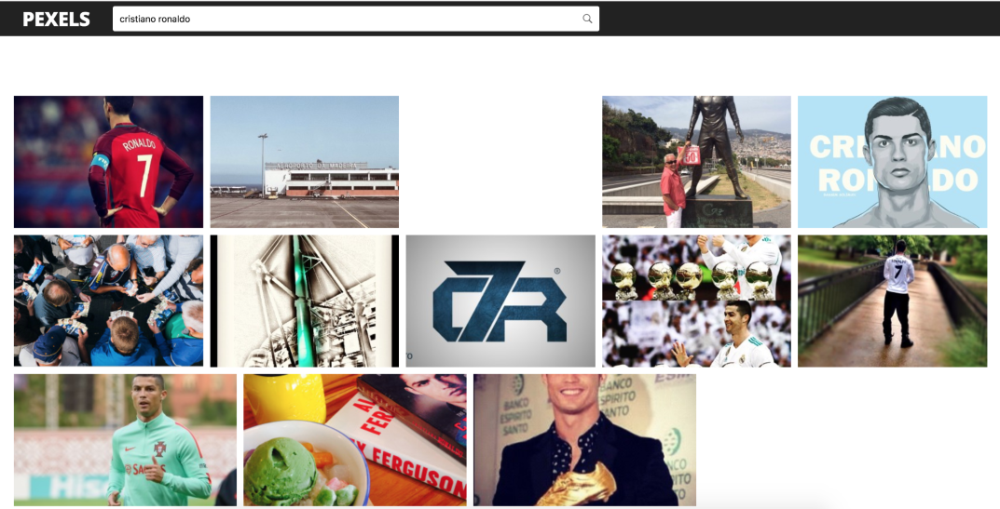


7.  Next, click on the **`Download all Images`** icon and specify the
    following download settings for the images as shown in the following
    screenshot:


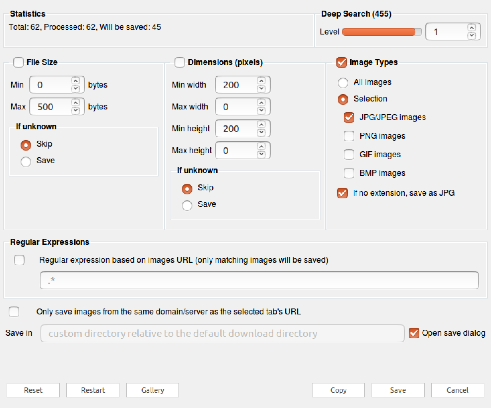


8.  Click on **`Save`**, as you will then have the option to download
    all of the pictures as a `.zip` file to a local directory.
    You can then unzip the file into a folder
    and peruse through all of the images. In our example, the images
    have all been extracted to
    `/Home/sparkNotebooks/Ch13/football/ronaldo/`, as seen in
    the following screenshot:


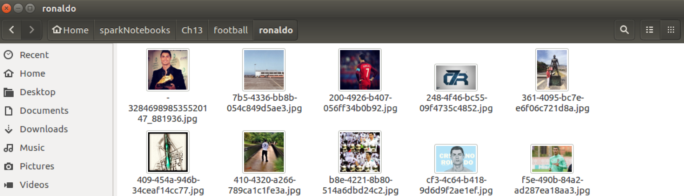


9.  Of all the images that are available in the folder, choose 30 images
    of Ronaldo and name them `ronaldo1.jpg`,
    `ronaldo2.jpg`\....`ronaldo30.jpg`, as shown in
    the following screenshot:


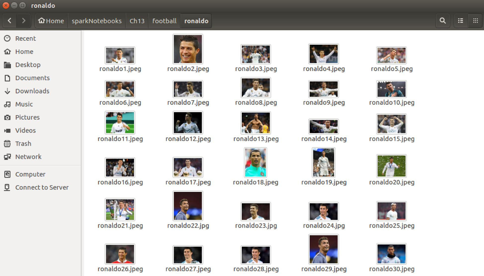


10. Repeat the steps again, this time for Messi to obtain 30 images of
    each. The final folder structure should look like the following:


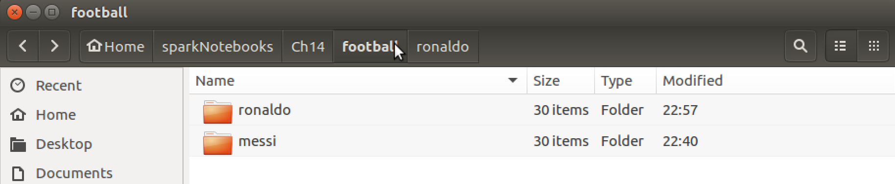


### How it works\...

This section explains the process of how the add-on downloads the images
in bulk to our desired location:

1.  Bulk image downloading software is readily available these days and
    integrated within browsers. We will use **`Download all Images`** as
    an add-on with Firefox to quickly download images for Messi and
    Ronaldo.
2.  We want to specify settings in the app to download lower-quality
    images, so we set a minimum threshold of 0 bytes, a maximum
    threshold of 500 bytes, and an image type of `jpg` or
    `jpeg`.
3.  Finally, we want to handpick only the 30
    images that best represent each player, as 20 of them will serve as
    our training dataset, and the remaining 10 will serve as our test
    dataset. All other images can be deleted.
4.  All of the images will be tagged or labeled for training purposes by
    their last name and a number between 1 and 30. For example,
    `Messi1.jpg`, `Messi2.jpg`,
    `Ronaldo1.jpg`, `Ronaldo2.jpg`, and so on.


### There\'s more\...

While you can use your own images that you have downloaded using
**`Download all Images`**, you can download the same images for Ronaldo
and Messi that will be used for training purposes in this lab by
visiting the following websites:

For Messi:

<https://github.com/asherif844/ApacheSparkDeepLearningCookbook/tree/master/CH13/football/messi>

For Ronaldo:

<https://github.com/asherif844/ApacheSparkDeepLearningCookbook/tree/master/CH13/football/ronaldo>


Configuring PySpark installation with deep learning packages
------------------------------------------------------------------------------

There are some additional configurations that
need to be done within PySpark to implement
deep learning packages from Databricks called
`spark-deep-learning`.


### Getting ready

This configuration requires making changes in the terminal, using **bash**.

### How to do it\...

The following section walks through the steps to configure PySpark with
deep learning packages:


Change it to the following:

```
pyspark --packages databricks:spark-deep-learning:0.1.0-spark2.1-s_2.11.
```


We have now configured our PySpark installation to incorporate deep
learning libraries that incorporate APIs that help build models for
all types of solutions, such as image classification.


Loading images on to PySpark dataframes
---------------------------------------------------------

We are now ready to begin importing our
images into our notebook for classification.


### Getting ready

We will be using several libraries and their dependencies in this
section, which will require us to install the following packages through
`pip install` on the terminal within Ubuntu Desktop:

```
pip install tensorflow==1.4.1
pip install keras==2.1.5
pip install sparkdl
pip install tensorframes
pip install kafka
pip install py4j
pip install tensorflowonspark
pip install jieba
```


### How to do it\...

The following steps will demonstrate how to decode images into a Spark
dataframe:

1.  Initiate a `spark` session, using the following script:

```
spark = SparkSession.builder \
      .master("local") \
      .appName("ImageClassification") \
      .config("spark.executor.memory", "6gb") \
      .getOrCreate()
```


2.  Import the following libraries from PySpark to create dataframes,
    using the following script:

```
import pyspark.sql.functions as f
import sparkdl as dl
```


3.  Execute the following script to create two dataframes
    for **`Messi `**and **`Ronaldo,`** using the main folder location
    for each player:

```
dfMessi = dl.readImages('football/messi/').withColumn('label', f.lit(0))
dfRonaldo = dl.readImages('football/ronaldo/').withColumn('label',             f.lit(1))
```


4.  Split each dataframe into a train-and-test set at a
    `66.7/33.3` ratio, and set a random seed set to
    `12`, using the following script:

```
trainDFmessi, testDFmessi = dfMessi.randomSplit([66.7, 33.3], seed = 12)
trainDFronaldo, testDFronaldo = dfRonaldo.randomSplit([66.7, 33.3], seed =     12)
```


5.  Finally, merge both the training dataframes and the testing
    dataframes into one new dataframe each, `trainDF` and
    `testDF`, using the following script:

```
trainDF = trainDFmessi.unionAll(trainDFronaldo)
testDF = testDFmessi.unionAll(testDFronaldo)
```


### How it works\...

The following section explains how the images are loaded and read into a
Jupyter notebook. Take a look at these steps:

1.  We always begin a Spark project by initiating a Spark session to set
    the application name as well as to set the Spark executor memory.
2.  We import both `pyspark.sql.functions` and
    `sparkdl` to help build dataframes based on encoded
    images. When `sparkdl` is imported, we see that it is
    using **`TensorFlow`** in the backend, as seen in the following
    screenshot:


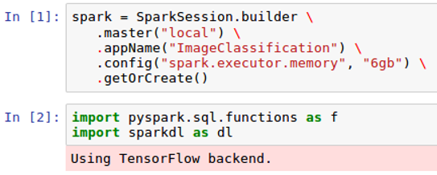


3.  The dataframes are created using `sparkdl` with three
    columns: **`filepath`**, **`image`**, and **`label`**. Sparkdl is
    used to import each image and encode it by color and shape.
    Additionally, a function, `lit`, is used to tag a literal
    value (**`0 or 1`**) to each of the two dataframes under the
    **`label`** column for training purposes, as seen in the following
    screenshot:


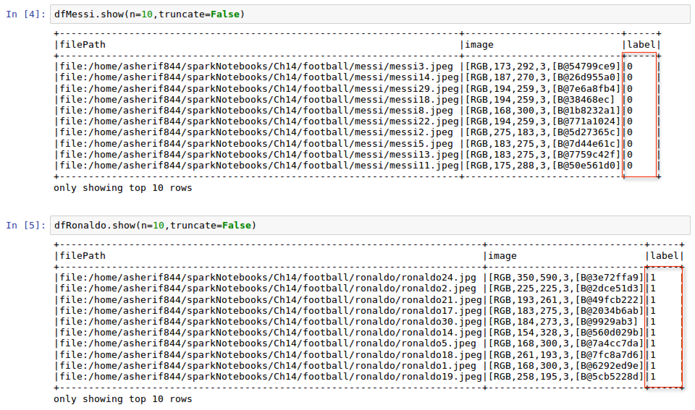


4.  Since there are 30 images for each footballer, a split of 66.7/33.3
    is used to create **`18`** training images and **`12`** testing
    images, as seen in the following screenshot:


### Note

Please note that the more images used in the training process the better
when using deep learning. However, the point we will try and prove in
this lab is that with transfer learning being implemented as an
extension of deep learning, we can classify images using fewer training
samples, as is the case in this lab with only 30 images for Ronaldo
and Messi each.


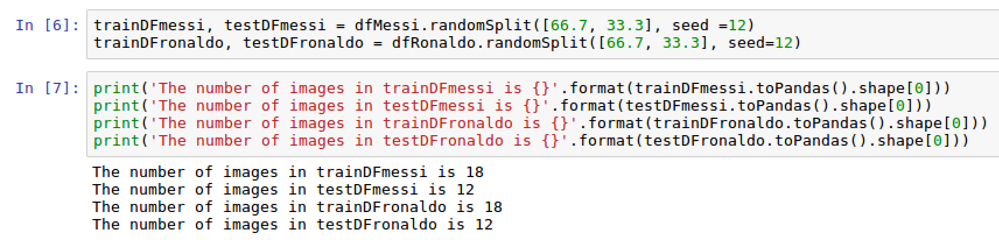


5.  To build out our model, we are only
    interested in creating a single training dataframe with the **`36`**
    images, as well as a single testing dataframe with the remaining
    **`24`** images. Once we merge the dataframes we can confirm that
    they are the correct size, as seen in the following screenshot:


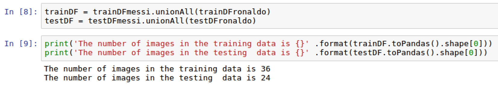


### There\'s more\...

It may be lost in the process but it is important to note that loading
the images into a dataframe was easy, and only took a few lines of code
using `sparkdl.readImages`. This showcases the power of the
machine learning pipelines that are available with Spark.


Understanding transfer learning
-------------------------------------------------

The rest of this lab will involve
transfer learning techniques; therefore, we will spend this section
explaining how transfer learning works within our architecture.


### Getting ready

There are no dependencies required for this section.

### How to do it\...

This section walks through the steps for how transfer learning works:

1.  Identify a pre-trained model that will be used as the training
    methodology that will be transferred to our chosen task. In our
    case, the task will be in identifying images of Messi and Ronaldo.
2.  There are several available pre-trained models that can be used. The
    most popular ones are the following:

    1.  Xception
    2.  InceptionV3
    3.  ResNet50
    4.  VGG16
    5.  VGG19

3.  The features from the pre-trained convolutional neural network are
    extracted and saved for a certain set of images over several layers
    of filtering and pooling.
4.  The final layer for the pre-trained convolutional neural network is
    substituted with the specific features that we are looking to
    classify based on our dataset.


### How it works\...

This section explains the methodology of transfer learning:

1.  In early labs, we discuss how machine learning models, and more
    importantly deep learning models, work best with larger samples for
    training purposes. In fact, the general motto with deep learning is
    the more the merrier.
2.  However, there are situations when a high volume of data or images
    is just not available to train a model. It is in these circumstances
    where we wish to transfer the learning of one field to predict the
    outcome of a different field. The heavy lifting of extracting
    features and filtering through layers and layers within a
    convolutional neural network have already been performed by
    institutions that have developed many pre-trained models such as
    InceptionV3 and ResNet50:

    1.  InceptionV3 was developed over at Google and has smaller weights
        than ResNet50 and VGG
    2.  ResNet50 uses 50 weight layers
    3.  VGG16 and VGG19 have 16 and 19 weight layers respectively

3.  Several higher level deep learning
    libraries such as Keras now come pre-built with these pre-trained
    networks for a more simplified application by specifying the model
    name.


### There\'s more\...

Determining which pre-trained model works best for the data or image set
in question will depend on the image types used. It is always best to
try different pre-trained sets and determine which one delivers the best
accuracy.

### See also

To learn more about the Inception V3 pre-trained model, read the
following paper:

<https://arxiv.org/abs/1409.4842>

To learn more about the VGG pre-trained models, read the following
paper:

<https://arxiv.org/abs/1409.1556>

Creating a pipeline for image classification training
------------------------------------------------------------------------

We are now ready to build the deep
learning pipeline for training our dataset.


### Getting ready

The following libraries will be imported to assist with the pipeline
development:


-   `LogisticRegression`
-   `Pipeline`


### How to do it\...

The following section walks through the following steps for creating a
pipeline for image classification:

1.  Execute the following script to begin the deep learning pipeline as
    well as to configure the classification parameters:

```
from pyspark.ml.classification import LogisticRegression
from pyspark.ml import Pipeline

vectorizer = dl.DeepImageFeaturizer(inputCol="image", 
                           outputCol="features", 
                           modelName="InceptionV3")
logreg = LogisticRegression(maxIter=30, 
         labelCol="label")
pipeline = Pipeline(stages=[vectorizer, logreg])
pipeline_model = pipeline.fit(trainDF)
```


2.  Create a new dataframe, `predictDF`, that houses the
    original testing labels as well as the new prediction scores, using
    the following script:

```
predictDF = pipeline_model.transform(testDF)
predictDF.select('prediction', 'label').show(n = testDF.toPandas().shape[0], truncate=False)
```


### How it works\...

The following section explains how the pipeline for image classification
is configured for optimal performance:

1.  `LogisticRegression` is imported, as it will be the main
    classification algorithm used to distinguish between Messi and
    Ronaldo images. `DeepImageFeaturizer` is imported from
    `sparkdl` to create features based off of the images that
    will be used as the final input to the logistic regression
    algorithm.


### Note

It is important to note that the features created from
`DeepImageFeaturizer` will be using a pre-trained model based
on `InceptionV3`, and assigned a variable of
`vectorizer`.


The logistic regression model is tuned to run for a maximum of **`30`**
iterations. Finally, the pipeline ingests both `vectorizer`
and `LogisticRegression` variables and fits it into the
training dataframe, `trainDF`. `vectorizer` is used
to create numeric values out of the images. The output of the
`DeepImageFeaturizer` can be seen in the following screenshot:


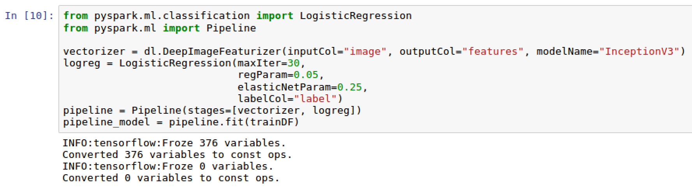


2.  The test dataframe, `testDF`, is transformed into a new
    dataframe, `predictDF`, by applying the fitted pipeline
    model, `pipeline_model`, which creates a new column called
    **`prediction`**. We can then compare our **`label`** column with
    our **`prediction`** column, as seen in the following screenshot:


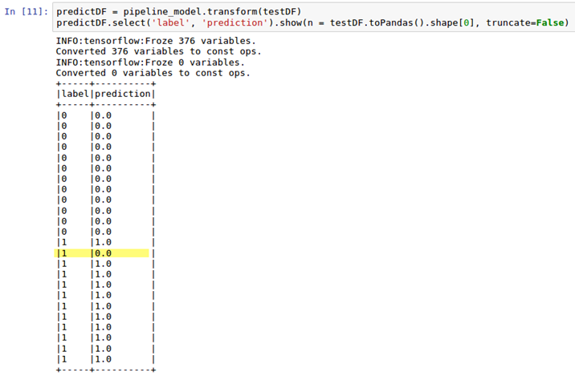


### There\'s more\...

`InceptionV3` is the image
classifier model that we used for classifying
our images; however, we could have very easily chosen other pre-trained
models and compared accuracy within our pipeline.

### See also

To learn more about transfer learning, read
the following article from the University of Wisconsin:

<http://ftp.cs.wisc.edu/machine-learning/shavlik-group/torrey.handbook09.pdf>


Evaluating model performance
-----------------------------------------------

We are ready to evaluate our model and see
how well we can distinguish between Messi and Ronaldo.


### Getting ready

Since we will be doing some model evaluation, we will need to import the
following library:


-   `MulticlassClassificationEvaluator`


### How to do it\...

The following section walks through the following steps to evaluate
model performance:

1.  Execute the following script to create a confusion matrix from the
    `predictDF` dataframe:

```
predictDF.crosstab('prediction', 'label').show().
```


2.  Calculate an accuracy score based on our 24 test images of Ronaldo
    and Messi by executing the following script:

```
from pyspark.ml.evaluation import MulticlassClassificationEvaluator

scoring = predictDF.select("prediction", "label")
accuracy_score = MulticlassClassificationEvaluator(metricName="accuracy")
rate = accuracy_score.evaluate(scoring)*100
print("accuracy: {}%" .format(round(rate,2))).
```


### How it works\...

The following section explains how we evaluate the model performance.
Take a look at these images:

1.  We can convert our dataframe, **`predictDF`**, into a crosstab to
    create a confusion matrix. This allows us to understand how many
    true positives, false positives, true negatives, and false negatives
    are in our model, as seen in the following screenshot:


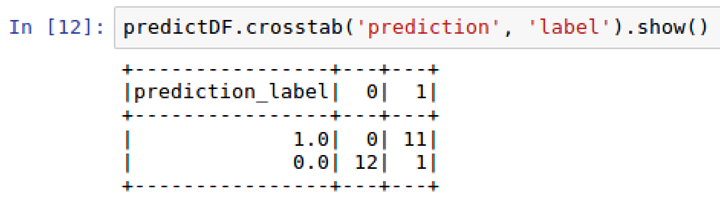


2.  At this point, we are ready to calculate how well we did with our
    model in using the 36 training images to accurately classify the 24
    remaining test images of Ronaldo and Messi. From the previous
    screenshot, it shows that we had 21 accurate classifications out
    of 24. We had 2 images of Messi misclassified as Ronaldo and only
    one image of Ronaldo misclassified as Messi. This should come out to
    an accuracy score of 88%. We can see that the accuracy score from
    the **`MulticlassClassificationEvaluator`** also scores our accuracy
    at 87.5%, as seen in the following screenshot:


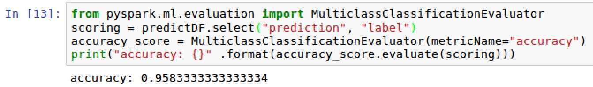


### There\'s more\...

While we did end up using accuracy as our benchmark indicator for how
well our model performed, we could have just as easily used
precision or recall. Additionally, we used
the `MulticlassClassificationEvaluator` for evaluating the
accuracy of the model. Since we are dealing with a binary outcome in
this specific case for only two types of images for Ronaldo or Messi, we
could have also just used a `BinaryClassificationEvaluator` as
seen in the following screenshot:


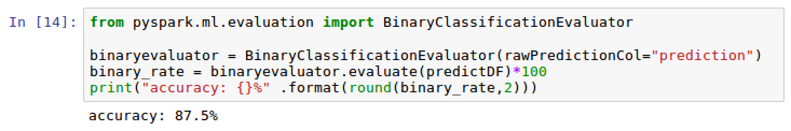


We still end up with the same accuracy rate of **`87.5%`**.

### See also

To learn more about
`MulticlassClassificationEvaluator` from the logistic
regression function in PySpark, visit the following website:

<https://spark.apache.org/docs/2.2.0/ml-classification-regression.html>


Fine-tuning model parameters
-----------------------------------------------

There is always room for improvement in the
accuracy of any model. In this section, we will talk about some of the
parameters that can be tweaked to improve our model accuracy score of
**`87.5%`** obtained from the previous section.


### Getting ready

This section does not require any new prerequisites. 

### How to do it\...

This section walks through the steps to fine-tune the model.

1.  Define a new logistic regression model with additional parameters
    for `regParam` and `elasticNetParam` as seen in
    the following script:

```
logregFT = LogisticRegression(
 regParam=0.05, 
 elasticNetParam=0.3,
 maxIter=15,labelCol = "label", featuresCol="features")
```


2.  Create a new pipeline configured for the newly created model using
    the following script:

```
pipelineFT = Pipeline(stages=[vectorizer, logregFT])
```


3.  Fit the pipeline to the trained dataset, `trainDF`, using
    the following script:

```
pipeline_model_FT = pipelineFT.fit(trainDF)
```


4.  Apply the model transformation to the test dataset,
    `testDF`, to be able to compare actual versus predicted
    scores using the following script:

```
predictDF_FT = pipeline_model_FT.transform(testDF)
predictDF_FT.crosstab('prediction', 'label').show()
```


5.  Finally, evaluate the new model accuracy rate,
    `binary_rate_FT`, using the following script:

```
binary_rate_FT = binaryevaluator.evaluate(predictDF_FT)*100
print("accuracy: {}%" .format(round(binary_rate_FT,2)))
```


### How it works\...

This section explains how the model is fine-tuned:

1.  The logistic regression model, `logregFT`, is fine-tuned
    using both the `regParam` and the
    `elasticNetParam` parameters. Both parameters correspond
    to the γ and the α parameters of a logistic regression model. The
    regularization parameter or `regParam` is used to find a
    balance between minimizing the loss function and minimizing
    overfitting the model. The more complex we make the model, the more
    likely it will overfit and not be generalized, but we will also
    likely get a lower training error. Additionally, the less complex we
    make the model, the less likely it will overfit, but the more likely
    it will have a higher training error.
2.  The elastic net parameter or `elasticNetParam` is another
    regularization technique that is used to combine multiple
    regularizers, L1 and L2, to minimize overfitting in a model.
    Additionally, we have decreased our iteration run from 20 to 15 to
    see if we can achieve a better accuracy score by including
    regularization and decreasing runs at the same time.
3.  Once again, as we did previously in this lab, we create a
    pipeline that incorporates our numerical features generated from our
    images, `vectorizer`, as well our logistic regression
    model, `logregFT`.
4.  The model is then fit on the training data, `trainDF`, and
    the transformation of the model is applied to the testing data,
    `testDF`.
5.  We can once again compare our actual versus predicted results from
    the outcome of the model in a crosstab as seen in the following
    screenshot:


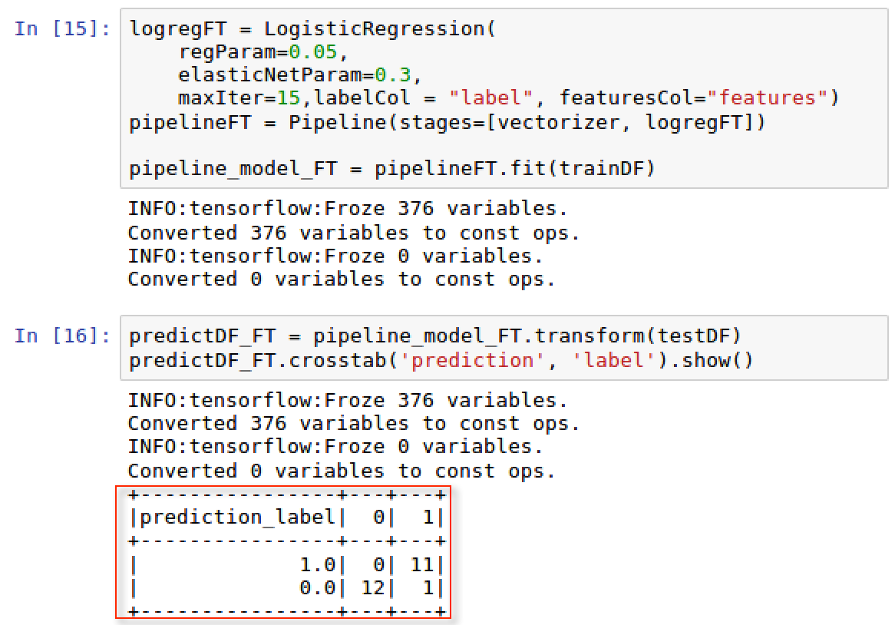


6.  We have now only 1 miss-classified image compared to 3 from the
    previous section. We accomplished this by lowering our maxIter to
    `15` runs and setting `regParam` to
    `0.05` and the `elasticNetParam` to
    `0.3`.
7.  Our new accuracy rate is now at `95.83%` as seen in the
    following screenshot:


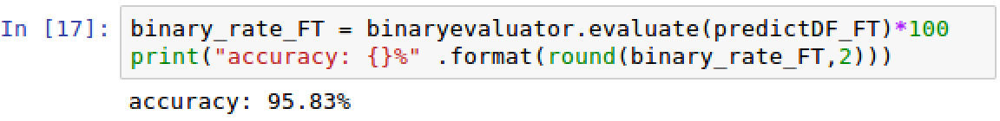


### There\'s more\...

Certainly, we have improved our rate from
**`87.5%`** from **`95.83%`** simply by incorporating specific
parameters into our model. Additional fine-tuning and tweaking of our
parameters could take place to determine if an accuracy of 100% could be
reached for our image classification model.

### See also

To learn more about the regularization and elastic net
parameters within a logistic regression,
visit the following website:

<https://spark.apache.org/docs/2.2.0/mllib-linear-methods.html#logistic-regression>
