Pain Points of Convolutional Neural Networks
----------------------------------------------------------------

In this lab, the following recipes will be covered:


-   Pain Point \#1: Importing MNIST images
-   Pain Point \#2: Visualizing MNIST images
-   Pain Point \#3: Exporting MNIST images as files
-   Pain Point \#4: Augmenting MNIST images
-   Pain Point \#5: Utilizing alternate sources for trained images
-   Pain Point \#6: Prioritizing high-level libraries for CNNs

Introduction
------------------------------

**Convolutional neural networks** (**CNNs**) have
been enjoying a bit of resurgence in the last
couple of years. They have shown great success when it comes to image
recognition. This is quite relevant these days with the advent of modern
smartphones as anyone now has the ability to take large volumes of
pictures of objects and post them on social media sites. Just due to
this phenomenon, convolutional neural networks are in high demand these
days.

There are several features that make a CNN optimally perform. They
require the following features:


-   A high volume of training data
-   Visual and spatial data
-   An emphasis on filtering (pooling), activation, and convoluting as
    opposed to a fully connected layer that is more apparent in a
    traditional neural network


While CNNs have gained great popularity, there are some limitations in
working with them primarily due to their computational needs as well as
the volume of training data required to get a well-performing model. We
will focus on techniques that can be applied to the data that will
ultimately assist with the development of a convolutional neural network
while addressing these limitations. In later labs, we will apply
some of these techniques when we develop models for image
classification. 


Pain Point \#1: Importing MNIST images
--------------------------------------------------------

One of the most common datasets used for image classification is
the `MNIST` dataset, which is composed of thousands of samples
of handwritten digits. The **Modified National Institute of Standards
and Technology** (**MNIST**) is, according to Yann
LeCun, Corinna Cortes, and Christopher J.C. Burges, useful for
the following reasons:


### Note

It is a good database for people who want to try learning techniques and
pattern recognition methods on real-world data while spending minimal
efforts on preprocessing and formatting.


There are several methods to import the MNIST images into our Jupyter
notebook. We will cover the following two methods in this lab:

1.  Directly through the TensorFlow library
2.  Manually through the MNIST website


### Note

One thing to note is that we will be primarily using MNIST images as our
example of how to improve performance within a convolutional neural
network. All of these techniques that will be applied on MNIST images
can be applied to any image that will be used to train a CNN.

### Getting ready

The only requirement needed is to install `TensorFlow`. It
will likely not come pre-installed with the **`anaconda3`** packages;
therefore, a simple `pip` install will either confirm the
availability of `TensorFlow` or install it if not currently
available. `TensorFlow` can be easily installed in the
Terminal, as seen in the following screenshot:


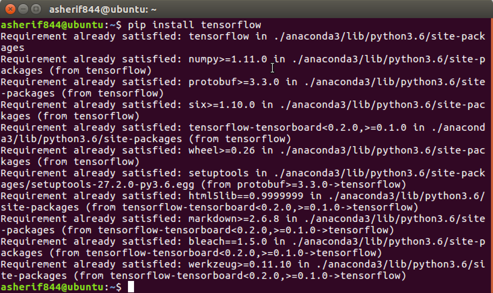


### How to do it\...

The `TensorFlow` library has a conveniently built-in set of
examples that can be used directly. One of those example datasets
is `MNIST`. This section will walk through the steps of
accessing those images.

1.  Import `TensorFlow` into the library with an alias
    of `tf` using the following script:

```
import tensorflow as tf
```


2.  Download and extract images from the library and save to a local
    folder using the following script:

```
from tensorflow.examples.tutorials.mnist import input_data
data = input_data.read_data_sets('MNIST/', one_hot=True)
```


3.  Retrieve a final count of the training and testing datasets that
    will be used to evaluate the accuracy of the image classification
    using the following script:

```
print('Image Inventory')
print('----------')
print('Training: ' + str(len(data.train.labels)))
print('Testing: '+ str(len(data.test.labels)))
print('----------')
```


### How it works\...

This section explains the process used to access the MNIST datasets:

1.  Once we receive a confirmation that the `TensorFlow`
    library has been properly installed, it is imported into the
    notebook.
2.  We can confirm the version of `TensorFlow` as well as
    extract the images to our local folder of `MNIST/`. The
    extraction process is visible in the output of the notebook, as seen
    in the following screenshot:


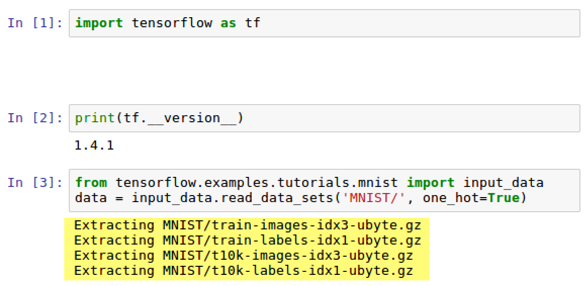


3.  The four extracted files are named the following:

    1.  `t10k-images-idx3-ubyte.gz`
    2.  `t10k-labels-idx1-ubyte.gz`
    3.  `train-images-idx3-ubyte.gz`
    4.  `train-labels-idx1-ubyte.gz`

4.  They have been downloaded to the `MNIST/` subfolder as
    seen in the following screenshot:


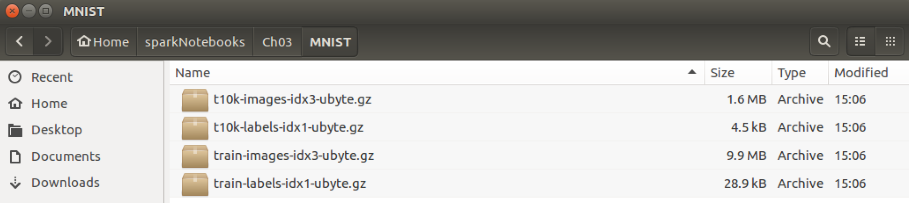


5.  In addition, the four files can be viewed in our notebook, as seen
    in the following screenshot:


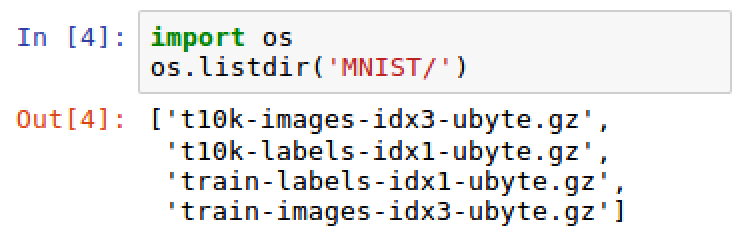


6.  The four files are the testing and training images along with the
    accompanying testing and training labels identifying each image in
    the testing and training datasets. Additionally,
    the `one_hot = True` feature is explicitly defined.
    This indicates that one-hot encoding is active with the labels,
    which assists with feature selection within modeling as each column
    value will be either 0 or 1.
7.  A subclass of the library is also imported that stores the
    handwritten images of MNIST to the specified local folder. The
    folder containing all of the images should be approximately 12 MB in
    size for **`55,000`**training images and**`10,000`**testing images,
    as seen in the following screenshot:


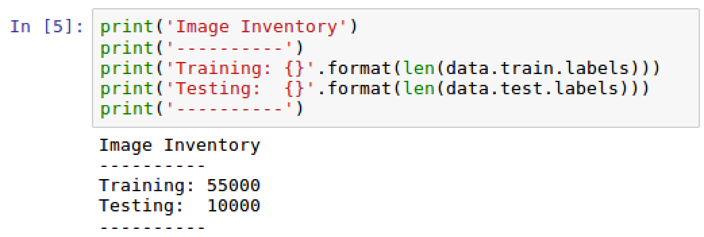


8.  The 10,000 images will be used to test the accuracy of our model
    that will be trained on the 55,000 images.


### There\'s more\...

Occasionally, there may be errors or warnings when trying to access the
MNIST datasets directly through `TensorFlow`. As was seen
earlier on in the section, we received the
following warning when importing MNIST:


### Note

WARNING:tensorflow:From \<ipython-input-3-ceaef6f48460\>:2:
read\_data\_sets (from
tensorflow.contrib.learn.python.learn.datasets.mnist) is deprecated and
will be removed in a future version. Instructions for updating: Please
use alternatives such as official/mnist/dataset.py from
tensorflow/models.


The dataset may become deprecated in a future release of
`TensorFlow` and therefore, no longer be directly accessible.
Sometimes we may just encounter a typical [*HTTP 403 error*]
when extracting the MNIST images through `TensorFlow`. This
may be due to the website being temporarily unavailable. Have no fear in
either case, there is a manual approach to downloading the
four `.gz` files using the following link:

<http://yann.lecun.com/exdb/mnist/>

The files are located on the website, as seen in the following
screenshot:


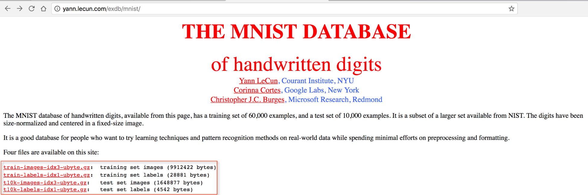


Download the files and save them to an accessible local folder similar
to what was done with the files that came directly from
`TensorFlow`.

### See also

To learn more about
the `MNIST` database of handwritten digits, visit the
following website: <http://yann.lecun.com/exdb/mnist/>.

To learn more about one-hot encoding, visit
the following
website: [https://hackernoon.com/what-is-one-hot-encoding-why-and-when-do-you-have-to-use-it-e3c6186d008f.](https://hackernoon.com/what-is-one-hot-encoding-why-and-when-do-you-have-to-use-it-e3c6186d008f)


Pain Point \#2: Visualizing MNIST images
----------------------------------------------------------

Plotting images is often a major pain point
when dealing with graphics within a Jupyter notebook. Displaying the
handwritten images from the training dataset is critical, especially
when comparing the actual value of the label that is associated with the
handwritten image.


### Getting ready

The only Python libraries that will be imported to visualize the
handwritten images are `numpy` and `matplotlib`.
Both should already be available through the packages in Anaconda. If
for some reason they are not available, they can both
be `pip` installed at the Terminal using the following
commands:


-   `pip install matplotlib`
-   `pip install numpy`


### How to do it\...

This section will walk through the steps to
visualize the MNIST handwritten images in a Jupyter notebook:

1.  Import the following libraries, `numpy` and
    `matplotlib`, and configure `matplotlib` to plot
    `inline` using the following script:

```
import numpy as np
import matplotlib.pyplot as plt
%matplotlib inline
```


2.  Plot the first two sample images using the following script:

```
for i in range(2):
    image = data.train.images[i]
    image = np.array(image, dtype='float')
    label = data.train.labels[i]
    pixels = image.reshape((28, 28))
    plt.imshow(pixels, cmap='gray')
    print('-----------------')
    print(label)
    plt.show()
```


### How it works\...

This section will walk through the process of how the MNIST handwritten
images are viewed in a Jupyter notebook:

1.  A loop is generated in Python that will sample two images from the
    training dataset.


2.  Initially, the images are just a series of values in float format
    between 0 and 1 that are stored in a `numpy` array. The
    value of the array is a labeled image
    called `image`. The `image` array is then
    reshaped into a 28 x 28 matrix called `pixels` that has a
    black color for any value at 0 and a gray shade color for any color
    that is not 0. The higher the value, the lighter the gray shade of
    color. An example can be seen in the following screenshot for the
    digit **`8`**:


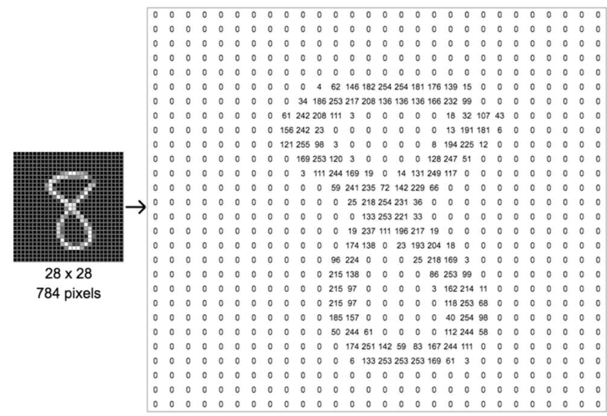


3.  The output of the loop produces two
    handwritten images for the numbers **`7`** and **`3`** along with
    their labels, as seen in the following screenshot:


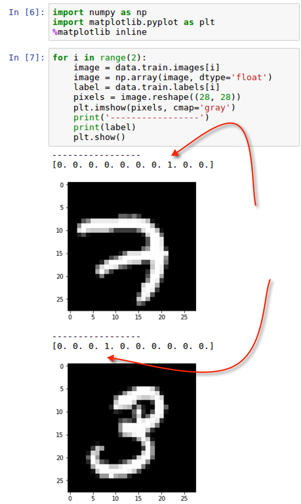


4.  In addition to the images being plotted, the label from the training
    dataset is also printed above the image. The label is an array of
    length 10, with values of 0 or 1 only for all 10 digits. For digit
    7, the 8th element in the array is of value 1 and for digit 3, the
    4th element in the array is of value 1. All other values are 0. 


### There\'s more\...

It may not be immediately obvious what the numeric value of the image
is. While most will be able to identify that the first image is a 7 and
the second image is a 3, it would be helpful
to have confirmation from the label array.

There are 10 elements in the array, each referencing a value for labels
0 through 9 in numeric order. Since the first array has a positive or 1
value in the 8th slot, that is an indication that the value of the image
is a 7, as 7 in the 8th index in the array. All other values should be
0. Additionally, the second image has a value of 1 in the 4th spot,
indicating a positive value for 3.

### See also

Leun, Cortes, and Burges discuss why the image pixelations were set at
28 x 28 in the following statement:


> [*he original black and white (bilevel) images from NIST were size
> normalized to fit in a 20x20 pixel box while preserving their aspect
> ratio. The resulting images contain grey levels as a result of the
> anti-aliasing technique used by the normalization algorithm. The
> images were centered in a 28x28 image by computing the center of mass
> of the pixels, and translating the image so as to position this point
> at the center of the 28x28 field.*]


> [*\--Leun, Cortes, and Burges
> from [http://yann.lecun.com/exdb/mnist/.](http://yann.lecun.com/exdb/mnist/)*]


Pain Point \#3: Exporting MNIST images as files
-----------------------------------------------------------------

We often need to work within the image
directly and not as an array vector. This section will guide us through
converting our arrays to `.png` images.


### Getting ready

Exporting the vectors to images requires importing the following
library:


-   `import image from matplotlib`


### How to do it\...

This section walks through the steps to convert a sample of MNIST arrays
to files in a local folder.

1.  Create a subfolder to save our images to our main folder
    of `MNIST/` using the following script:

```
if not os.path.exists('MNIST/images'):
   os.makedirs('MNIST/images/')
os.chdir('MNIST/images/')
```


2.  Loop through the first 10 samples of MNIST arrays and convert them
    to `.png` files using the following script:

```
from matplotlib import image
for i in range(1,10):
     png = data.train.images[i]
     png = np.array(png, dtype='float')
     pixels = png.reshape((28, 28))
     image.imsave('image_no_{}.png'.format(i), pixels, cmap = 'gray')
```


3.  Execute the following script to see the list of images
    from `image_no_1.png` to `image_no_9.png`:

```
print(os.listdir())
```


### How it works\...

This section explains how the MNIST arrays are converted to images and
saved to a local folder.

1.  We create a subfolder called `MNIST/images` to help us
    store our temporary `.png` images and separate them from
    the MNIST arrays and labels.


2.  Once again we loop through `data.train` images and
    obtain nine arrays that can be used for
    sampling. The images are then saved as `.png` files to our
    local directory with the following
    format: `'image_no_{}.png'.format(i), pixels, cmap = 'gray'`
3.  The output of the nine images can be seen in our local directory, as
    seen in the following screenshot:


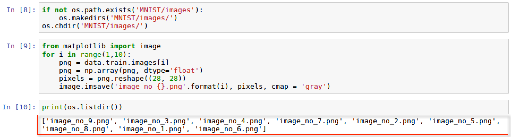


### There\'s more\...

In addition to seeing the list of images in our directory, we can also
view the image in our directory within Linux, as seen in the following
screenshot:


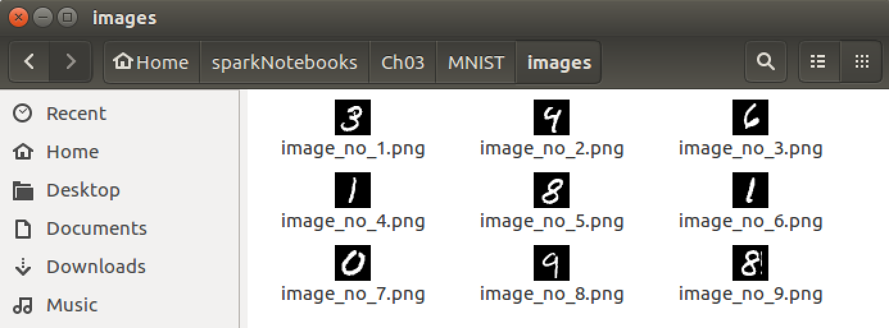


### See also

To learn more about `image.imsave`
from `matplotlib` visit the following website: 

<https://matplotlib.org/api/_as_gen/matplotlib.pyplot.imsave.html>

Pain Point \#4: Augmenting MNIST images
---------------------------------------------------------

One of the main drawbacks of working with image recognition is the lack
of variety in some of the images available. This may cause the
convolutional neural network to not operate
as optimally as we would like, and return less than ideal results due to
the lack of variety in the training data. There are techniques available
to bypass that shortcoming and we discuss one of them in this section.


### Getting ready

Once again much of the heavy lifting is already done for us. We will use
a popular Python package, `augmentor`, that is frequently used
with machine learning and deep learning modeling to generate additional
versions of existing images distorted and augmented for variety. 

The package will first have to be `pip` installed using the
following script: `pip install augmentor`

We should then have confirmation that the package is installed, as seen
in the following screenshot:


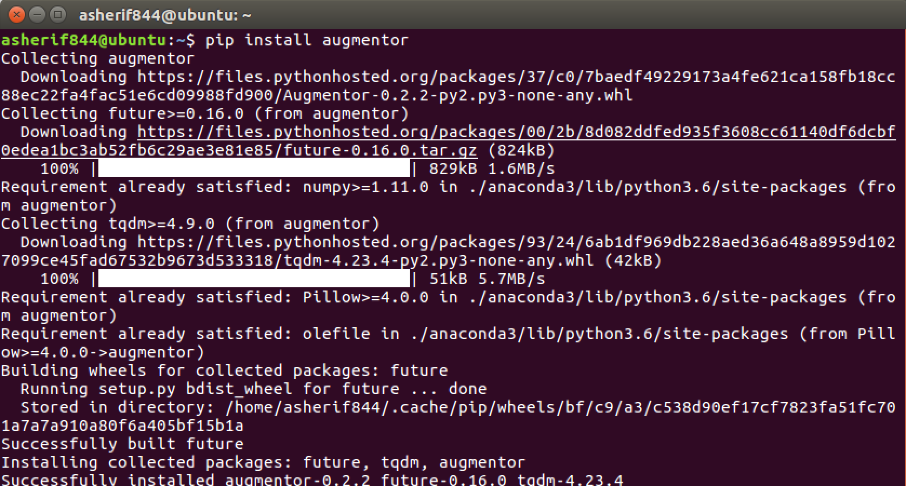


We will then need to import the pipeline class from augmentor:


-   `from Augmentor import Pipeline`


### How to do it\...

This section walks through the steps to increase the frequency and
augmentation of our nine sample images.

1.  Initialize the `augmentor` function using the following
    script:

```
from Augmentor import Pipeline
augmentor = Pipeline('/headless/Desktop/next-level-python-big-data/apache-spark-deep-learning/Lab03/MNIST/images')
```


2.  Execute the following script so that the `augmentor`
    function can `rotate` our images with the following
    specifications:

```
augmentor.rotate(probability=0.9, max_left_rotation=25, max_right_rotation=25)
```


3.  Execute the following script so that each image is augmented through
    two iterations 10 times each:

```
for i in range(1,3):
     augmentor.sample(10)
```


### How it works\...

This section explains how our nine images are
used to create additional images that are distorted.

1.  We need to create a `Pipeline` for our image
    transformation and specify the location of the images that will be
    used.  This ensures the following:

    1.  The source location of the images
    2.  The number of images that will be transformed 
    3.  The destination location of the images

2.  We can see that our destination location is created with a subfolder
    called `/output/` as seen in the following screenshot:


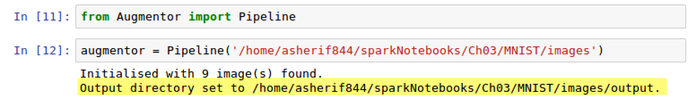


4.  The `augmentor` function is configured to rotate each
    image up to 25 degrees to the right or 25 degrees to the left with a
    90 percent probability. Basically, the probability configuration
    determines how often an augmentation takes place. 
5.  A loop is created to go through each image twice and apply two
    transformations to each image; however, since we did add a
    probability to each transformation some images may not get
    transformed and others may get transformed more than twice. Once the
    transformations are complete, we should get a message indicating so,
    as seen in the following screenshot:


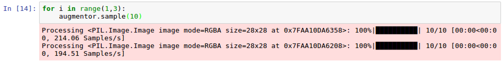


6.  Once we have the augmentations complete, we can visit the
    `/output/` subdirectory and see how each digit is slightly
    altered, as seen in the following screenshot:


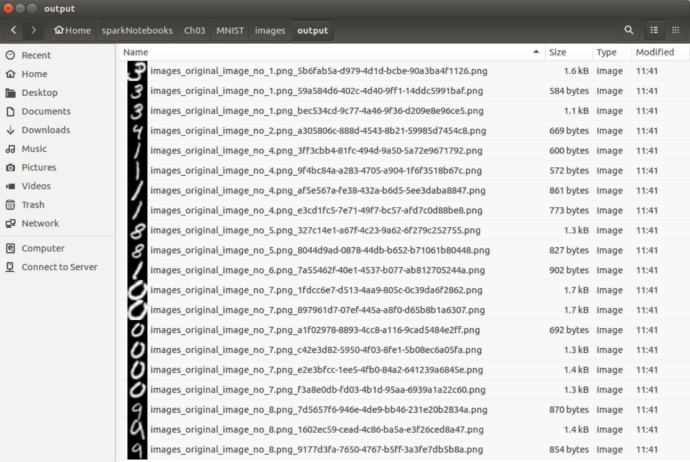


7.  We can see that we have several variations of the digits **`3`**,
    **`1`**, **`8`**, **`0`**, and **`9`** all with varying degrees of
    rotation. We now have tripled our sample data set and added more
    variety without having to go out and extract more images for
    training and testing purposes.


### There\'s more\...

We only applied the `rotate` transformation; however, there
are several transformation and augmentation
features available to apply to images:


-   Perspective skewing
-   Elastic distortions
-   Shearing
-   Cropping
-   Mirroring


While not all of these transformations will be necessary when looking to
increase frequency and variety of a training dataset, it may be
beneficial to use some combination of features and evaluate model
performance.

### See also

To learn more about `augmentor` visit the following website:

<https://augmentor.readthedocs.io/en/master/>


Pain Point \#5: Utilizing alternate sources for trained images
--------------------------------------------------------------------------------

Sometimes there are just not enough resources
available to perform a convolutional neural network. The resources could
be limited from a computational perspective or a data collection
perspective. In situations like these, we rely on other sources to help
us with classifying our images.


### Getting ready

The technique for utilizing pre-trained models as the source for testing
outcomes on other datasets is referred to as transfer learning. The
advantage here is that much of the CPU resources allotted for training
images is outsourced to a pre-trained model. Transfer learning has
become a common extension of deep learning more recently.

### How to do it\...

This section explains how the process of transfer learning works.

1.  Collect a series of datasets or images that you are interested in
    classifying, just as you would with traditional machine learning or
    deep learning.
2.  Split the dataset into a training and testing split such as 75/25 or
    80/20. 
3.  Identify a pre-trained model that will be used to identify the
    patterns and recognition of the images you are looking to classify.
4.  Build a deep learning pipeline that connects the training data to
    the pre-trained model and develops the weights and parameters needed
    to identify the test data.
5.  Finally, evaluate the model performance on the test data.


### How it works\...

This section explains the process of transfer learning when applied to
the MNIST dataset.

1.  We are definitely taking a shortcut approach with transfer learning
    as we are either limited in resources, time, or both as we are
    taking prior work that has already been done and hoping that it will
    help us solve something new. 
2.  Since we are dealing with an image classification problem, we should
    use a pre-trained model that has worked with classifying common
    images in the past. There are many common ones out there but two
    that stand out are:

    1.  The ResNet model developed at Microsoft.
    2.  The Inception model developed at Google.

3.  Both models are useful for image classification because both
    Microsoft and Google have a wide spectrum of images that are
    available to them to train a robust model that can extract features
    at a more detailed level.
4.  Directly within Spark, there is the ability to build a deep learning
    pipeline and to call about a class called
    `DeepImageFeaturizer` and apply the
    `InceptionV3` model to a set of features collected from
    training data. The trained dataset is then evaluated on the testing
    data using some type of binary or multiclassification evaluator.
5.  A pipeline within deep learning or machine learning is simply the
    workflow process used to get from an initial environment of data
    collection to a final evaluation or classification environment on
    the collected data by applying a model.


### There\'s more\...

As with everything, there are pros and cons to using
transfer learning. As we discussed earlier on
in the section, transfer learning is ideal when you are limited in
resources to perform your own modeling on a large dataset. There is
always the chance that the source data at hand does not exhibit many of
the features unique to it in the pre-trained models leading to poor
model performance. There is always the option to switch from one
pre-trained model to another and evaluate model performance. Again,
transfer learning is a fail fast approach that can be taken when other
options are not available.

### See also

To learn more about ResNet at Microsoft, visit the following website:

<https://resnet.microsoft.com/>

To learn more about Inception at Google, visit the following website:

<https://www.tensorflow.org/tutorials/image_recognition>

To learn more specifically about InceptionV3, you can read the following
paper titled


> Rethinking the Inception Architecture for Computer Vision


at Cornell University:

<https://arxiv.org/abs/1512.00567>

Pain Point \#6: Prioritizing high-level libraries for CNNs
----------------------------------------------------------------------------

There are many libraries available to perform convolutional neural
networks. Some of them are considered low-level such as TensorFlow,
where much of the configuration and setup
requires extensive coding. This can be considered a major pain point for
an inexperienced developer. There are other libraries, such as Keras,
that are high-level frameworks built on top of libraries such as
TensorFlow. These libraries require much less code to get up and running
with building a convolutional neural network. Often times developers
getting started with building a neural network will try and implement a
model with TensorFlow and run into several issues along the way. This
section will propose initially building a convolutional neural network
with Keras instead to predict the hand-written images from the MNIST
dataset.


### Getting ready

In this section, we will be working with Keras to train a model for
recognizing handwritten images from MNIST. You can install Keras by
executing the following command at the
terminal:

```
pip install keras
```


### How to do it\...

This section walks through the steps to build a model to recognize
handwritten images from MNIST.

1.  Create testing and training images and labels based on the MNIST
    dataset from the following variables using the following script:

```
xtrain = data.train.images
ytrain = np.asarray(data.train.labels)
xtest = data.test.images 
ytest = np.asarray(data.test.labels)
```


2.  Reshape the testing and training arrays using the following script:

```
xtrain = xtrain.reshape( xtrain.shape[0],28,28,1)
xtest = xtest.reshape(xtest.shape[0],28,28,1)
ytest= ytest.reshape(ytest.shape[0],10)
ytrain = ytrain.reshape(ytrain.shape[0],10)
```


3.  Import the following from `keras` to build the
    convolutional neural network model:

```
import keras
import keras.backend as K
from keras.models import Sequential
from keras.layers import Dense, Flatten, Conv2D
```


4.  Set the image ordering using the following script:

```
K.set_image_dim_ordering('th')
```


5.  Initialize the `Sequential``model` using the
    following script:

```
model = Sequential()
```


6.  Add layers to the `model` using the following script:

```
model.add(Conv2D(32, kernel_size=(3, 3),activation='relu', 
            input_shape=(1,28,28)))
model.add(Flatten())
model.add(Dense(128, activation='relu'))
model.add(Dense(10, activation='sigmoid'))
```


7.  Compile the `model` using the following script:

```
model.compile(optimizer='adam',loss='binary_crossentropy', 
              metrics=['accuracy'])
```


8.  Train the `model` using the following script:

```
model.fit(xtrain,ytrain,batch_size=512,epochs=5,
            validation_data=(xtest, ytest))
```


9.  Test the `model` performance using the following script:

```
stats = model.evaluate(xtest, ytest)
print('The accuracy rate is {}%'.format(round(stats[1],3)*100))
print('The loss rate is {}%'.format(round(stats[0],3)*100))
```


### How it works\...

This section explains how the convolutional
neural network is built on Keras to identify handwritten images from
MNIST.

1.  For any model development, we need to identify our testing and
    training datasets as well as the features and the labels. In our
    case, it is pretty straightforward as the MNIST data from TensorFlow
    is already broken up into `data.train.images` for the
    features and `data.train.labels` for the labels.
    Additionally, we want to convert the labels into arrays, so we
    utilize `np.asarray()` for `ytest` and
    `ytrain`.


2.  The arrays for `xtrain`, `xtest`,
    `ytrain`, and `ytest` are currently not in the
    proper shape to be used for a convolutional neural network within
    Keras. As we identified early on in the lab, the features for
    the MNIST images represent 28 x 28-pixel images and the labels
    indicate one of ten values from 0 through 9. The x-arrays will be
    reshaped to **`(,28,28,1)`** and the y-arrays will be reshaped to
    **`(,10)`**. The `shape` of the new arrays can be seen in
    the following screenshot:


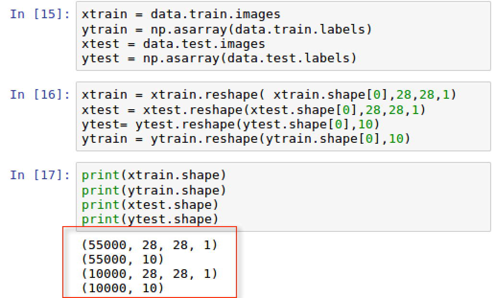


3.  As mentioned previously, Keras is a high-level library; therefore,
    it does not perform tensor or convolutional operations without the
    assistance of a lower level library such as TensorFlow. In order to
    configure these operations, we set the `backend` to be
    `K` for `Keras` with the image dimensional
    ordering, `image_dim_ordering`, set to `tf` for
    TensorFlow.


### Note

Please note that the backend could also be set to other low-level
libraries, such as `Theano`. Instead of `tf`, we
would set the dimensional ordering to `th`. Additionally, we
would need to reconstruct the shaping of the features. However, in the
past few years, `Theano` has not garnered the same adoption
rate `TensorFlow` has.


4.  Once we import the necessary libraries to build the CNN model, we
    can begin constructing the sequences or layers,
    `Sequential()`, of the model. For demonstration purposes,
    we will keep this model as simple as possible with only 4 layers to
    prove that we can still gain a high accuracy with minimal
    complexity. Each layer is added using the `.add()` method.

    1.  The first layer is set to build a 2-Dimensional
        (`Conv2D`) convolution layer, which is common for
        spatial images such as the MNIST data. Since it is the first
        layer, we must explicitly define the `input_shape` of
        the incoming data. Additionally, we specify a
        `kernel_size` that is used to set the height and width
        of the window filter used for convolution. Usually, this is
        either a 3x3 window or 5x5 window for the 32 filters.
        Additionally, we have to set an activation function for this
        layer and rectified linear units, `relu`, are a good
        option here for efficiency purposes, especially early on in the
        neural network.
    2.  Next, the second layer flattens the first layer inputs to
        retrieve a classification that we can use to determine whether
        the image is one of a possible 10 digits.
    3.  Third, we pass the outputs from the second layer into a
        `dense` layer that has 128 hidden layers with another
        `relu` activation function. The function within a
        densely connected layer incorporates the `input_shape`
        and `kernel_size` as well as the bias to create the
        output for each of the 128 hidden layers. 
    4.  The final layer is the output that will determine what the
        predicted value will be for the MNIST image. We add another
        `dense` layer with a `sigmoid` function to
        output probabilities for each of the 10 possible scenarios our
        MNIST image could be. Sigmoid functions are useful for binary or
        multiclass classification outcomes.

5.  The next step is to compile the model using `adam` for the
    `optimizer` and evaluating `accuracy` for the
    `metrics`. The `adam` optimizer is common for
    CNN models as is using `categorical_crossentropy` as a
    loss function when dealing with multiclassification scenarios for 10
    possible outcomes as is our case. 


5.  We train the model using a `batch_size` of `512`
    images at a time over `5` runs or `epochs`. The
    loss and accuracy of each epoch are captured and can be seen in the
    following screenshot:


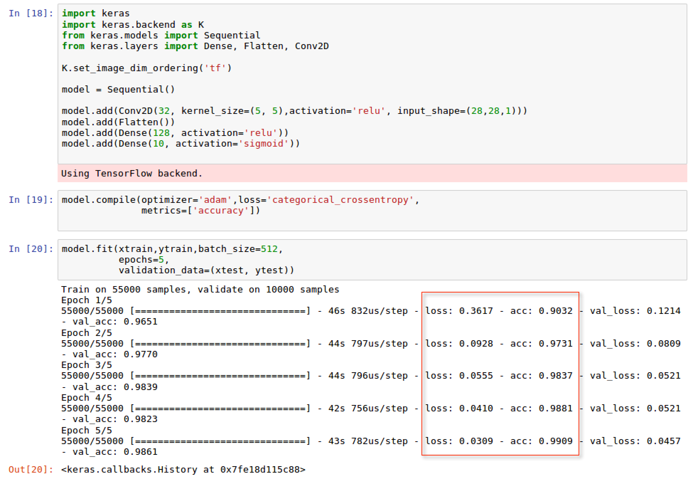


6.  We calculate the **`accuracy`** and the **`loss rate`** by
    evaluating the trained model on the test dataset as seen in the
    following screenshot:


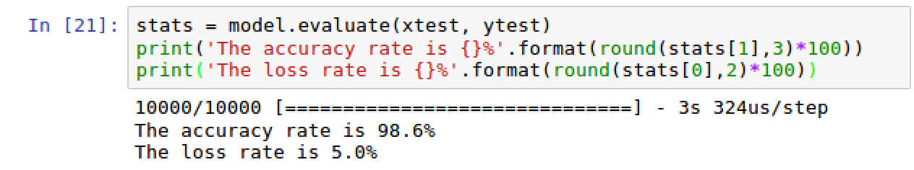


7.  Our model seems to be performing well with a
    **`98.6%``accuracy rate`** and a **`5% loss rate`**. 
8.  We built a simple convolutional neural network in Keras using five
    lines of code for the actual model design. Keras is a great way to
    get a model up and running in little time and code. Once you are
    ready to move onto more sophisticated model development and control,
    it may make more sense to build a convolutional neural network in
    TensorFlow.


### There\'s more\...

In addition to retrieving the accuracy of the model we can also produce
the shapes within each layer of the CNN modeling process by executing
the following script:

```
model.summary()
```


The output of the `model.summary()` can be seen in the
following screenshot:


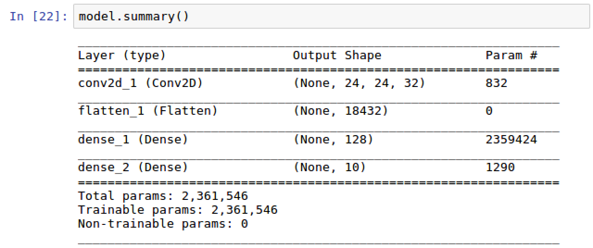


We see that the output shape of the first
layer **`(None, 24, 24, 32)`** was flattened out into a shape of
**`(None, 18432)`** by multiplying 24 x 24 x 32 within the second layer.
Additionally, we see our third and fourth layers have the shape that we
assigned them using the **`Dense`** layer function

### See also

To learn more about 2D convolutional layer development in Keras, visit
the following website:

<https://keras.io/layers/convolutional/#conv2d>

To learn how to build a convolutional neural network in TensorFlow with
MNIST images, visit the following website:

<https://www.tensorflow.org/versions/r1.4/get_started/mnist/pros>
