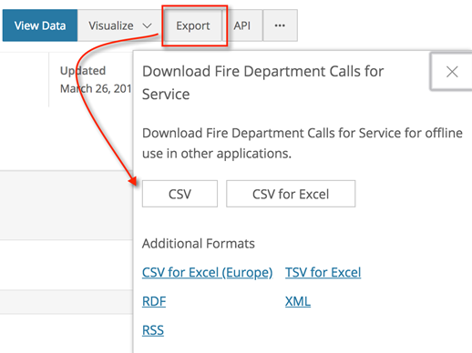

Predicting Fire Department Calls with Spark ML
------------------------------------------------------------------

In this lab, the following recipes will be covered:


-   Downloading the San Francisco fire department calls dataset
-   Identifying the target variable of the logistic regression model
-   Preparing feature variables for the logistic regression model
-   Applying the logistic regression model
-   Evaluating the accuracy of the logistic regression model

Introduction
------------------------------

Classification models are a popular way to
predict a defined categorical outcome. We use outputs from
classification models all the time. Anytime we go to see a movie in a
theatre, we are interested to know whether the film is considered
correct? One of the most popular classification models in the data
science community is a logistic regression. The logistic regression
model produces a response that is activated by a sigmoid function. The
sigmoid function uses the inputs from the model and produces an output
that is between 0 and 1. That output is usually in a form of a
probability score. Many deep learning models are also used for
classification purposes. It is common to find logistic regression models
performed in conjunction with deep learning models to help establish a
baseline in which deep learning models are measured against. The sigmoid
activation function is one of many activation functions that are also
used in deep neural networks within deep learning to produce a
probability output. We will utilize the built-in machine learning
libraries within Spark to build a logistic regression model that will
predict whether an incoming call to the San Francisco Fire department is
actually related to a fire, rather than another incident.


Downloading the San Francisco fire department calls dataset
-----------------------------------------------------------------------------

The City of San Francisco does a great job of collecting fire department
calls for services across their area. As it states on their website,
each record includes the call number, incident number, address, unit
identifier, call type, and disposition. The official website containing
San Francisco fire department call data can
be found at the following link:

<https://data.sfgov.org/Public-Safety/Fire-Department-Calls-for-Service/nuek-vuh3>

There is some general information regarding the dataset with regards to
the number of columns and rows, seen in the following screenshot:


This current dataset, updated on 3/26/2018, has roughly **`4.61 M`**
rows and **`34`** columns. 


### Getting ready

The dataset is available in a `.csv` file and can be
downloaded locally on to your machine, where
it can then be imported into Spark.

### How to do it\...

This section will walk through the steps to download and import the
`.csv` file to our Jupyter notebook.

1.  Download the dataset from the website by selecting **`Export`** and
    then **`CSV`**, as seen in the following screenshot:





2.  If not already the case, name the downloaded
    dataset `Fire_Department_Calls_for_Service.csv`


3.  Save the dataset to any local directory, although ideally it should
    be saved to the same folder that contains the Spark notebook that
    will be used in this lab, as seen in
    the following screenshot:


4.  Once the dataset has been saved to the same directory as the
    notebook, execute the following `pyspark` script to import
    the dataset into Spark and create a dataframe called `df`:

```
from pyspark.sql import SparkSession
spark = SparkSession.builder \
                    .master("local") \
                    .appName("Predicting Fire Dept Calls") \
                    .config("spark.executor.memory", "6gb") \
                    .getOrCreate()

df = spark.read.format('com.databricks.spark.csv')\
                    .options(header='true', inferschema='true')\
                    .load('Fire_Department_Calls_for_Service.csv')
df.show(2)
```


### How it works\...

The dataset is saved to the same directory that houses the Jupyter
notebook for ease of import into the Spark session.

1.  A local `pyspark` session is initialized by importing `SparkSession` from
    `pyspark.sql`.
2.  A dataframe, `df`, is created by reading in the CSV file
    with the options `header = 'true'` and
    `inferschema = 'true'`.
3.  Finally, it is always ideal to run a script to show the data that
    has been imported into Spark through the dataframe to confirm that
    the data has made its way through. The outcome of the script,
    showing the first two rows of the dataset from the San Francisco
    fire department calls, can be seen in the following screenshot:


### Note

Please note that as we read the file into spark, we are using
`.load()` to pull the `.csv` file into the Jupyter
notebook. This is fine for our purposes as we are using a local cluster,
but would not work if we were leveraging a cluster from Hadoop. 


### There\'s more\...

The dataset is accompanied by a data dictionary that defines the headers for each of the 34 columns. This
data dictionary can be accessed from the same website through the following link:

<https://data.sfgov.org/api/views/nuek-vuh3/files/ddb7f3a9-0160-4f07-bb1e-2af744909294?download=true&filename=FIR-0002_DataDictionary_fire-calls-for-service.xlsx>

### See also

The San Francisco government website allows for online visualization of
the data, which can be used to do some quick data profiling. The
visualization application can be accessed on the website by selecting
the **`Visualize`** dropdown, as seen in the following screenshot:


Identifying the target variable of the logistic regression model
----------------------------------------------------------------------------------

A logistic regression model operates as a
classification algorithm aiming to predict a binary outcome. In this
section, we will specify the best column within the dataset to predict
whether an incoming call to the operator is related to fire or non-fire
incidents.


### Getting ready

We will visualize many of the data points in this section, which will
require the following:

1.  Ensuring that `matplotlib` is installed by executing
    `pip install matplotlib` at the command line.
2.  Running `import matplotlib.pyplot as plt` as well as
    ensuring graphs are viewed within cells by running
    `%matplotlib inline`.


Additionally, there will be some manipulation of functions within
`pyspark.sql` that requires
`importing functions as F`.

### How to do it\...

This section will walk through visualizing
the data from the San Francisco Fire Department.

1.  Execute the following script to get a cursory identification of the
    unique values in the `Call Type Group` column:

```
df.select('Call Type Group').distinct().show()
```


2.  There are five main categories:

    1.  `Alarm`.
    2.  `Potentially Life-threatening`.
    3.  `Non Life-threatening`.
    4.  `Fire`.
    5.  `null`.

3.  Unfortunately, one of those categories is `null` values.
    It would be useful to get a row count of each unique value to
    identify how many null values there are in the dataset. Execute the
    following script to generate a row count of each unique value for
    the column `Call Type Group`:

```
df.groupBy('Call Type Group').count().show()
```


6.  Unfortunately, there are over 2.8 M rows of data that do not have a
    `Call Type Group` associated with them. That is over 60
    percent of the available rows of 4.6 M. Execute the following script
    to view the imbalance of null values in a bar chart:

```
df2 = df.groupBy('Call Type Group').count()
graphDF = df2.toPandas()
graphDF = graphDF.sort_values('count', ascending=False)

import matplotlib.pyplot as plt
%matplotlib inline

graphDF.plot(x='Call Type Group', y = 'count', kind='bar')
plt.title('Call Type Group by Count')
plt.show()
```


7.  Another indicator may need to be chosen
    to determine a target variable. Instead, we can
    profile `Call Type` to identify calls associated with fire
    versus all other calls. Execute the following script to profile
    `Call Type`:

```
df.groupBy('Call Type').count().orderBy('count', ascending=False).show(100)
```


8.  There do not appear to be any `null` values, as there were
    with `Call Type Group`. There are 32 unique categories for
    `Call Type`; therefore, it will be used as the target
    variable for fire incidents. Execute the following script to tag the
    columns containing `Fire` in`Call Type`:

```
from pyspark.sql import functions as F
fireIndicator = df.select(df["Call Type"],F.when(df["Call Type"].like("%Fire%"),1)\
                          .otherwise(0).alias('Fire Indicator'))
fireIndicator.show()
```


9.  Execute the following script to retrieve the distinct counts of
    `Fire Indicator`:

```
fireIndicator.groupBy('Fire Indicator').count().show()
```


10. Execute the following script to add the `Fire Indicator`
    column to the original dataframe, `df`:

```
df = df.withColumn("fireIndicator",\ 
F.when(df["Call Type"].like("%Fire%"),1).otherwise(0))
```


11. Finally, add the `fireIndicator` column has to the
    dataframe, `df`, and confirm by executing the following
    script:

```
df.printSchema()
```


### How it works\...

One of the key steps to building a successful logistic regression model
is establishing a binary target variable that will be used as the
prediction outcome. This section walks through the logic behind selecting our target variable:

1.  Data profiling of potential target columns is performed by
    identifying the unique column values of `Call Type Group`.
    We can view the unique values of the `Call Type Group`
    column, as seen in the following screenshot:


2.  The goal is to identify whether there are any missing values within
    the `Call Type Group` column and what can be done with
    those missing values. Sometimes, the missing values in the columns
    can just be dropped, and other times they are manipulated to
    populate values.


3.  The following screenshot shows how many null values are present:


4.  Additionally, we can also plot how many `null` values are
    present to get a better visual sense of the abundance of values, as
    seen in the following screenshot:


5.  Since there are over 2.8 M rows that are missing from
    `Call Type Group`, as seen in the `df.groupBy`
    script as well as the bar chart, it doesn\'t make sense to drop all
    of those values, as that is over 60 percent of the total row count
    from the dataset. Therefore, another column will need to be chosen
    as the target indicator.
6.  While profiling the `Call Type` column, we find that there
    aren\'t any **`null`** rows in the 32 unique possible values. This
    makes `Call Type` a better candidate for the target
    variable for the logistic regression
    model. The following is a screenshot of the `Call Type`
    column profiled:


7.  Since logistic regression works best when there is a binary outcome,
    a new column is created using the `withColumn()` operator
    in the `df` dataframe to capture an indicator (0 or 1) as
    to whether a call is affiliated with a fire-related incident or a
    non-fire-related incident. The new column
    is called `fireIndicator` and can be seen in the following
    screenshot:


8.  We can identify how prevalent fire calls are compared to the rest of
    the calls by doing a `groupBy().count()`, as seen in the
    following screenshot:


9.  It is best practice to confirm that the new column has been attached to the existing dataframe by executing
    the `printSchema()` script of the newly modified
    dataframe. The output of the new schema can be seen in the following
    screenshot:


### There\'s more\...

There were a couple of column manipulations done with the
`pyspark.sql` module in this section.
The `withColumn()` operator returns a new dataframe or
modifies an existing dataframe by adding a new column or modifies an existing column of the same name. This is not
to be confused with the `withColumnRenamed()` operator, which
also returns a new dataframe, but by modifying the name of an existing
column to a new column. Finally, we needed to perform some logical
operations to convert values associated with`Fire`to 0 and
without`Fire`to 1. This required using the
`pyspark.sql.functions` module and incorporating the
`where` function as an equivalent to a case statement used in
SQL. The function created a case statement equation using the following
syntax: 

```
CASE WHEN Call Type LIKE %Fire% THEN 1 ELSE 0 END
```


The outcome of the new dataset for both columns, `Call Type`
and `fireIndicator`, appear as the following:


### See also

In order to learn more about the `pyspark.sql` module
available within Spark, visit the following
website:

<http://spark.apache.org/docs/2.2.0/api/python/pyspark.sql.html>


Preparing feature variables for the logistic regression model
-------------------------------------------------------------------------------

In the previous section, we identified our target
variable that will be used as our predictor
for fire calls in our logistic regression model. This section will focus
on identifying all of the features that will
best help the model identify what the target should be. This is known as
**feature selection**.


### Getting ready

This section will require importing `StringIndexer` from
`pyspark.ml.feature`. In order to ensure proper feature
selection, we will need to map string columns to columns of indices.
This will help generate distinct numeric values for categorical
variables that will provide ease of computation for the machine learning
model to ingest the independent variables used to predict the target
outcome.

### How to do it\...

This section will walk through the steps to prepare the feature
variables for our model.

1.  Execute the following script to update the dataframe,
    `df`, by only selecting the fields that are independent of
    any fire indicators:

```
df = df.select('fireIndicator', 
    'Zipcode of Incident',
    'Battalion',
    'Station Area',
    'Box', 
    'Number of Alarms',
    'Unit sequence in call dispatch',
    'Neighborhooods - Analysis Boundaries',
    'Fire Prevention District',
    'Supervisor District')
df.show(5)
```


2.  The next step is to identify any null values within the dataframe
    and remove them if they exist. Execute the following script to
    identify the row count with any null values:

```
print('Total Rows')
df.count()
print('Rows without Null values')
df.dropna().count()
print('Row with Null Values')
df.count()-df.dropna().count()
```


3.  There are **`16,551`** rows with missing values. Execute the
    following script to update the dataframe to remove all rows with
    null values:

```
df = df.dropna()
```


4.  Execute the following script to retrieve the updated target count of
    `fireIndicator`:

```
df.groupBy('fireIndicator').count().orderBy('count', ascending = False).show()
```


5.  Import the `StringIndexer`class
    from`pyspark.ml.feature` to assign numeric values to each
    categorical variable for the features, as seen in the following
    script:

```
from pyspark.ml.feature import StringIndexer
```


6.  Create a Python list for all the feature variables that will be used
    in the model using the following script:

```
column_names = df.columns[1:]
```


7.  Execute the following script to specify the output column format,
    `outputcol`, that will be `stringIndexed` from
    the list of features from the input column, `inputcol`:

```
categoricalColumns = column_names
indexers = []
for categoricalCol in categoricalColumns:
    stringIndexer = StringIndexer(inputCol=categoricalCol, outputCol=categoricalCol+"_Index")
    indexers += [stringIndexer]
```


8.  Execute the following script to create a `model` that will
    be used to `fit` the input columns and produce the newly
    defined output columns to the existing dataframe, `df`:

```
models = []
for model in indexers:
    indexer_model = model.fit(df)
    models+=[indexer_model]

for i in models:
    df = i.transform(df)
```


9.  Execute the following script to define a final selection of the
    features in the dataframe, `df`, that will be used for the
    model:

```
df = df.select(
          'fireIndicator',
          'Zipcode of Incident_Index',
          'Battalion_Index',
          'Station Area_Index',
          'Box_Index',
          'Number of Alarms_Index',
          'Unit sequence in call dispatch_Index',
          'Neighborhooods - Analysis Boundaries_Index',
          'Fire Prevention District_Index',
          'Supervisor District_Index')
```


### How it works\...

This section will explain the logic behind the steps in
preparing the feature variables for our
model.

1.  Only the indicators in the dataframe that are truly independent of
    an indication of fire are selected to contribute to the logistic
    regression model that will predict the outcome. The reason this is
    performed is to remove any potential bias in the dataset that may
    already reveal the outcome of the prediction. This minimizes human
    interaction with the final outcome. The output of the updated
    dataframe can be seen in the following screenshot:


### Note

Please note that the column
`Neighborhooods - Analysis of Boundaries` is originally
misspelled from the data we extract. We will continue to use the
misspelling for the rest of the lab for continuity purposes.
However, the column name can be renamed using the
`withColumnRenamed()` function in Spark.


2.  The final selection of columns are chosen as the following:
    
    -   `fireIndicator`
    -   `Zipcode of Incident`
    -   `Battalion`
    -   `Station Area`
    -   `Box`
    -   `Number of Alarms`
    -   `Unit sequence in call dispatch`
    -   `Neighborhooods - Analysis Boundaries`
    -   `Fire Prevention District`
    -   `Supervisor District`

3.  These columns are selected to avoid data leakage in our modeling.
    Data leakage is common in modeling and can lead to invalid
    predictive models because it can incorporate features that are
    directly a result of the outcome we are trying to predict. Ideally,
    we wish to incorporate features that are truly independent of the
    outcome. There are several columns that appeared to be leaky and,
    hence, are removed from our dataframe and model.
4.  All rows with missing or null values are identified and removed in
    order to get the very best performance out of the model without
    overstating or understating key features. An inventory of the rows
    with missing values can be calculated and shown to be **`16,551,`**
    as seen in the following script:


5.  We can get a look at the frequency of calls that are fire-related
    versus those that are not, as seen in the following screenshot:


6.  `StringIndexer` is imported to help convert several of the
    categorical or string features into numerical values for ease of
    computation within the logistic regression model. The input of the
    features needs to be in a vector or array format, which is ideal for
    numeric values. A list of all the features that will be used in the
    model can be seen in the following screenshot:


7.  An indexer is built for each of the categorical variables specifying
    the input (`inputCol`) and output (`outputCol`)
    columns that will be used in the
    model. Each column in the dataframe is adjusted or transformed to
    rebuild a new output with the updated indexing, ranging from 0 to
    the maximum value of the unique count of that specific column. The
    new column is appended with `_Index` at the end. While the
    updated column is created, the original column is still available in
    the dataframe, as seen in the following screenshot:


8.  We can look at one of the newly created columns and compare it with
    the original to see how the strings have been converted to numeric
    categories. The following screenshot shows
    how `Neighborhooods - Analysis Boundaries` compares
    with`Neighborhooods - Analysis Boundaries_Index`:


9.  The dataframe is then trimmed down to incorporate only the numerical
    values and remove the original categorical variables that were
    transformed. The non-numerical values no longer serve a purpose from
    a modeling perspective and are dropped from the dataframe.
10. The new columns are printed out to confirm that each value type of
    the dataframe is either double precision or integer, as seen in the
    following screenshot:


### There\'s more\...

A final look at the newly modified dataframe will reveal only numerical values, as seen in the following
screenshot:


### See also

In order to learn more about `StringIndexer`, visit the
following
website: <https://spark.apache.org/docs/2.2.0/ml-features.html#stringindexer>.


Applying the logistic regression model
--------------------------------------------------------

The stage is now set to apply the model to
the dataframe.


### Getting ready

This section will focus on applying a very common classification model
called **logistic regression**, which will involve importing
some of the following from Spark:

```
from pyspark.ml.feature import VectorAssembler
from pyspark.ml.evaluation import BinaryClassificationEvaluator
from pyspark.ml.classification import LogisticRegression
```


### How to do it\...

This section will walk through the steps of applying our model and
evaluating the results.

1.  Execute the following script to lump all of the feature variables in
    the dataframe in a list called `features`:

```
features = df.columns[1:]
```


2.  Execute the following to import `VectorAssembler` and
    configure the fields that will be assigned to the feature vector by
    assigning the `inputCols` and `outputCol`:

```
from pyspark.ml.feature import VectorAssembler
feature_vectors = VectorAssembler(
    inputCols = features,
    outputCol = "features")
```


3.  Execute the following script to apply
    `VectorAssembler` to the dataframe with the
    `transform` function:

```
df = feature_vectors.transform(df)
```


4.  Modify the dataframe to remove all of the columns except for
    `fireIndicator` and `features`, as seen in the
    following script:

```
df = df.drop( 'Zipcode of Incident_Index',
              'Battalion_Index',
              'Station Area_Index',
              'Box_Index',
              'Number of Alarms_Index',
              'Unit sequence in call dispatch_Index',
              'Neighborhooods - Analysis Boundaries_Index',
              'Fire Prevention District_Index',
              'Supervisor District_Index')
```


5.  Modify the dataframe to rename `fireIndicator` to
    `label`, as seen in the following script:

```
df = df.withColumnRenamed('fireIndicator', 'label')
```


6.  Split the entire dataframe, `df`, into training and test
    sets in a 75:25 ratio, with a random seed set as `12345`,
    as seen in the following script:

```
(trainDF, testDF) = df.randomSplit([0.75, 0.25], seed = 12345)
```


7.  Import the `LogisticRegression` library from
    `pyspark.ml.classification` and configure to incorporate
    the `label` and `features` from the dataframe,
    and then fit on the training dataset, `trainDF`, as seen
    in the following script:

```
from pyspark.ml.classification import LogisticRegression
logreg = LogisticRegression(labelCol="label", featuresCol="features", maxIter=10)
LogisticRegressionModel = logreg.fit(trainDF)
```


8.  Transform the test dataframe, `testDF`, to apply the
    logistic regression model. The new dataframe with the scores from
    the prediction is called `df_predicted`, as seen in the
    following script:

```
df_predicted = LogisticRegressionModel.transform(testDF)
```


### How it works\...

This section explains the logic behind the
steps in applying our model and evaluating the results.

1.  Classification models work best when all of the features are
    combined in a single vector for training purposes. Therefore, we
    begin the vectorization process by collecting all of the features
    into a single list called `features`. Since our label is
    the first column of the dataframe, we exclude it and pull in every
    column after as a feature column or feature variable.
2.  The vectorization process continues by converting all of the
    variables from the `features` list into a single vector
    output to a column called `features`. This process
    requires importing `VectorAssembler` from
    `pyspark.ml.feature`.
3.  Applying `VectorAssembler` transforms the dataframe by
    creating a newly added column called `features`, as seen
    in the following screenshot:


4.  At this point, the only columns that are necessary for us to use in
    the model are the label column, `fireIndicator`, and the
    `features` column. All of the other columns can be dropped
    from the dataframe as they will no longer be needed for modeling
    purposes.
5.  Additionally, to help with the logistic regression model, we will
    change the column called `fireIndicator` to
    `label`. The output of the `df.show()` script
    can be seen in the following screenshot with the newly renamed
    columns:


6.  In order to minimize overfitting the model, the dataframe will be
    split into a testing and training dataset to fit the model on the
    training dataset, `trainDF`,
    and test it on the testing dataset, `testDF`. A random
    seed of `12345` is set to keep the randomness consistent
    each time the cell is executed. We can identify the row counts for
    the data split, as seen in the following screenshot:


7.  A logistic regression model, `LogisticRegression`, is then
    imported from `pyspark.ml.classification` and configured
    to input the appropriate column names from the dataframe associated
    with the features and the label. Additionally, the logistic
    regression model is assigned to a variable called
    `logreg` that is then fit to train our data set,
    `trainDF`.
8.  A new dataframe, `predicted_df`, is created based on the
    transformation of the test dataframe, `testDF`, once the
    logistic regression model is scored on it. The model creates three
    additional columns for `predicted_df`, based on the
    scoring. The three additional columns are `rawPrediction`,
    `probability`, and `prediction`, as seen in the
    following screenshot:


9.  Finally, the new columns in `df_predicted` can be
    profiled, as seen in the following screenshot:


### There\'s more\...

One important thing to keep in mind because it may initially come off as
being counter-intuitive is that our **`probability`** threshold is set
at 50 percent in our dataframe. Any call with
a **`probability`** of 0.500 and above is given a **`prediction`** of
**`0.0`** and any call with a **`probability`** of less than 0.500 is
given a **`prediction`** of **`1.0`**. This was set during the pipeline
development process and as long as we are aware of what the threshold is
along with how the prediction is allocated, we are in good shape.

### See also

To learn more about `VectorAssembler`, visit the
following website:

<https://spark.apache.org/docs/latest/ml-features.html#vectorassembler>


Evaluating the accuracy of the logistic regression model
--------------------------------------------------------------------------

We are now ready to evaluate the performance
of predicting whether a call was correctly classified as a fire
incident.


### Getting ready

We will perform the model analysis which will require importing the
following:


-   `from sklearn import metrics`


### How to do it\...

This section walks through the steps to evaluate the model performance.

1.  Create a confusion matrix using
    the `.crosstab()` function, as seen in the following
    script:

```
df_predicted.crosstab('label', 'prediction').show()
```


2.  Import `metrics` from `sklearn` to help measure
    accuracy using the following script:

```
from sklearn import metrics
```


3.  Create two variables for
    the `actual` and `predicted` columns from the
    dataframe that will be used to measure accuracy, using the following
    script:

```
actual = df_predicted.select('label').toPandas()
predicted = df_predicted.select('prediction').toPandas()
```


4.  Compute the accuracy prediction score using the following script:

```
metrics.accuracy_score(actual, predicted)
```


### How it works\...

This section explains how the model performance is evaluated.

1.  In order to compute the accuracy of our model, it is important to be
    able to identify how accurate our predictions were. Often, this is
    best visualized using a confusion matrix cross table that shows
    correct and incorrect prediction scores. We create a confusion
    matrix using the `crosstab()` function off
    the `df_predicted` dataframe that shows us we have 964,980
    true negative predictions for labels that are 0 and we have 48,034
    true positive predictions for labels that are 1, as seen in the
    following screenshot:


2.  We know from earlier in this section that there are a total of
    1,145,589 rows from the `testDF` dataframe; therefore, we
    can calculate the accuracy of the model using the following
    formula: [*(TP + TN) / Total*]. The accuracy would then
    be 88.4 percent.
3.  It is important to note that not all false scores are created equal.
    For example, it is more detrimental to classify a call as not
    relating to fire and ultimately have it be related to fire than
    vice-versa from a fire safety perspective. This is
    referred to as a false negative. There is
    a metric that accounts for a **false negative**
    (**FN**), known as **recall**.
4.  While we can work out the accuracy
    manually, as seen in the last step, it is ideal to have the accuracy
    automatically calculated. This can be easily performed by
    importing `sklearn.metrics`, which is a module that is
    commonly used for scoring and model evaluation.
5.  `sklearn.metrics` takes in two parameters, the actual
    results that we have for labels and the predicted values we derived
    from the logistic regression model. Therefore, two variables are
    created, `actual` and `predicted`, and an
    accuracy score is calculated using
    the `accuracy_score()` function, as seen in the following
    screenshot:


6.  The accuracy score is the same as we calculated manually, 88.4
    percent.


### There\'s more\...

We now know that our model was able to accurately predict whether a call
coming in is related to fire or not at a rate of 88.4 percent. At first,
this may sound like a strong prediction; however, it\'s always important
to compare this to a baseline score where every call was predicted as a
non-fire call. The predicted dataframe, `df_predicted`, had
the following breakdown of labels `1` and `0`, as
seen in the following screenshot:


We can run some statistics on that same dataframe to get the mean of
label occurrences of value `1` using
the `df_predicted.describe('label').show()` script. The output
of that script can be seen in the following screenshot:


A base model has a prediction value of `1` at a rate of 14.94
percent, or in other words, it has a prediction rate of [*100 -
14.94*] percent, which is 85.06 percent for a value of **`0`**. Therefore, since 85.06 percent is less
than the model prediction rate of 88.4 percent, this model provides an
improvement over a blind guess as to whether a call is fire-related or
not.

### See also

To learn more about accuracy vs. precision, visit the following website:

<https://www.mathsisfun.com/accuracy-precision.html>
