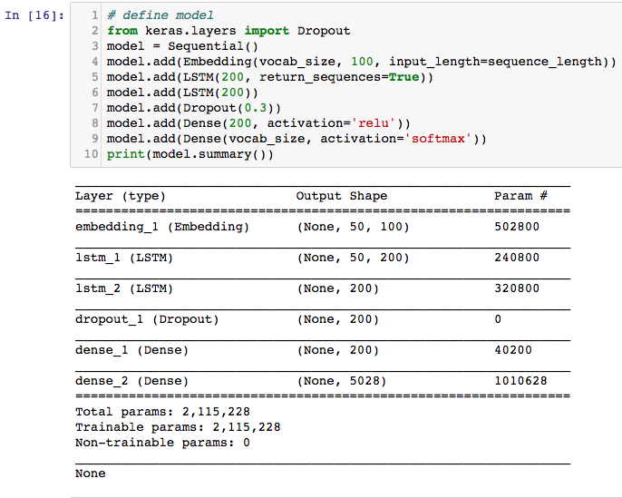
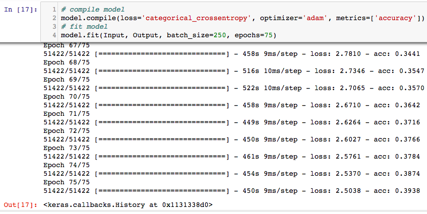
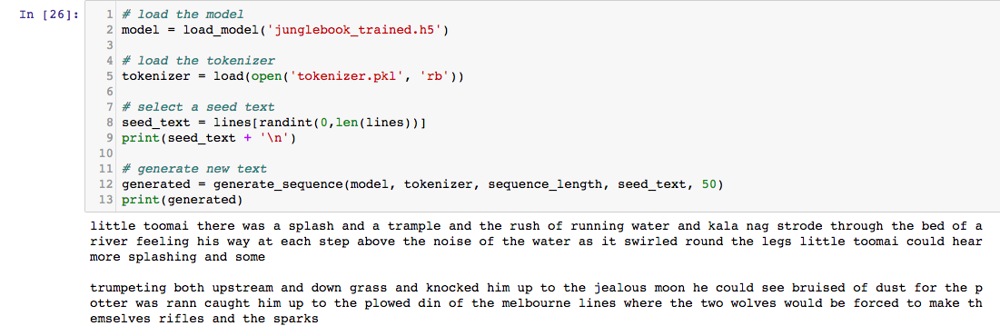

 Using LSTMs in Generative Networks
------------------------------------------------------

After reading this lab, you will be able to accomplish the
following:


-   Downloading novels/books that will be used as input text
-   Preparing and cleansing data
-   Tokenizing sentences
-   Training and saving the LSTM model
-   Generating similar text using the model

Introduction
------------------------------

Due to the drawbacks of **recurrent neural
networks** (**RNNs**) when it comes to backpropagation, **Long Short-Term Memory
Units** (**LSTMs**) and **Gated Recurrent
Units** (**GRUs**) have been gaining popularity in
recent times when it comes to learning
sequential input data as they are better
suited to tackle problems of vanishing and exploding gradients.

Downloading novels/books that will be used as input text
--------------------------------------------------------------------------

In this recipe, we will go the steps that we need to download the
novels/books which we will use as input text for the execution of this
recipe.


### Getting ready


-   Place the input data in the form of a
    `.txt` file in the working directory.
-   The input may be any kind of text, such as song lyrics, novels,
    magazine articles, and source code.
-   Most of the classical texts are no longer protected by copyright and
    may be downloaded for free and used in experiments. The best place
    to get access to free books is Project
    [Gutenberg](http://www.gutenberg.org/).
-   In this lab, we will be using [*The Jungle course*] by
    Rudyard Kipling as the input to train our model and generate
    statistically similar text as output. The following screenshot shows
    you how to download the necessary file in `.txt` format:


-   After visiting the website and searching for the required course,
    click on **`Plain Text UTF-8`** and download it. UTF-8 basically
    specifies the type of encoding. The text may be copied and pasted or
    saved directly to the working directory by clicking on the link.


### How to do it\...

Before beginning, it always helps to take a look at the
data and analyze it. After looking at the
data, we can see that there are a lot of punctuation marks, blank
spaces, quotes, and uppercase as well as lowercase letters. We need to
prepare the data first before performing any kind of analysis on it or
feeding it into the LSTM network. We require a number of libraries that
will make handling data easier :

1.  Import the necessary libraries by issuing the following commands:

```
from keras.preprocessing.text import Tokenizer
from keras.utils import to_categorical
from keras.models import Sequential
from keras.layers import Dense, lSTM, Dropout, Embedding
import numpy as np
from pickle import dump
import string
```


2.  The output to the preceding commands looks like the following
    screenshot:


3.  It is always a good idea to double check the current working
    directory and choose the required folder as the working directory.
    In our case, the `.txt` file is named
    `junglebook.txt`. So, we will select that folder as the working
    directory for the whole lab. This may be done as shown in the
    following screenshot:


4.  Next, load the file into the program\'s memory by defining a
    function named `load_document`, which can be done by
    issuing the following commands:

```
def load_document(name):
    file = open(name, 'r')
    text = file.read()
    file.close()
    return text
```


5.  Use the previously defined function to load the document into memory
    and print the first `2000` characters of the text file
    using the following script:

```
input_filename = 'junglebook.txt'
doc = load_document(input_filename)
print(doc[:2000])
```


6.  Running the preceding function as well as the commands produces the
    output  shown in the following screenshots:


The output to the above code is shown in the screenshot here:


The following screenshot is a continuation of the previous output:


7.  As seen in the preceding screenshots, the first `2000`
    characters from the `.txt` file are printed. It is always
    a good idea to analyze the data by looking at it before performing
    any preprocessing on it. It will give a better idea of how to
    approach the preprocessing steps.


### How it works\...

1.  The `array` function will be used to handle
    data in the form of arrays. The
    `numpy` library provides this function readily.
2.  Since our data is only text data, we will require the string library
    to handle all input data as strings before encoding the words as
    integers, which can be fed.
3.  The `tokenizer` function will be used to split all the
    sentences into tokens, where each token represents a word.
4.  The pickle library will be required in order to save the dictionary
    into a pickle file by using the `dump` function.
5.  The `to_categorical` function from the `keras`
    library converts a class vector (integers) to a binary class matrix,
    for example, for use with `categorical_crossentropy`,
    which we will require at a later stage in order to map tokens to
    unique integers and vice versa.
6.  Some of the other Keras layers required in this lab are the LSTM
    layer, dense layer, dropout layer, and the embedding layer. The
    model will be defined sequentially, for which we require the
    sequential model from the `keras` library.


### There\'s more\...


-   You may also use the same model with different types of texts, such
    as customer reviews on websites, tweets, structured text such as
    source code, mathematics theories, and so on.
-   The idea of this lab to understand how LSTMs learn long-term
    dependencies and how they perform better at processing sequential
    data when compared to recurrent neural networks.
-   Another good idea would be to input [*Pokémon*] names
    into the model and try to generate your own Pokémon names.


### See also

More information about the different libraries used can be found at the
following links:


-   <https://www.scipy-lectures.org/intro/numpy/array_object.html>
-   <https://docs.python.org/2/library/string.html>
-   <https://wiki.python.org/moin/UsingPickle>
-   <https://keras.io/preprocessing/text/>
-   <https://keras.io/layers/core/>
-   <https://keras.io/layers/recurrent/>

Preparing and cleansing data
----------------------------------------------

This section of this lab will discuss the
various data preparation and text
preprocessing steps involved before feeding it into the model as input.
The specific way we prepare the data really depends on how we intend to
model it, which in turn depends on how we intend to use it.


### Getting ready

The language model will be based on statistics and predict the
probability of each word given an input sequence of text. The predicted
word will be fed in as input to the model, to, in turn, generate the
next word.

A key decision is how long the input sequences should be. They need to
be long enough to allow the model to learn the context for the words to
predict. This input length will also define the length of the seed text
used to generate new sequences when we use the model.

For the purpose of simplicity, we will arbitrarily pick a length of 50
words for the length of the input sequences.

### How to do it\...

Based on reviewing the text (which we did previously), the following are
some operations that could be performed to clean and preprocess the text
in the input file. We have presented a few options regarding text
preprocessing. However, you may want to explore more cleaning operations
as an exercise:


-   Replace dashes `–` with whitespaces so you can split words
    better
-   Split words based on whitespaces
-   Remove all punctuation from the input text in order to reduce the
    number of unique characters in the text that is fed into the model
    (for example, Why? becomes Why)
-   Remove all words that are not alphabetic to remove standalone
    punctuation tokens and emoticons
-   Convert all words from uppercase to lowercase in order to reduce the
    size of the total number of tokens further and remove any
    discrepancies and data redundancy


Vocabulary size is a decisive factor in language modeling and deciding
the training time for the model. A smaller vocabulary results in a more
efficient model that trains faster. While it is good to have a small
vocabulary in some cases, it helps to have a larger vocabulary in other
cases in order to prevent overfitting. In order to preprocess the data,
we are going to need a function that takes in the entire input text,
splits it up based on white spaces, removes all punctuation, normalizes
all cases, and returns a sequence of tokens. For this purpose, define
the `clean_document` function by issuing the following
commands:

```
 import string
 def clean_document(doc):
     doc = doc.replace('--', ' ')
     tokens = doc.split()
     table = str.maketrans('', '', string.punctuation)
     tokens = [w.translate(table) for w in tokens]
     tokens = [word for word in tokens if word.isalpha()]
     tokens = [word.lower() for word in tokens]
     return tokens
```


1.  The previously defined function will basically take the loaded
    document/file as its argument and return an array of clean tokens,
    as shown in the following screenshot:


2.  Next, print out some of the tokens and statistics just to develop a
    better understanding of what the `clean_document` function
    is doing. This step is done by issuing the following commands:

```
tokens = clean_document(doc)
print(tokens[:200])
print('Total Tokens: %d' % len(tokens))
print('Total Unique Tokens: %d' % len(set(tokens)))
```


3.  The output of the preceding set of commands prints the first two
    hundred tokens and is as shown in the following screenshots:


4.  Next, organize all these tokens into sequences, with each sequence
    containing 50 words (chosen arbitrarily) using the following
    commands:

```
 length = 50 + 1
 sequences = list()
 for i in range(length, len(tokens)):
     seq = tokens[i-sequence_length:i]
     line = ' '.join(seq)
     sequences.append(line)
 print('Total Sequences: %d' % len(sequences))
```


The total number of sequences formed from the document may be viewed by
printing them out, as shown in the following screenshot:


5.  Save all the generated tokens as well as sequences into a file in
    the working directory by defining the `save_doc` function
    using the following commands:

```
def save_document(lines, name):
    data = '\n'.join(lines)
    file = open(name, 'w')
    file.write(data)
    file.close()
```


To save the sequences, use the following two commands:

```
 output_filename = 'junglebook_sequences.txt'
 save_document(sequences, output_filename)
```


6.  This process is illustrated in the following screenshot:


7.  Next, load the saved document, which contains all the saved tokens
    and sequences, into the memory using the `load_document`
    function, which is defined as follows:

```
def load_document(name):
    file = open(name, 'r')
    text = file.read()
    file.close()
    return text

# function to load document and split based on lines
input_filename = 'junglebook_sequences.txt'
doc = load_document(input_filename)
lines = doc.split('\n')
```


### How it works\...

1.  The `clean_document` function removes all whitespaces, punctuation, uppercase text, and
    quotation marks, and splits the entire document into tokens, where each token is a word.
2.  By printing the total number of tokens and total unique tokens in
    the document, we will note that the `clean_document`
    function generated 51,473 tokens, out of which 5,027 tokens (or
    words) are unique.
3.  The `save_document` function then saves all of these
    tokens as well as unique tokens which are required to generate our
    sequences of 50 words each. Note how, by looping through all the
    generated tokens, we are able to generate a long list of 51,422
    sequences. These are the same sequences that will be used as input
    to train the language model.


4.  Before training the model on all 51,422 sequences, it is always a
    good practice to save the tokens as well as sequences to file. Once
    saved, the file can be loaded back into the memory using the defined
    `load_document` function.
5.  The sequences are organized as 50 input tokens and one output token
    (which means that there are 51 tokens per sequence). For predicting
    each output token, the previous 50 tokens will be used as the input
    to the model. We can do this by iterating over the list of tokens
    from token 51 onwards and taking the previous 50 tokens as a
    sequence, then repeating this process until the end of the list of
    all tokens.


### See also

Visit the following links for a better understanding of data preparation using various functions:


-   <https://docs.python.org/3/library/tokenize.html>
-   <https://keras.io/utils/>
-   <http://www.pythonforbeginners.com/dictionary/python-split>
-   <https://www.tutorialspoint.com/python/string_join.htm>
-   <https://www.tutorialspoint.com/python/string_lower.htm>

Tokenizing sentences
--------------------------------------

Before defining and feeding data into an LSTM
network it is important that the data is converted into a form which can
be understood by the neural network.
Computers understand everything in binary code (0s and 1s) and
therefore, the textual or data in string format needs to be converted
into one hot encoded variables.


### Getting ready

For understanding how one hot encoding works,
visit the following links:


-   <https://machinelearningmastery.com/how-to-one-hot-encode-sequence-data-in-python/>
-   <http://scikit-learn.org/stable/modules/generated/sklearn.preprocessing.OneHotEncoder.html>
-   <https://stackoverflow.com/questions/37292872/how-can-i-one-hot-encode-in-python>
-   <https://www.ritchieng.com/machinelearning-one-hot-encoding/>
-   <https://hackernoon.com/what-is-one-hot-encoding-why-and-when-do-you-have-to-use-it-e3c6186d008f>


### How to do it\...

After the going through the previous section you should be able to clean
the entire corpus and split up sentences. The next steps which involve
one hot encoding and tokenizing sentences can be done in the following
manner:

1.  Once the tokens and sequences are saved to a file and loaded into
    memory, they have to be encoded as integers since the word embedding
    layer in the model expects input sequences to be comprised of
    integers and not strings.
2.  This is done by mapping each word in the vocabulary to a unique
    integer and encoding the input sequences. Later, while making
    predictions, the predictions can be converted (or mapped) back to
    numbers to look up their associated words in the same mapping and
    reverse map back from integers to words.
3.  To perform this encoding, utilize the `Tokenizer` class in
    the Keras API. Before encoding, the tokenizer must be trained on the
    entire dataset so it finds all the unique tokens and assigns each
    token a unique integer. The commands to do so as are  follows:

```
tokenizer = Tokenizer()
tokenizer.fit_on_texts(lines)
sequences = tokenizer.texts_to_sequences(lines)
```


4.  You also need to calculate the size of the vocabulary before
    defining the embedding layer later. This is determined by
    calculating the size of the mapping dictionary.
5.  Therefore, when specifying the vocabulary size to the Embedding
    layer, specify it as 1 larger than the actual vocabulary. The
    vocabulary size is therefore defined as follows:

```
vocab_size = len(tokenizer.word_index) + 1
print('Vocabulary size : %d' % vocab_size)
```


6.  Now that once the input sequences have been encoded, they need to be
    separated into input and output elements, which can be done by array
    slicing.

7.  After separating, one hot encode the output word. This means
    converting it from an integer to an n-dimensional vector of 0
    values, one for each word in the vocabulary, with a 1 to indicate
    the specific word at the index of the word\'s integer value. Keras
    provides the `to_categorical()` function, which can be
    used to one hot encode the output words for each input-output
    sequence pair.

8.  Finally, specify to the Embedding layer how long input sequences
    are. We know that there are 50 words because the model was designed
    by specifying the sequence length as 50, but a good generic way to
    specify the sequence length is to use the second dimension (number
    of columns) of the input data's shape.

9.  This can be done by issuing the following commands:


 

```
sequences = array(sequences)
Input, Output = sequences[:,:-1], sequences[:,-1]
Output = to_categorical(Output, num_classes=vocab_size)
sequence_length = Input.shape[1]
```


### How it works\...

This section will describe the outputs you must see on executing the commands in the previous section:

1.  After running the commands for tokenizing the sentences and
    calculating vocabulary length you must see an output as shown in the
    following screenshot:


2.  Words are assigned values starting from 1 up to the total number of
    words (for example, 5,027 in this case). The Embedding layer needs
    to allocate a vector representation for each word in this vocabulary
    from index 1 to the largest index. The index of the word at the end
    of the vocabulary will be 5,027; that means the array must be
    5,027 + 1 in length.
3.  The output after array slicing and separating sentences into
    sequences of 50 words per sequence must look like the following
    screenshot:


4.  The `to_categorical()` function is used so that the model
    learns to predict the probability distribution for the next word.


### There\'s more\...

More information on reshaping arrays in Python can be found at the
following links:


-   <https://docs.scipy.org/doc/numpy/reference/generated/numpy.reshape.html>
-   <https://machinelearningmastery.com/index-slice-reshape-numpy-arrays-machine-learning-python/>


Training and saving the LSTM model
----------------------------------------------------

You can now train a statistical language
model from the prepared data.

The model that will be trained is a neural
language model. It has a few unique characteristics:


-   It uses a distributed representation for words so that different
    words with similar meanings will have a similar representation
-   It learns the representation at the same time as learning the model
-   It learns to predict the probability for the next word using the
    context of the previous 50 words


Specifically, you will use an Embedding Layer to learn the
representation of words, and a **Long
Short-Term Memory** (**LSTM**) recurrent neural
network to learn to predict words based on their context.


### Getting ready

The learned embedding needs to know the size of the vocabulary and the
length of input sequences as previously discussed. It also has a
parameter to specify how many dimensions will be used to represent each
word. That is the size of the embedding vector space.

Common values are 50, 100, and 300. We will use 100 here, but consider
testing smaller or larger values and evaluating metrics for those
values.

The network will be comprised of the following:


-   Two LSTM hidden layers with 200 memory cells each. More memory cells
    and a deeper network may achieve better results.

-   A dropout layer with a dropout of 0.3 or 30%, which will aid the
    network to depend less on each neuron/unit and reduce overfitting
    the data.

-   A dense fully connected layer with 200 neurons connects to the LSTM
    hidden layers to interpret the features extracted from the sequence.

-   The output layer, which predicts the next word as a single vector of
    the size of the vocabulary with a probability for each word in the
    vocabulary.

-   A softmax classifier is used in the second dense or fully connected
    layer to ensure the outputs have the characteristics of normalized
    probabilities (such as between 0 and 1).


### How to do it\...

1.  The model is defined using the following commands and is also
    illustrated in the following screenshot:

```
model = Sequential()
model.add(Embedding(vocab_size, 100, input_length=sequence_length))
model.add(LSTM(200, return_sequences=True))
model.add(LSTM(200))
model.add(Dropout(0.3))
model.add(Dense(200, activation='relu'))
model.add(Dense(vocab_size, activation='softmax'))
print(model.summary())
```





2.  Print the model summary just to ensure that the model is constructed
    as intended.
3.  Compile the model, specifying the categorical cross entropy loss
    needed to fit the model. The number of epochs is set to 75 and the
    model is trained in mini batches with a batch size of 250. This is
    done using the following commands:

```
 model.compile(loss='categorical_crossentropy', optimizer='adam', 
        metrics=['accuracy'])

 model.fit(Input, Output, batch_size=250, epochs=75)
```


4.  The output of the preceding commands is illustrated in the following
    screenshot:





5.  Once the model is done compiling, it is saved using the following
    commands:

```
model.save('junglebook_trained.h5')

dump(tokenizer, open('tokenizer.pkl', 'wb'))
```


### How it works\...

1.  The model is built using the `Sequential()` function in
    the Keras framework. The first layer in the model is an embedding
    layer that takes in the
    vocabulary size, vector dimension, and
    the input sequence length as its arguments.


2.  The next two layers are LSTM layers with 200 memory cells each. More
    memory cells and a deeper network can be experimented with to check
    if it improves accuracy.
3.  The next layer is a dropout layer with a dropout probability of 30%,
    which means that there is a 30% chance a certain memory unit is not
    used during training. This prevents overfitting of data. Again, the
    dropout probabilities can be played with and tuned accordingly.
4.  The final two layers are two fully connected layers. The first one
    has a `relu` activation function and the second has a
    softmax classifier. The model summary is printed to check whether
    the model is built according to requirements.
5.  Notice that in this case, the total number of trainable parameters
    are 2,115,228. The model summary also shows the number of parameters
    that will be trained by each layer in the model.
6.  The model is trained in mini batches of 250 over 75 epochs, in our
    case, to minimize training time. Increasing the number of epochs to
    over 100 and utilizing smaller batches while training greatly
    improves the model\'s accuracy while simultaneously reducing loss.
7.  During training, you will see a summary of performance, including
    the loss and accuracy evaluated from the training data at the end of
    each batch update. In our case, after running the model for 75
    epochs, we obtained an accuracy of close to 40%.
8.  The aim of the model is not to remember the text with 100% accuracy,
    but rather to capture the properties of the input text, such as
    long-term dependencies and structures that exist in natural language
    and sentences.
9.  The model, after it is done training, is saved in the working
    directory named `junglebook_trained.h5`.
10. We also require the mapping of words to integers when the model is
    later loaded into memory to make predictions. This is present in the
    `Tokenizer` object, which is also saved using
    the `dump ()` function in the `Pickle` library.


### There\'s more\...

Jason Brownlee\'s blogs on Machine Learning Mastery have a lot of useful
information on developing, training, and tuning machine learning models
for natural language processing. They can be
found at the following
links:<https://machinelearningmastery.com/deep-learning-for-nlp/><https://machinelearningmastery.com/lstms-with-python/>[https://machinelearningmastery.com/blog/](https://machinelearningmastery.com/deep-learning-for-nlp/)

### See also

Further information about different keras layers and
other functions used in this section can be
found at the following links:


-   <https://keras.io/models/sequential/>
-   <https://docs.python.org/2/library/pickle.html>
-   <https://keras.io/optimizers/>
-   <https://keras.io/models/model/>


Generating similar text using the model
---------------------------------------------------------

Now that you have a trained language model,
it can be used. In this case, you can use it to generate new sequences
of text that have the same statistical properties as the source text.
This is not practical, at least not for this example, but it gives a
concrete example of what the language model has learned.


### Getting ready

1.  Begin by loading the training sequences again. You may do so by
    using the `load_document()` function, which we developed
    initially. This is done by using the following code:

```
def load_document(name):
    file = open(name, 'r')
    text = file.read()
    file.close()
    return text

# load sequences of cleaned text
input_filename = 'junglebook_sequences.txt'
doc = load_document(input_filename)
lines = doc.split('\n')
```


The output of the preceding code is illustrated in the following
screenshot:


2.  Note that the input filename is now
    `'junglebook_sequences.txt'`, which will load the saved
    training sequences into the memory. We need the text so that we can
    choose a source sequence as input to the model for generating a new
    sequence of text.

3.  The model will require 50 words as input.

    Later, the expected length of input needs to be specified. This can
    be determined from the input sequences by calculating the length of
    one line of the loaded data and subtracting 1 for the expected
    output word that is also on the same line, as
    follows:`sequence_length = len(lines[0].split()) - 1`

4.  Next, load the trained and saved model into memory by executing the
    following commands:

```
 from keras.models import load_model
 model = load_model('junglebook.h5')
```


5.  The first step in generating text is preparing a seed input. Select
    a random line of text from the input text for this purpose. Once
    selected, print it so that you have some idea of what was used. This
    is done as follows:

```
from random import randint
seed_text = lines[randint(0,len(lines))]
print(seed_text + '\n')
```


### How to do it\...

1.  You are now ready to generate new words,
    one at a time. First, encode the seed text to integers using the
    same tokenizer that was used when training the model, which is done
    using the following
    code:`encoded = tokenizer.texts_to_sequences([seed_text])[0]`


2.  The model can predict the next word directly by
    calling `model.predict_classes()`, which will return the
    index of the word with the highest probability:

```
 prediction = model.predict_classes(encoded, verbose=0)
```


3.  Look up the index in the Tokenizers mapping to get the associated
    word, as shown in the following code:

```
 out_word = ''
 for word, index in tokenizer.word_index.items():
         if index == prediction:
                 out_word = word
                 break
```


4.  Append this word to the seed text and repeat the
    process. Importantly, the input sequence is going to get too long.
    We can truncate it to the desired length after the input sequence
    has been encoded to integers. Keras provides
    the `pad_sequences()` function which we can use to perform
    this truncation, as follows:

```
 encoded = pad_sequences([encoded], maxlen=seq_length, truncating='pre')
```


5.  Wrap all of this into a function
    called `generate_sequence()` that takes as input the
    model, the tokenizer, the input sequence length, the seed text, and
    the number of words to generate. It then returns a sequence of words
    generated by the model. You may use the following code to do so:

```
from random import randint
 from pickle import load
 from keras.models import load_model
 from keras.preprocessing.sequence import pad_sequences

 def load_document(filename):
     file = open(filename, 'r')
     text = file.read()
     file.close()
     return text

 def generate_sequence(model, tokenizer, sequence_length, seed_text, n_words):
     result = list()
     input_text = seed_text
     for _ in range(n_words):
         encoded = tokenizer.texts_to_sequences([input_text])[0]
         encoded = pad_sequences([encoded], maxlen=seq_length,                 truncating='pre')
         prediction = model.predict_classes(encoded, verbose=0)
         out_word = ''
             for word, index in tokenizer.word_index.items():
                 if index == prediction:
                     out_word = word
                     break
      input_text += ' ' + out_word
      result.append(out_word)
    return ' '.join(result)

 input_filename = 'junglebook_sequences.txt'
 doc = load_document(input_filename)
 lines = doc.split('\n')
 seq_length = len(lines[0].split()) - 1
```


### How it works\...

We are now ready to generate a sequence of
new words, given that we have some seed text :

1.  Start by loading the model into memory again using the following
    command:

```
 model = load_model('junglebook.h5')
```


2.  Next, load the tokenizer by typing the following command:

```
 tokenizer = load(open('tokenizer.pkl', 'rb'))
```


3.  Select a seed text randomly by using the following command:

```
 seed_text = lines[randint(0,len(lines))]
 print(seed_text + '\n')
```


4.  Finally, a new sequence is generated by using the following command:

```
 generated = generate_sequence(model, tokenizer, sequence_length,             seed_text, 50)
 print(generated)
```


5.  On printing the generated sequence, you will see an output similar
    to the one shown in the following screenshot:


6.  The model first prints 50 words of the random seed text followed by
    50 words of the generated text. In this case, the random seed text
    is as follows:[*Baskets of dried grass and put grasshoppers in them
    or catch two praying mantises and make them fight or string a
    necklace of red and black jungle nuts or watch a lizard basking on a
    rock or a snake hunting a frog near the wallows then they sing long
    long songs*]. The 50 words of
    text generated by the model, in this case, are as follows:[*with odd
    native quavers at the end of the review and the hyaena whom he had
    seen the truth they feel twitched to the noises round him for a
    picture of the end of the ravine and snuffing bitten and best of the
    bulls at the dawn is a native*]
7.  Note how the model outputs a sequence of random words it generated
    based on what it learned from the input text. You will also notice
    that the model does a reasonably good job of mimicking the input
    text and generating its own stories. Though the text does not make
    much sense, it gives valuable insight into how the model learns to
    place statistically similar words next to each other.


### There\'s more\...


-   Upon changing the random seed that was set, the
    output generated by the network also
    changes. You may not get the exact same output text as the preceding
    example, but it will be very similar to the input used to train the
    model.
-   The following are some screenshots of different results that were
    obtained by running the generated text piece multiple times:





-   The model even generates its own version of the project Gutenberg
    license, as can be seen in the following screenshot:


-   The model\'s accuracy can be improved to about 60% by increasing the
    number of epochs from about 100 to 200. Another method to increase
    the learning is by training the model in mini batches of about 50
    and 100. Try to play around with the different hyperparameters and
    activation functions to see what affects the results in the best
    possible way.
-   The model may also be made denser by including more LSTM and dropout
    layers while defining the model. However, know that it will only
    increase the training time if the model is more complex and runs
    over more epochs. 
-   After much experimentation, the ideal batch size was found to be
    between 50 to 100, and the ideal number of epochs to train the model
    was determined to be between 100 and 200.
-   There is no definitive way of performing the preceding task. You can
    also experiment with different text inputs to the model such as
    tweets, customer reviews, or HTML code.
-   Some of the other tasks that can be performed include using a
    simplified vocabulary (such as with all the stopwords removed) to
    further enhance the unique words in the dictionary; tuning the size
    of the embedding layer and the number of memory cells in the hidden
    layers; and extending the model to use a pre-trained model
    such as Google\'s Word2Vec (pre-trained
    word model) to see whether it results in a better model.
