Natural Language Processing with TF-IDF
-----------------------------------------------------------

In this lab, the following recipes will be covered:


-   Downloading the therapy bot session text dataset
-   Analyzing the therapy bot session dataset
-   Visualizing word counts in the dataset
-   Calculating sentiment analysis of text
-   Removing stop words from the text
-   Training the TF-IDF model
-   Evaluating TF-IDF model performance
-   Comparing model performance to a baseline score


Introduction
------------------------------

**Natural language processing** (**NLP**) is
all over the news lately, and if you ask five
different people, you will get ten different definitions. Recently NLP
has been used to help identify bots or trolls on the internet trying to
spread fake news or, even worse, tactics such as cyberbullying. In fact,
recently there was a case in Spain where a student at a school was
getting cyberbullied through social media accounts and it was having
such a serious effect on the health of the student that the teachers
started to get involved. The school reached out to researchers who were
able to help identify several potential sources for the trolls using NLP
methods such as TF-IDF. Ultimately, the list of potential students was
presented to the school and when confronted the actual suspect admitted
to being the perpetrator. The story was published in a paper
titled [*Supervised Machine Learning for the Detection of Troll Profiles
in Twitter Social Network: Application to a Real Case of
Cyberbullying*] by Patxi Galan-Garcıa, Jose Gaviria de la
Puerta, Carlos Laorden Gomez, Igor Santos, and Pablo Garcıa Bringas.

This paper highlights the ability to utilize several varying methods to
analyze text and develop human-like language processing. It is this
methodology that incorporates NLP into machine learning, deep learning,
and artificial intelligence. Having machines able to ingest text data
and potentially make decisions from that same text data is the core of
natural language processing. There are many algorithms that are used for
NLP, such as the following:


-   TF-IDF
-   Word2Vec
-   N-grams
-   Latent Dirichlet allocation (LDA)
-   Long short-term memory (LSTM)


This lab will focus on a dataset that contains conversations between
an individual and a chatbot from an online therapy website. The purpose
of the chatbot is to recognize conversations that need to be flagged for
immediate attention to an individual rather than continued discussion
with the chatbot. Ultimately, we will focus on using a TF-IDF algorithm
to perform text analysis on the dataset to determine whether the chat
conversation warrants a classification that needs to be escalated to an
individual or not. **TF-IDF** stands for **Term
Frequency-Inverse Document Frequency**. This is a technique
commonly used in algorithms to identify the
importance of a word in a document. Additionally, TF-IDF is easy to
compute especially when dealing with high word counts in documents and
has the ability to measure the uniqueness of a word. This comes in handy
when dealing with a chatbot data. The main goal is to quickly identify a
unique word that would trigger escalation to an individual to provide
immediate support.


Downloading the therapy bot session text dataset
------------------------------------------------------------------

This section will focus on downloading and
setting up the dataset that will be used for
NLP in this lab.


### Getting ready

The dataset that we will use in this lab is based on interactions
between a therapy bot and visitors to an online therapy website. It
contains 100 interactions and each interaction is tagged as either
`escalate` or `do_not_escalate`. If the discussion
warrants a more serious conversation, the bot will tag the discussion as
`escalate` to an individual. Otherwise, the bot will continue
the discussion with the user.

### How it works\...

This section walks through the steps for downloading the chatbot data.

1.  Access the dataset from the following GitHub
    repository: <https://github.com/asherif844/ApacheSparkDeepLearningCookbook/tree/master/CH07/data>
2.  Once you arrive at the repository, right-click on the file seen in
    the following screenshot:


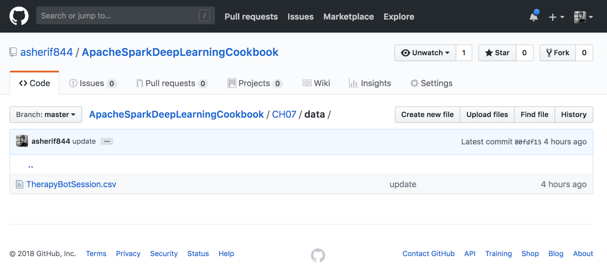


3.  Download `TherapyBotSession.csv`and save to the same local
    directory as the Jupyter notebook`SparkSession`.


 

4.  Access the dataset through the Jupyter notebook using the following
    script to build the `SparkSession` called
    `spark`, as well as to assign the dataset to a dataframe
    in Spark, called `df`:

```
spark = SparkSession.builder \
        .master("local") \
        .appName("Natural Language Processing") \
        .config("spark.executor.memory", "6gb") \
        .getOrCreate()
df = spark.read.format('com.databricks.spark.csv')\
     .options(header='true', inferschema='true')\
     .load('TherapyBotSession.csv')  
```


### How to do it\...

This section explains how the chatbot data
makes its way into our Jupyter notebook.

1.  The contents of the dataset can be seen by clicking on
    **`TherapyBotSession.csv`** on the repository as seen in the
    following screenshot:


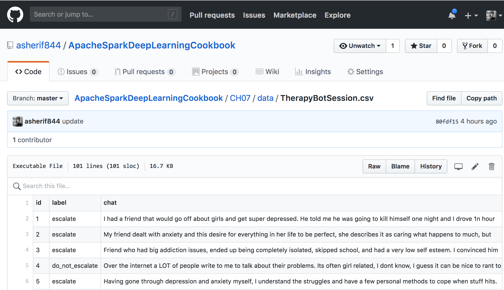


2.  Once the dataset is downloaded, it can be uploaded and converted
    into a dataframe, `df`. The dataframe can be viewed by
    executing `df.show()`, as seen in the following
    screenshot:


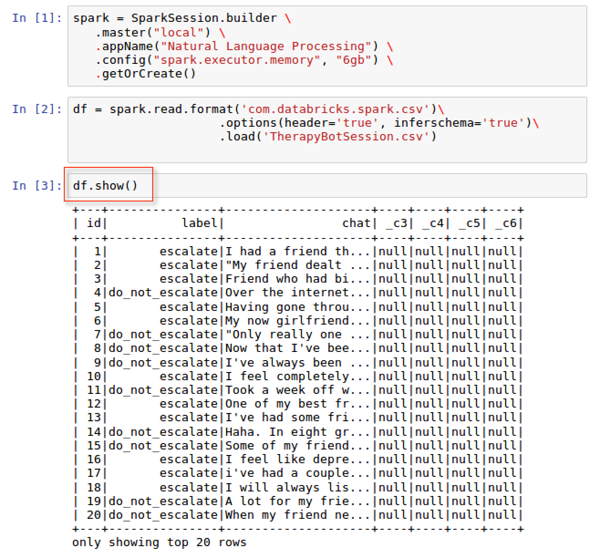


3.  There are 3 main fields that are of particular interest to us from
    the dataframe:

    1.  `id`: the unique id of each transaction between a
        visitor to the website and the chatbot.
    2.  `label`: since this is a supervised modeling approach
        where we know the outcome that we are trying to predict, each
        transaction has been classified as either `escalate`
        or `do_not_escalate`. This field will be used during
        the modeling process to train the text to identify words that
        would classify falling under one of these two scenarios.
    3.  `chat`: lastly we have the `chat` text from
        the visitor on the website that our model will classify.


### There\'s more\...

The dataframe, `df`, has some additional
columns, `_c3`, `_c4`, `_c5`, and
`_c6` that will not be used in the model and therefore, can be
excluded from the dataset using
the following script:

```
df = df.select('id', 'label', 'chat')
df.show()
```


The output of the script can be seen in the following screenshot:


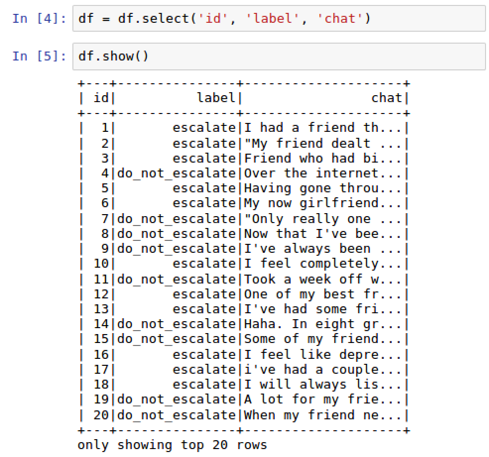

<div>

Analyzing the therapy bot session dataset
-----------------------------------------------------------

It is always important to first analyze any
dataset before applying models on that same
dataset


### Getting ready

This section will require importing `functions` from
`pyspark.sql` to be performed on our dataframe.

```
import pyspark.sql.functions as F
```


### How to do it\...

The following section walks through the steps to profile the text data.

1.  Execute the following script to group the `label` column
    and to generate a count distribution:

```
df.groupBy("label") \
   .count() \
   .orderBy("count", ascending = False) \
   .show()
```


2.  Add a new column, `word_count`, to the
    dataframe, `df`, using the following script:

```
import pyspark.sql.functions as F
df = df.withColumn('word_count', F.size(F.split(F.col('response_text'),' ')))
```


3.  Aggregate the average word count, `avg_word_count`,
    by `label` using the following script:

```
df.groupBy('label')\
  .agg(F.avg('word_count').alias('avg_word_count'))\
  .orderBy('avg_word_count', ascending = False) \
  .show()
```


### How it works\...

The following section explains the feedback obtained from analyzing the
text data.

1.  It is useful to collect data across multiple rows and group the
    results by a dimension. In this case, the dimension is
    `label`. A `df.groupby()` function is used to
    measure the count of 100 therapy transactions online distributed
    by `label`. We can see that there is a
    `65`:`35` distribution of
    `do_not_escalate` to `escalate` as seen in the
    following screenshot:


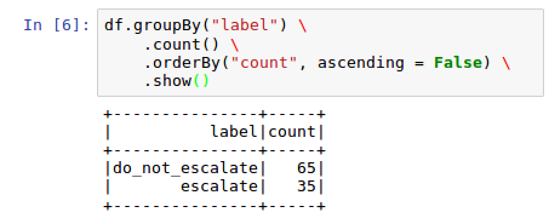


2.  A new column, `word_count`, is created to calculate how
    many words are used in each of the 100 transactions
    between the chatbot and
    the online visitor. The newly created
    column, `word_count`, can be seen in the following
    screenshot:


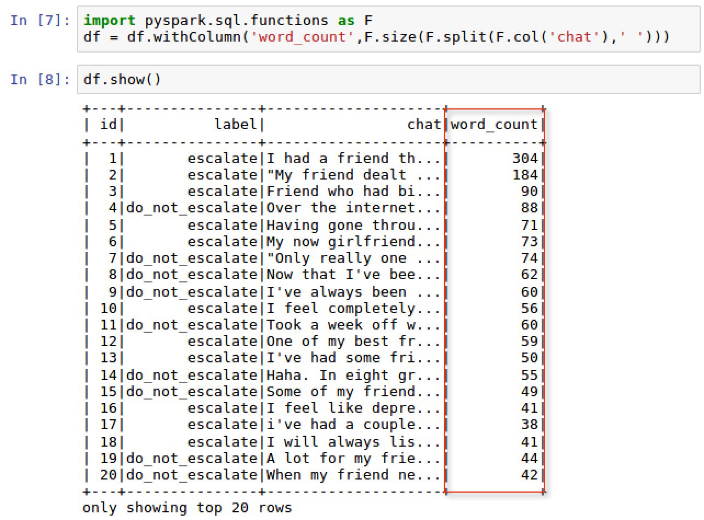


3.  Since the `word_count` is now added to the dataframe, it
    can be aggregated to calculate the average word count
    by `label`. Once this is performed, we can see that
    `escalate` conversations on average are more than twice as
    long as `do_not_escalate` conversations, as seen in the
    following screenshot:


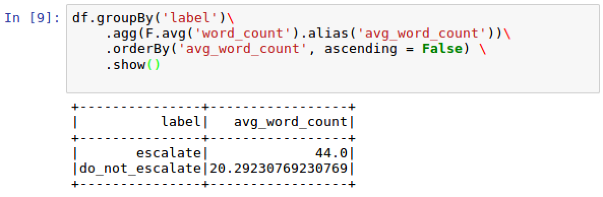

Visualizing word counts in the dataset
--------------------------------------------------------

A picture is worth a thousand words and this
section will set out to prove that. Unfortunately, Spark does not have
any inherent plotting capabilities as of
version 2.2. In order to plot values in a dataframe, we must convert to
`pandas`. 


### Getting ready

This section will require importing `matplotlib` for plotting:

```
import matplotlib.pyplot as plt
%matplotlib inline
```


### How to do it\...

This section walks through the steps to convert the Spark dataframe into
a visualization that can be seen in the Jupyter notebook. 

1.  Convert Spark dataframe to a `pandas` dataframe using the
    following script:

```
df_plot = df.select('id', 'word_count').toPandas()
```


2.  Plot the dataframe using the following script:

```
import matplotlib.pyplot as plt
%matplotlib inline

df_plot.set_index('id', inplace=True)
df_plot.plot(kind='bar', figsize=(16, 6))
plt.ylabel('Word Count')
plt.title('Word Count distribution')
plt.show()
```


### How it works\...

This section explains how the Spark dataframe is converted to
`pandas` and then plotted.

1.  A subset of the Spark dataframe is collected and converted to
    `pandas` using the `toPandas()` method in Spark.
2.  That subset of data is then plotted using matplotlib setting the
    y-values to be `word_count` and the x-values to be the
    `id` as seen in the following screenshot:


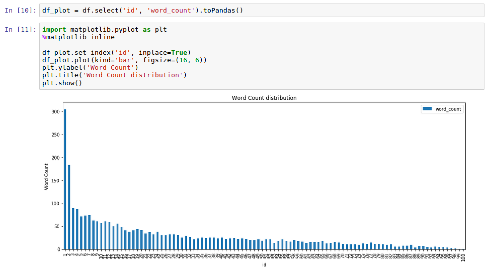


### See also

There are other plotting capabilities in
Python other than `matplotlib` such
as `bokeh`, `plotly`, and `seaborn`.

To learn more about `bokeh`, visit the following website:

<https://bokeh.pydata.org/en/latest/>

To learn more about `plotly`, visit the following website:

<https://plot.ly/>

To learn more about `seaborn`, visit the following website:

<https://seaborn.pydata.org/>

Calculating sentiment analysis of text
--------------------------------------------------------

Sentiment analysis is the ability to derive
tone and feeling behind a word or series of words. This section will
utilize techniques in python to calculate a
sentiment analysis score from the 100 transactions in our dataset.


### Getting ready

This section will require using functions and data types within PySpark.
Additionally, we well importing the `TextBlob` library for
sentiment analysis. In order to use SQL and data type functions within
PySpark, the following must be imported:

```
from pyspark.sql.types import FloatType 
```


Additionally, in order to use `TextBlob`, the following
library must be imported:

```
from textblob import TextBlob
```


### How to do it\...

The following section walks through the steps to apply sentiment score
to the dataset.

1.  Create a sentiment score function, `sentiment_score`,
    using the following script:

```
from textblob import TextBlob
def sentiment_score(chat):
    return TextBlob(chat).sentiment.polarity
```


2.  Apply `sentiment_score` to each conversation response in
    the dataframe using the following script:
3.  Create a `lambda` function, called
    `sentiment_score_udf`, that maps
    `sentiment_score` into a user-defined function within
    Spark, `udf`, to each transaction and specifies the output
    type of `FloatType()` as seen in the following script:

```
from pyspark.sql.types import FloatType
sentiment_score_udf = F.udf(lambda x: sentiment_score(x), FloatType())
```


4.  Apply the function, `sentiment_score_udf`, to each
    `chat` column in the dataframe as seen in the following
    script:

```
df = df.select('id', 'label', 'chat','word_count',
                   sentiment_score_udf('chat').alias('sentiment_score'))
```


5.  Calculate the average sentiment score,
    `avg_sentiment_score`, by `label` using the
    following script:

```
df.groupBy('label')\
     .agg(F.avg('sentiment_score').alias('avg_sentiment_score'))\
     .orderBy('avg_sentiment_score', ascending = False) \
     .show()
```


### How it works\...

This section explains how a Python function is converted
into a user-defined function,
`udf`, within Spark to apply a sentiment analysis score to
each column in the dataframe.

1.  `Textblob`is a sentiment analysis library in Python. It
    can calculate the sentiment score from a method
    called`sentiment.polarity`that is scored from -1 (very
    negative) to +1 (very positive) with 0 being neutral.
    Additionally,`Textblob`can measure subjectivity from 0
    (very objective) to 1 (very subjective); although, we will not be
    measuring subjectivity in this lab.
2.  There are a couple of steps to applying a Python function to Spark
    dataframe:

    1.  `Textblob`is imported and a function
        called`sentiment_score`is applied to
        the`chat`column to generate the sentiment polarity of
        each bot conversation in a new column, also
        called`sentiment_score`.
    2.  A Python function cannot be directly applied to a Spark
        dataframe without first going through a user-defined function
        transformation,`udf`, within Spark.
    3.  Additionally, the output of the function must also be explicitly
        stated, whether it be an integer or float data type. In our
        situation, we explicitly state that the output of the function
        will be using the`FloatType() from pyspark.sql.types`.
        Finally, the sentiment is applied across each row using
        a`lambda`function within the`udf`sentiment
        score function, called`sentiment_score_udf`.


4.  The updated dataframe with the newly created
    field,`sentiment score`, can be seen by
    executing `df.show()`, as shown in the following
    screenshot:


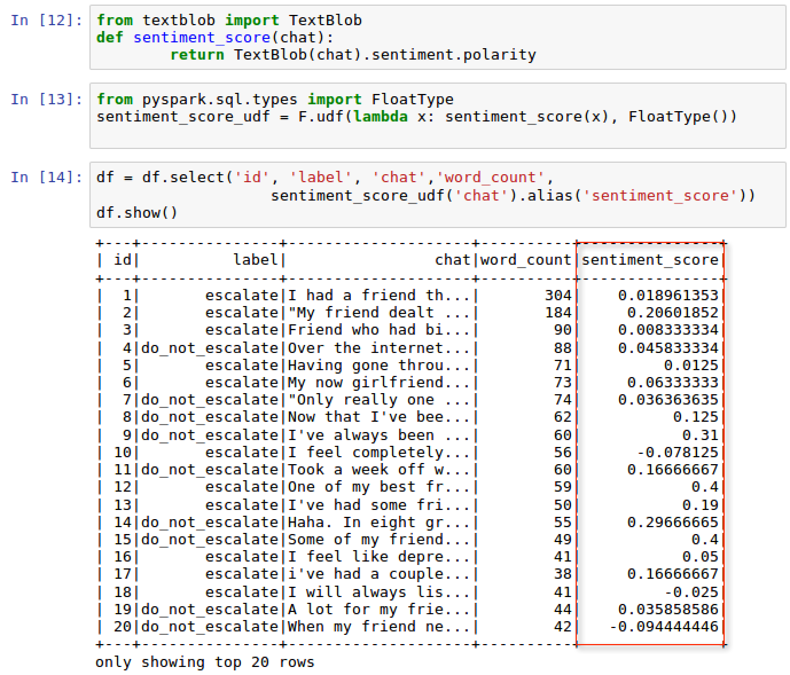


5.  Now that the `sentiment_score` is calculated for each
    response from the chat conversation, we can denote a value range of
    -1 (very negative polarity) to +1 (very positive polarity) for each
    row. Just as we did with counts and average word count, we can
    compare whether `escalate` conversations are more positive
    or negative in sentiment than `do_not_escalate`
    conversations on average. We can calculate an average sentiment
    score, `avg_sentiment_score`, by `label` as seen
    in the following screenshot:


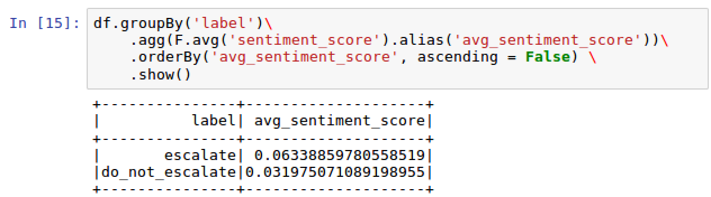


6.  Initially, it would make sense to assume that `escalate`
    conversations would be more negative from a polarity score than
    `do_not_escalate`. We actually find that
    `escalate` is slightly more positive in polarity than
    `do_not_escalate`; however, both are pretty neutral as
    they are close to 0.


### See also

To learn more about the `TextBlob`
library, visit the following website:

<http://textblob.readthedocs.io/en/dev/>

Removing stop words from the text
---------------------------------------------------

A stop word is a very common word used in the
English language and is often removed from
common NLP techniques because they can be distracting. Common stop word
would be words such as [*the*] or [*and*]. 


### Getting ready

This section requires importing the following libraries:

```
from pyspark.ml.feature import StopWordsRemover 
from pyspark.ml import Pipeline
```


### How to do it\...

This section walks through the steps to remove stop words.

1.  Execute the following script to extract each word in
    `chat` into a string within an array:

```
df = df.withColumn('words',F.split(F.col('chat'),' '))
```


2.  Assign a list of common words to a variable, `stop_words`,
    that will be considered stop words using the following script:

```
stop_words = ['i','me','my','myself','we','our','ours','ourselves',
'you','your','yours','yourself','yourselves','he','him',
'his','himself','she','her','hers','herself','it','its',
'itself','they','them','their','theirs','themselves',
'what','which','who','whom','this','that','these','those',
'am','is','are','was','were','be','been','being','have',
'has','had','having','do','does','did','doing','a','an',
'the','and','but','if','or','because','as','until','while',
'of','at','by','for','with','about','against','between',
'into','through','during','before','after','above','below',
'to','from','up','down','in','out','on','off','over','under',
'again','further','then','once','here','there','when','where',
'why','how','all','any','both','each','few','more','most',
'other','some','such','no','nor','not','only','own','same',
'so','than','too','very','can','will','just','don','should','now']
```


3.  Execute the following script to import
    the `StopWordsRemover` function from PySpark and configure
    the input and output columns, `words` and
    `word without stop`:

```
from pyspark.ml.feature import StopWordsRemover 

stopwordsRemovalFeature = StopWordsRemover(inputCol="words", 
                   outputCol="words without stop").setStopWords(stop_words)
```


4.  Execute the following script to import Pipeline and define the
    `stages` for the stop word transformation process that
    will be applied to the dataframe:

```
from pyspark.ml import Pipeline

stopWordRemovalPipeline = Pipeline(stages=[stopwordsRemovalFeature])
pipelineFitRemoveStopWords = stopWordRemovalPipeline.fit(df)
```


5.  Finally, apply the stop word removal transformation,
    `pipelineFitRemoveStopWords`, to the dataframe,
    `df`, using the following script:

```
df = pipelineFitRemoveStopWords.transform(df)
```


### How it works\...

This section explains how to remove
stop words from the text.

1.  Just as we did by applying some analysis when profiling and
    exploring the `chat` data, we can also tweak the text of
    the `chat` conversation and break up each word into a
    separate array. This will be used to isolate stop words and remove
    them.
2.  The new column with each word extracted as a string is called
    `words` and can be seen in the following screenshot:


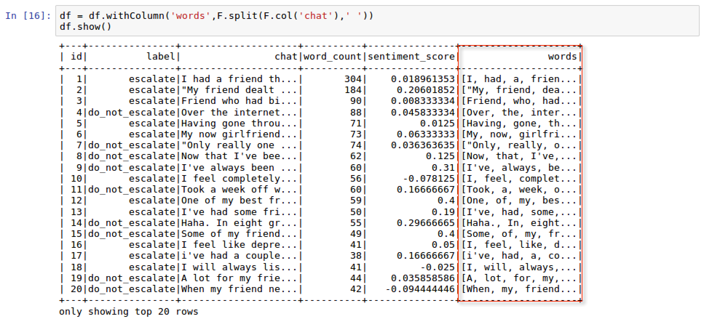


3.  There are many ways to assign a group of words to a stop word list.
    Some of these words can be automatically downloaded and updated
    using a proper Python library called `nltk`, which stands
    for natural language toolkit. For our purposes, we will utilize a
    common list of 124 stop words to generate our own list. Additional
    words can be easily added or removed from the list manually.


 

4.  Stop words do not add any value to the text and will be removed from
    the newly created column by
    specifying `outputCol="words without stop"`. Additionally,
    the column that will serve as the source for the transformation is
    set by specifying `inputCol = "words"`.


5.  We create a pipeline, `stopWordRemovalPipeline`, to define
    the sequence of steps or `stages` that will transform the
    data. In this situation, the only stage that will be used to
    transform the data is the feature, `stopwordsRemover`.
6.  Each stage in a pipeline can have a transforming role and an
    estimator role. The estimator role, `pipeline.fit(df)`, is
    called on to produce a transformer function
    called `pipelineFitRemoveStopWords`. Finally,
    the `transform(df)` function is called on the dataframe to
    produce an updated dataframe with a new column
    called `words without stop`. We can compare both columns
    side by side to examine the differences as seen in the following
    screenshot:


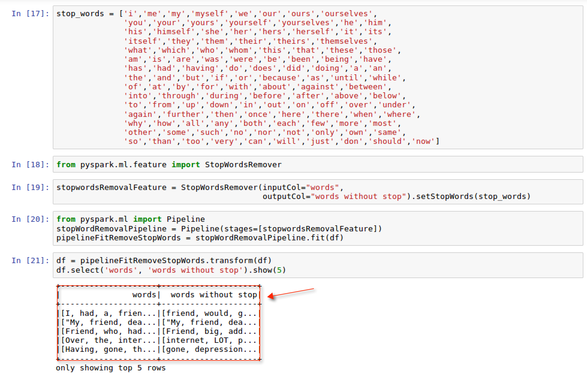


7.  The new column, `words without stop`, contains none of the
    strings that are considered stop words from the original column,
    `words`. 


### See also

To learn more about stop words from
`nltk`, visit the following
website:

<https://www.nltk.org/data.html>

To learn more about Spark machine learning pipelines, visit
the following website:

<https://spark.apache.org/docs/2.2.0/ml-pipeline.html>

To learn more about the `StopWordsRemover` feature in PySpark,
visit the following website:

<https://spark.apache.org/docs/2.2.0/api/python/pyspark.ml.html#pyspark.ml.feature.StopWordsRemover>

Training the TF-IDF model
-------------------------------------------

We are now ready to train our TF-IDF NLP model and see if we
can classify these transactions as either
`escalate` or `do_not_escalate`.


### Getting ready

This section will require importing from `spark.ml.feature`
and `spark.ml.classification`.

### How to do it\...

The following section walks through the steps to train the TF-IDF model.

1.  Create a new user-defined function, `udf`, to define
    numerical values for the `label` column using the
    following script:

```
label = F.udf(lambda x: 1.0 if x == 'escalate' else 0.0, FloatType())
df = df.withColumn('label', label('label'))
```


2.  Execute the following script to set the TF and IDF columns for the
    vectorization of the words:

```
import pyspark.ml.feature as feat
TF_ = feat.HashingTF(inputCol="words without stop", 
                     outputCol="rawFeatures", numFeatures=100000)
IDF_ = feat.IDF(inputCol="rawFeatures", outputCol="features")
```


3.  Set up a pipeline, `pipelineTFIDF`, to set the sequence of
    stages for `TF_` and `IDF_` using the following
    script:

```
pipelineTFIDF = Pipeline(stages=[TF_, IDF_])
```


4.   Fit and transform the IDF estimator onto the dataframe,
    `df`, using the following script:

```
pipelineFit = pipelineTFIDF.fit(df)
df = pipelineFit.transform(df)
```


5.  Split the dataframe into a 75:25 split for model evaluation purposes
    using the following script:

```
(trainingDF, testDF) = df.randomSplit([0.75, 0.25], seed = 1234)
```


6.  Import and configure a classification model,
    `LogisticRegression`, using the following script:

```
from pyspark.ml.classification import LogisticRegression
logreg = LogisticRegression(regParam=0.25)
```


7.  Fit the logistic regression model, `logreg`, onto the
    training dataframe, `trainingDF.` A new
    dataframe, `predictionDF`, is created based on
    the `transform()` method from the logistic regression
    model, as seen in the following script:

```
logregModel = logreg.fit(trainingDF)
predictionDF = logregModel.transform(testDF)
```


### How it works\...

The following section explains to effectively
train a TF-IDF NLP model.

1.  It is ideal to have labels in a numerical format rather than a
    categorical form as the model is able to interpret numerical values
    while classifying outputs between 0 and 1. Therefore, all labels
    under the `label` column are converted to a
    numerical `label` of **`0.0`** or **`1.0`**, as seen in
    the following screenshot:


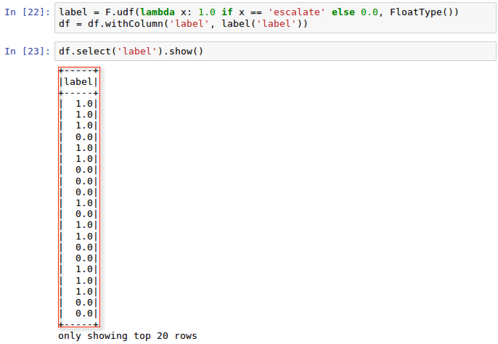


2.  TF-IDF models require a two-step approach by importing both
    `HashingTF` and `IDF`
    from `pyspark.ml.feature` to handle separate tasks. The
    first task merely involves importing
    both `HashingTF` and `IDF` and assigning values
    for the input and subsequent output columns.
    The `numfeatures` parameter is set to 100,000 to ensure
    that it is larger than the distinct number of words in the
    dataframe. If `numfeatures` were to be than the distinct
    word count, the model would be inaccurate.


 

3.  As stated earlier, each step of the pipeline contains a
    transformation process and an estimator process. The
    pipeline, `pipelineTFIDF`, is configured to order the
    sequence of steps where `IDF` will
    follow `HashingTF`.
4.  `HashingTF` is used to transform the
    `words without stop` into vectors within a new column
    called `rawFeatures`.
    Subsequently, `rawFeatures` will then be consumed
    by `IDF` to estimate the size and fit the dataframe to
    produce a new column called `features`, as seen in the
    following screenshot: 


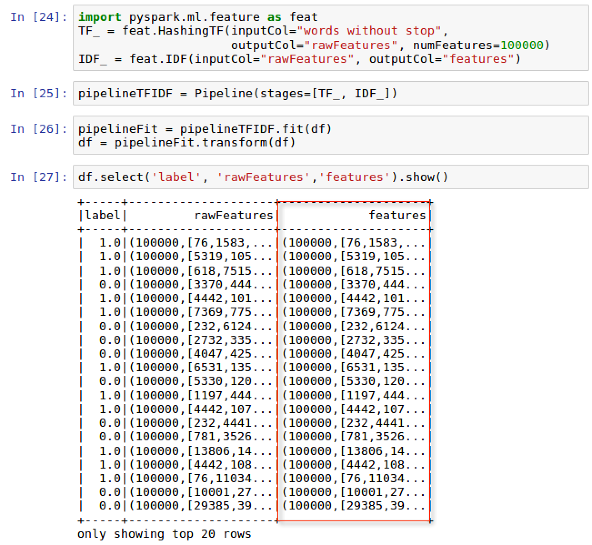


5.  For training purposes, our dataframe will be conservatively split
    into a `75`:`25` ratio with a random seed set at
    `1234`.


 

6.  Since our main goal is to classify each conversation as
    either `escalate` for escalation
    or `do_not_escalate` for continued bot chat, we can use a traditional classification
    algorithm such as a logistic regression model from the PySpark
    library. The logistic regression model is configured with a
    regularization parameter, `regParam`, of 0.025. We use the
    parameter to slightly improve the model by minimizing overfitting at
    the expense of a little bias. 
7.  The logistic regression model is trained and fitted
    on `trainingDF`, and then a new
    dataframe, `predictionDF`, is created with the newly
    transformed field, `prediction`, as seen in the following
    screenshot: 


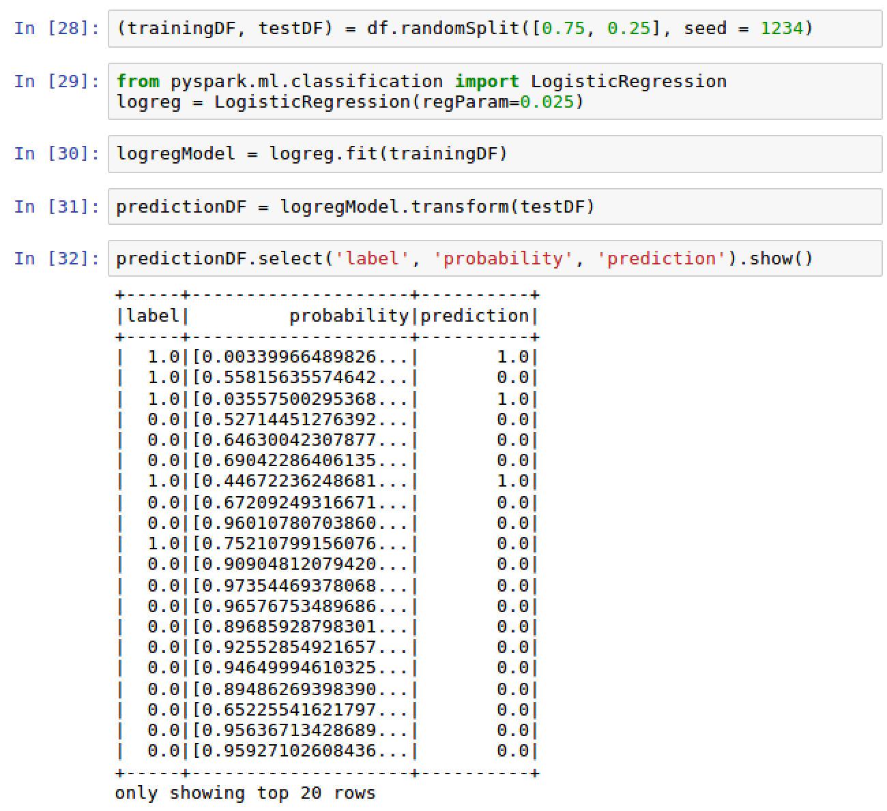


### There\'s more\...

While we did use the user-defined function,
`udf`, to manually create a numerical label column, we also
could have used a built-in feature from PySpark called
`StringIndexer` to assign numerical values to categorical
labels.

### See also

To learn more about the TF-IDF model within
PySpark, visit the following website:

<https://spark.apache.org/docs/latest/mllib-feature-extraction.html#tf-idf>

Evaluating TF-IDF model performance
-----------------------------------------------------

At this point, we are ready to evaluate our
model\'s performance


### Getting ready

This section will require importing the following libraries:


-   `metrics` from `sklearn` 
-   `BinaryClassificationEvaluator`
    from `pyspark.ml.evaluation`


### How to do it\...

This section walks through the steps to evaluate the TF-IDF NLP model.

1.  Create a confusion matrix using the following script:

```
predictionDF.crosstab('label', 'prediction').show()
```


2.  Evaluate the model using `metrics` from sklearn with the
    following script:

```
from sklearn import metrics

actual = predictionDF.select('label').toPandas()
predicted = predictionDF.select('prediction').toPandas()
print('accuracy score: {}%'.format(round(metrics.accuracy_score(actual,         predicted),3)*100))
```


3.  Calculate the ROC score using the following script:

```
from pyspark.ml.evaluation import BinaryClassificationEvaluator

scores = predictionDF.select('label', 'rawPrediction')
evaluator = BinaryClassificationEvaluator()
print('The ROC score is {}%'.format(round(evaluator.evaluate(scores),3)*100))
```


### How it works\...

This section explains how we use the
evaluation calculations to determine the accuracy of our model.

1.  A confusion matrix is helpful to quickly summarize the accuracy
    numbers between actual results and predicted results. Since we had a
    75:25 split, we should see 25 predictions from our training dataset.
    We can build a build a confusion matric using the following script:
    `predictionDF.crosstab('label', 'prediction').show()`. The
    output of the script can be seen in the following screenshot:


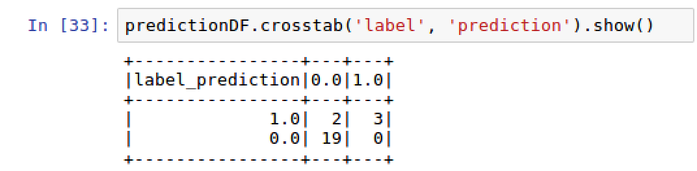


2.  We are now at the stage of evaluating the accuracy of the model by
    comparing the `prediction` values against the actual
    `label` values. `sklearn.metrics`intakes two
    parameters, the`actual`values tied to
    the`label`column, as well as
    the`predicted`values derived from the logistic regression
    model. 


### Note

Please note that once again we are converting the column values from
Spark dataframes to pandas dataframes using the `toPandas()`
method.


3.  Two variables are
    created,`actual`and`predicted`, and an accuracy
    score of **`91.7%`** is calculated using the
    `metrics.accuracy_score()` function, as seen in the
    following screenshot:


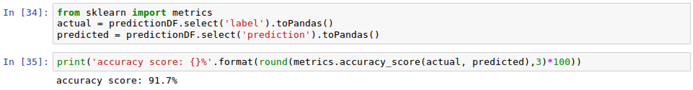


4.  The ROC (Receiver Operating Characteristic) is often associated with
    a curve measuring the true positive rate against the false positive
    rate. The greater the area under the curve, the better. The ROC
    score associated with the curve is another indicator that can be
    used to measure the performance of the model. We can calculate the
    `ROC` using the `BinaryClassificationEvaluator`
    as seen in the following screenshot:


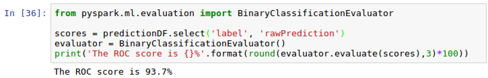


### See also

To learn more about the
`BinaryClassificationEvaluator` from PySpark, visit the
following website:

<https://spark.apache.org/docs/2.2.0/api/java/index.html?org/apache/spark/ml/evaluation/BinaryClassificationEvaluator.html>


Comparing model performance to a baseline score
-----------------------------------------------------------------

While it is great that we have a high
accuracy score from our model of 91.7 percent, it is also important to
compare this to a baseline score. We dig deeper into this concept in
this section.


### How to do it\...

This section walks through the steps to calculate the baseline accuracy.

1.  Execute the following script to retrieve the mean value from the
    `describe()` method:

```
predictionDF.describe('label').show()
```


2.  Subtract `1- mean value score` to calculate baseline
    accuracy.


### How it works\...

This section explains the concept behind the
baseline accuracy and how we can use it to understand the effectiveness
of our model.

1.  What if every `chat` conversation was flagged for
    `do_not_escalate` or vice versa. Would we have a baseline
    accuracy higher than 91.7 percent? The easiest way to figure this
    out is to run the `describe()` method on
    the `label` column from `predictionDF` using the
    following script: `predictionDF.describe('label').show()`
2.  The output of the script can be seen in the following screenshot:


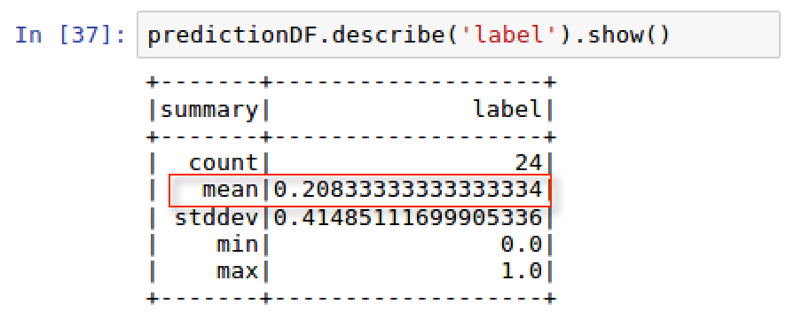


3.  The mean of `label` is at 0.2083 or \~21%, which means
    that a `label` of **`1`** occurs only 21% of the time.
    Therefore, if we labeled each conversation
    as `do_not_escalate`, we would be correct \~79% of the
    time, which is less than our model accuracy of 91.7%. 
4.  Therefore, we can say that our model performs better than a blind
    baseline performance model.


### See also

To learn more about the `describe()` method in a PySpark
dataframe, visit the following website:

<http://spark.apache.org/docs/2.2.0/api/python/pyspark.sql.html#pyspark.sql.DataFrame.describe>
