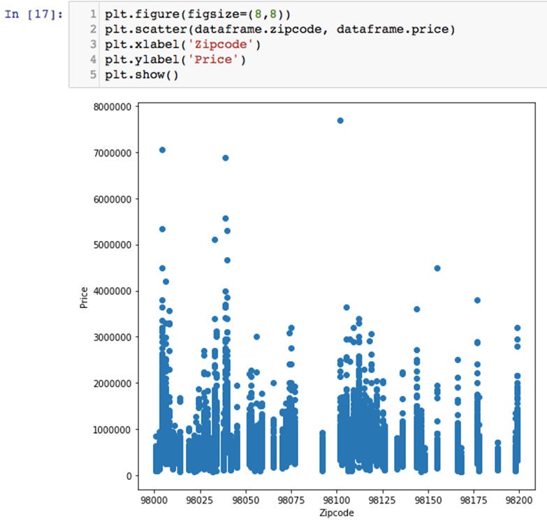
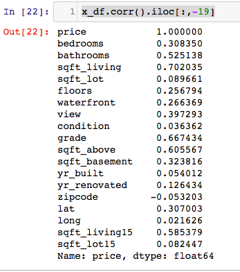
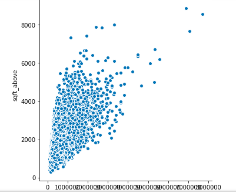

Real Estate Value Prediction Using XGBoost
--------------------------------------------------------------

The real estate market is one of the most competitive markets when it
comes to pricing. This tends to vary significantly based on a number of
factors such as the location, age of the property, size, and so on.
Therefore, it has become a modern-day challenge to accurately predict
the prices of properties (especially those in the housing market) in
order to make better investment decisions. This lab will deal with
precisely that.

After going through this lab, you will be able to:


-   Downloading the King County Housing sales dataset
-   Performing exploratory analysis and visualization
-   Plotting correlation between price and other features
-   Predicting the price of a house


Downloading the King County House sales dataset
-----------------------------------------------------------------

We can\'t build a model without a dataset.  We will download our data in
this section.


### Getting ready

Kaggle (<https://www.kaggle.com/>) is a platform for predictive modeling and
analytics competitions in which statisticians and data miners compete to
produce the best models for predicting and describing the datasets
uploaded by companies and users. The King County House Sales dataset
contains records of 21,613 houses sold in King County, New York between
1900 and 2015. The dataset also contains 21 different variables such as
location, zip code, number of bedrooms, area of the living space, and so
on, for each house.

### How to do it\...

1.  The dataset can be accessed from the following
    website: <https://www.kaggle.com/harlfoxem/housesalesprediction>. The
    dataset is from the public records of King County and is freely
    available to download and use in any analysis.

2.  Once you arrive at the website, you can click on the
    **`Download`** button, as shown in the following screenshot:


King County House Sales Dataset

3.  One file named `kc_house_data.csv` appears from the
    zipped, downloaded file, `housesalesprediction.zip`.
4.  Save the file named `kc_house_data.csv` in the current
    working directory as this will be our dataset. This will be loaded
    into the IPython notebook for analysis and predictions.


### How it works\...

1.  Install the necessary libraries for this lab using the following
    code:

```
import numpy as np
import pandas as pd
import matplotlib.pyplot as plt
import seaborn as sns
import mpl_toolkits
from sklearn import preprocessing
from sklearn.preprocessing import LabelEncoder, OneHotEncoder
from sklearn.feature_selection import RFE
from sklearn import linear_model
from sklearn.cross_validation import train_test_split %matplotlib inline
```


2.  The preceding step should result in an
    output, as shown in the following screenshot:


3.  It is always a good idea to check the current working directory and
    set it to the directory in which the dataset is stored. This is
    shown in the following screenshot:


4.  The data in the file is read into a Pandas dataframe named
    `dataframe` using the `read_csv()` function and
    the features/headers are listed out using the
    `list(dataframe)` command, as shown in the following
    screenshot:


As you may have noticed, the dataset contains 21 different variables
such as **`id`**, **`date`**, **`price`**, **`bedrooms`**,
**`bathrooms`**, and so on.

### There\'s more\...

The libraries used as well as their functions
in this lab are as follows:


-   `Numpy`, which is used to wrangle data in the form of
    arrays as well as store lists of names in the form of arrays
-   `Pandas`, which is used for all data wrangling and
    managing data in the form of dataframes
-   `Seaborn`, which is a visualization library required for
    exploratory analysis and plots
-   `MPL_Toolkits`, which contains a number of functions and
    dependencies required by `Matplotlib`
-   Functions from the `Scikit Learn` library, which is the
    primary scientific and statistical library required in this lab
-   We will also require some other libraries such
    as `XGBoost`, but those will be imported as required while
    building the model


### See also

Further documentation about the different
libraries can be found by visiting the following links:


-   <http://scikit-learn.org/stable/modules/preprocessing.html>
-   <http://scikit-learn.org/stable/modules/generated/sklearn.feature_selection.RFE.html>
-   <https://seaborn.pydata.org/>
-   <https://matplotlib.org/mpl_toolkits/index.html>


Performing exploratory analysis and visualization
-------------------------------------------------------------------

In situations where the goal is to predict a
variable such as `price`, it helps to visualize the data and
figure out how the dependent variable is being influenced by other variables.


### Getting ready


-   The head of the `dataframe` can be printed using the
    `dataframe.head()` function which produces an output, as
    shown in the following screenshot:


-   Similarly, the tail of the `dataframe` can be printed
    using the `dataframe.tail()` function, which produces an
    output, as shown in the following screenshot:


-   The `dataframe.describe()` function is used to obtain some
    basic statistics such as the maximum, minimum, and mean values under
    each column. This is illustrated in the following screenshot:


dataframe.describe() function output


-   As you can observe, the dataset has 21,613 records of houses sold
    between 1900 and 2015.
-   On taking a closer look at the statistics, we realize that most
    houses sold have about three bedrooms on average. We can also see
    that the minimum number of bedrooms in a house is 0 and the largest
    house has 33 bedrooms and a living area of 13,540 square feet.


### How to do it\...

1.  Let\'s plot the count of bedrooms in the
    whole dataset to see how three bedroom houses stand compared to
    houses with two or one bedrooms. This is done using the following
    code:

```
dataframe['bedrooms'].value_counts().plot(kind='bar') plt.title('No. of bedrooms')
plt.xlabel('Bedrooms')
plt.ylabel('Count')
sns.despine
```


2.  We can also plot a pie chart of the same data using the following
    commands:

```
 dataframe['bedrooms'].value_counts().plot(kind='pie')
plt.title('No. of bedrooms')
```


3.  Next, let\'s try to see the number of floors in houses that are sold
    most frequently in King County. This may be done by plotting a bar
    graph using the following commands:

```
dataframe['floors'].value_counts().plot(kind='bar') plt.title('Number of floors')
plt.xlabel('No. of floors')
plt.ylabel('Count')
sns.despine
```


4.  Next, we need to have an idea of what locations have the highest
    number of houses sold. We can do this by using the
    `latitude` and `longitude` variables from the
    dataset, as shown in the following code:

```
plt.figure(figsize=(20,20))
sns.jointplot(x=dataframe.lat.values, y=dataframe.long.values, size=9)
plt.xlabel('Longitude', fontsize=10)
plt.ylabel('Latitude', fontsize=10)
plt.show()
sns.despine()
```


5.  Let\'s also take a look at how the prices compare for houses with
    different numbers of bedrooms by executing the following commands:

```
 plt.figure(figsize=(20,20))
sns.jointplot(x=dataframe.lat.values, y=dataframe.long.values, size=9)
plt.xlabel('Longitude', fontsize=10)
plt.ylabel('Latitude', fontsize=10)
plt.show()
sns.despine()
```


6.  A plot of the price of houses versus the number of bedrooms is
    obtained using the following commands:

```
plt.figure(figsize=(20,20))
sns.jointplot(x=dataframe.lat.values, y=dataframe.long.values, size=9)
plt.xlabel('Longitude', fontsize=10)
plt.ylabel('Latitude', fontsize=10)
plt.show()
sns.despine()
```


7.  Similarly, let\'s see how the price compares to the living area of
    all the houses sold. This may be done by using the following
    commands:

```
plt.figure(figsize=(8,8))
plt.scatter(dataframe.price, dataframe.sqft_living)
plt.xlabel('Price')
plt.ylabel('Square feet')
plt.show()
```


8.  The condition of houses sold gives us some important information as
    well. Let\'s plot this against the prices to get a better idea of
    the general trends. This is done using the following commands:

```
plt.figure(figsize=(5,5))
plt.bar(dataframe.condition, dataframe.price)
plt.xlabel('Condition')
plt.ylabel('Price')
plt.show()
```


9.  We can see which zip codes have the most house sales in King County
    by using the following commands:

```
plt.figure(figsize=(8,8))
plt.scatter(dataframe.zipcode, dataframe.price)
plt.xlabel('Zipcode')
plt.ylabel('Price')
plt.show()
```


10. Finally, plot the grade of each house versus the price to figure out
    the trends in house sales based on the grade given to each house
    using the following commands:

```
plt.figure(figsize=(10,10))
plt.scatter(dataframe.grade, dataframe.price)
plt.xlabel('Grade')
plt.ylabel('Price')
plt.show()
```


### How it works\...

1.  The plot of bedroom counts must give an
    output, as shown in the following screenshot:


2.  It is evident that three bedroom houses are sold the most, followed
    by four bedroom houses, then by two bedroom houses, and then
    surprisingly by five bedroom and six bedroom houses. 


3.  The pie chart of the number of bedrooms gives an output that looks
    like the following screenshot:


4.  You will notice that three bedroom houses account for roughly 50% of
    all houses sold in King County. It looks like about 25% are four
    bedroom houses and the remaining 25% is made up of houses with two,
    five, six bedrooms, and so on.


5.  On running the script for most houses sold categorized by the number
    of floors, we notice the following output:


6.  It is quite clear that single floor houses sell the most, followed
    by two-story houses. The count of houses with more than two stories
    is rather low, which is perhaps an indication of family sizes and
    the income of residents living in King County.
7.  On inspecting the density of houses sold at different locations, we
    obtain an output, as shown in the following screenshots. It is
    pretty clear that some locations see a higher density of house sales
    compared to others:


8.  From the trends observed in the preceding figure, it is easy to
    notice how a greater number of houses are sold between latitudes
    -122.2 and -122.4. Similarly, the density of houses sold between
    longitudes 47.5 and 47.8 is higher compared to other longitudes.
    This could perhaps be an indication of safer and better-living
    communities compared to the other communities.


9.  On plotting the prices of houses versus
    the number of bedrooms in the house, we realize that the trends
    regarding the number of bedrooms in a house are directly
    proportional to the price up to six bedrooms, and then it becomes
    inversely proportional, as shown in the following screenshot:


10. Plotting the living area of each house against the price gives us an
    expected trend of increasing prices with the increasing size of the
    house. The most expensive house seems to have a living area of
    12,000 square feet, as shown in the following screenshot:


### There\'s more\...

1.  On plotting the condition of houses
    versus price, we again notice an expected trend of increasing prices
    with higher condition ratings, as shown in the following screenshot.
    Interestingly, five bedroom prices have a lower mean price compared
    to four bedroom houses, which is possibly due to lesser buyers for
    such a big house:


2.  A plot of the **`Zipcode`** of the house versus price shows trends
    in the prices of houses in different zip codes. You may have noticed
    that certain zip codes, like the ones between 98100 and 98125, have
    a higher density of houses sold compared to other areas, while the
    prices of houses in zip codes like 98040 are higher than the average
    price, perhaps indicating a richer neighborhood, as shown in the
    following screenshot:





3.  A plot of the grade of the house versus price shows a consistent
    increase in price with increasing grade. There seems to be a clear
    linear relationship between the two, as observed in the output of
    the following screenshots:


### See also

The following links give a good explanation
of why data visualization is so important before running any model on the data:


-   <https://www.slideshare.net/Centerline_Digital/the-importance-of-data-visualization>
-   <https://data-visualization.cioreview.com/cxoinsight/what-is-data-visualization-and-why-is-it-important-nid-11806-cid-163.html>
-   <https://www.techchange.org/2015/05/19/data-visualization-analysis-international-development/>


Plotting correlation between price and other features
-----------------------------------------------------------------------

Now that the initial exploratory analysis is
done, we have a better idea of how the different variables are
contributing to the price of each house. However, we have no idea of the
importance of each variable when it comes to predicting prices. Since we
have 21 variables, it becomes difficult to build models by incorporating
all variables in one single model. Therefore, some variables may need to
be discarded or neglected if they have lesser significance than other
variables.


### Getting ready

Correlation coefficients are used in statistics to measure how strong
the relationship is between two variables. In particular, Pearson\'s
correlation coefficient is the most commonly used coefficient while
performing linear regression. The correlation coefficient usually takes
on a value between -1 and +1:


-   A correlation coefficient of 1 means that for every positive
    increase in one variable, there is a positive increase of a fixed
    proportion in the other. For example, shoe sizes go up in (almost)
    perfect correlation with foot length.
-   A correlation coefficient of -1 means that for every positive
    increase in one variable, there is a negative decrease of a fixed
    proportion in the other. For example, the amount of gas in a tank
    decreases in (almost) perfect correlation with acceleration or the
    gear mechanism (more gas is used up by traveling for longer periods
    in first gear compared to fourth gear).
-   Zero means that for every increase, there isn\'t a positive or
    negative increase. The two just aren\'t related.


### How to do it\...

1.  Begin by dropping the `id` and `date` features
    from the dataset using the following commands. We will not be using
    them in our predictions as the ID variables are all unique and have
    no values in our analysis while the dates require a different
    function to handle them correctly. This is left as an exercise for
    the reader to do:

```
 x_df = dataframe.drop(['id','date',], axis = 1)
 x_df
```


2.  Copy the dependent variable (house prices, in this case) into a new
    `dataframe` using the following commands:

```
 y = dataframe[['price']].copy()
 y_df = pd.DataFrame(y)
 y_df
```


3.  The correlation between price and every other variable can be
    manually found using the following script:

```
 print('Price Vs Bedrooms: %s' % x_df['price'].corr(x_df['bedrooms']))
 print('Price Vs Bathrooms: %s' % x_df['price'].corr(x_df['bathrooms']))
 print('Price Vs Living Area: %s' % x_df['price'].corr(x_df['sqft_living']))
 print('Price Vs Plot Area: %s' % x_df['price'].corr(x_df['sqft_lot']))
 print('Price Vs No. of floors: %s' % x_df['price'].corr(x_df['floors']))
 print('Price Vs Waterfront property: %s' % x_df['price'].corr(x_df['waterfront']))
 print('Price Vs View: %s' % x_df['price'].corr(x_df['view']))
 print('Price Vs Grade: %s' % x_df['price'].corr(x_df['grade']))
 print('Price Vs Condition: %s' % x_df['price'].corr(x_df['condition']))
 print('Price Vs Sqft Above: %s' % x_df['price'].corr(x_df['sqft_above']))
 print('Price Vs Basement Area: %s' % x_df['price'].corr(x_df['sqft_basement']))
 print('Price Vs Year Built: %s' % x_df['price'].corr(x_df['yr_built']))
 print('Price Vs Year Renovated: %s' % x_df['price'].corr(x_df['yr_renovated']))
 print('Price Vs Zipcode: %s' % x_df['price'].corr(x_df['zipcode']))
 print('Price Vs Latitude: %s' % x_df['price'].corr(x_df['lat']))
 print('Price Vs Longitude: %s' % x_df['price'].corr(x_df['long']))
```


4.  Besides the preceding method, an easier way to find the correlation
    between one variable and all other variables (or columns) in a
    `dataframe` is done by using just one line in the
    following manner:`x_df.corr().iloc[:,-19]`
5.  The correlated variables may be plotted using the
    `seaborn` library and the following script:

```
 sns.pairplot(data=x_df,
 x_vars=['price'],
 y_vars=['bedrooms', 'bathrooms', 'sqft_living',
 'sqft_lot', 'floors', 'waterfront','view',
 'grade','condition','sqft_above','sqft_basement',
 'yr_built','yr_renovated','zipcode','lat','long'],
 size = 5)
```


### How it works\...

1.  After dropping the `id` and `date` variables,
    the new `dataframe`, which is named `x_df`,
    contains 19 variables or columns, as shown in the
    following screenshots. For the purposes
    of this course, only the first ten entries are printed out:


First 10 entries of output


2.  On creating a new `dataframe` with only the dependent
    variable (price), you will see an output as follows. This new
    `dataframe` is named `y_df`. Again, only the
    first ten entries of the price column are printed for illustration
    purposes:


3.  The correlation between price and other variables is shown in the
    following screenshot:


4.  You may have noticed that the `sqft_living` variable is
    most highly correlated with the price and has a correlation
    coefficient of 0.702035. The next most highly correlated variable is
    `grade`, with a correlation coefficient of 0.667434
    followed by `sqft_above`, which has a correlation
    coefficient of 0.605567. `Zipcode` is the least correlated
    variable with price and has a correlation coefficient of -0.053202.


### There\'s more\...


-   The correlation coefficients found using the simplified code gives
    the exact same values but also gives the correlation of price with
    itself, which turns out to be a value of 1.0000, as expected. This
    is illustrated in the following
    screenshot:





-   The coefficients of correlation plotted using the
    `seaborn` library are presented in the following
    screenshots. Note that price is on the x-axis for each plot:


 Plotting of coefficients of correlation





### See also

The following links give an excellent explanation of Pearson\'s
correlation coefficient and how it is manually
calculated:[https://en.wikipedia.org/wiki/Pearson\_correlation\_coefficient](https://en.wikipedia.org/wiki/Pearson_correlation_coefficient)<http://www.statisticshowto.com/probability-and-statistics/correlation-coefficient-formula/>


Predicting the price of a house
-------------------------------------------------

This section will deal with building a simple
linear model to predict house prices using all the features in the
current `dataframe`. We will then evaluate the model and try to improve the accuracy by using a more
complex model in the latter half of the section.


### Getting ready

Visit the following links to understand how linear
regression works and how to use the linear
regression model in the Scikit Learn
library:[https://en.wikipedia.org/wiki/Linear\_regression](https://en.wikipedia.org/wiki/Linear_regression)

<http://www.stat.yale.edu/Courses/1997-98/101/linreg.htm>

<https://newonlinecourses.science.psu.edu/stat501/node/251/>

<http://scikit-learn.org/stable/modules/generated/sklearn.linear_model.LinearRegression.html>

<http://scikit-learn.org/stable/modules/linear_model.html>

### How to do it\...

1.  Drop the `Price` column from the `x_df`
    dataframe and save it into a new `dataframe` named
    `x_df2` using the following script:

```
 x_df2 = x_df.drop(['price'], axis = 1)
```


2.  Declare a variable named `reg` and equate it to the
    `LinearRegression()` function from the Scikit Learn
    library using the following script:

```
 reg=linear_model.LinearRegression()
```


3.  Split the dataset into test and train using the following script:

```
 x_train,x_test,y_train,y_test = train_test_split(x_df2,y_df,test_size=0.4,random_state=4)
```


4.  Fit the model over the training set using the following script:

```
 reg.fit(x_train,y_train)
```


5.  Print the coefficients generated from applying linear regression to
    the training and test sets by using the `reg.coef_`
    command.
6.  Take a look at the column of predictions generated by the model
    using the following script:

```
 predictions=reg.predict(x_test)
 predictions
```


7.  Print the accuracy of the model using the following command:

```
 reg.score(x_test,y_test)
```


### How it works\...

1.  The output after fitting the regression
    model to the training sets must look like
    the following screenshot:


2.  The `reg.coeff_` command generates 18 coefficients, one
    for each variable in the dataset, as shown in the following
    screenshot:


3.  The coefficients of features/variables with the most positive values
    have a higher significance on price predictions when compared to the
    coefficients of features/variables which have negative values. This
    is the main importance of the regression coefficients.
4.  On printing the predictions, you must see an output which is an
    array of values from 1 to 21,612, one value for each row in the
    dataset, as shown in the following screenshot:


5.  Finally, on printing the accuracy of the model, we obtained an
    accuracy of 70.37%, which is not bad for a linear model. This is
    illustrated in the following screenshot:


### There\'s more\...

The linear model does alright at its first
attempt, but if we want our model to be more accurate, we will have to
use a more complex model with some
non-linearities in order to fit well to all the data points. XGBoost is
the model we will be using in this section in order to try and improve
the accuracy obtained through linear regression. This is done in the
following manner:

1.  Import the `XGBoost` library using the
    `import xgboost` command.
2.  In case this produces an error, you will have to do a pip install of
    the library through the terminal. This can be done by opening up a
    new terminal window and issuing the following command:

```
/usr/bin/ruby -e "$(curl -fsSL https://raw.githubusercontent.com/Homebrew/install/master/install)"
```


3.  At this stage, you must see an output which looks like the one shown
    in the following screenshot:


4.  At this stage, you will be prompted to enter your password. After
    homebrew is installed, you will see an output like the one shown in
    the following screenshot:


5.  Next, install Python using the following
    command:`brew install python`
6.  Check your installation using the `brew doctor` command
    and follow homebrew\'s suggestions.
7.  Once `Homebrew` is installed, do a pip install of XGBoost
    using the following command:`pip install xgboost`
8.  Once it finishes installing, you should be able to import XGBoost
    into the IPython environment.


Once XGBoost is imported successfully into the Jupyter environment, you
will be able to use the functions within the library to declare and
store the model. This can be done in the following steps:

9.  Declare a variable named `new_model` to store the model
    and declare all its hyperparameters using the following command:

```
new_model = xgboost.XGBRegressor(n_estimators=750, learning_rate=0.09,         gamma=0, subsample=0.65, colsample_bytree=1, max_depth=7)
```


10. The output of the preceding command must look like the one in the
    following screenshot:


11. Split the data into test and training sets and fit the new model to
    the split data using the following commands:

```
 from sklearn.model_selection import train_test_split
 traindf, testdf = train_test_split(x_train, test_size = 0.2)
 new_model.fit(x_train,y_train)
```


12. At this point, you will see an output like the one shown in the
    following screenshot:


13. Finally, use the newly fitted model to predict the house prices and
    evaluate the new model using the following commands:

```
 from sklearn.metrics import explained_variance_score
 predictions = new_model.predict(x_test)
 print(explained_variance_score(predictions,y_test))
```


14. On executing the preceding commands, you must see an output like the
    one shown in the following screenshot:


15. Notice that the new model\'s accuracy is now 87.79 %, which is
    approximately 88%. This is considered optimal.
16. In this case, the `number of estimators` is set to 750.
    After experimenting between 100 to 1,000, it was determined that 750
    estimators gave the most optimal accuracy. The
    `learning rate` is set to 0.09. `Subsample rate`
    is set at 65%. `Max_depth` is set at 7. There didn\'t seem
    to be too much influence of `max_depth` over the model\'s
    accuracy. However, the accuracy did show improvement in using slower
    learning rates. By experimenting with various hyperparameters, we
    were able to further improve accuracy to 89%.
17. Future steps involve one hot encoding variables such as bedrooms,
    bathrooms, floors, zipcodes, and so on, and normalizing all the
    variables before model fitting. Try to tune the hyperparameters such
    as learning rate, number of estimators in the XGBoost model,
    subsampling rates, and so on to see how they influence model
    accuracy. This is left as an exercise for the reader.
18. Also, you may want to try and use cross-validation along with
    XGBoost in order to figure out the optimal number of trees in the
    model, which would further improve accuracy. 
19. Another exercise that can be done is using different sizes of test
    and train datasets as well as incorporating the
    `date` variable during training. In our case, we have
    split it into a ratio of 80% training data and 20% test data. Try to
    increase the test set to 40% and see how the model accuracy changes.


### See also

Visit the following links to understand how
to tune the hyperparameters in the XGBoost
model as well as how to implement cross-validation with XGBoost:

<https://xgboost.readthedocs.io/en/latest/python/index.html>

<http://xgboost.readthedocs.io/en/latest/get_started/>

<https://www.kaggle.com/cast42/xg-cv>
