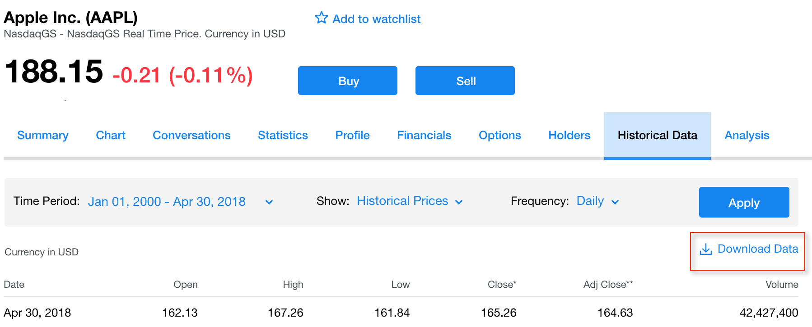

Predicting Apple Stock Market Cost with LSTM
----------------------------------------------------------------

Stock market predictions have been going on for many years and it has
spawned an entire industry of prognosticators. It shouldn\'t come as a
surprise since it can turn a significant profit if predicted properly.
Understanding when is a good time to buy or sell a stock is key to
getting the upper hand on Wall Street. This lab will focus on
creating a deep learning model using LSTM on Keras to predict the stock
market quote of AAPL.

The following recipes will be covered in this lab:


-   Downloading stock market data for Apple
-   Exploring and visualizing stock market data for Apple
-   Preparing stock data for model performance
-   Building the LSTM model
-   Evaluating the LSTM model

Downloading stock market data for Apple
---------------------------------------------------------

There are many resources for downloading
stock market data for Apple. For our
purposes, we will be using the Yahoo! Finance website.


### Getting ready

This section will require initializing a Spark cluster that will be used
for all recipes in this lab. A Spark notebook can be initialized in
the terminal using `sparknotebook`, as seen in the following
screenshot:


A `SparkSession` can be initialized in a Jupyter notebook
using the following script:

```
spark = SparkSession.builder \
    .master("local") \
    .appName("StockMarket") \
    .config("spark.executor.memory", "6gb") \
    .getOrCreate()
```


### How to do it\...

The following section walks through the steps for downloading historical stock
market data for Apple.

1.  Visit the following website to track the daily historical adjusted
    closing stock value for Apple, which has a stock ticker value of
    AAPL: <https://finance.yahoo.com/quote/AAPL/history>
2.  Set and apply the following parameters to the **`Historical Data`**
    tab:

    1.  **`Time Period``: Jan 01, 2000 - Apr 30, 2018.`**
    2.  **`Show``: Historical prices.`**
    3.  **`Frequency``: Daily.`**


 

4.  Download the dataset with the specified parameter to a
    `.csv` file by clicking on the **`Download Data`** link,
    as seen in the following screenshot:





5.  Download the file, `AAPL.csv`, and then upload the same
    dataset to a Spark dataframe using the following script:

```
df =spark.read.format('com.databricks.spark.csv')\
   .options(header='true', inferschema='true')\
   .load('AAPL.csv')
```


### How it works\...

The following section explains how the stock
market data is incorporated into a Jupyter
notebook.

1.  Yahoo! Finance is a great source for stock market quotes for
    publicly traded companies. The stock quote for Apple, AAPL, is
    traded on NASDAQ and the historical quotes can be captured for model
    development and analysis purposes. Yahoo! Finance gives you the
    option to capture stock quotes on a daily, weekly, or monthly
    snapshot.
2.  The purpose of this lab is to forecast stock at a daily level,
    as that would pull in the most amount of data into our training
    model. We can do this by tracing data back to January 1, 2000, all
    the way to April 30, 2018.


 

3.  Once our parameters are set for download, we receive a nicely
    formatted comma-separated value file from Yahoo! Finance that can be
    easily converted into a Spark dataframe with minimal issues.
4.  The dataframe will allow us to view the
    **`Date`**, **`Open`**, **`High`**, **`Low`**, **`Close`**,
    **`Adj Close`**, and **`Volume`** of the stock on a daily basis. The
    columns in the dataframe track the
    opening and closing stock values as well as the highest and lowest
    values traded during that day. The number of shares traded during
    the day is also captured. The output of the Spark dataframe,
    `df`, can be shown by executing `df.show()`, as
    you can see in the following screenshot:


### There\'s more\...

Python had stock market APIs that allowed you
to automatically connect and pull back stock
market quotes for publicly traded companies such as Apple.   You would
be required to input parameters and retrieve the data that can be stored
in a dataframe. However, as of April 2018, the [*Yahoo!
Finance*] API is no longer operational and therefore not a
reliable solution for extracting data for this lab.

### See also

`Pandas_datareader` is a very powerful library for extracting
data from websites such as Yahoo! Finance. To learn more about the
library and how it may connect back to Yahoo! Finance once it is back
online, visit the following website: 

<https://github.com/pydata/pandas-datareader>

Exploring and visualizing stock market data for Apple
-----------------------------------------------------------------------

Before any modeling and predictions
are performed on the data, it is
important to first
explore and visualize the data at hand for any hidden gems.


### Getting ready

We will perform transformations and visualizations on the dataframe in
this section. This will require importing the following libraries in
Python:


-   `pyspark.sql.functions`
-   `matplotlib`


### How to do it\...

The following section walks through the steps to explore and visualize
the stock market data.

1.  Transform the `Date` column in the dataframe by removing
    the timestamp using the following script:

```
import pyspark.sql.functions as f
df = df.withColumn('date', f.to_date('Date'))
```


2.  Create a for-cycle to add three additional columns to the dataframe.
    The loop breaks apart the `date` field into
    `year`, `month`, and `day`, as seen in
    the following script:

```
date_breakdown = ['year', 'month', 'day']
for i in enumerate(date_breakdown):
    index = i[0]
    name = i[1]
    df = df.withColumn(name, f.split('date', '-')[index])
```


3.  Save a subset of the Spark dataframe to a `pandas`
    dataframe called `df_plot` using the following
    script: `df_plot = df.select('year', 'Adj Close').toPandas()`.
4.  Graph and visualize the `pandas` dataframe,
    `df_plot`, inside of the notebook using the following
    script:

```
from matplotlib import pyplot as plt
%matplotlib inline

df_plot.set_index('year', inplace=True)
df_plot.plot(figsize=(16, 6), grid=True)
plt.title('Apple stock')
plt.ylabel('Stock Quote ($)')
plt.show()
```


5.  Calculate the row and column count of our Spark dataframe using the
    following script: `df.toPandas().shape`.


 

6.  Execute the following script to determine null values in the
    dataframe: `df.dropna().count()`.
7.  Execute the following script to pull back statistics on
    `Open`, `High`, `Low`,
    `Close`, and `Adj Close`:

```
df.select('Open', 'High', 'Low', 'Close', 'Adj Close').describe().show()
```


### How it works\...

The following section explains the techniques used and insights gained
from exploratory data analysis.

1.  The **`date`** column in the dataframe is more of a date-time column
    with the time values all ending in **`00:00:00`**. This is
    unnecessary for what we will need during our modeling and therefore
    can be removed from the dataset. Luckily for us, PySpark has
    a `to_date` function that can do this quite easily. The
    dataframe, `df`, is transformed using
    the `withColumn()` function and now only shows the date
    column without the timestamp, as seen in the following screenshot:


2.  For analysis purposes, we want to extract the `day`,
    `month`, and `year` from the `date`
    column. We can do this by enumerating through a custom list,
    `date_breakdown`, to split the date by a **`-`** and then
    adding a new column for **`the year`**, **`month`**, and **`day`**
    using the `withColumn()` function. The updated dataframe
    with the newly added columns can be seen in the following
    screenshot:


### Note

One important takeaway is that `PySpark` also has a SQL
function for dates that can extract the day, month, or year from a date
timestamp. For example, if we were to add a month column to our
dataframe, we would use the following
script: `df.withColumn("month",f.month("date")).show()`. This
is to highlight the fact that there are multiple ways to transform data
within Spark.


3.  Spark dataframes are more limited in visualization features than
    `pandas` dataframes. Therefore, we will subset two columns
    from the Spark dataframe, `df`, and convert them into a
    `pandas` dataframe for plotting a line or time-series
    chart. The y-axis will be the adjusted close of the stock and the
    x-axis will be the year of the date.

4.  Thepandasdataframe,df\_plot, is ready to be plotted
    usingmatplotlibonce some formatting features are set, such as the
    grid visibility, the figure size of the plot, and the labels for the
    title and axes. Additionally, we explicitly state that the index of
    the dataframe needs to point to the year column. Otherwise, the
    default index will appear on the x-axis and not the year. The final
    time-series plot can be seen in the following screenshot:


5.  Apple has experienced extensive growth over the last 18 years. While
    a few years saw some downward dips, the overall trend has been a
    steady upward move with the last couple of year\'s stock quotes
    hovering between \$150 and \$175.
6.  We have made some changes to our dataframe so far, so it is
    important to get an inventory count of the rows and columns total as
    this will affect how the dataset is broken up for testing and
    training purposes later on in the lab. As can be seen in the
    following screenshot, we have a total of 10 columns and 4,610 rows:


7.  When executing `df.dropna().count()`, we can see that the
    row count is still 4,610, which is identical to the row count from
    the previous step, indicating that none of the rows have any null
    values.
8.  Finally, we can get a good read on the row count, mean, standard
    deviation, minimum, and maximum values of each of the columns that
    will be used in the model. This can help to identify whether there
    are anomalies in the data. One important thing to note is that each
    of the five fields that will be used in the model has a standard
    deviation higher than the mean value, indicating that the data is
    more spread out and not so clustered around the mean. The statistics
    for **`Open`**, **`High`**, **`Low`**, **`Close`**, and
    **`Adj Close`** can be seen in the following screenshot:


### There\'s more\...

While dataframes in Spark do not have the same native visualization features
that are found in `pandas` dataframes, there are companies
that manage Spark for enterprise solutions
that allow for advanced visualization
capabilities through notebooks without having to use libraries such as
`matplotlib`. Databricks is one such company that offers this
feature.

The following is an example of a visualization using the built-in
features available in notebooks from Databricks:


### See also

To learn more about Databricks in general, visit the following
website: <https://databricks.com/>.

To learn more about visualizations in Databricks notebooks, visit the
following
website: <https://docs.databricks.com/user-guide/visualizations/index.html>.

To learn more about accessing Databricks through a Microsoft Azure
subscription, visit the following website:

<https://azure.microsoft.com/en-us/services/databricks/>

Preparing stock data for model performance
------------------------------------------------------------

We are almost ready to build a prediction
algorithm for the stock value performance of Apple. The remaining task
at hand is to prepare the data in a manner that ensures the best
possible predictive outcome.


### Getting ready

We will perform transformations and visualizations on the dataframe in
this section. This will require importing the following libraries in
Python:


-   `numpy`
-   `MinMaxScaler()`


### How to do it\...

This section walks through the steps for preparing the stock market data
for our model.

1.  Execute the following script to group the year column by the
    `Adj Close` count:

```
df.groupBy(['year']).agg({'Adj Close':'count'})\
     .withColumnRenamed('count(Adj Close)', 'Row Count')\
     .orderBy(["year"],ascending=False)\
     .show()
```


2.  Execute the following script to create two new dataframes for
    training and testing purposes:

```
trainDF = df[df.year < 2017]
testDF = df[df.year > 2016]
```


3.  Convert the two new dataframes  to `pandas` dataframes to
    get row and column counts with `toPandas()` using the
    following script:

```
trainDF.toPandas().shape
testDF.toPandas().shape
```


4.  As we did previously with `df`, we visualize
    `trainDF` and `testDF` using the following
    script:

```
trainDF_plot = trainDF.select('year', 'Adj Close').toPandas()
trainDF_plot.set_index('year', inplace=True)
trainDF_plot.plot(figsize=(16, 6), grid=True)
plt.title('Apple Stock 2000-2016')
plt.ylabel('Stock Quote ($)')
plt.show()

testDF_plot = testDF.select('year', 'Adj Close').toPandas()
testDF_plot.set_index('year', inplace=True)
testDF_plot.plot(figsize=(16, 6), grid=True)
plt.title('Apple Stock 2017-2018')
plt.ylabel('Stock Quote ($)')
plt.show()
```


5.  We create two new arrays, `trainArray` and
    `testArray`, based on the dataframes with the exception of
    the date columns using the following script:

```
import numpy as np
trainArray = np.array(trainDF.select('Open', 'High', 'Low',                     'Close','Volume', 'Adj Close' ).collect())
testArray = np.array(testDF.select('Open', 'High', 'Low', 'Close','Volume',     'Adj Close' ).collect())
```


6.  In order to scale the arrays between 0 and 1, import
    `MinMaxScaler` from `sklearn` and create a
    function call, `MinMaxScale`, using the following script:

```
from sklearn.preprocessing import MinMaxScaler
minMaxScale = MinMaxScaler()
```


7.  `MinMaxScaler` is then fit on the `trainArray`
    and used to create two new arrays that are scaled to fit using the
    following script:

```
minMaxScale.fit(trainArray)

testingArray = minMaxScale.transform(testArray)
trainingArray = minMaxScale.transform(trainArray)
```


8.  Split both `testingArray` and `trainingArray` 
    into features, `x`, and label, `y`, using the
    following script:

```
xtrain = trainingArray[:, 0:-1]
xtest = testingArray[:, 0:-1]
ytrain = trainingArray[:, -1:]
ytest = testingArray[:, -1:]
```


9.  Execute the following script to retrieve a final inventory of the
    shape of all four arrays:

```
print('xtrain shape = {}'.format(xtrain.shape))
print('xtest shape = {}'.format(xtest.shape))
print('ytrain shape = {}'.format(ytrain.shape))
print('ytest shape = {}'.format(ytest.shape))
```


10. Execute the following script to plot the training
    array for the quotes `open`,
    `high`, `low`, and `close` :

```
plt.figure(figsize=(16,6))
plt.plot(xtrain[:,0],color='red', label='open')
plt.plot(xtrain[:,1],color='blue', label='high')
plt.plot(xtrain[:,2],color='green', label='low')
plt.plot(xtrain[:,3],color='purple', label='close')
plt.legend(loc = 'upper left')
plt.title('Open, High, Low, and Close by Day')
plt.xlabel('Days')
plt.ylabel('Scaled Quotes')
plt.show()
```


11. Additionally, we plot the training array for
    `volume` using the following script:

```
plt.figure(figsize=(16,6))
plt.plot(xtrain[:,4],color='black', label='volume')
plt.legend(loc = 'upper right')
plt.title('Volume by Day')
plt.xlabel('Days')
plt.ylabel('Scaled Volume')
plt.show()
```


### How it works\...

This section explains the transformations needed on the data to be used
in the model.

1.  One of the first steps to building a model is splitting the data
    into a training and test dataset for model evaluation purposes. Our
    goal is to use all of the stock quotes from 2000 through 2016 to
    predict stock trends in 2017-2018. We know from previous sections
    that we have a total of 4,610 days of stock quotes, but we don\'t
    know exactly how many fall in each year. We can use the
    `groupBy()` function within the dataframe to get a unique
    count of stock quotes per year, as can be seen in the following
    screenshot:


2.  2016 and 2017\'s combined data represents approximately 7% of the
    total data, which is a bit small for a testing dataset. However, for
    the purposes of this model, it should be
    sufficient. The remaining 93% of the dataset will be used for
    training purposes between 2000 and 2016. Therefore, two dataframes
    are created using a filter to determine whether to include or
    exclude rows before or after 2016.
3.  We can now see that the test dataset, `testDF`, contains
    333 rows and that the training dataset, `trainDF`,
    contains 4,277 rows. When both are combined, we reach our total row
    count from our original dataframe, `df`, of 4,610.
    Finally, we see that `testDF` is comprised of 2017 and
    2018 data only, which is 251 rows for 2017 and 82 rows for 2018 for
    a total of 333 rows, as can be seen in the following screenshot:


### Note

Please note that anytime we are converting a Spark dataframe to a
`pandas` dataframe it may not always scale for big data. 
While it will work for our specific example as we are using a relatively
small dataset, the conversion to a `pandas` dataframe means
that all of the data is loaded into the memory of the driver.  Once this
conversion occurs, the data is not stored in the Spark worker nodes but
is instead to the main driver node.  This is not optimal and may produce
an out of memory error.  If you find that you need to convert to a
`pandas` dataframe from Spark to visualize data it is
recommended to pull a random sample from Spark or to aggregate the spark
data to a more manageable dataset and then visualize in
`pandas`.


4.  Both testing and training dataframes can be visualized using
    `matplotlib` once a subset of the data is converted using
    `toPandas()` to leverage the built-in graphing
    capabilities of `pandas`. Visualizing the dataframes side
    by side showcases how the graphs appear
    to be similar when the y-axis for adjusted close is not scaled. In
    reality, we can see that `trainDF_plot` starts close to 0,
    but `testDF_plot` starts closer to 110, as seen in the
    following two screenshots:


5.  Our stock values, as they stand, don\'t lend themselves well to deep
    learning modeling because there isn\'t a baseline for normalization
    or standardization. When working with neural networks, it is best to
    keep the values between 0 and 1 to match
    outcomes found in sigmoid or step functions that are used for
    activation. In order for us to accomplish this, we must first
    convert our `pyspark` dataframes, `trainDF` and
    `testDF`, into `numpy` arrays, these
    being `trainArray` and `testArray`. As these are
    now arrays and not dataframes, we will not be using the date column
    as the neural network is only interested in numerical values. The
    first values in each can be seen in the following screenshot:


6.  There are many ways to scale array values to a range between 0
    and 1. It involves using the following formula:
    `scaled array value = (array value - min array value) / (max array value - min array value)`.
    Fortunately, we do not need to manually make this calculation on
    arrays. We can leverage the `MinMaxScaler()` function from
    `sklearn` to scale down both arrays.


 

7.  The `MinMaxScaler()` function is fit on the training
    array, `trainArray`, and is then applied to create two
    brand new arrays, `trainingArray` and
    `testingArray`, that are scaled to values between 0 and 1.
    The first row for each array can be seen in the following
    screenshot:


8.  We are now ready to set our label and feature variables by slicing
    up the array into x and y for both testing and training purposes.
    The first five elements in the array are
    the features or the x values and the last element is the label or y
    value. The features are composed of the values from **`Open`**,
    **`High`**, **`Low`**, **`Close`**, and **`Volume`**. The label is
    composed of **`Adj Close`**. The breakout of the first row for
    `trainingArray` can be seen in the following screenshot:


9.  A final look at the shape of the four arrays that we will be using
    in the model can be used to confirm that we have **`4,227`** matrix
    rows of training data, **`333`** matrix rows of test
    data, **`5`** elements for features (`x`),
    and **`1`** element for the label (`y`), as can be seen in
    the following screenshot:


10. The values for the training array, `xtrain`, for
    **`open`**, **`low`**, **`high`**, and **`close`** can be plotted
    using the newly adjusted scales between 0 and 1 for the quotes, as
    shown in the following screenshot:


11. Additionally, to **`volume`** can also be plotted with the scaled
    volume scores between 0 and 1, as shown in the following screenshot:


### There\'s more\...

While we did use `MinMaxScaler` from `sklearn`, it
is also important to understand that there is
also a `MinMaxScaler` function that is available directly
through `pyspark.ml.feature`. It works exactly the same way by
rescaling each feature to a value between 0 and 1. Had we used a machine
learning library natively through PySpark in this lab to make our
prediction, we would have used `MinMaxScaler` from
`pyspark.ml.feature`. 

### See also

To learn more about `MinMaxScaler` from `sklearn`,
visit the following website: 

[http://scikit-learn.org/stable/modules/generated/sklearn.preprocessing.MinMaxScaler.html.](http://scikit-learn.org/stable/modules/generated/sklearn.preprocessing.MinMaxScaler.html)

To learn more about `MinMaxScaler` from `pyspark`,
visit the following website: 

[https://spark.apache.org/docs/2.2.0/ml-features.html\#minmaxscaler.](https://spark.apache.org/docs/2.2.0/ml-features.html#minmaxscaler)


Building the LSTM model
-----------------------------------------

The data is now in a format compatible with model development in Keras for LSTM modeling. Therefore, we will
spend this section setting up and configuring the deep learning model
for predicting stock quotes for Apple in 2017 and 2018.


### Getting ready

We will perform model management and hyperparameter tuning of our model
in this section. This will require importing the following libraries in
Python:

```
from keras import models
from keras import layers
```


### How to do it\...

This section walks through the steps to setting up and tuning the LSTM
model.

1.  Import the following libraries from `keras` using the
    following script:

```
from keras import models, layers
```


2.  Build a `Sequential` model using the following script:

```
model = models.Sequential()
model.add(layers.LSTM(1, input_shape=(1,5)))
model.add(layers.Dense(1))
model.compile(loss='mean_squared_error', optimizer='adam')
```


3.  Transform the testing and training data sets into three-dimensional
    arrays using the following script:

```
xtrain = xtrain.reshape((xtrain.shape[0], 1, xtrain.shape[1]))
xtest = xtest.reshape((xtest.shape[0], 1, xtest.shape[1]))
```


4.  Fit the  `model` using a variable called `loss`
    with the following script:

```
loss = model.fit(xtrain, ytrain, batch_size=10, epochs=100)
```


5.  Create a new array, `predicted`, using the following
    script:

```
predicted = model.predict(xtest)
```


6.  Combine the `predicted` and `ytest` arrays into
    a single unified array,
    `combined_array`, using the following script:

```
combined_array = np.concatenate((ytest, predicted), axis = 1)
```


### How it works\...

This section explains how the LSTM neural network model is configured to
train on our dataset.

1.  Most of the functionality from `keras` used to build the
    LSTM model will come from `models` and `layers`.
2.  The `LSTM` model that has been built will be defined using
    a `Sequential` class that works well with time series that
    are sequence dependent. The LSTM model has an
    `input_shape = (1,5)` for one dependent variable and five
    independent variables in our training dataset. Only
    one `Dense` layer will be used to define the neural
    network as we are looking to keep the model simple. A loss function
    is required when compiling a model in keras, and since we are
    performing it on a recurrent neural network, a
    `mean_squared_error` calculation is best to determine how
    close the predicted value is to the actual value. Finally, an
    optimizer is also defined when the model is compiled to adjust the
    weights in the neural network. `adam` has given good
    results, especially when being used with recurrent neural networks.


 

3.  Our current arrays, `xtrain` and `xtest`, are
    currently two-dimensional arrays; however, to incorporate them into
    the LSTM model, they will need to be converted to three-dimensional
    arrays using `reshape()`, as shown in the following
    screenshot:


4.  The LSTM model is fit with `xtrain` and `ytrain`
    and the batch size is set to 10 with 100 epochs. The batch size is
    the setting that defines the number of objects that are trained together. We can go as low or as high
    as we like in terms of setting the batch size, keeping in mind that
    the lower the number of batches, the more memory is required.
    Additionally, an epoch is a measurement of how often the model goes
    through the entire dataset. Ultimately, these parameters can be
    tuned based on time and memory allotment.


The **`mean squared error`** loss in each **`epoch`** is captured and
visualized. After the fifth or sixth **`epoch`**, we can see that the
**`loss`** tapers off, as shown in the following screenshot:


5.   We can now create a new array, `predicted`, based on the
    fitted model applied on `xtest`
    and then combine it with `ytest` to compare them side by
    side for accuracy purposes.


### See also

To learn more about parameter tuning models within keras, visit the
following
website: <https://keras.io/models/model/>

Evaluating the model
--------------------------------------

Here\'s the moment of truth: we are going to see if our model is able to give us a good prediction for the
AAPL stock in 2017 and 2018.


### Getting ready

We will perform a model evaluation using the mean squared error.
Therefore, we will need to import the following library:

```
import sklearn.metrics as metrics
```


### How to do it\...

This section walks through visualizing and calculating the predicted vs.
actual stock quotes for Apple in 2017 and 2018.

1.  Plot a side by side comparison of `Actual`
    versus `Predicted` stock to compare trends using the
    following script:

```
plt.figure(figsize=(16,6))
plt.plot(combined_array[:,0],color='red', label='actual')
plt.plot(combined_array[:,1],color='blue', label='predicted')
plt.legend(loc = 'lower right')
plt.title('2017 Actual vs. Predicted APPL Stock')
plt.xlabel('Days')
plt.ylabel('Scaled Quotes')
plt.show()
```


2.  Calculate the mean squared error between the actual
    `ytest` versus `predicted` stock using the
    following script:

```
import sklearn.metrics as metrics
np.sqrt(metrics.mean_squared_error(ytest,predicted))
```


### How it works\...

This section explains the results of the LSTM
model\'s evaluation.

1.  From a graphical perspective, we can see that our predictions were
    close to the actual stock quotes from 2017-2018, as shown in the
    following screenshot:


2.  Our model shows that the predicted values are closer to the actual
    values earlier on in the days for 2017 and 2018 than later
    on.  Overall, while it seems that our predicted and actual scores
    are very close, it would be best to get a mean squared error
    calculation to understand how much deviation is between the two. As
    we can see, we have a mean squared error of 0.05841 or approximately
    5.8%:


### See also

In order to learn more about how the mean squared error is calculated
within sklearn, visit the following website: 

<http://scikit-learn.org/stable/modules/generated/sklearn.metrics.mean_squared_error.html>.
