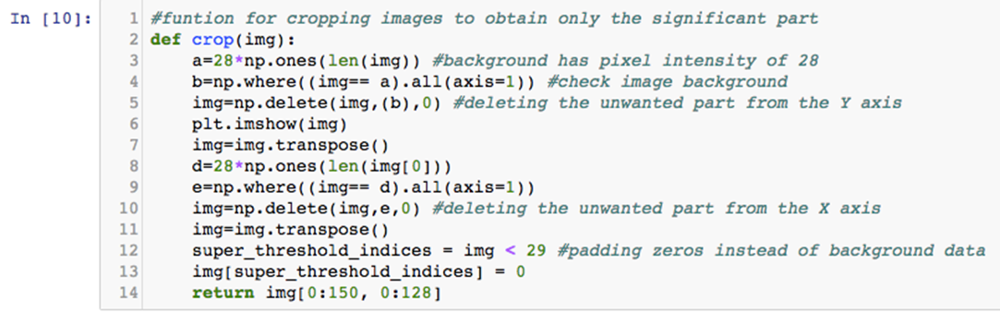
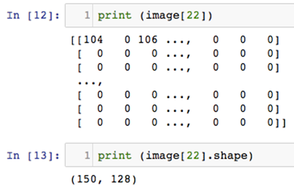
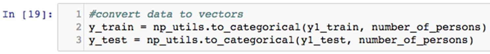

Face Recognition Using Deep Convolutional Networks
-----------------------------------------------------------------------

In this lab, we will cover the following recipes:


-   Downloading and loading the MIT-CBCL dataset into the memory
-   Plotting and visualizing images from the directory
-   Preprocessing images
-   Model building, training, and analysis


Introduction
------------------------------

In today\'s world, the need to maintain the security of information is
becoming increasingly important, as well as increasingly difficult.
There are various methods by which this security can be enforced
(passwords, fingerprint IDs, PIN numbers, and so on). However, when it
comes to ease of use, accuracy, and low intrusiveness, face recognition
algorithms have been doing very well. With the availability of
high-speed computing and the
evolution of deep convolutional networks, it
has been made possible to further increase the robustness of these
algorithms. They have gotten so advanced that they are now being used as
the primary security feature in many electronic devices (for example,
iPhoneX) and even banking applications. The goal of this lab is to
develop a robust, pose-invariant face recognition algorithm for use in
security systems. For the purposes of this lab, we will be using the
openly available `MIT-CBCL` dataset of face images of 10
different subjects.


Downloading and loading the MIT-CBCL dataset into the memory
------------------------------------------------------------------------------

In this recipe, we will understand how to download the MIT-CBCL dataset and load it into the memory.

With a predicted worth of \$15 billion by 2025, the
biometrics industry is poised to grow like
never before. Some of the examples of physiological characteristics used
for biometric authentication include fingerprints, DNA, face, retina or
ear features, and voice. While technologies such as DNA authentication
and fingerprints are quite advanced, face recognition brings its own
advantages to the table.

Ease of use and robustness due to recent developments in deep learning
models are some of the driving factors behind face recognition
algorithms gaining so much popularity.


### Getting ready

The following key points need to be considered for this recipe:


-   The `MIT-CBCL` dataset is composed of 3,240 images (324
    images per subject). In our model, we will make arrangements to
    augment the data in order to increase model robustness. We will
    employ techniques such as shifting the subject, rotation, zooming,
    and shearing of the subject to obtain this augmented data.
-   We will use 20% of the dataset to test our model (648 images) by
    randomly selecting these images from the dataset. Similarly, we
    randomly select 80% of the images in the dataset and use this as our
    training dataset (2,592 images).
-   The biggest challenge is cropping the images to the exact same size
    so that they can be fed into the neural network.
-   It is a known fact that it is much easier to design a network when
    all the input images are of the same size. However, since some of
    the subjects in these images have a side profile or rotated/tilted
    profiles, we have to adapt our network to take input images of
    different sizes.


### How to do it\...

The steps are as follows.

1.  Download the `MIT-CBCL` dataset by visiting the **`FACE RECOGNITION HOMEPAGE`**, which contains a
    number of databases for face recognition experiments. The link, as
    well as a screenshot of the homepage, is
    provided as follows:<http://www.face-rec.org/databases/>:


2.  Navigate down to the link that is named
    **`MIT-CBCL Face Recognition Database`** and click on it, as shown
    in the following screenshot:


3.  Once you have clicked on it, it will
    take you to a license page on which you
    are required to accept the license agreement and proceed to the
    download page. Once on the download page, click on
    `download now`. This downloads a zip file of about 116 MB.
    Go ahead and extract the contents into the working directory.


### How it works\...

The functionality is as follows:

1.  The license agreement requires the appropriate citation for the use
    of the database in any projects. This database was developed by the
    research team from the Massachusetts Institute of Technology.
2.  Credit is hereby given to the Massachusetts Institute of Technology
    and to the center for biological and computational learning for
    providing the database of facial images. The license also requires
    the mentioning of the paper titled [*Component-based Face
    Recognition with 3D Morphable Models, First IEEE Workshop on Face
    Processing in Video,*] Washington, D.C., 2004, B.
    Weyrauch, J. Huang, B. Heisele, and V. Blanz.
3.  The following screenshot describes the
    license agreement as well as the link to
    download the dataset:


Face Recognition Database Homepage

4.  Once the dataset is downloaded and extracted, you will see a folder
    titled **`MIT-CBCL-facerec-database`**.


 

5.  For the purposes of this lab, we will only be using the images
    in the **`training-synthetic`** folder, which
    contains all 3,240 images, as shown in the following screenshot:


### There\'s more\...

For this lab, you will require the
following libraries to be imported by Python:


-   `os`
-   `matplotlib`
-   `numpy`
-   `keras`
-   `TensorFlow`


The following section of the lab will deal with importing the
necessary libraries and preprocessing the images before building the
neural network model and loading them into it.

### See also

For complete information on the packages used in this lab, visit the
following links:


-   <https://matplotlib.org/>
-   <https://docs.python.org/2/library/os.html>
-   <https://www.tensorflow.org/get_started/>
-   <https://keras.io/layers/about-keras-layers/>
-   <https://docs.scipy.org/doc/numpy-1.9.1/reference/>


Plotting and visualizing images from the directory
--------------------------------------------------------------------

This section will describe how to read and visualize the downloaded images before they
are preprocessed and fed into the neural network for training. This is
an important step in this lab because the images need to be
visualized to get a better understanding of the image sizes so they can
be accurately cropped to omit the background and preserve only the
necessary facial features.


### Getting ready

Before beginning, complete the initial setup of importing the necessary
libraries and functions as well as setting the path of the working
directory.

### How to do it\...

The steps are as follows:

1.  Download the necessary libraries using the following lines of code.
    The output must result in a line that
    says`Using TensorFlow backend`, as shown in the screenshot
    that follows:

```
%matplotlib inline
from os import listdir
from os.path import isfile, join
import matplotlib.pyplot as plt
import matplotlib.image as mpimg
import numpy as np
from keras.models import Sequential
from keras.layers import Dense, Dropout, Activation, Flatten, Conv2D
from keras.optimizers import Adam
from keras.layers.normalization import BatchNormalization
from keras.utils import np_utils
from keras.layers import MaxPooling2D
from keras.preprocessing.image import ImageDataGenerator
```


The importing of the libraries is as shown:


2.  Print and set the current working directory as shown in the
    following screenshot. In our case, the desktop was set as the
    working directory:


3.  Read all the images directly from the
    folder by using the commands illustrated
    in the following screenshot:


4.  Print a few random images from the dataset using the
    `plt.imshow (images[])` command, as shown in the following
    screenshots, to get a better idea of the face profiles in the
    images. This will also give an idea of the size of the image, which
    will be required at a later stage:


5.  Shown here are the images of different
    test subjects from the first image.


### How it works\...

The functionality is as follows:

1.  The `mypath` variable sets the path to read all the files
    from. The `training-synthetic` folder is specified in this
    step, as only the files in this folder are going to be used for this
    lab.
2.  The `onlyfiles` variable is used in order to count all the
    files under the folder whose path is provided in the previous step
    by looping through all the files contained in the folder. This will
    be required in the next step for reading and storing the images.
3.  The `images` variable is used
    to create an empty array of size 3,240 in
    order to store the images, which are all 200 x 200-pixels.
4.  Next, by looping through all the files using the
    `onlyfiles` variable as an argument in the for loop, each
    image contained in the folder is read and stored into the previously
    defined `images` array using the
    `matplotlib.image` function.
5.  Finally, on printing randomly chosen images by specifying different
    indices of the images you will notice that each image is a 200 x
    200-pixel array and each subject may either be facing forward or
    rotated between zero and fifteen degrees on either side.


### There\'s more\...

The following points are of note:


-   An interesting feature of this database is that the fourth digit of
    each filename describes which subject is in the respective image.
-   The names of the images are unique in the sense that the fourthdigit
    represents the individual in the respective image. Two examples of
    image names are `0001_-4_0_0_60_45_1.pgm` and
    `0006_-24_0_0_0_75_15_1.pgm`.One can easily understand
    that the fourthdigits represent the secondand seventh individual
    respectively.
-   We will need to store this information
    for later use while making predictions. This will help the neural
    network during training by knowing what subject\'s
    facial features it is learning.
-   The filenames of each image can be read into an array, and each of
    the ten subjects can be segregated by using the following lines of
    code:

```
y =np.empty([3240,1],dtype=int)
for x in range(0, len(onlyfiles)):
    if onlyfiles[x][3]=='0': y[x]=0
    elif onlyfiles[x][3]=='1': y[x]=1
    elif onlyfiles[x][3]=='2': y[x]=2
    elif onlyfiles[x][3]=='3': y[x]=3
    elif onlyfiles[x][3]=='4': y[x]=4
    elif onlyfiles[x][3]=='5': y[x]=5
    elif onlyfiles[x][3]=='6': y[x]=6
    elif onlyfiles[x][3]=='7': y[x]=7
    elif onlyfiles[x][3]=='8': y[x]=8
    elif onlyfiles[x][3]=='9': y[x]=9
```


-   The preceding code will initialize an empty one-dimensional
    `numpy` array of size 3,240 (the number of images in the
    `training-synthetic` folder) and store the relevant
    subjects in different arrays by looping through the whole set of
    files.
-   The `if` statements are basically checking what the fourth
    digit is under each filename and storing that digit in the
    initialized `numpy` array.
-   The output in the iPython notebook for
    the same is shown in the following
    screenshot:


### See also

The following blog describes a method of cropping images in Python and
can be used for image preprocessing which will be required in the
following section:


-   <https://www.blog.pythonlibrary.org/2017/10/03/how-to-crop-a-photo-with-python/>


More information about the Adam Optimizer and
its use cases can be found by visiting the following links:


-   <https://www.tensorflow.org/api_docs/python/tf/train/AdamOptimizer>
-   <https://arxiv.org/abs/1412.6980>
-   <https://www.coursera.org/lecture/deep-neural-network/adam-optimization-algorithm-w9VCZ>

Preprocessing images
--------------------------------------

In the previous section, you may have noticed
how all the images are not a front view of the face profiles, and that
there are also slightly rotated side profiles. You may also have noticed
some unnecessary background areas in each image that needs to be
omitted. This section will describe how to preprocess and handle the
images so that they are ready to be fed into the network for training.


### Getting ready

Consider the following:


-   A lot of algorithms are devised to crop the significant part of an
    image; for example, SIFT, LBP, Haar-cascade filter, and so on.
-   We will, however, tackle this problem with a very simplistic naïve
    code to crop the facial portion from the image. This is one of the
    novelties of this algorithm.
-   We have found that the pixel intensity of the unnecessary background
    part is 28.
-   Remember that each image is a three-channel matrix of 200 x
    200-pixels. This means that every image contains three matrices or
    Tensors of red, green, and blue pixels with an intensity ranging
    from 0 to 255.
-   Therefore, we will discard any row or column of the images that
    contain only 28s as the pixel intensities.
-   We will also make sure that all the images have the same pixel size
    after the cropping action to achieve the highest parallelizability
    of the convolutional neural network.


### How to do it\...

The steps are as follows:

1.  Define the `crop()` function to crop images to obtain only
    the significant part, as shown in the following lines of code:

```
 #function for cropping images to obtain only the significant part
 def crop(img):
      a=28*np.ones(len(img)) 
      b=np.where((img== a).all(axis=1)) 
      img=np.delete(img,(b),0) 
      plt.imshow(img)
      img=img.transpose()
      d=28*np.ones(len(img[0]))
      e=np.where((img== d).all(axis=1))
      img=np.delete(img,e,0) 
      img=img.transpose()
      print(img.shape) 
      super_threshold_indices = img < 29 
      img[super_threshold_indices] = 0
      plt.imshow (img)
      return img[0:150, 0:128]
```


2.  Use the following lines of code to loop through every image in the
    folder and crop it using the preceding defined function:

```
#cropping all the images
 image = np.empty([3240,150,128],dtype=int)
 for n in range(0, len(images)):
     image[n]=crop(images[n])
```


3.  Next, randomly choose an image and print it to check that it has
    been cropped from a 200 x 200 sized image to a different size. We
    have chosen image 23 in our case. This can be done using the
    following lines of code:

```
 print (image[22])
 print (image[22].shape)
```


4.  Next, split the data into a test and train set
    using`80%`of the images in the folder as the training set
    and the remaining`20% `as the test set. This can be done
    with the following commands:

```
# Split data into 80/20 split for testing and training
test_ind=np.random.choice(range(3240), 648, replace=False) train_ind=np.delete(range(0,len(onlyfiles)),test_ind)
```


5.  Once the data has finished splitting,
    segregate the training and test images using the following commands:

```
 # slicing the training and test images 
 y1_train=y[train_ind]
 x_test=image[test_ind]
 y1_test=y[test_ind]
```


6.  Next, reshape all the cropped images into sizes of 128 x 150, since
    this is the size that is to be fed into the neural network. This can
    be done using the following commands:

```
#reshaping the input images
 x_train = x_train.reshape(x_train.shape[0], 128, 150, 1)
 x_test = x_test.reshape(x_test.shape[0], 128, 150, 1)
```


7.  Once the data is done reshaping, convert it into `float32`
    type, which will make it easier to handle in the next step when it
    is normalized. Converting from int to float32 can be done using the
    following commands:

```
 #converting data to float32
 x_train = x_train.astype('float32')
 x_test = x_test.astype('float32')
```


8.  After reshaping and converting the data into the float32 type, it
    has to be normalized in order to adjust all the values to a similar
    scale. This is an important step in
    preventing data redundancy. Perform normalization using the
    following commands:

```
 #normalizing data
 x_train/=255
 x_test/=255
 #10 digits represent the 10 classes
 number_of_persons = 10
```


9.  The final step is to convert the reshaped, normalized images into
    vectors, as this is the only form of input the neural network
    understands. Convert the images into vectors using the following
    commands:

```
 #convert data to vectors
 y_train = np_utils.to_categorical(y1_train, number_of_persons)
 y_test = np_utils.to_categorical(y1_test, number_of_persons)
```


### How it works\...

The functionality is as follows:

1.  The `crop()` function executes the following tasks:

    1.  Multiplies all pixels with an intensity of 28 with a numpy array
        of 1s and stores in variable `a`.
    2.  Checks for all instances where an entire column consists of only
        pixel intensities of 28 and stores in variable `b`.
    3.  Deletes all columns (or [*Y*] axes) where pixel
        intensities are 28 for the entire column.
    4.  Plots the resulting image. 


1.  
    5.  Transposes the image in order to perform the preceding set of
        operations on all the rows (or [*X*] axes) in a
        similar manner.


2.  
    6.  Multiplies all pixels with an intensity of 28 with a
        `numpy` array of 1s and stores in variable
        `d`.
    7.  Checks for all instances where an entire column consists of only
        pixel intensities of 28 and stores in variable `e`.
    8.   Deletes all columns (from the transposed image) where pixel
        intensities are 28 for the entire column.
    9.  Transposes the image to get back the original image.
    10. Prints the shape of the image.
    11. Wherever a pixel intensity of less
        than 29 is found, replaces those pixel intensities with zeros,
        which will result in the cropping of all those pixels by making
        them white.
    12. Plots the resulting image.
    13. Reshapes the resulting image to a size of 150 x 128 pixels.


The output for the `crop()` function, as seen on the Jupyter
notebook during execution, is shown in the following screenshot:





14. Next, the defined `crop()` function is applied to all the
    files contained in the `training-synthetic` folder by
    looping through every file. This will result in an output as shown
    in the following screenshots:


The output continues as follows:


### Note

Notice that only the relevant facial features are preserved and the
resulting shapes of all the cropped images are less than 200 x 200,
which was the initial size. 


15. On printing the image and shape of any random image, you will notice
    that every image is now resized to a 150 x 128-pixel array, and you
    will see the following output:




16. Splitting the images into test and train sets as well as segregating
    them into variables named `x_train`, `y1_train`,
    `x_test`, and `y1_test` will result in the
    output shown in the following screenshot:


17. Segregating the data is done as follows:


18. Reshaping the training and test images and converting the data type
    to float32 will result in the output seen in the following
    screenshot:


### There\'s more\...

Consider the following:


-   Once the images are done preprocessing they still need to be
    normalized and converted into vectors (in this case tensors) before
    being fed into the network.

-   Normalization, in the simplest case, means adjusting values measured
    on different scales to a notionally common scale, often prior to
    averaging. It is always a good idea to normalize data in order to
    prevent gradients from exploding or vanishing as seen in the
    vanishing and exploding gradient problems during gradient descent.
    Normalization also ensures there is no data redundancy.

-   Normalization of the data is done by dividing each pixel in each
    image by `255` since the pixel values range between 0 and
    `255`. This will result in the output shown in the following screenshot:


-   Next, the images are converted to input vectors with ten different
    classes using the `to_categorical()` function from
    `numpy_utils`, as shown in the following screenshot:





### See also

Additional resources are as follows:


-   For more information on data normalization, check the
    following
    link:<https://www.quora.com/What-is-normalization-in-machine-learning>
-   For information on overfitting and why data is split into test and training sets, visit the following
    link:<https://towardsdatascience.com/train-test-split-and-cross-validation-in-python-80b61beca4b6>
-   For more information on encoding variables and their importance, visit the following
    link:<http://pbpython.com/categorical-encoding.html>


Model building, training, and analysis
--------------------------------------------------------

We will use a standard sequential model from
the `keras` library to build the CNN. The network will consist
of three convolutional layers, two maxpooling layers, and four fully
connected layers. The input layer and the
subsequent hidden layers have 16 neurons, while the maxpooling layers
contain a pool size of (2,2). The four fully connected layers consist of two dense layers and one flattened layer
and one dropout layer. Dropout 0.25 was used to reduce the overfitting
problem. Another noveltyof this algorithm is the use of dataaugmentation
to fight the overfitting phenomenon. Data augmentation is carried by
rotating, shifting, shearing, and zooming the images to different
extents to fit the model.

The `relu` function is used as the activation function in both
the input and hidden layers, while the `softmax` classifier is
used in the output layer to classify the test images based on the
predicted output.


### Getting ready

The network which will be constructed can be visualized as shown in the
following diagram:


### How to do it\...

The steps are as follows:

1.  Define the model using the
    `Sequential()` function in the
    Keras framework using the following
    commands:

```
model = Sequential()
model.add(Conv2D(16, (3, 3), input_shape=(128,150,1)))  
model.add(Activation('relu')) 
model.add(Conv2D(16, (3, 3))) 
model.add(Activation('relu'))
model.add(MaxPooling2D(pool_size=(2,2))) 
model.add(Conv2D(16,(3, 3))) 
model.add(Activation('relu'))
model.add(MaxPooling2D(pool_size=(2,2))) 
model.add(Flatten()) 

model.add(Dense(512))
model.add(Activation('relu'))
model.add(Dropout(0.25)) 
model.add(Dense(10))

model.add(Activation('softmax')) 
```


2.  Print the summary of the model to get a better understanding of how
    the model is built and to ensure that it is built as per the
    preceding specifications. This can be done by using the
    `model.summary()` command.
3.  Next, compile the model using the following command:

```
model.compile(loss='categorical_crossentropy', optimizer=Adam(), metrics=        ['accuracy'])
```


4.  In order to prevent overfitting and improve model accuracy further,
    implement some form of data augmentation. In this step, the images
    will be sheared, shifted on a horizontal as well as the vertical
    axis, zoomed in, and rotated. The ability of the model to learn and
    identify these anomalies will dictate how robust the model is.
    Augment the data using the following commands:

```
# data augmentation to minimize overfitting
gen = ImageDataGenerator(rotation_range=8, 
        width_shift_range=0.08, shear_range=0.3,
        height_shift_range=0.08,zoom_range=0.08)
test_gen = ImageDataGenerator()
train_generator = gen.flow(x_train, y_train, batch_size=16) 
test_generator = test_gen.flow(x_test, y_test, batch_size=16)
```


5.  Finally, fit and evaluate the model after data augmentation using
    the following commands:

```
model.fit_generator(train_generator, epochs=5, validation_data=test_generator)

scores = model.evaluate(x_test, y_test, verbose=0)
print("Recognition Error: %.2f%%" % (100-scores[1]*100))
```


### How it works\...

The functionality is as follows:

1.  By using the sequential function, a nine-layer convolutional neural
    network is defined with each layer performing the following
    functions:

    1.  The first layer is a convolutional
        layer with 16 neurons and performs
        convolution on the input
        tensor/matrix. The size of the feature map is defined to be a 3
        x 3 matrix. The input shape needs to be specified for the first
        layer since the neural network needs to know what type of input
        to expect. Since all the images have been cropped to a size of
        128 x 150 pixels, this will be the input shape defined for the
        first layer of the network as well.
        The activation function used in this layer is a **rectified
        linear unit** (**relu**).
    2.  The second layer of the network (first hidden layer) is another
        convolution layer with 16 neurons as well. Again, a
        `relu` will be used as the activation function for
        this layer.
    3.  The third layer of the network (second hidden layer) is a max
        pooling layer with a pool size of 2 x 2. The function of this
        layer is to extract all the valid features learned by performing
        convolution in the first two layers and reducing the size of the
        matrix with all the learned features. Convolution is nothing but
        a matrix multiplication between the feature map and the input
        matrix (in our case, an image). The resulting values, which form
        the convolution process, are stored by the network in a matrix.
        The maximum values from these stored values will define a
        certain feature in the input image. These maximum values are
        what will be preserved by the max pooling layer, which will omit
        the non-relevant features.
    4.  The fourth layer of the network (third hidden layer) is another
        convolutional layer with a feature map of 3 x 3 again. The
        activation function used in this layer will again be a
        `relu` function.
    5.  The fifth layer of the network (fourth hidden layer) is a max
        pooling layer with a pool size of 2 x 2.
    6.  The sixth layer of the network (fifth hidden layer) is a flatten
        layer that will convert the matrix containing all the learned
        features (stored in the form of numbers) into a single row
        instead of a multi-dimensional matrix.


1.  
    7.  The seventh layer in the network (sixth hidden layer) is a dense
        layer with 512 neurons and a `relu` activation. Each
        neuron will basically process a certain weight and bias, which
        is nothing but a representation of all the learned features from
        a particular image. This is done in order to easily classify the
        image by using a `softmax` classifier on the dense
        layer.
    8.  The eighth layer in the network (seventh hidden layer) is a
        dropout layer with a dropout probability of 0.25 or 25%. This
        layer will randomly `dropout` 25% of the neurons
        during the training process and help prevent overfitting by
        encouraging the network to learn a given feature using many
        alternative paths.
    9.  The final layer in the network is a dense layer with just 10
        neurons and the `softmax` classifier. This is the
        eighth hidden layer and will also serve as the output layer of
        the network.


2.  The output after defining the model
    must look like the one in the
    following screenshot:


10. On printing the `model.summary()` function, you must see
    an output like the one in the following screenshot:


11. The model is compiled using categorical
    crossentropy, which is a function to
    measure and compute the loss from the network while
    transferring information from one layer
    to the subsequent layers. The model will make use of the
    `Adam()` optimizer function from the Keras framework,
    which will basically dictate how the network optimizes the weights
    and biases while learning the features. The output of the
    `model.compile()` function must look like the following
    screenshot:


12. Since the neural network is quite dense and the number of total
    images is only 3,240, we devise a method to prevent overfitting.
    This is done by generating more images from the training set by
    performing data augmentation. In this step, the images are generated
    through the `ImageDataGenerator()` function. This function
    takes the training and test sets and augments images by:
    
    -   Rotating them
    -   Shearing them
    -   Shifting the width, which is basically widening the images
    -   Shifting the images on a horizontal axis
    -   Shifting the images on a vertical axis


The output of the preceding function must look like the following
screenshot:


13. Finally, the model is fitted to the
    data and evaluated after training over 5 epochs. The output we obtained is
    shown in the following screenshot:


14. As you can see, we obtained an accuracy of 98.46%, which resulted in
    an error rate of 1.54%. This is pretty good, but convolutional
    networks have advanced so much that we can improve this error rate
    by tuning a few hyperparameters or using a deeper network.


### There\'s more\...

Using a deeper CNN with 12 layers (one extra convolution and one extra
max pooling layer) resulted in an improvement
of accuracy to 99.07%, as shown in the
following screenshot:


Using data normalization after every two
layers during model building, we were further able to improve the
accuracy to 99.85%, as shown in the following screenshot:


You may obtain different results, but feel
free to run the training step a few times.
The following are some of the steps you can take to experiment with the
network in the future to understand it
better:


-   Try to tune hyperparameters better and implement a higher dropout
    percentage and see how the network responds.
-   The accuracy greatly reduced when we tried using different
    activation functions or a smaller (less dense) network.
-   Also, change the size of the feature maps and max pooling layer and
    see how this influences training time and model accuracy.
-   Try including more neurons in a less dense CNN and tune it to
    improve accuracy. This may also result in a faster network that
    trains in less time.
-   Use more training data. Explore other online repositories and find
    larger databases to train the network. Convolutional neural networks
    usually perform better when the size of the training data is
    increased.


### See also

The following published papers are good resources to obtain a better
understanding of convolutional neural networks. They may be used as
further reading in order to gain more understanding of various
applications of convolutional neural networks:


-   <http://papers.nips.cc/paper/4824-imagenet-classification-with-deep-convolutional-neural-networks>
-   <https://arxiv.org/abs/1408.5882>
-   <https://www.cv-foundation.org/openaccess/content_cvpr_2014/papers/Karpathy_Large-scale_Video_Classification_2014_CVPR_paper.pdf>
-   <http://www.cs.cmu.edu/~bhiksha/courses/deeplearning/Fall.2016/pdfs/Simard.pdf>
-   <https://dl.acm.org/citation.cfm?id=2807412>
-   <https://ieeexplore.ieee.org/abstract/document/6165309/>
-   <http://openaccess.thecvf.com/content_cvpr_2014/papers/Oquab_Learning_and_Transferring_2014_CVPR_paper.pdf>
-   <http://www.aaai.org/ocs/index.php/IJCAI/IJCAI11/paper/download/3098/3425>
-   <https://ieeexplore.ieee.org/abstract/document/6288864/>
