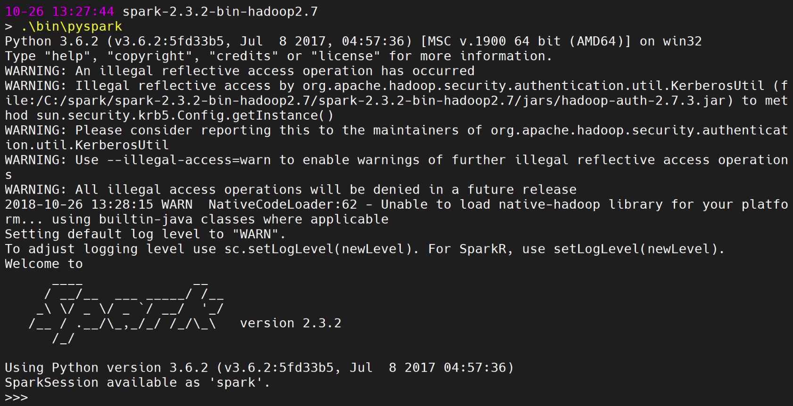

Installing Pyspark and Setting up Your Development Environment
==============================================================

In this lab, we will cover the following topics:

-   An overview of PySpark
-   Setting up Spark on Windows and PySpark
-   Core concepts in Spark and PySpark


An overview of PySpark
======================

Before we start with installing PySpark, which is the Python interface
for Spark, let\'s go through some core concepts in Spark and PySpark.
Spark is the latest big data tool from Apache, which can be found by
simply going to <http://spark.apache.org/>. It\'s a unified analytics
engine for large-scale data processing. This means that, if you have a
lot of data, you can feed that data into Spark to create some analytics
at a good speed. If we look at the running times between Hadoop and
Spark, Spark is more than a hundred times faster than Hadoop. It is very
easy to use because there are very good APIs for use with Spark.

The four major components of the Spark platform are as follows:

-   **Spark SQL**: A clearing language for Spark
-   **Spark Streaming**: Allows you to feed in real-time streaming data
-   **MLlib (machine learning)**: The machine learning library for Spark
-   **GraphX (graph)**: The graphing library for Spark

The core concept in Spark is an RDD, which is similar to the pandas
DataFrame, or a Python dictionary or list. It is a way for Spark to
store large amounts of data on the infrastructure for us. The key
difference of an RDD versus something that is in your local memory, such
as a pandas DataFrame, is that an RDD is distributed across many
machines, but it appears like one unified dataset. What this means is,
if you have large amounts of data that you want to operate on in
parallel, you can put it in an RDD and Spark will handle parallelization
and the clustering of the data for you.

Spark has three different interfaces, as follows:

-   Scala
-   Java
-   Python

Python is similar to PySpark integration, which we will cover soon. For
now, we will import some libraries from the PySpark package to help us
work with Spark. The best way for us to understand Spark is to look at
an example, as shown in the following screenshot:

```
lines = sc.textFile("data.txt")
lineLengths = lines.map(lambda s: len(s))
totalLength = lineLengths.reduce(lambda a, b: a + b)
```


In the preceding code, we have created a new variable called
[lines] by calling [SC.textFile (\"data.txt\")]. [sc]
is our Python objects that represent our Spark cluster. A Spark cluster
is a series of instances or cloud computers that store our Spark
processes. By calling a [textFile] constructor and feeding in
[data.text], we have potentially fed in a large text file and
created an RDD just using this one line. In other words, what we are
trying to do here is to feed a large text file into a distributed
cluster and Spark, and Spark handles this clustering for us.

In line two and line three, we have a MapReduce function. In line two,
we have mapped the length function using a [lambda] function to
each line of [data.text]. In line three, we have called a
reduction function to add all [lineLengths] together to produce
the total length of the documents. While Python\'s [lines] is a
variable that contains all the lines in [data.text], under the
hood, Spark is actually handling the distribution of fragments of
[data.text] in two different instances on the Spark cluster, and
is handling the MapReduce computation over all of these instances.


Spark SQL
=========

Spark SQL is one of the four components on top of the Spark platform, as
we saw earlier in the lab. It can be used to execute SQL queries or
read data from any existing Hive insulation, where Hive is a database
implementation also from Apache. Spark SQL looks very similar to MySQL
or Postgres. The following code snippet is a good example:

```
#Register the DataFrame as a SQL temporary view
df.CreateOrReplaceTempView("people")

sqlDF = spark.sql("SELECT * FROM people")
sqlDF.show()

#+----+-------+
#| age| name|
#+----+-------+
#+null|Jackson|
#| 30| Martin|
#| 19| Melvin|
#+----|-------|
```


You\'ll need to select all the columns from a certain table, such as
[people], and using the Spark objects, you\'ll feed in a very
standard-looking SQL statement, which is going to show an SQL result
much like what you would expect from a normal SQL implementation.

Let\'s now look at datasets and DataFrames. A dataset is a distributed
collection of data. It is an interface added in Spark 1.6 that provides
benefits on top of RDDs. A DataFrame, on the other hand, is very
familiar to those who have used pandas or R. A DataFrame is simply a
dataset organized into named columns, which is similar to a relational
database or a DataFrame in Python. The main difference between a dataset
and a DataFrame is that DataFrames have column names. As you can
imagine, this would be very convenient for machine learning work and
feeding into things such as scikit-learn.

Let\'s look at how DataFrames can be used. The following code snippet is
a quick example of a DataFrame:

```
# spark is an existing SparkSession
df = spark.read.json("examples/src/main/resources/people.json")
# Displays the content of the DataFrame to stdout
df.show()

#+----+-------+
#| age| name|
#+----+-------+
#+null|Jackson|
#| 30| Martin|
#| 19| Melvin|
#+----|-------|
```


In the same way, as pandas or R would do, [read.json] allows us to
feed in some data from a JSON file, and [df.show] shows us the
contents of the DataFrame in a similar way to pandas.


SparkContext
============


A **SparkContext** lets you use the power of Spark\'s cluster manager as
with Python objects. So with a **SparkContext**, you can pass jobs and
resources, schedule tasks, and complete tasks the downstream from the
**SparkContext** down to the **Spark Cluster Manager**, which will then
take the results back from the **Spark Cluster Manager**[
]once it has completed its computation.

Let\'s see what this looks like in practice and see how to set up a
SparkContext:

1.  First, we need to import [SparkContext].
2.  Create a new object in the [sc] variable standing for the
    SparkContext using the [SparkContext] constructor.
3.  In the [SparkContext] constructor, pass a [local]
    context. We are looking at [hands on PySpark] in this context,
    as follows:

```
from pyspark import SparkContext
sc = SparkContext('local', 'hands on PySpark')
```


4.  After we\'ve established this, all we need to do is then use
    [sc] as an entry point to our Spark operation, as demonstrated
    in the following code snippet:

```
visitors = [10, 3, 35, 25, 41, 9, 29]
df_visitors = sc.parallelize(visitors)
df_visitors_yearly = df_visitors.map(lambda x: x*365).collect()
print(df_visitors_yearly)
```


Let\'s take an example; if we were to analyze the synthetic datasets of
visitor counts to our clothing store, we might have a list of
[visitors] denoting the daily visitors to our store. We can then
create a parallelized version of the DataFrame, call
[sc.parallelize(visitors)], and feed in the [visitors]
datasets. [df\_visitors] then creates for us a DataFrame of
visitors. We can then map a function; for example, making the daily
numbers and extrapolating them into a yearly number by mapping a
[lambda] function that multiplies the daily number ([x]) by
[365], which is the number of days in a year. Then, we call a
[collect()] function to make sure that Spark executes on this
[lambda] call. Lastly, we print out [df\_ visitors\_yearly].
Now, we have Spark working on this computation on our synthetic data
behind the scenes, while this is simply a Python operation.


Spark shell
===========

We will go back into our Spark folder, which is
[spark-2.3.2-bin-hadoop2.7], and start our PySpark binary by
typing [.\\bin\\pyspark].

We can see that we\'ve started a shell session with Spark in the
following screenshot:





Spark is now available to us as a [spark] variable. Let\'s try a
simple thing in Spark. The first thing to do is to load a random file.
In each Spark installation, there is a [README.md] markdown file,
so let\'s load it into our memory as follows:

```
text_file = spark.read.text("README.md")
```


If we use [spark.read.text] and then put in [README.md], we
get a few warnings, but we shouldn\'t be too concerned about that at the
moment, as we will see later how we are going to fix these things. The
main thing here is that we can use Python syntax to access Spark.

What we have done here is put [README.md] as text data read by
[spark] into Spark, and we can use [text\_file.count()] can
get Spark to count how many characters are in our text file as follows:

```
text_file.count()
```


From this, we get the following output:

```
103
```


We can also see what the first line is with the following:

```
text_file.first()
```


We will get the following output:

```
Row(value='# Apache Spark')
```


We can now count a number of lines that contain the word [Spark]
by doing the following:

```
lines_with_spark = text_file.filter(text_file.value.contains("Spark"))
```


Here, we have filtered for lines using the [filter()] function,
and within the [filter()] function, we have specified that
[text\_file\_value.contains] includes the word [\"Spark\"],
and we have put those results into the [lines\_with\_spark]
variable.

We can modify the preceding command and simply add [.count()], as
follows:

```
text_file.filter(text_file.value.contains("Spark")).count()
```


We will now get the following output:

```
20
```


We can see that [20] lines in the text file contain the word
[Spark]. This is just a simple example of how we can use the Spark
shell.


SparkConf
=========

SparkConf allows us to configure a Spark application. It sets various
Spark parameters as key-value pairs, and so will usually create a
[SparkConf] object with a [SparkConf()] constructor, which
would then load values from the [spark.\*] underlying Java system.

There are a few useful functions; for example, we can use the
[sets()] function to set the configuration property. We can use
the [setMaster()] function to set the master URL to connect to. We
can use the [setAppName()] function to set the application name,
and [setSparkHome()] in order to set the path where Spark will be
installed on worker nodes.

Summary
=======

In this lab, we learned about the core concepts in Spark and
PySpark. We learned about setting up Spark and using PySpark on Windows.
We also went through the three main pillars of Spark, which are
SparkContext, Spark shell, and SparkConf.

In the next lab, we\'re going to look at getting your big data into
Spark environments using RDDs.
