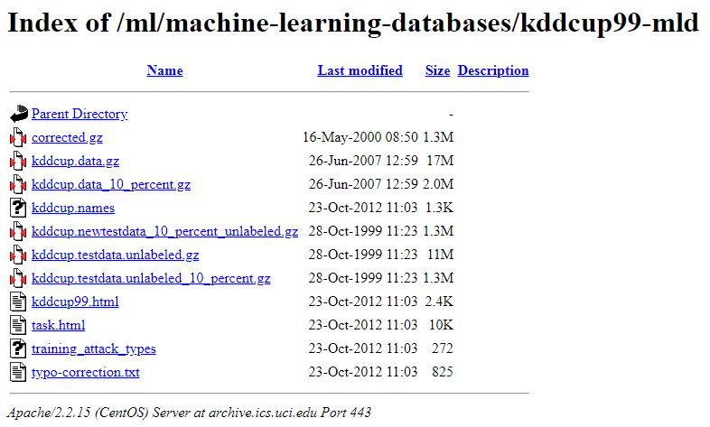
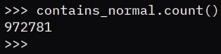
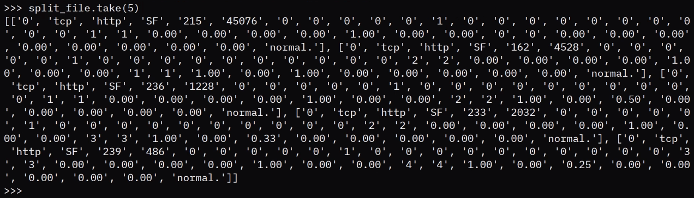

Getting Your Big Data into the Spark Environment Using RDDs
===========================================================

In this lab, we will cover the following topics:

-   Loading data onto Spark RDDs
-   Parallelization with Spark RDDs
-   Basics of RDD operation

Loading data on to Spark RDDs
=============================

In this section, we are going to look at loading data on to Spark RDDs,
and will cover the following topics:

-   The UCI machine learning data repository
-   Getting data from the repository to Python
-   Getting data into Spark

Let\'s start with an overview of the UCI machine learning data
repository.


The UCI machine learning repository
===================================

We can access the UCI machine learning repository by navigating to
<https://archive.ics.uci.edu/ml/>. So, what is the UCI machine learning
repository? UCI stands for the University of California Irvine machine
learning repository, and it is a very useful resource for getting open
source and free datasets for machine learning. Although PySpark\'s main
issue or solution doesn\'t concern machine learning, we can use this as
a chance to get big datasets that help us test out the functions of
PySpark.

Let\'s take a look at the KDD Cup 1999 dataset, which we will download,
and then we will load the whole dataset into PySpark.


Getting the data from the repository to Spark
=============================================

We can follow these steps to download the dataset and load it in
PySpark:

1.  Click on [Data Folder].
2.  You will be redirected to a folder that has various files as
    follows:





You can see that there\'s [kddcup.data.gz], and there is
also 10% of that data available in
[kddcup.data\_10\_percent.gz]. We will be working with
food datasets. To work with the food datasets, right-click on
[kddcup.data.gz], select [Copy link
address], and then go back to the PySpark console and
import the data.

Let\'s take a look at how this works using the following steps:

1.  After launching PySpark, the first thing we need to do is import
    [urllib], which is a library that allows us to interact with
    resources on the internet, as follows:

```
import urllib.request
```


2.  The next thing to do is use this [request] library to pull
    some resources from the internet, as shown in the following code:

```
f = urllib.request.urlretrieve("https://archive.ics.uci.edu/ml/machine-learning-databases/kddcup99-mld/kddcup.data.gz"),"kddcup.data.gz"
```


This command will take some time to process. Once the file has been
downloaded, we can see that Python has returned and the console is
active.

3.  Next, load this using [SparkContext]. So, [SparkContext]
    is materialized or objectified in Python as the [sc] variable,
    as follows:

```
sc
```


This output is as demonstrated in the following code snippet:

```
SparkContext
Spark UI
Version
v2.3.3
Master
local[*]
AppName
PySparkShell
```


Getting data into Spark
=======================

1.  Next, load the KDD cup data into PySpark using [sc], as shown
    in the following command:

```
raw_data = sc.textFile("./kddcup.data.gz")
```


2.  In the following command, we can see that the raw data is now in the
    [raw\_data] variable:

```
raw_data
```


This output is as demonstrated in the following code snippet:

```
./kddcup.data,gz MapPartitionsRDD[3] at textFile at NativeMethodAccessorImpl.java:0
```


If we enter the [raw\_data] variable, it gives us details
regarding [kddcup.data.gz], where raw data underlying the data
file is located, and tells us about [MapPartitionsRDD.]

Now that we know how to load the data into Spark, let\'s learn about
parallelization with Spark RDDs.


Parallelization with Spark RDDs
===============================

Now that we know how to create RDDs within the text file that we
received from the internet, we can look at a different way to create
this RDD. Let\'s discuss parallelization with our Spark RDDs.

In this section, we will cover the following topics:

-   What is parallelization?
-   How do we parallelize Spark RDDs?

Let\'s start with parallelization.


What is parallelization?
========================

The best way to understand Spark, or any language, is to look at the
documentation. If we look at Spark\'s documentation, it clearly states
that, for the [textFile] function that we used last time, it reads
the text file from HDFS.

On the other hand, if we look at the definition of [parallelize],
we can see that this is creating an RDD by distributing a local Scala
collection.

So, the main difference between using [parallelize] to create an
RDD and using the [textFile] to create an RDD is where the data is
sourced from.

Let\'s look at how this works practically. Let\'s go to the PySpark
installation screen, from where we left off previously. So, we imported
[urllib], we used [urllib.request] to retrieve some data
from the internet, and we used [SparkContext] and [textFile]
to load this data into Spark. The other way to do this is to use
[parallelize].

Let\'s look at how we can do this. Let\'s first assume that our data is
already in Python, and so, for demonstration purposes, we are going to
create a Python list of a hundred numbers as follows:

```
a = range(100)
a
```


This gives us the following output:

```
range(0, 100)
```


For example, if we look at [a], it is simply a list of 100
numbers. If we convert this into a [list], it will show us the
list of 100 numbers:

```
list (a)
```


This gives us the following output:

```
[0, 1, 2, 3, 4, 5, 6, 7, 8, 9, 10, 11, 12, 13, 14, 15, 16, 17, 18, 19, 20, 21, 22, 23, 24, 25, 26, 27,
...
```


The following command shows us how to turn this into an RDD:

```
list_rdd = sc.parallelize(a)
```


If we look at what [list\_rdd] contains, we can see that it is
[PythonRDD.scala:52], so, this tells us that the Scala-backed
PySpark instance has recognized this as a Python-created RDD, as
follows:

```
list_rdd
```


This gives us the following output:

```
PythonRDD[3] at RDD at PythonRDD.scala:52
```


Now, let\'s look at what we can do with this list. The first thing we
can do is count how many elements are present in [list\_rdd] by
using the following command:

```
list_rdd.count()
```


This gives us the following output:

```
100
```


We can see that [list\_rdd] is counted at 100. If we run it again
without cutting through into the results, we can actually see that,
since Scala is running in a real time when going through the RDD, it is
slower than just running the length of [a], which is instant.

However, RDD takes some time, because it needs time to go through the
parallelized version of the list. So, at small scales, where there are
only a hundred numbers, it might not be very helpful to have this
trade-off, but with larger amounts of data and larger individual sizes
of the elements of the data, it will make a lot more sense.

We can also take an arbitrary amount of elements from the list, as
follows:

```
list_rdd.take(10)
```


This gives us the following output:

```
[0, 1, 2, 3, 4, 5, 6, 7, 8, 9]
```


When we run the preceding command, we can see that PySpark has performed
some calculations before returning the first ten elements of the list.
Notice that all of this is now backed by PySpark, and we are using
Spark\'s power to manipulate this list of 100 items.

Let\'s now use the reduce function in [list\_rdd], or in RDDs in
general, to demonstrate what we can do with PySpark\'s RDDs. We will
apply two parameter functions as an anonymous [lambda] function to
the [reduce] call as follows:

```
list_rdd.reduce(lambda a, b: a+b)
```


Here, [lambda] takes two parameters, [a] and [b]. It
simply adds these two numbers together, hence [a+b], and returns
the output. With the RDD [reduce] call, we can sequentially add
the first two numbers of RDD lists together, return the results, and
then add the third number to the results, and so on. So, eventually, you
add all 100 numbers to the same results by using [reduce].

Now, after some work through the distributed database, we can now see
that adding numbers from [0] to [99] gives us [4950],
and it is all done using PySpark\'s RDD methodology. You might recognize
this function from the term MapReduce, and, indeed, it\'s the same
thing.

We have just learned what parallelization is in PySpark, and how we can
parallelize Spark RDDs. This effectively amounts to another way for us
to create RDDs, and that\'s very useful for us. Now, let\'s look at some
basics of RDD operation.


Basics of RDD operation
=======================


So, let\'s start with the [map] function. The [map] function
returns an RDD by applying the [f] function to each element of
this RDD. In other words, it works the same as the [map] function
we see in Python. On the other hand, the [filter] function returns
a new RDD containing only the elements that satisfy a predicate, and
that predicate, which is a Boolean, is often returned by an [f]
function fed into the [filter] function. Again, this works very
similarly to the [filter] function in Python. Lastly, the
[collect()] function returns a list that contains all the elements
in this RDD. And this is where I think reading the documentation really
shines, when we see notes like this. This would never come up in Stack
Overflow or a blog post if you were simply googling what this is.

So, we\'re saying that [collect()] should only be used if the
resulting array is expected to be small, as all the data is loaded in a
driver\'s memory. Spark is superb because it can collect and parallelize data across many
different unique machines, and have it transparently operatable from one
Terminal. What collects notes is saying is that, if we call
[collect()], the resulting RDD would be completely loaded into the
driver\'s memory, in which case we lose the benefits of distributing the
data around a cluster of Spark instances.

Now that we know all of this, let\'s see how we actually apply these
three functions to our data. So, go back to the PySpark Terminal; we
have already loaded our raw data as a text file, as we have seen in
previous labs.

We will write a [filter] function to find all the lines to
indicate RDD data, where each line [contains] the word
[normal], as seen in the following screenshot:

```
contains_normal = raw_data.filter(lambda line: "normal." in line)
```


Let\'s analyze what this means. Firstly, we are calling the
[filter] function for the RDD raw data, and we\'re feeding it an
anonymous [lambda] function that takes one [line] parameter
and returns the predicates, as we have read in the documentation, on
whether or not the word [normal] exists in the line. At this
moment, as we have discussed in the previous labs, we haven\'t
actually computed this [filter] operation. What we need to do is
call a function that actually consolidates the data and forces Spark to
calculate something. In this case, we can count on
[contains\_normal], as demonstrated in the following screenshot:




You can see that it has counted just over 970,000 lines in the raw data
that contain the word [normal]. To use the [filter]
function, we provide it with the [lambda] function and use a
consolidating function, such as [counts], that forces Spark to
calculate and compute the data in the underlying DataFrame.

For the second example, we will use the map. Since we downloaded the KDD
cup data, we know that it is a comma-separated value file, and so, one
of the very easy things for us to do is to split each line by two
commas, as follows:

```
split_file = raw_data.map(lambda line: line.split(","))
```


Let\'s analyze what is happening. We call the [map] function on
[raw\_data]. We feed it an anonymous [lambda] function
called [line], where we are splitting the [line] function by
using [,]. The result is a split file. Now, here the power of
Spark really comes into play. Recall that, in the
[contains\_normal.] filter, when we called a function that forced
Spark to calculate [count], it took us a few minutes to come up
with the correct results. If we perform the [map] function, it is
going to have the same effect, because there are going to be millions of
lines of data that we need to map through. And so, one of the ways to
quickly preview whether our mapping function runs correctly is if we can
materialize a few lines instead of the whole file.

To do this, we can use the [take] function that we have used
before, as demonstrated in the following screenshot:





This might take a few seconds because we are only taking five lines,
which is our splits and is actually quite manageable. If we look at this
sample output, we can understand that our [map] function has been
created successfully. The last thing we can do is to call
[collect()] on raw data as follows:

```
raw_data.collect()
```


This is designed to move all of the raw data from Spark\'s RDD data
structure into the memory.

Summary
=======

In this lab, we learned how to load data on Spark RDDs and also
covered parallelization with Spark RDDs. We had a brief overview of the
UCI machine learning repository before loading the data. We had an
overview of the basic RDD operations, and also checked the functions
from the official documentation.

In the next lab, we will cover big data cleaning and data wrangling.
