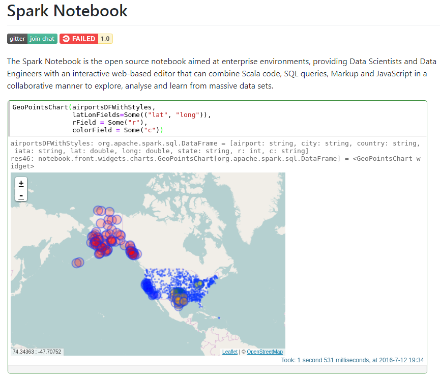
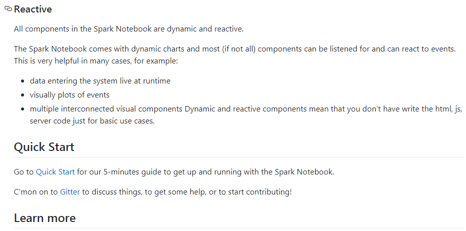
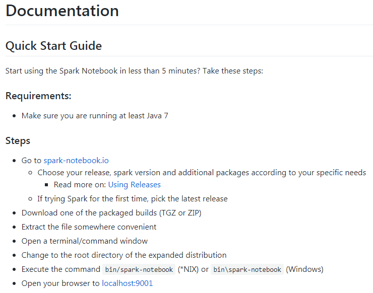
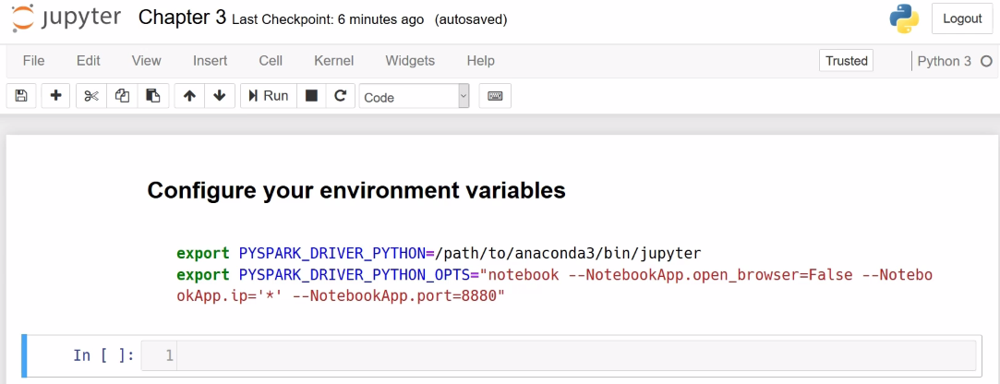
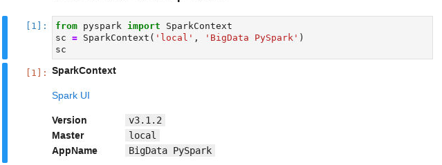
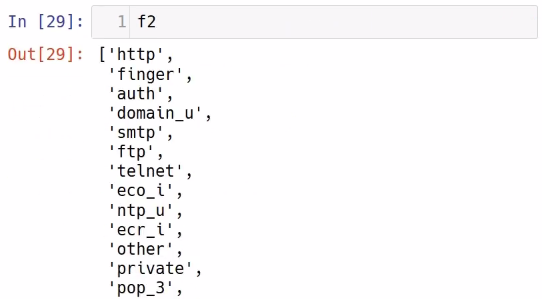

Big Data Cleaning and Wrangling with Spark
==========================================


In this lab, we will discuss the following topics:

-   Sampling/filtering RDDs to pick out relevant data points
-   Splitting datasets and creating some new combinations

Using Spark Notebooks for quick iteration of ideas
==================================================

In this section, we will answer the following questions:

-   What are Spark Notebooks?
-   How do you start Spark Notebooks?
-   How do you use Spark Notebooks?

Let\'s start with setting up a Jupyter Notebook-like environment for
Spark. Spark Notebook is just an interactive and reactive data science
environment that uses Scala and Spark.

If we view the GitHub page
(<https://github.com/spark-notebook/spark-notebook>), we can see that
what the Notebooks do is actually very straightforward, as shown in the
following screenshot:





If we look at a Spark Notebook, we can see that they look very much like
what Python developers use, which is Jupyter Notebooks. You have a text
box allowing you to enter some code, and then you execute the code below
the text box, which is similar to a Notebook format. This allows us to
perform a reproducible analysis with Apache Spark and the big data
ecosystem.

So, we can use Spark Notebooks as it is, and all we need to do is go to
the Spark Notebook website and click on [Quick Start] to
get the Notebook started, as shown in the following screenshot:





We need to make sure that we are running Java 7. We can see that the
setup steps are also mentioned in the documentation, as shown in the
following screenshot:





The main website for Spark Notebook is [spark-notebook.io], where
we can see many options. A few of them have been shown in the following
screenshot:


We can download the TAR file and unzip it. You can use Spark Notebook,
but we will be using Jupyter Notebook in this course. So, going back to
the Jupyter environment, we can look at the PySpark-accompanying code
files. In [Chapter 3] Notebook we have included a convenient way
for us to set up the environment variables to get PySpark working with
Jupyter, as shown in the following screenshot:





First, we need to create two new [environment variables]
in our environments. If you are using Linux, you can use Bash RC. If you
are using Windows, all you need to do is to change and edit your system
[environment variables]. There are multiple tutorials
online to help you do this. What we want to do here is to edit or
include the [PYSPARK\_DRIVER\_PYTHON] variable and point it to
your Jupyter Notebook installation. If you are on Anaconda, you probably
would be pointed to the Anaconda Jupyter Bash file. Since we are on
WinPython, I have pointed it to my WinPython Jupyter Notebook Bash file.
The second [environment variable] we want to export is
simply [PYSPARK\_DRIVER\_PYTHON\_OPTS].

One of the suggestions is that we include the Notebook folder and the
Notebook app in the options, ask it not to open in the browser, and tell
it what port to bind to. In practice, if you are on Windows and
WinPython environments then you don\'t really need this line here, and
you can simply skip it. After this has been done, simply restart your
PySpark from a command line. What will happen is that, instead of having
the console that we have seen before, it directly launches into a
Jupyter Notebook instance, and, furthermore, we can use Spark and
SparkContext variables as in Jupyter Notebook. So, let\'s test it out as
follows:

```
from pyspark import SparkContext
sc = SparkContext('local', 'BigData PySpark')
sc
```


We instantly get access to our [SparkContext] that tells us that
Spark is version [3.1.2], our [Master] is at [local],
and the [AppName] is the Python SparkShell (`BigData PySpark`),
as shown below:




So, now we know how we create a Notebook-like environment in Jupyter. In
the next section, we will look at sampling and filtering RDDs to pick
out relevant data points.

Sampling/filtering RDDs to pick out relevant data points
========================================================

In this section, we will look at sampling and filtering RDDs to pick up
relevant data points. This is a very powerful concept that allows us to
circumvent the limitations of big data and perform our calculations on a
particular sample.

Let\'s now check how sampling not only speeds up our calculations, but
also gives us a good approximation of the statistic that we are trying
to calculate. To do this, we first import the [time] library as
follows:

```
from time import time
```


The next thing we want to do is look at lines or data points in the KDD
database that contains the word [normal]:

```
raw_data = sc.textFile("./kdd.data.gz")
```


We need to create a sample of [raw\_data]. We will store the
sample into the [sample], variable, and we\'re sampling from
[raw\_data] without replacement. We\'re sampling 10% of the data,
and we\'re providing [42] as our random seed:

```
sampled = raw_data.sample(False, 0.1, 42)
```


The next thing to do is to chain some [map] and [filter]
functions, as we do normally if we are dealing with unsampled datasets:

```
contains_normal_sample = sampled.map(lambda x: x.split(",")).filter(lambda x: "normal" in x)
```


Next, we need to time how long it would take for us to count the number
of rows in the sample:

```
t0 = time()
num_sampled = contains_normal_sample.count()
duration = time() - t0
```


We issue the count statement here. As you know from the previous
section, this is going to trigger all the calculations in PySpark as
defined in [contains\_normal\_sample], and we\'re recording the
time before the sample count happens. We are also recording the time
after the sample count happens, so we can see how long it takes when
we\'re looking at a sample. Once this is done, let\'s take a look at how
long the [duration] was in the following code snippet:

```
duration
```


The output will be as follows:

```
23.724565505981445
```


It took us 23 seconds to run this operation over 10% of the data. Now,
let\'s look at what happens if we run the same transform over all of the
data:

```
contains_normal = raw_data.map(lambda x: x.split(",")).filter(lambda x: "normal" in x)
t0 = time()
num_sampled = contains_normal.count()
duration = time() - t0
```


Let\'s take a look at the [duration] again:

```
duration 
```


This will provide the following output:

```
36.51565098762512
```


There is a small difference, as we are comparing [36.5] seconds to
[23.7] seconds. However, this difference becomes much larger as
your dataset becomes much more varied, and the amount of data you\'re
dealing with becomes much more complex. The great thing about this is
that, if you are usually doing big data, verifying whether your answers
make sense with a small sample of the data can help you catch bugs much
earlier on.

The last thing to look at is how we can use [takeSample]. All we
need to do is use the following code:

```
data_in_memory = raw_data.takeSample(False, 10, 42)
```


As we\'ve learned earlier, when we present the new functions we call
[takeSample], and it will give us [10] items with a random
seed of [42], which we will now put into memory. Now that this
data is in memory, we can call the same [map] and [filter]
functions using native Python methods as follows:

```
contains_normal_py = [line.split(",") for line in data_in_memory if "normal" in line]
len(contains_normal_py)
```


The output will be as follows:

```
1
```


We have now finished calculating our [contains\_normal] function
by bringing [data\_in\_memory]. This is a great illustration of
the power of PySpark.


Splitting datasets and creating some new combinations
=====================================================

In this section, we are going to look at splitting datasets and creating
new combinations with set operations. We\'re going to learn subtracts,
and Cartesian ones in particular.

Let\'s go back to the Jupyter Notebook that we\'ve
been looking at lines in the datasets that contain the word
[normal]. Let\'s try to get all the lines that don\'t contain the
word [normal]. One way is to use the [filter] function to
look at lines that don\'t have [normal] in it. But, we can use
something different in PySpark: a function called [subtract] to
take the entire dataset and subtract the data that contains the word
[normal]. Let\'s have a look at the following snippet:

```
normal_sample = sampled.filter(lambda line: "normal." in line)
```


We can then obtain interactions or data points that don\'t contain the
word [normal] by subtracting the [normal] ones from the
entire sample as follows:

```
non_normal_sample = sampled.subtract(normal_sample)
```


We take the [normal] sample and we subtract it from the entire
sample, which is 10% of the entire dataset. Let\'s issue some counts as
follows:

```
sampled.count()
```


This will give us the following output:

```
490705
```


As you can see, 10% of the dataset gives us [490705] data points,
and within it, we have a number of data points containing the word
[normal]. To find out its count, write the following code:

```
normal_sample.count()
```


This will give us the following output:

```
97404
```


So, here we have [97404] data points. If we count the on normal
samples because we\'re simply subtracting one sample from another, the
count should be roughly just below 400,000 data points, because we have
490,000 data points minus 97,000 data points, which should result in
something like 390,000. Let\'s see what happens using the following code
snippet:

```
non_normal_sample.count()
```


This will give us the following output:

```
393301
```


As expected, it returned a value of [393301], which validates our
assumption that subtracting the data points containing [normal]
gives us all the non-normal data points.

Let\'s now discuss the other function, called [cartesian]. This
allows us to give all the combinations between the distinct values of
two different features. Let\'s see how this works in the following code
snippet:

```
feature_1 = sampled.map(lambda line: line.split(",")).map(lambda features: features[1]).distinct()
```


Here, we\'re splitting the [line] function by using [,]. So,
we will split the values that are comma-separated---for all the features
that we come up with after splitting, we take the first feature, and we
find all the distinct values of that column. We can repeat this for the
second feature as follows:

```
feature_2 = sampled.map(lambda line: line.split(",")).map(lambda features: features[2]).distinct()
```


And so, we now have two features. We can look at the actual items in
[feature\_1] and[feature\_2] as follows, by issuing the
[collect()] call that we saw earlier:

```
f1 = feature_1.collect()
f2 = feature_2.collect()
```


Let\'s look at each one as follows:

```
f1
```


This will provide the following outcome:

```
['tcp', 'udp', 'icmp']
```


So, [f1] has three values; let\'s check for [f2] as follows:

```
f2
```


This will provide us with the following output:





[f2] has a lot more values, and we can use the [cartesian]
function to collect all the combinations between [f1] and
[f2] as follows:

```
len(feature_1.cartesian(feature_2).collect())
```


This will give us the following output:

```
198
```


This is how we use the [cartesian] function to find the Cartesian
product between two features. In this lab, we looked at Spark
Notebooks; sampling, filtering, and splitting datasets; and creating new
combinations with set operations.

Summary
=======

In this lab, we looked at Spark Notebooks for quick iterations. We
then used sampling or filtering to pick out relevant data points. We
also learned how to split datasets and create new combinations with set
operations.

In the next lab, we will cover aggregating and summarizing data into
useful reports.
