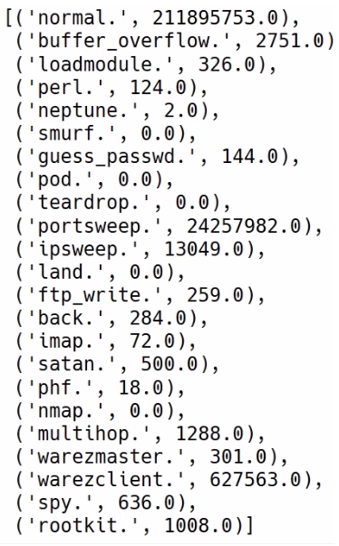
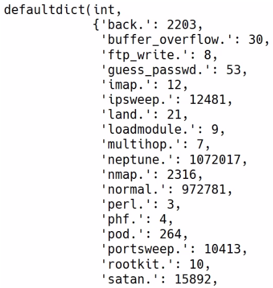

Aggregating and Summarizing Data into Useful Reports
====================================================


In this lab, we will cover the following topics:

-   Calculating averages with [map] and [reduce]
-   Faster average computations with aggregate
-   Pivot tabling with key-value paired data points

Calculating averages with map and reduce
========================================

The [map] function takes two arguments, one of which is optional.
The first argument to [map] is [f], which is a function that
gets applied to the RDD throughout by the [map] function. The
second argument, or parameter, is the [preservesPartitioning]
parameter, which is [False] by default.

If we look at the documentation, it says that [map] simply returns
a new RDD by applying a function to each element of this RDD, and
obviously, this function refers to [f] that we feed into the
[map] function itself. There\'s a very simple example in the
documentation, where it says if we parallelize an [rdd] method
that contains a list of three characters, [b], [a], and
[c], and we map a function that creates a tuple of each element,
then we\'ll create a list of three-tuples, where the original character
is placed in the first elements of the tuple, and the [1] integer
is placed in the second as follows:

```
rdd = sc.paralleize(["b", "a", "c"])
sorted(rdd.map(lambda x: (x, 1)).collect())
```


This will give us the following output:

```
[('a', 1), ('b', 1), ('c', 1)]
```


The [reduce] function takes only one argument, which is [f].
[f] is a function to reduce a list into one number. From a
technical point of view, the specified commutative and associative
binary operator reduces the elements of this RDD.

Let\'s take an example using the KDD data we have been using. We launch
our Jupyter Notebook instance that links to a Spark instance, as we have
done previously. We then create a [raw\_data] variable by loading
a [kddcup.data.gz] text file from the local disk as follows:

```
raw_data = sc.textFile("./kddcup.data.gz")
```


The next thing to do is to split this file into [csv], and then we
will filter for rows where feature 41 includes the word [normal]:

```
csv = raw_data.map(lambda x: x.split(","))
normal_data = csv.filter(lambda x: x[41]=="normal.")
```


Then we use the [map] function to convert this data into an
integer, and then, finally, we can use the [reduce] function to
compute the [total\_duration], and then we can print the
[total\_duration] as follows:

```
duration = normal_data.map(lambda x: int(x[0]))
total_duration = duration.reduce(lambda x, y: x+y)
total_duration
```


We will then get the following output:

```
211895753
```


The next thing to do is to divide [total\_duration] by the counts
of the data as follows:

```
total_duration/(normal_data.count())
```


This will give us the following output:

```
217.82472416710442
```


And after a little computation, we would have created two counts using
[map] and [reduce]. We have just learned how we can
calculate averages with PySpark, and what the [map] and
[reduce] functions are in PySpark.

Faster average computations with aggregate
==========================================

Let\'s go to our Jupyter Notebook.
[aggregate] allows us to calculate both the total duration and the
count at the same time. We call the [duration\_count] function. We
then take [normal\_data] and we aggregate it. Remember that there
are three arguments to aggregate. The first one is the initial value;
that is, the zero value, [(0,0)]. The second one is a sequential
operation, as follows:

```
duration_count = duration.aggregate(
(0,0),
(lambda db, new_value: (db[0] + new_value, db[1] + 1))
)
```


We need to specify a [lambda] function with two arguments. The
first argument is the current accumulator, or the aggregator, or what
can also be called a database ([db]). Then, we have the second
argument in our [lambda] function as [new\_value], or the
current value we\'re processing in the RDD. We simply want to do the
right thing to the database, so to say, where we know that our database
looks like a tuple with the sum of duration on the first element and the
count on the second element. Here, we know that our database looks like
a tuple, where the sum of duration is the first element, and the count
is the second element. Whenever we look at a new value, we need to add
the new value to the current running total and add [1] to the
current running counts.

The running total is the first element, [db\[0\]]. And we then
simply need to add [1] to the second element [db\[1\]],
which is the count. That\'s the sequential operation.

Every time we get a [new\_value], as shown in the previous code
block, we simply add it to the running total. And, because we\'ve added
[new\_value] to the running total, we need to increment the counts
by [1]. Secondly, we need to put in the combinator operation. Now,
we simply need to combine the respective elements of two separate
databases, [db1] and [db2], as follows:

```
duration_count = duration.aggregate(
(0,0),
(lambda db, new_value: (db[0] + new_value, db[1] + 1)),
(lambda db1, db2: (db1[0] + db2[0], db1[1] + db2[1]))
)
```


Since the duration counts is a tuple that collects our total duration on
the first element, and counts how many durations we looked at in the
second element, computing the average is very simple. We need to divide
the first element by the second element as follows:

```
duration_count[0]/duration_count[1]
```


This will give us the following output:

```
217.82472416710442
```


You can see that it returns the same results as we saw in the previous
section, which is great. In the next section, we are going to look at
pivot tabling with key-value paired data points.

Pivot tabling with key-value paired data points
===============================================

We can use the [map] function to move the KDD datasets into a
key-value pair paradigm. We map feature [41] of the dataset using
a [lambda] function in the [kv] key value, and we append the
value as follows:

```
kv = csv.map(lambda x: (x[41], x))
kv.take(1)
```


We use feature [41] as the key, and the value is the data point,
which is [x]. We can use the [take] function to take one of
these transformed rows to see how it looks.

Let\'s now try something similar to the previous example. To figure out
the total duration against each type of value that is present in feature
[41], we can use the [map] function again and simply take
the [41] feature as our key. We can take the float of the first
number in the data point as our value. We will use the
[reduceByKey] function to reduce each duration by its key.


The [reduceByKey] function simply takes one argument. We will be
using the [lambda] function. We take two different durations and
add them together, and PySpark is smart enough to apply this reduction
function depending on a key, as follows:

```
kv_duration = csv.map(lambda x: (x[41], float(x[0]))).reduceByKey(lambda x, y: x+y)
kv_duration.collect()
```


The resulting output is shown in the following screenshot:





If we collect the key-value duration data, we can see that the duration
is collected by the value that appears in feature [41]. If we are
using pivot tables in Excel, there is a convenience function that is the
[countByKey] function, which does the exact same thing,
demonstrated as follows:

```
kv.countByKey()
```


This will give us the following output:





You can see that calling the [kv.countByKey()] function is the
same as calling the [reduceByKey] function, preceded by a mapping
from the key to the duration.

Summary
=======

In this lab, we have learned how to calculate averages with
[map] and [reduce]. We also learned faster average
computations with [aggregate]. Finally, we learned that pivot
tables allow us to aggregate data based on different values of features,
and that, with pivot tables in PySpark, we can leverage handy functions,
such as [reducedByKey] or [countByKey].
