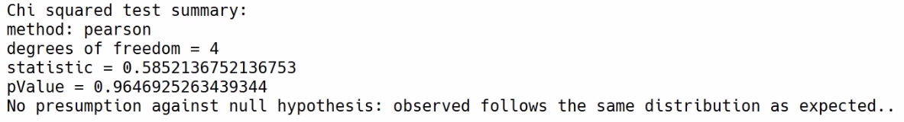

Powerful Exploratory Data Analysis with MLlib
=============================================

In this lab, we will explore Spark\'s capability to perform
regression tasks with models such as linear regression and
**support-vector machines** (**SVMs**). We will learn how to compute
summary statistics with MLlib, and discover correlations in datasets
using Pearson and Spearman correlations. We will also test our
hypothesis on large datasets.

We will cover the following topics:

-   Computing summary statistics with MLlib
-   Using the Pearson and Spearman methods to discover correlations
-   Testing our hypotheses on large datasets


Computing summary statistics with MLlib
=======================================

Let\'s check how to compute summary statistics in Spark. The key factor
here is the [colStats] function. The [colStats] function
computes the column-wise summary statistics for an [rdd] input.
The [colStats] function accepts one parameter, that is
[rdd], and it allows us to compute different summary statistics
using Spark.

Let\'s look at the code in the Jupyter Notebook
for this lab in [Lab_5.ipynb]. We will first collect the
data from the [kddcup.data.gz] text file and pipe this into the
[raw\_data] variable as follows:

```
raw_data = sc.textFile("./kddcup.data.gz")
```


The [kddcup.data] file is a **comma-separated value** (**CSV**)
file. We have to split this data by the [,] character and put it
in the [csv] variable as follows:

```
csv = raw_data.map(lambda x: x.split(","))
```


Let\'s take the first feature [x\[0\]] of the data file; this
feature represents the [duration], that is, aspects of the data.
We will transform it into an integer here, and also wrap it in a list as
follows:

```
duration = csv.map(lambda x: [int(x[0])])
```


This helps us do summary statistics over multiple variables, and not
just one of them. To activate the [colStats] function, we need to
import the [Statistics] package, as shown in the following
snippet:

```
from pyspark.mllib.stat import Statistics
```


This [Statistics] package is a sub package of
[pyspark.mllib.stat]. Now, we need to call the [colStats]
function in the [Statistics] package and feed it some data. Here,
we are talking about the [duration] data from the dataset and
we\'re feeding the summary statistics into the [summary] variable:

```
summary = Statistics.colStats(duration)
```


To access different summary statistics, such as the mean, standard
deviation, and so on, we can call the functions of the [summary]
objects, and access different summary statistics. For example, we can
access the [mean], and since we have only one feature in our
[duration] dataset, we can index it by the [00] index, and
we\'ll get the mean of the dataset as follows:

```
summary.mean()[0]
```


This will give us the following output:

```
47.97930249928637
```


Similarly, if we import the [sqrt] function from the Python
standard library, we can create the standard deviation of the durations
seen in the datasets, as demonstrated in the following code snippet:

```
from math import sqrt
sqrt(summary.variance()[0])
```


This will give us the following output:

```
707.746472305374
```


If we don\'t index the summary statistics with [\[0\]], we can see
that [summary.max()] and [summary.min()] gives us back an
array, of which the first element is the summary statistic that we
desire, as shown in the following code snippet:

```
summary.max()
array ([58329.]) #output
summary.min()
array([0.]) #output
```


Using Pearson and Spearman correlations to discover correlations
================================================================

In this section, we will look at two different ways of computing
correlations in your datasets, and these two methods are called Pearson
and Spearman correlations.


The Pearson correlation
=======================

The Pearson correlation coefficient shows us how two different variables
vary at the same time, and then adjusts it for how much they vary. This
is probably one of the most popular ways to compute a correlation if you
have a dataset.


The Spearman correlation
========================

Spearman\'s rank correlation is not the default correlation calculation
that is built into PySpark, but it is very useful. The Spearman
correlation coefficient is the Pearson correlation coefficient between
the ranked variables. Using different ways of looking at correlation
gives us more dimensions of understanding on how correlation works.
Let\'s look at how we calculate this in PySpark.


Computing Pearson and Spearman correlations
===========================================

To understand this, let\'s assume that we are taking the first three
numeric variables from our dataset. For this, we want to access the
[csv] variable that we defined previously, where we simply split
[raw\_data] using a comma ([,]). We will consider only the
first three columns that are numeric. We will not take anything that
contains words; we\'re only interested in features that are purely based
on numbers. In our case, in [kddcup.data], the first feature is
indexed at [0]; feature 5 and feature 6 are indexed at [4]
and [5], respectively which are the numeric variables that we
have. We use a [lambda] function to take all three of these into a
list and put it into the [metrics] variable:

```
metrics = csv.map(lambda x: [x[0], x[4], x[5]])
Statistics.corr(metrics, method="spearman")
```


This will give us the following output:

```
array([[1. , 0.01419628, 0.29918926],
[0.01419628, 1. , -0.16793059],
[0.29918926, -0.16793059, 1. ]])
```


In the *Computing summary statistics with MLlib* section, we simply took
the first feature into a list and created a list with a length of one.
Here, we\'re taking three quantities of three variables into the same
list. Now, each list has a length of three.

To compute the correlations, we call the [corr] method on the
[metrics] variable and specify the [method] as
[\"spearman\"]. PySpark would give us a very simple matrix telling
us the correlation between the variables. In our example, the third
variable in our [metrics] variable is more correlated than the
second variable.

If we run [corr] on [metrics] again, but specify that the
method is [pearson], then it gives us Pearson correlations. So,
let\'s examine why we need to be qualified as the data scientist or
machine learning researcher to call these two simple functions and
simply change the value of the second parameter. A lot of machine
learning and data science revolves around our understanding of
statistics, understanding how data behaves, an understanding of how
machine learning models are grounded, and what gives them their
predictive power.

So, as a machine learning practitioner or a data scientist, we simply
use PySpark as a big calculator. When we use a calculator, we never
complain that the calculator is simple to use---in fact, it helps us to
complete the goal in a more straightforward way. It is the same case
with PySpark; once we move from the data engineering side to the MLlib
side, we will notice that the code gets incrementally easier. It tries
to hide the complexity of the mathematics underneath it, but we need to
understand the difference between different correlations, and we also
need to know how and when to use them.

Testing our hypotheses on large datasets
========================================

In this section, we will look at hypothesis testing, and also learn how
to test the hypotheses using PySpark. Let\'s look at one particular type
of hypothesis testing that is implemented in PySpark. This form of
hypothesis testing is called Pearson\'s chi-square test. Chi-square
tests how likely it is that the differences in the two datasets are
there by chance.

For example, if we had a retail store without any footfall, and suddenly
you get footfall, how likely is it that this is random, or is there even
any statistically significant difference in the level of visitors that
we are getting now in comparison to before? The reason why this is
called the chi-square test is that the test itself references the
chi-square distributions. You can refer to online documentation to
understand more about chi-square distributions.

There are three variations within Pearson\'s chi-square test. We will
check whether the observed datasets are distributed differently than in
a theoretical dataset.

Let\'s see how we can implement this. Let\'s start by importing the
[Vectors] package from [pyspark.mllib.linalg]. Using this
vector, we\'re going to create a dense vector of the visitor frequencies
by day in our store.

Let\'s imagine that the frequencies go from [0.13] an hour to
[0.61], [0.8], and [0.5], finally ending on Friday at
[0.3]. So, we are putting these visitor frequencies into the
[visitors\_freq] variable. Since we\'re using PySpark, it is very
simple for us to run a chi-square test from the [Statistics]
package, which we have already imported as follows:

```
from pyspark.mllib.linalg import Vectors
visitors_freq = Vectors.dense(0.13, 0.61, 0.8, 0.5, 0.3)
print(Statistics.chiSqTest(visitors_freq))
```


By running the chi-square test, the [visitors\_freq] variable
gives us a bunch of useful information, as demonstrated in the following
screenshot:





The preceding output shows the chi-square test summary. We\'ve used the
[pearson] method, where there are [4] degrees of freedom in
our Pearson chi-square test, and the statistics are [0.585], which
means that the [pValue] is [0.964]. This results in no
presumption against the null hypothesis. In this way, the observed data
follows the same distribution as expected, which means our visitors are
not actually different. This gives us a good understanding of hypothesis
testing.

Summary
=======

In this lab, we learned summary statistics and computing the summary
statistics with MLlib. We also learned about Pearson and Spearman
correlations, and how we can discover these correlations in our datasets
using PySpark. Finally, we learned one particular way of performing
hypothesis testing, which is called the Pearson chi-square test. We then
used PySpark\'s hypothesis-testing functions to test our hypotheses on
large datasets.

In the next lab, we\'re going to look at putting the structure on
our big data with Spark SQL.
