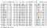
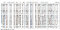
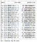

Lab 1: Regression
=================


The goal of this series is to help you get started with Apache Spark’s
ML library. Together we will explore how to solve various interesting
machine learning use-cases in a well structured way. By the end, you
will be able to use Spark ML with high confidence and learn to implement
an organized and easy to maintain workflow for your future projects


#### Pre-reqs:
- Google Chrome (Recommended)

#### Lab Environment
Notebooks are ready to run. All packages have been installed. There is no requirement for any setup.

All examples are present in `~/work/next-level-python-big-data/linear-regression/Lab01` folder. 


Problem Definition
==================

The first problem in this series is ***Regression***. We are going to
train a model to predict the famous [*Boston
Housing*](https://www.cs.toronto.edu/~delve/data/boston/bostonDetail.html)**dataset
(download from
[here](https://drive.google.com/open?id=1-zxrKH1T0fM1Oi1mZzCWNtzHzeM4OsKt)).

This dataset contains information collected by the U.S Census Service
concerning housing in the area of Boston Mass. It was obtained from the
[StatLib archive](http://lib.stat.cmu.edu/datasets/boston), and has been
used extensively throughout the literature to benchmark algorithms.

The dataset is small in size with only 506 cases. It contains 14
features described as follows:

1.  CRIM: per capita crime rate by town
2.  ZN: proportion of residential land zoned for lots over 25,000 sq.ft.
3.  INDUS: proportion of non-retail business acres per town.
4.  CHAS: Charles River dummy variable (1 if tract bounds river; 0
    otherwise)
5.  NOX: nitric oxides concentration (parts per 10 million)
6.  RM: average number of rooms per dwelling
7.  AGE: proportion of owner-occupied units built prior to 1940
8.  DIS: weighted distances to five Boston employment centres
9.  RAD: index of accessibility to radial highways
10. TAX: full-value property-tax rate per \$10,000
11. PTRATIO: pupil-teacher ratio by town
12. B: 1000(Bk — 0.63)² where Bk is the proportion of blacks by town
13. LSTAT: % lower status of the population
14. MEDV: Median value of owner-occupied homes in \$1000's

**The goal is to use the 13 features to predict the value of MEDV (which
represents the housing price).**

It is time to get your hands dirty. Let us jump into Spark and Spark .

Implementation
==============

Setting Up Apache Spark
-----------------------

To create a ***SQLContext*** we write:

```
from pyspark import SparkContext, SparkConf
from pyspark.sql import SQLContext

# (2) Instantiate a Spark Context
conf = SparkConf().setMaster("local").setAppName("Regression")
sc = SparkContext(conf=conf)
spark = SQLContext(sc)
```

Loading the Data
----------------

```
data = spark.read.csv('./boston_housing.csv', header=True, inferSchema=True)
```

-   header=True signals that the first line contains the header
-   inferSchema=True enables automatic detection of the underlying data
    schema

To display the data:

```
data.show()
```



.png)


Top 20 rows of the data

Setting up the Features
-----------------------

Now for the fun part… Spark ML’s algorithms expect the data to be
represented in two columns: **Features**and **Labels**. Features is an
array of data points of all the features to be used for prediction.
Labels contain the output label for each data point.

In our example, the features are the columns from 1 → 13, the labels is
the *MEDV*column that contains the price.

> The goal is to predict the label from the features.

Creating a features array is straight forward. You just have to import
the ***VectorAssembler***class and pass in a list of the feature column
names.

```
feature_columns = data.columns[:-1] # here we omit the final columnfrom pyspark.ml.feature import VectorAssemblerassembler = VectorAssembler(inputCols=feature_columns,outputCol="features")
```

-   outputCol=”features” defines the name of the output vector that
    combines all the values

Now we use the assembler to create the features column:

```
data_2 = assembler.transform(data)
```

That is it! If you print the values of data\_2 you will notice a new
column named “features” that contains all the values combined in one
list:

```
data_2.show()
```



.png)


Data after VectorAssembler

Train\\Test Split
-----------------

As in any machine learning work flow, we split the data into train and
test set. Here we split it to 70% training examples and 30% testing
examples.

```
train, test = data_2.randomSplit([0.7, 0.3])
```

Training the Machine Learning Algorithm
---------------------------------------

We move to another interesting part, let us train a simple
***LinearRegression***model on our data. First, we import the necessary
class.

```
from pyspark.ml.regression import LinearRegression
```

Next we define the ***algorithm***variable. We need to specify the name
of the features column and the labels column.

```
algo = LinearRegression(featuresCol="features", labelCol="medv")
```

Time for training… We call the ***fit***method to start training our
model on the train set.

```
model = algo.fit(train)
```

Voila! You have trained your first model using Spark ML!

Evaluating Model Performance
----------------------------

Completing the training phase is not enough. We have to calculate how
good our model is. Luckily the model object has an ***evaluate***method:

```
evaluation_summary = model.evaluate(test)
```

Use the ***evaluation\_summary***object to access a vast amount of
metrics:

```
evaluation_summary.meanAbsoluteError# Output: 3.39evaluation_summary.rootMeanSquaredError# Output: 5.16evaluation_summary.r2# Output: 0.58
```

Well, not bad for a simple model.

Predicting Values
-----------------

To predict outputs for unlabeled data you call ***model.transform***
function while passing your DataFrame.

For example, let us predict values from the test set:

```
predictions = model.transform(test)
```

***predictions***is a DataFrame that contains: the original columns, the
features column and predictions column generated by the model.

```
predictions.select(predictions.columns[13:]).show() # here I am filtering out some columns just for the figure to fit
```



.png)
