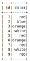
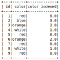
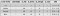
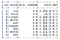
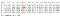
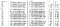
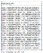
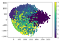

Lab 2: Feature Transformation
===============================

Feature transformation is simply a function that transforms features
from one representation to another. But why would we transform our
features? Well there are many reasons, such as:

1.  data types are not suitable to be fed into a machine learning
    algorithm, e.g. text, categories
2.  feature values may cause problems during the learning process, e.g.
    data represented in different scales
3.  we want to reduce the number of features to plot and visualize data,
    speed up training or improve the accuracy of a specific model

In this lab we will focus on three main transformation techniques:

-   Handling categorical variables
-   Feature scaling
-   Principal Component Analysis


#### Pre-reqs:
- Google Chrome (Recommended)

#### Lab Environment
Notebooks are ready to run. All packages have been installed. There is no requirement for any setup.

All examples are present in `~/work/next-level-python-big-data/linear-regression/Lab02` folder. 

Handling Categorical Variables
==============================

Categorical Data
----------------

Categorical values are values that can be represented as categories or
groups. They can be grouped into two main types: *Nominal* and
*Ordinal*.

-   Nominal values are simply names or labels with no ordering defined.
    Example: gender, color.
-   Ordinal values are categories where order does matter. Example:
    t-shirt size, rank, grade.

Machine learning algorithms can not handle data represented as
categories or labels. Therefore, we need to transform the values into a
more relevant format.

Dataset
-------

We will work with a very simple dataset so that we put total focus on
the techniques we are going to learn. The dataset is simply a CSV file
with two fields: *ID*and *Color*.

Setting up the Environment
--------------------------

For the rest of the lab, the following steps are common to setup the
development environment:

1.  open a *Jupyter*notebook
2.  import *findspark*and initialize it
3.  create a*spark session*
4.  load and show the data

```
from pyspark import SparkContext, SparkConf
from pyspark.sql import SQLContext

# (2) Instantiate a Spark Context
conf = SparkConf().setMaster("local").setAppName("Transformation")
sc = SparkContext(conf=conf)
spark = SQLContext(sc)

data = spark.read.csv('./datasets/colors.csv', header=True, inferSchema=True)data.show()
```



.png)


Data

Even thought the data is very simple, we can not work with the color
column as it is, since it contains categorical data.

In order to solve this problem, we will introduce two main methods and
how implement them in Spark ML: *String Indexing* and*One Hot Encoding*.

String Indexing
---------------

The concept behind *String Indexing*is very intuitive. We simply replace
each category with a number. Then we use this number in our models
instead of the label.

Here is how we do it. First, we need to define a **StringIndexer**.

```
from pyspark.ml.feature import StringIndexer
indexer = StringIndexer(inputCol="color", outputCol="color_indexed")
```


The objective of an estimator here is to learn the mappings from a color
label to a color index.

Next we call the***fit()*****method to initiate the learning process.

```
indexer_model = indexer.fit(data)
```

The returned*indexer\_model*is an object of type **Transformer**.

After fitting the estimator and getting our transformer, it is time to
use it on our data by calling ***transform()***.

```
indexed_data= indexer_model.transform(data)# to view the dataindexed_data.show()
```

Notice how a new column *“color\_indexed”* is added**as specified in our
*outputCol* field.




Data after running the StringIndexer

The new column represents an index for each color value. Similar color
values have similar indices. Here we see that red, white, orange and
blue where given the numbers 0, 1, 2 and 3 respectively.

These numbers will be the ones collected in the features vector with the
**VectorAssembler** to be passed to the machine learning algorithm.

But wait! We still have a problem. A color is a nominal value not an
ordinal one. This means that there is no order between the color names.
For example: red is not greater, less than or equal to green. However,
based on the current representation the machine learning model may
consider somehow that there is an order based on the values given. Don’t
worry we will fix this with another technique called **One Hot
Encoding**.

One Hot Encoding
----------------

We use **One Hot Encoding (OHE)**to break the ordering within a
categorical column. The process to apply OHE is the following:

1.  break the categorical column into *n* different columns, where *n*
    is the number of uniques categories in the column
2.  assign a binary value (0 or 1) in each column that represents the
    existence of the color in the data point

Going back to our example, we have four unique colors: *red, white,
orange*and *blue*. Therefore, we need four columns. We will name them:
is\_red, is\_white, is\_orange and is\_blue. Now instead of having a
value *x* for the color *red*we will put *1* in the is\_red column and
*0* in the others. Then, we will group the values in an array to be used
as the color feature instead of the single-value index calculated by
StringIndexer. [See the table below to get a better idea]




**One Hot Encoding Process**

To apply OHE, we first import the **OneHotEncoder** class and
create an estimator variable.

```
from pyspark.ml.feature import OneHotEncoder

ohe = OneHotEncoder(inputCols=["color_indexed"], outputCols=["color_ohe"])
```

Now we fit the estimator on the data to learn how many categories it
needs to encode.

```
ohe_model = ohe.fit(indexed_data)
```

We got our trained model, time to apply it on our data.

```
encoded_data = ohe_model.transform(indexed_data)encoded_data.show()
```




Data after applying the One Hot Encoder

Done! We have the *color\_ohe*column that contains our one-hot-encoded
data. But what is this weird representation? It is called a
**DenseVector**data type, used to reduce storage space. For example the
numbers **(3, [0], [1])** mean we have an array of **3** values such
that we got the value **1** at index **0**, and the value 0 in all other
positions. But again, why 3 values while we have four unique categories?
Well this is how Spark ML does it. It omits the final category to break
the correlation between features. Normally you do not have to worry
about it. But in case you want to force Spark ML not to drop the last
column, simply add **dropLast=False** in the constructor.

```
ohe = OneHotEncoder(inputCols=["color_indexed"], outputCols=["color_ohe"], dropLast=False)
```

Now the *color\_ohe*column is ready to be collected by your
**VectorAssembler**without worrying about the ordinal relationship
between colors.

Feature Scaling
===============

Let us move from categorical values to numerical ones. But why do we
need to bother? This kind of data is already numerical and could be used
directly in a machine learning model, right? Unfortunately, this is not
always the case. Next we will understand what is feature scaling, and
how it could improve our models.

Dataset
-------

We will work with the popular [**Wine Data Set**](https://archive.ics.uci.edu/ml/datasets/wine)****[Download from
[here](https://archive.ics.uci.edu/ml/machine-learning-databases/wine/wine.data)].
Let us load it and have a look.

Note: I have omitted the column names for space purposes.

```
data = spark.read.csv('./datasets/wine.csv', header=False, inferSchema=True)data.show()
```




Wine dataset

You might ask what is wrong with the data? Well, have a closer look at
the values in each column. Some values are small fractions \< 1, some
range between 10 and 20 and others are in thousands. Notice for each
column, the difference in means, standard deviations, minimum and
maximum values. [Calculated with ***data.describe().show()*** method]




Wine data statistics

This diversity in scale could cause a lot of problems in some machine
learning algorithms e.g. KMeans. This is because the algorithm may treat
some variables as more dominant according to their value range. For
example: consider a dataset about employees. We may have a *years of
experience*column that ranges between 0 → 30 and a *salary*column with
values in thousands. But this does not mean that the salary column is
more dominant!

To solve this problem we transform the values to be at the same scale.
There are a lot of transformation methods, we will look at two of them.

Note that scalers are applied on ***Vector Data Types*** that is why we
need to collect the features using a **VectorAssembler**first:

```
from pyspark.ml.feature import VectorAssemblerassembler = VectorAssembler(inputCols=data.columns[1:], outputCol="features")data_2 = assembler.transform(data)
```

**Important**: We omitted the *\_c0*column since it is a categorical
column. Scaler should be applied only on numerical values.

Here we got our *features*column.


StandardScaler
--------------

A **StandardScaler**standardizes features by removing the mean and
scaling to unit standard deviation using *column-summary-statistics.*

To define a **StandardScaler**:

```
from pyspark.ml.feature import StandardScaler
scaler = StandardScaler(inputCol="features", outputCol="scaled_features")
```

**StandardScaler**can take two additional parameters:

-   *withStd*: True by default. Scales the data to unit standard
    deviation.
-   *withMean*: False by default. Centers the data with mean before
    scaling.

Now we fit our estimator on the dataset.

```
scaler_model = scaler.fit(data_2)
```

Finally, we apply our transformer on the data to get our scaled
features.

```
scaled_data = scaler_model.transform(data_2)
```

Done! We have our scaled features ready.

MinMaxScaler
------------

Applying any other scaler is doing the exact same process as above, but
with a different class name and its relevant parameters.

**MinMaxScaler**transforms data values to a specific range ([0, 1] by
default).

Full example:

```
from pyspark.ml.feature import MinMaxScaler

scaler = MinMaxScaler(min=0, max=1, inputCol='features', outputCol='features_minmax')scaler_model = scaler.fit(data_2)data_3 = scaler_model.transform(data_2)
```

Principal Component Analysis
============================

**Principal Component Analysis** (PCA) is a procedure that converts a
set of observations from *m* to *n* dimensions *(m \> n)*, after
analyzing the correlated features of the variables. It is used to move
the data from high to a low dimension for visualization or
dimensionality reduction purposes. I will not go much into details since
my goal here is to teach you how to apply it.

Applying PCA is no different than applying other estimators:

1.  create an *estimator*,
2.  fit it on the model to get a transformer,
3.  apply the transformer to the data.

To see how powerful **PCA**is, we will apply it on a dataset of
handwritten images [Download from
[here](https://drive.google.com/open?id=1SPQS2tD4khaixSHGtTIORN4w11z1zjEo)].
The data has 785 columns. The first column represents a label defining
the digit class (0 →9), the other 784 columns represent the pixel values
of the 28\*28 image.

It is too difficult for our minds to visualize something higher that 3
dimensions. Here our data has 784 dimensions! So it would be impossible
for use to make sense of it in this representation. Luckily we could use
**PCA**to reduce the dimensions to only 2!

First, we read the data and collect the pixels into a features column:

```
data = spark.read.csv('./datasets/digits.csv', header=True, inferSchema=True)

from pyspark.ml.feature import VectorAssembler
assembler = VectorAssembler(inputCols=data.columns[1:], outputCol='features')data_2 = assembler.transform(data)
```

We create our PCA model given **k = 2**(number of output dimensions):

```
from pyspark.ml.feature import PCApca = PCA(k=2, inputCol='features', outputCol='features_pca')
```

We train the estimator:

```
pca_model = pca.fit(data_2)
```

Finally, we apply the model on the data:

```
pca_data = pca_model.transform(data_2).select('features_pca')
```

Notice how the *features\_pca* column only has two values. These values
are the reduced dimensions from 784 → 2.




PCA features with K = 2

Now, notice what happens when we plot these values and label them by
each digit label.




Digits plotted with 2 dimensions

See how we beautifully were able to plot the distribution of digits only
using 2 dimensions. We see that similar digits form a cluster, and this
insight is very useful for later processing.

**PCA** is very powerful when used properly. It helps you visualize data
or prepare it for other machine learning algorithms.

Summary
=========

In this lab we covered the basics of **Feature Transformation**. A
set of techniques that help transforming our data into more relevant or
optimized formats for machine learning algorithms. We covered the most
common approaches and how to implement them in Spark ML. Next we are
going to learn how to put these techniques in practice and how to
organize them in a full work flow. Stay tuned…
