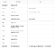
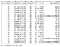
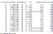
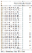
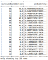
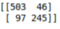

Lab 3 : Classification
======================


In this lab, we will put together everything we have
learned to train a **classification model**. The objective is to learn
how to build a complete classification workflow from the beginning to
the end.


#### Pre-reqs:
- Google Chrome (Recommended)

#### Lab Environment
Notebooks are ready to run. All packages have been installed. There is no requirement for any setup.

All examples are present in `~/work/next-level-python-big-data/linear-regression/Lab03` folder. 


Problem Definition
==================

The problem we are going to solve is the infamous [*Titanic Survival
Problem*](https://www.kaggle.com/c/titanic). We are asked to build a
machine learning model that takes passenger information and predict
whether he/she survived or not. The dataset contains 12 columns
described as follows: [download from
[here](https://drive.google.com/open?id=1wI5UtWvoE_n9bvX8nMSp3v6tWr4NRb22)]



.png)


Preparing the Development Environment
=====================================

You should be familiar with this step now. We will open a new *Jyputer
notebook*, import and initialize *findspark*, create a *spark session*
and finally *load*the data.

```
from pyspark import SparkContext, SparkConf
from pyspark.sql import SQLContext

# (2) Instantiate a Spark Context
conf = SparkConf().setMaster("local").setAppName("Classification")
sc = SparkContext(conf=conf)
spark = SQLContext(sc)

data = spark.read.csv('./datasets/titanic.csv', inferSchema=True, header=True)
```

Let us have a look at the data and its statistics:


.png)


Top 20 rows of the dataset


.png)


Statistics

Here is an example on how someone may select/update his features by
analyzing the above tables:

-   It does not make sense to include some features such as:
    *PassengerID*, *Name*and *Ticket*→ we will drop them
-   *Cabin*has a lot of null values → we will drop it as well
-   Maybe the *Embarked*column has nothing to do with the survival → let
    us remove it
-   We are missing 177 values from the *Age*column → *Age* is important,
    we need to find a way to deal with the missing values
-   *Gender*has nominal values → need to encode them

Let us filter out the unneeded columns:

```
data = data.select(['Survived', 'Pclass', 'Gender', 'Age', 'SibSp', 'Parch', 'Fare'])
```

Feature Transformation
======================

We will deal with the transformations one by one. In a future lab, I
will discuss how to improve the process using **pipelines.** But let us
do it the boring way first.

Calculating Age Missing Values
------------------------------

*Age*is an important feature; it is not wise to drop it because of some
missing values. What we could do is to fill missing values with the help
of existing ones. This process is called **Data Imputation**. There are
many available strategies, but we will follow a simple one that fills
missing values with the *mean value* calculated from the sample.

**Spark ML**makes the job easy using the **Imputer**class. First, we
define the estimator, fit it to the model, then we apply the transformer
on the data.

```
from pyspark.ml.feature import Imputerimputer = Imputer(strategy='mean', inputCols=['Age'], outputCols=['AgeImputed'])imputer_model = imputer.fit(data)data = imputer_model.transform(data)
```



.png)


No more missing values! Let us continue to the next step…

Encoding Gender Values
----------------------

We learned that machine learning algorithms cannot deal with categorical
features. So, we need to index the *Gender*values:

```
from pyspark.ml.feature import StringIndexergender_indexer = StringIndexer(inputCol='Gender', outputCol='GenderIndexed')gender_indexer_model = gender_indexer.fit(data)data = gender_indexer_model.transform(data)
```



.png)


No more categorical values… Note that we do not need to one-hot-encode
the indexed values, they are naturally binary encoded with 0 and 1
values.

Creating the Features Vector
----------------------------

We learned previously that *Spark ML* expects data to be represented in
two columns: a *features vector*and a *label column*. We have the
*label*column ready (*Survived*), so let us prepare the *features
vector*.

**Note that we add the *AgeImputed*and *GenderIndexed*instead of
*Age*and *Gender*.**

```
from pyspark.ml.feature import VectorAssemblerassembler = VectorAssembler(inputCols=['Pclass', 'SibSp', 'Parch', 'Fare', 'AgeImputed', 'GenderIndexed'], outputCol='features')data = assembler.transform(data)
```



.png)


We are set to go! Time for machine learning…

Training the Model
==================

We will use a **Random Forest Classifier** for this problem. You are
free to choose any other classifier you see fit.

Steps:

1.  Create an estimator
2.  Specify the name of the features column and the label column
3.  Fit the model

```
from pyspark.ml.classification import RandomForestClassifieralgo = RandomForestClassifier(featuresCol='features', labelCol='Survived')model = algo.fit(data)
```

Done!

Generating Predictions
======================

We call the model’s transform method to get our predictions:

```
predictions = model.transform(data)
```

Let us check the prediction values:

```
predictions.select(['Survived','prediction', 'probability']).show()
```



.png)


So far so good, but it is not logical to go through the records and
verify them one by one. We need to calculate some metrics to get the
overall performance of the model.**Evaluation time…**

Model Evaluation
================

We will use a **BinaryClassificationEvaluator** to evaluate our model.
It needs to know the name of the *label column* and the *metric name*.
Here we will use the [*area under ROC
curve*](https://en.wikipedia.org/wiki/Receiver_operating_characteristic).

```
from pyspark.ml.evaluation import BinaryClassificationEvaluatorevaluator = BinaryClassificationEvaluator(labelCol='Survived', metricName='areaUnderROC')
```

Call the evaluate method to get the results:

```
evaluator.evaluate(predictions)
```

By using the above settings my evaluator returned: **0.90**

Given that we did nothing to configure the *hypreparatmers*, the initial
results are promising. I know that I did not evaluate it on a testing
data, but I trust you can do it.

Model Evaluation with SciKit-Learn
==================================

If you want to generate other evaluations such as a confusion matrix or
a classification report, you could always use the [scikit-learn
library](https://scikit-learn.org/).

You only need to extract *y\_true*and *y\_pred*from your DataFrame. Do
not worry I will show you how:

```
y_true = predictions.select(['Survived']).collect()y_pred = predictions.select(['prediction']).collect()
```

Import your metrics:

```
from sklearn.metrics import confusion_matrix
```


```
print(confusion_matrix(y_true, y_pred))
```



.png)


