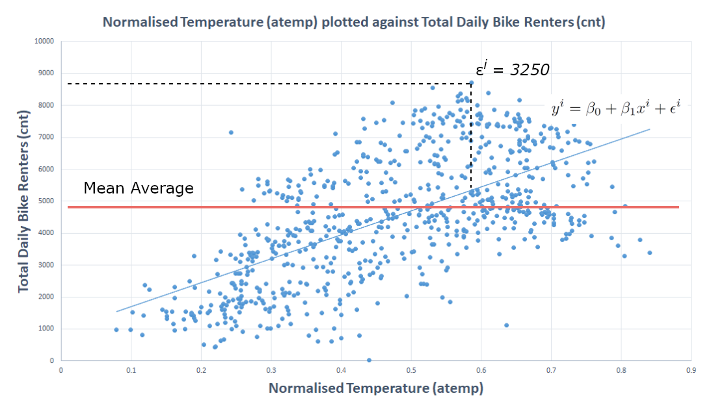
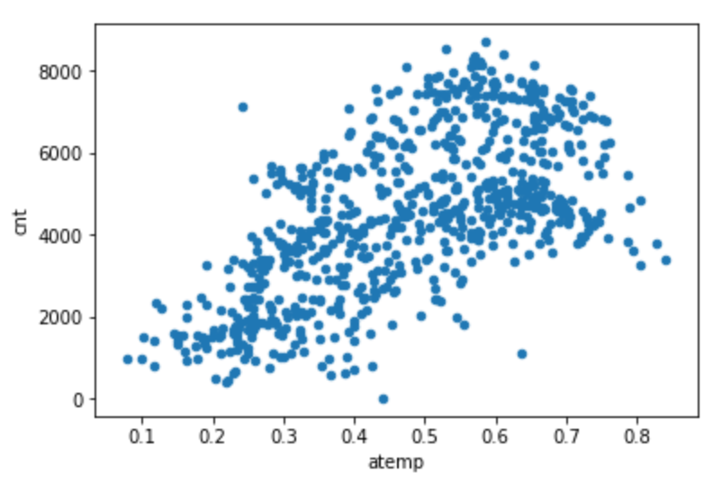
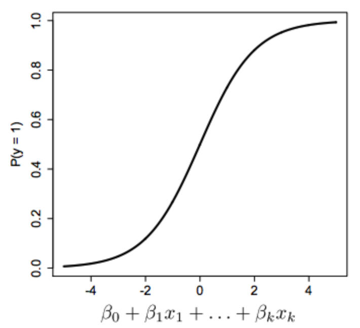
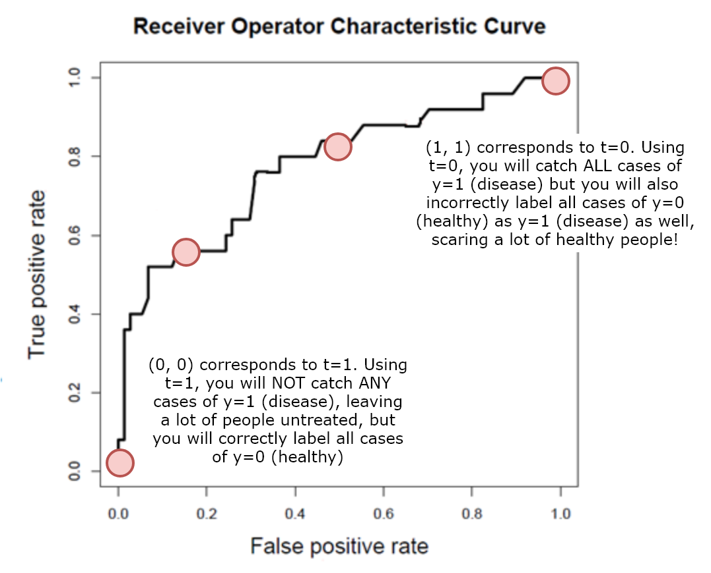
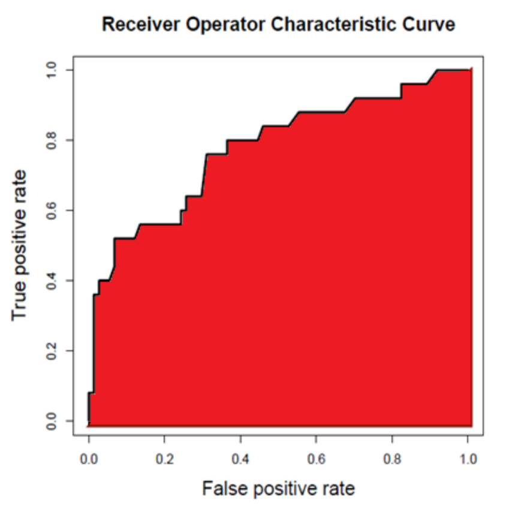
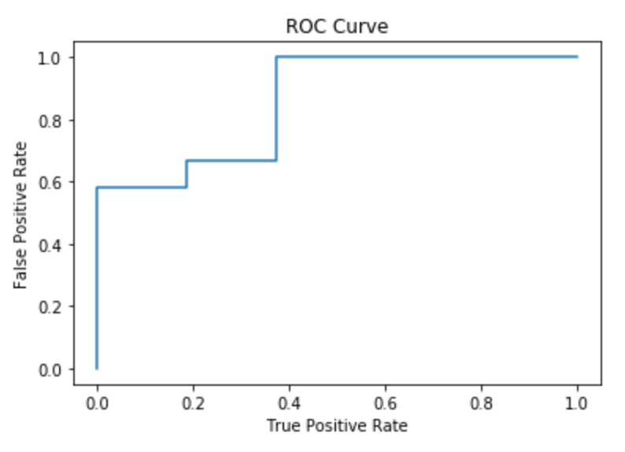
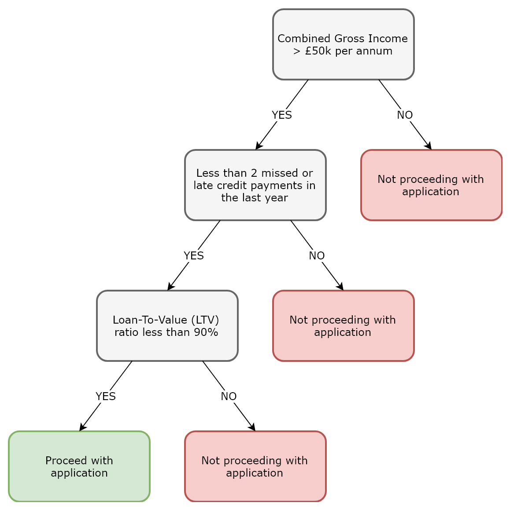
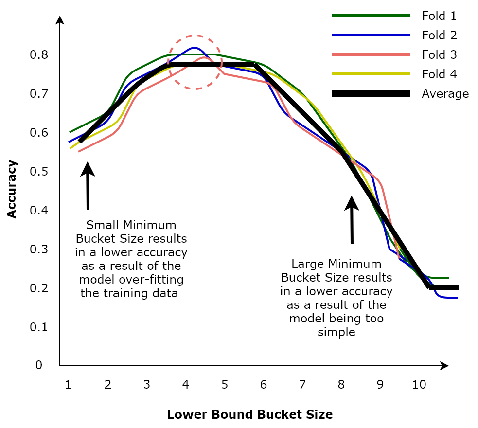

Supervised Learning Using Apache Spark
======================================

In this lab, we will develop, test, and evaluate supervised machine
learning models applied to a variety of real-world use cases using
Python, Apache Spark, and its machine learning library, [MLlib].
Specifically, we will train, test, and interpret the following types of
supervised machine learning models:

-   Univariate linear regression
-   Multivariate linear regression
-   Logistic regression
-   Classification and regression trees
-   Random forests


Linear regression
=================

The first supervised learning model that we will study is that of linear
regression. Formally, linear regression models the relationship between
a *dependent* variable using a set of one or more *independent*
variables. The resulting model can then be used to predict the numerical
value of the *dependent* variable. But what does this mean in practice?
Well, let\'s look at our first real-world use case to make sense of
this.


Case study -- predicting bike sharing demand
============================================

Bike sharing schemes have become very popular across the world over the
last decade or so as people seek a convenient means to travel within
busy cities while limiting their carbon footprint and helping to reduce
road congestion. If you are unfamiliar with bike sharing systems, they
are very simple; people rent a bike from certain locations in a city and
thereafter return that bike to either the same or another location once
they have finished their journey. In this example, we will be examining
whether we can predict the daily demand for bike sharing systems given
the weather on a particular day!

**Note:**

The dataset that we will be using has been derived from the **University
of California\'s** (**UCI**) machine learning repository found at
<https://archive.ics.uci.edu/ml/index.php>. The specific bike sharing
dataset that we will use, available from both the GitHub repository
accompanying this course and from
<https://archive.ics.uci.edu/ml/datasets/Bike+Sharing+Dataset>, has been
cited by Fanaee-T, Hadi, and Gama, Joao, \'Event labeling combining
ensemble detectors and background knowledge,\' Progress in Artificial
Intelligence (2013): pp. 1-15, Springer Berlin Heidelberg.


If you open [bike-sharing-data/day.csv] in any text editor, from
either the GitHub repository accompanying this course or from UCI\'s
machine learning repository, you will find bike sharing data aggregated
on a daily basis over 731 days using the following schema:

  -------------------- ----------------- -----------------------------------------------------------
  **Column name**      **Data type**     **Description**
  [instant]      [Integer]   Unique record identifier (primary key)
  [dteday]       [Date]      Date
  [season]       [Integer]   Season (1 -- spring, 2 -- summer, 3 -- fall, 4 -- winter)
  [yr]           [Integer]   Year
  [mnth]         [Integer]   Month
  [holiday]      [Integer]   Day is a holiday or not
  [weekday]      [Integer]   Day of the week
  [workingday]   [Integer]   1 -- neither a weekend nor a holiday, 0 -- otherwise
  [weathersit]   [Integer]   1 -- clear, 2 -- mist, 3 -- light snow, 4 -- heavy rain
  [temp]         [Double]    Normalized temperature in Celsius
  [atemp]        [Double]    Normalized feeling temperature in Celsius
  [hum]          [Double]    Normalized humidity
  [windspeed]    [Double]    Normalized wind speed
  [casual]       [Integer]   Count of casual users for that day
  [registered]   [Integer]   Count of registered users for that day
  [cnt]          [Integer]   Count of total bike renters that day
  -------------------- ----------------- -----------------------------------------------------------

Using this dataset, can we predict the total bike renters for a given
day (*cnt*) given the weather patterns for that particular day? In this
case, *cnt* is the *dependent* variable that we wish to predict based on
a set of *independent* variables that we shall choose from.


Univariate linear regression
============================

Univariate (or single-variable) linear regression refers to a linear
regression model where we use only one independent variable *x* to learn
a *linear* function that maps *x* to our dependent variable *y:*


In the preceding equation, we have the following:

-   *y^i^* represents the *dependent* variable (cnt) for the *i^th^*
    observation
-   *x^i^* represents the single *independent* variable for the *i^th^*
    observation
-   ε^*i*^ represents the *error* term for the *i^th^* observation
-   *β~0~* is the intercept coefficient
-   *β~1~* is the regression coefficient for the single independent
    variable

Since, in general form, a univariate linear regression model is a linear
function, we can easily plot this on a scatter graph where the x-axis
represents the single independent variable, and the y-axis represents
the dependent variable that we are trying to predict. *Figure 4.1*
illustrates the scatter plot generated when we plot normalized feeling
temperature (independent variable) against total daily bike renters
(dependent variable):




By analyzing *Figure 4.1*, you will see that there seems to be a general
positive linear trend between the normalized feeling temperature
(**atemp**) and the total daily biker renters (**cnt**). However, you
will also see that our blue trend line, which is the visual
representation of our univariate linear regression function, is not
perfect, in other words, not all of our data points fit exactly on this
line. In the real world, it is extremely rare to have a perfect model;
in other words, all predictive models will make some mistakes. The goal
therefore is to minimize the number of mistakes our models make so that
we may have confidence in the predictions that they provide.


Residuals
=========

The errors (or mistakes) that our model makes are called error terms or
*residuals*, and are denoted in our univariate linear regression
equation by ε^*i*^. Our goal therefore is to choose regression
coefficients for the independent variables (in our case *β~1~*) that
minimize these residuals. To compute the *i^th^* residual, we can simply
subtract the predicted value from the actual value, as illustrated in
*Figure 4.1*. To quantify the quality of our regression line, and hence
our regression model, we can use a metric called the **Sum of Squared
Errors** (**SSE**), which is simply the sum of all squared residuals, as
follows:


A smaller SSE implies a better fit. However, SSE as a metric to quantify
the quality of our regression model has its limitations. SSE scales with
the number of data points *N*, which means that if we doubled the number
of data points, the SSE may be twice as large, which may lead you to
believe that the model is twice as bad, which is not the case! We
therefore require other means to quantify the quality of our model.


Root mean square error
======================

The **root mean square error** (**RMSE**) is the square root of the SSE
divided by the total number of data points *N*, as follows:


The RMSE tends to be used more often as a means to quantify the quality
of a linear regression model, since its units are the same as the
dependent variable, and is normalized by N.


R-squared
=========

Another metric that provides an error measure of a linear regression
model is called the R^*2*^ (R-squared) metric. The R^2^ metric
represents the proportion of *variance* in the dependent variable
explained by the independent variable(s). The equation for calculating
R^2^ is as follows:


In this equation, SST refers to the **Total Sum of Squares**, which is
just the SSE from the overall mean (as illustrated in *Figure 4.1* by
the red horizontal line, which is often used as a **baseline** model).
An R^2^ value of 0 implies a linear regression model that provides no
improvement over the baseline model (in other words, SSE = SST). An R^2^
value of 1 implies a perfect predictive linear regression model (in
other words, SSE = 0). The aim therefore is to get an R^2^ value as
close as possible to 1.


Univariate linear regression in Apache Spark
============================================

Returning to our case study, let\'s develop a univariate linear
regression model in Apache Spark using its machine learning library,
[MLlib], in order to predict the total daily bike renters using
our bike sharing dataset:

**Note:**

The following sub-sections describe each of the pertinent cells in the
corresponding Jupyter Notebook for this use case, entitled
[chp04-01-univariate-linear-regression.ipynb], and which may be
found in the GitHub repository accompanying this course.


1.  First, we import the required Python dependencies, including
    [pandas] (Python data analysis library), [matplotlib]
    (Python plotting library), and [pyspark] (Apache Spark Python
    API). By using the [%matplotlib] magic function, any plots
    that we generate will automatically be rendered within the Jupyter
    Notebook cell output:

```
%matplotlib inline
import matplotlib.pyplot as plt
import pandas as pd
from pyspark import SparkContext, SparkConf
from pyspark.sql import SQLContext
from pyspark.ml.feature import VectorAssembler
from pyspark.ml.regression import LinearRegression
from pyspark.ml.evaluation import RegressionEvaluator
```


2.  Before we instantiate a Spark context, it is generally a good idea
    to load a sample of any pertinent dataset into [pandas] so
    that we may identify any trends or patterns before developing a
    predictive model. Here, we use the [pandas] library to load
    the entire CSV into a [pandas] DataFrame called
    [bike\_sharing\_raw\_df] (since it is a very small dataset
    anyway):

```
bike_sharing_raw_df = pd.read_csv('<Path to CSV file>',
delimiter = '<delimiter character>')
bike_sharing_raw_df.head()
```


3.  In cells 3.1 to 3.4, we use the [matplotlib] library to plot
    various independent variables ([temp], [atemp],
    [hum], and [windspeed]) against the dependent variable
    ([cnt]):

```
bike_sharing_raw_df.plot.scatter(x = '<Independent Variable>',
y = '<Dependent Variable>')
```


As you can see in *Figure 4.2*, there is a general positive linear
relationship between the normalized temperatures ([temp] and
[atemp]) and the total daily bike renters (cnt). However, there is
no such obvious trend when using humidity and wind speed as our
independent variables. Therefore, we will proceed to develop a
univariate linear regression model using normalized feeling temperature
([atemp]) as our single independent variable, with total daily
bike renters ([cnt]) being our dependent variable:\




4.  In order to develop a Spark application, we need to first
    instantiate a Spark context to connect to our local Apache Spark
    cluster. We also instantiate a Spark [SQLContext] for the
    structured processing of our dataset:

```
conf = SparkConf().setMaster("local")
.setAppName("Univariate Linear Regression - Bike Sharing")
sc = SparkContext(conf=conf)
sqlContext = SQLContext(sc)
```


5.  We can now load our CSV dataset into a Spark DataFrame called [bike\_sharing\_df]. We use
    the [SQLContext] previously defined and we tell Spark to use
    the first row as the header row and to infer the schema data types:

```
bike_sharing_df = sqlContext.read
.format('com.databricks.spark.csv')
.options(header = 'true', inferschema = 'true')
.load('Path to CSV file')
bike_sharing_df.head(10)
bike_sharing_df.printSchema()
```


6.  Before developing a predictive model, it is also a good idea to
    generate standard statistical metrics for a dataset so as to gain
    additional insights. Here, we generate the row count for the
    DataFrame, as well as calculating the mean average, standard
    deviation, and the minimum and maximum for each column. We achieve
    this using the [describe()] method for a Spark DataFrame as
    follows:

```
bike_sharing_df.describe().toPandas().transpose()
```


7.  We now demonstrate how to plot a dataset using a Spark DataFrame as
    an input. In this case, we simply convert the Spark DataFrame into a
    [pandas] DataFrame before plotting as before (note that for
    very large datasets, it is recommended to use a representative
    sample of the dataset for plotting purposes):

```
bike_sharing_df.toPandas().plot.scatter(x='atemp', y='cnt')
```


8.  Now that we have finished our exploratory analysis, we can start
    developing our univariate linear regression model! First, we need to
    convert our independent variable ([atemp]) into a *numerical feature vector*. We can achieve this
    using MLlib\'s [VectorAssembler], which will take one or more
    feature columns, convert them into feature vectors, and store those
    feature vectors in an output column, which, in this example, is
    called [features]:

```
univariate_feature_column = 'atemp'
univariate_label_column = 'cnt'
vector_assembler = VectorAssembler(
inputCols = [univariate_feature_column],
outputCol = 'features')
```


We then apply the [VectorAssembler] *transformer* to the raw dataset and
identify the column that contains our label (in this case, our dependent
variable [cnt]). The output is a new Spark DataFrame called
[bike\_sharing\_features\_df] containing our independent numerical
feature vectors ([atemp]) mapped to a known label ([cnt]):

```
bike_sharing_features_df = vector_assembler
.transform(bike_sharing_df)
.select(['features', univariate_label_column])
bike_sharing_features_df.head(10)
```


9.  As per supervised learning models in general, we need a *training*
    dataset to train our model in order to learn the mapping function,
    and a *test* dataset in order to evaluate the performance of our
    model. We can randomly split our raw labeled feature vector
    DataFrame using the [randomSplit()] method and a seed, which
    is used to initialize the random generator, and which can be any
    number you like. Note that if you use a different seed, you will get
    a different random split between your training and test dataset,
    which means that you may get slightly different coefficients for
    your final linear regression model:

```
train_df, test_df = bike_sharing_features_df
.randomSplit([0.75, 0.25], seed=12345)
train_df.count(), test_df.count()
```


In our case, 75% of the original rows will form our training DataFrame
called [train\_df], with the remaining 25% forming our test
DataFrame called [test\_df], while using a [seed] of
[12345].

10. We are now ready to train our univariate linear regression model! We
    achieve this by using [MLlib]\'s [LinearRegression]
    estimator and passing it the
    name of the column containing our independent numerical feature
    vectors (in our case, called [features]) and the name of the
    column containing our labels (in our case, called [cnt]). We
    then apply the [fit()] method to train our model and output a
    linear regression *transformer* which, in our case, is called
    [linear\_regression\_model]:

```
linear_regression = LinearRegression(featuresCol = 'features',
labelCol = univariate_label_column)
linear_regression_model = linear_regression.fit(train_df)
```


11. Before we evaluate our trained univariate linear regression model on
    the test DataFrame, let\'s generate some summary statistics for it.
    The transformer model exposes a series of statistics, including
    model coefficients (in other words, *β~1~* in our case), the
    intercept coefficient *β~0~*, the error metrics RMSE and R^2^, and
    the set of residuals for each data point. In our case, we have the
    following:\
    \
    -   β~0~ = 829.62
    -   β~1~ = 7733.75
    -   RMSE = 1490.12
    -   R^2^ = 0.42

```
print("Model Coefficients: " +
str(linear_regression_model.coefficients))
print("Intercept: " + str(linear_regression_model.intercept))
training_summary = linear_regression_model.summary
print("RMSE: %f" % training_summary.rootMeanSquaredError)
print("R-SQUARED: %f" % training_summary.r2)
print("TRAINING DATASET DESCRIPTIVE SUMMARY: ")
train_df.describe().show()
print("TRAINING DATASET RESIDUALS: ")
training_summary.residuals.show()
```


Therefore, our trained univariate linear regression model has learned
the following function in order to be able to predict our dependent
variable *y* (total daily bike renters) using a single independent
variable *x* (normalized feeling temperature):

*y = 829.62 + 7733.75x*

12. Let\'s now apply our trained model to our test DataFrame in order to
    evaluate its performance on test data. Here, we apply our trained
    linear regression model transformer to the test DataFrame using the
    [transform()] method in order to make predictions. For
    example, our model predicts a total daily bike rental count of 1742
    given a normalized feeling temperature of 0.11793. The actual total
    daily bike rental count was 1416 (an error of 326):

```
test_linear_regression_predictions_df =
linear_regression_model.transform(test_df)
test_linear_regression_predictions_df
.select("prediction", univariate_label_column, "features")
.show(10)
```


13. We now compute the same RMSE and R^2^ error metrics, but based on
    the performance of our model on the *test* DataFrame. In our case,
    these are 1534.51 (RMSE) and 0.34 (R^2^) respectively, calculated
    using [MLlib]\'s [RegressionEvaluator]. So, in our case,
    our trained model actually performs more poorly on the test dataset:

```
linear_regression_evaluator_rmse = RegressionEvaluator(
predictionCol = "prediction",
labelCol = univariate_label_column, metricName = "rmse")
linear_regression_evaluator_r2 = RegressionEvaluator(
predictionCol = "prediction",
labelCol = univariate_label_column, metricName = "r2")
print("RMSE on Test Data = %g" % linear_regression_evaluator_rmse
.evaluate(test_linear_regression_predictions_df))
print("R-SQUARED on Test Data = %g" %
linear_regression_evaluator_r2
.evaluate(test_linear_regression_predictions_df))
```


14. Note that we can generate the same metrics but using the
    [evaluate()] method of the linear regression model, as shown
    in the following code block:

```
test_summary = linear_regression_model.evaluate(test_df)
print("RMSE on Test Data = %g" % test_summary.rootMeanSquaredError)
print("R-SQUARED on Test Data = %g" % test_summary.r2)
```


15. Finally, we terminate our Spark application by stopping the Spark
    context:

```
sc.stop()
```


Multivariate linear regression
==============================

Our univariate linear regression model actually performed relatively
poorly on both the training and test datasets, with R^2^ values of 0.42
on the training dataset and 0.34 on the test dataset respectively. Is
there any way we can take advantage of the other independent variables
available in our raw dataset to increase the predictive quality of our
model?

Multivariate (or multiple) linear regression extends univariate linear
regression by allowing us to utilize more than one independent variable,
in this case *K* independent variables, as follows:


As before, we have our dependent variable *y^i^* (for the *i^th^*
observation), an intercept coefficient *β~0~,* and our residuals ε^*i*^.
But we also now have *k* independent variables, each with their own
regression coefficient, *β~k~*. The goal, as before, is to derive
coefficients that minimize the amount of error that our model makes. The
problem now though is how to choose which subset of independent
variables to use in order to train our multivariate linear regression
model. Adding more independent variables increases the complexity of
models in general and, hence, the data storage and processing
requirements of underlying processing platforms. Furthermore, models
that are too complex tend to cause **overfitting**, whereby the model
achieves better performance (in other words, a higher *R^2^* metric) on
the training dataset used to train the model than on new data that it
has not seen before.


Correlation
===========

Correlation is a metric that measures the linear relationship between
two variables, and helps us to decide which independent variables to
include in our model:

-   +1 implies a perfect positive linear relationship
-   0 implies no linear relationship
-   -1 implies a perfect negative linear relationship

When two variables have an *absolute* value of correlation close to 1,
then these two variables are said to be \"highly correlated\".


Multivariate linear regression in Apache Spark
==============================================

Returning to our case study, let\'s now develop a multivariate linear
regression model in order to predict the total daily bike renters using
our bike sharing dataset and a subset of independent variables:

**Note:**

The following sub-sections describe each of the pertinent cells in the
corresponding Jupyter Notebook for this use case, entitled
[chp04-02-multivariate-linear-regression.ipynb], and which may be
found in the GitHub repository accompanying this course. Note that for the
sake of brevity, we will skip those cells that perform the same
functions as seen previously.


1.  First, let\'s demonstrate how we can use Spark to calculate the
    correlation value between our dependent variable, [cnt], and
    each independent variable in our DataFrame. We achieve this by
    iterating over each column in our raw Spark DataFrame and using the
    [stat.corr()] method as follows:

```
independent_variables = ['season', 'yr', 'mnth', 'holiday',
'weekday', 'workingday', 'weathersit', 'temp', 'atemp',
'hum', 'windspeed']
dependent_variable = ['cnt']
bike_sharing_df = bike_sharing_df.select( independent_variables +
dependent_variable )
for i in bike_sharing_df.columns:
print( "Correlation to CNT for ",
i, bike_sharing_df.stat.corr('cnt', i))
```


The resultant correlation matrix shows that the independent
variables---[season], [yr], [mnth], [temp] , and
[atemp], exhibit significant positive correlation with our
dependent variable [cnt]. We will therefore proceed to train a
multivariate linear regression model using this subset of independent
variables.

2.  As seen previously, we can apply a [VectorAssembler] in order
    to generate numerical feature vector representations of our
    collection of independent variables along with the [cnt]
    label. The syntax is identical to that seen previously, but this
    time we pass multiple columns to the [VectorAssembler]
    representing the columns containing our independent variables:

```
multivariate_feature_columns = ['season', 'yr', 'mnth',
'temp', 'atemp']
multivariate_label_column = 'cnt'
vector_assembler = VectorAssembler(inputCols =
multivariate_feature_columns, outputCol = 'features')
bike_sharing_features_df = vector_assembler
.transform(bike_sharing_df)
.select(['features', multivariate_label_column])
```


3.  We are now ready to generate our respective training and test
    datasets using the [randomSplit] method via the DataFrame API:

```
train_df, test_df = bike_sharing_features_df
.randomSplit([0.75, 0.25], seed=12345)
train_df.count(), test_df.count()
```


4.  We can now train our multivariate linear regression model using the
    same [LinearRegression] estimator that we used in our
    univariate linear regression model:

```
linear_regression = LinearRegression(featuresCol = 'features',
labelCol = multivariate_label_column)
linear_regression_model = linear_regression.fit(train_df)
```


5.  After splitting our original DataFrame into a training and test
    DataFrame respectively, and applying the same *LinearRegression*
    estimator to the training DataFrame, we now have a trained
    multivariate linear regression model with the following summary
    training statistics (as can be seen in cell 8 of this Jupyter
    Notebook):\
    \
    -   β~0~ = -389.94, β~1~ = 526.05, β~2~ = 2058.85, β~3~ = -51.90,
        β~4~ = 2408.66, β~5~ = 3502.94
    -   RMSE = 1008.50
    -   R^2^ = 0.73

Therefore, our trained multivariate linear regression model has learned
the following function in order to be able to predict our dependent
variable *y* (total daily bike renters) using a set of independent
variables *x~k~* (season, year, month, normalized temperature, and
normalized feeling temperature):

*y = -389.94 + 526.05x~1~ + 2058.85x~2~ - 51.90x~3~ + 2408.66x~4~ +
3502.94x~5~*

Furthermore, our trained multivariate linear regression model actually
performs even better on the test dataset with a test RMSE of 964.60 and
a test R^2^ of 0.74.

To finish our discussion of multivariate linear regression models, note
that our training R^2^ metric will always either increase or stay the
same as more independent variables are added. However, a better training
R^2^ metric does not always imply a better test R^2^ metric---in fact, a
test R^2^ metric can even be negative, meaning that it performs worse on
the test dataset than the baseline model (which can never be the case
for the training R^2^ metric). The goal therefore is to be able to
develop a model that works well for both the training and test datasets.


Logistic regression
===================

We have seen how linear regression models allows us to predict a
numerical outcome. Logistic regression models, however, allow us to
predict a *categorical* outcome by predicting the probability that an
outcome is true.

As with linear regression, in logistic regression models, we also have a
dependent variable *y* and a set of independent variables *x~1~*,
*x~2~*, ..., *x~k~*. In logistic regression however, we want to learn a
function that provides the probability that *y = 1* (in other words,
that the outcome variable is true) given this set of independent
variables, as follows:


This function is called the **Logistic Response** function, and provides
a number between 0 and 1, representing the probability that the
outcome-dependent variable is true, as illustrated in *Figure 4.3*:




Positive coefficient values β~k~ increase the probability that y = 1,
and negative coefficient values decrease the probability that y = 1. Our
goal, therefore, when developing logistic regression models, is to
choose coefficients that predict a high probability when y = 1, but
predict a low probability when y = 0.


Threshold value
===============

We now know that logistic regression models provide us with the
probability that the outcome variable is true, that is to say, y = 1.
However, in real-world use cases, we need to make *decisions*, not just
deliver probabilities. Often, we make binary predictions, such as
Yes/No, Good/Bad, and Go/Stop. A threshold value (*t*) allows us to make
these decisions based on probabilities as follows:

-   If P(y=1) \>= t, then we predict y = 1
-   If P(y=1) \< t, then we predict y = 0

The challenge now is how to choose a suitable value of *t*. In fact,
what does *suitable* mean in this context?

In real-world use cases, some types of error are better than others.
Imagine that you were a doctor and were testing a large group of
patients for a particular disease using logistic regression. In this
case, the outcome *y=1* would be a patient carrying the disease
(therefore y=0 would be a patient not carrying the disease), and, hence,
our model would provide P(y=1) for a given person. In this example, it
is better to detect as many patients potentially carrying the disease as
possible, even if it means misclassifying some patients as carrying the
disease who subsequently turn out not to. In this case, we select a
smaller threshold value. If we select a large threshold value, however,
we would detect those patients that almost certainly have the disease,
but we would misclassify a large number of patients as not carrying the
disease when, in actual fact, they do, which would be a much worse
scenario!

In general therefore, when using logistic regression models, we can make
two types of error:

-   We predict y=1 (disease), but the actual outcome is y=0 (healthy)
-   We predict y=0 (healthy), but the actual outcome is y=1 (disease)


Confusion matrix
================

A confusion (or classification) matrix can help us qualify what
threshold value to use by comparing the predicted outcomes against the
actual outcomes as follows:

  -------------------------- ------------------------------ ------------------------------
                             **Predict y=0 (healthy)**      **Predict y=1 (disease)**
  **Actual y=0 (healthy)**   **True negatives** (**TN**)    **False positives** (**FP**)
  **Actual y=1 (disease)**   **False negatives** (**FN**)   **True positives** (**TP**)
  -------------------------- ------------------------------ ------------------------------

By generating a confusion matrix, it allows us to quantify the accuracy
of our model based on a given threshold value by using the following
series of metrics:

-   N = number of observations
-   Overall accuracy = (TN + TP) / N
-   Overall error rate = (FP + FN) / N
-   Sensitivity (True Positive Rate) = TP / (TP + FN)
-   Specificity (True Negative Rate) = TN / (TN + FP)
-   False positive error rate = FP / (TN + FP)
-   False negative error rate = FN / (TP + FN)

Logistic regression models with a higher threshold value will have a
lower sensitivity and higher specificity. Models with a lower threshold
value will have a higher sensitivity and lower specificity. The choice
of threshold value therefore depends on the type of error that is
\"better\" for your particular use case. In use cases where there is
genuinely no preference, for example, political leaning of
Conservative/Non-Conservative, then you should choose a threshold value
of 0.5 that will predict the most likely outcome.


Receiver operator characteristic curve
======================================

To further assist us in choosing a threshold value in a more visual way,
we can generate a **receiver operator characteristic** (**ROC**) curve.
An ROC curve plots the **false positive error rate** (**FPR**) against
the **true positive rate** (**TPR**, or sensitivity) for every threshold
value between 0 and 1, as illustrated in *Figure 4.4*:





As illustrated in *Figure 4.4*, using a threshold value of 0 means that
you will catch ALL cases of y=1 (disease), but you will also incorrectly
label all cases of y=0 (healthy) as y=1 (disease) as well, scaring a lot
of healthy people! However using a threshold value of 1 means that you
will NOT catch ANY cases of y=1 (disease), leaving a lot of people
untreated, but you will correctly label all cases of y=0 (healthy). The
benefit of plotting an ROC curve therefore is that it helps you to see
the trade-off for *every* threshold value, and ultimately helps you to
make a decision as to which threshold value to use for your given use
case.


Area under the ROC curve
========================

As a means of quantifying the quality of the predictions made by a
logistic regression model, we can calculate the **Area under the ROC
curve** (**AUC**), as illustrated in *Figure 4.5*. The AUC measures the
proportion of time that the model predicts correctly, with an AUC value
of 1 (maximum), implying a perfect model, in other words, our model
predicts correctly 100% of the time, and an AUC value of 0.5 (minimum),
implying our model predicts correctly 50% of the time, analogous to just
guessing:





Case study -- predicting breast cancer
======================================

Let\'s now apply logistic regression to a very important real-world use
case; predicting patients who may have breast cancer. Approximately 1 in
8 women are diagnosed with breast cancer during their lifetime (with the
disease also affecting men), resulting in the premature deaths of
hundreds of thousands of women annually across the world. In fact, it is
projected that over 2 million new cases of breast cancer will have been
reported worldwide by the end of 2018 alone. Various factors are known
to increase the risk of breast cancer, including age, weight, family
history, and previous diagnoses.

Using a dataset of quantitative predictors, along with a binary
dependent variable indicating the presence or absence of breast cancer,
we will train a logistic regression model to predict the probability of
whether a given patient is healthy (y=1) or has the biomarkers of breast
cancer (y=0).

**Note:**

The dataset that we will use has again been derived from the University
of California\'s (UCI) machine learning repository. The specific breast
cancer dataset, available from both the GitHub repository accompanying
this course and from
<https://archive.ics.uci.edu/ml/datasets/Breast+Cancer+Coimbra>, has
been cited by \[Patricio, 2018\] Patrício, M., Pereira, J., Crisóstomo,
J., Matafome, P., Gomes, M., Seiça, R., and Caramelo, F. (2018). Using
Resistin, glucose, age, and BMI to predict the presence of breast
cancer. BMC Cancer, 18(1).


If you open [breast-cancer-data/dataR2.csv] in any text editor,
from either the GitHub repository accompanying this course or from UCI\'s
machine learning repository, you will find breast cancer data that
employs the following schema:

  ------------------------ ----------------- -----------------------------------------------------------------------------------------------
  **Column name**          **Data type**     **Description**
  [Age]              [Integer]   Age of patient
  [BMI]              [Double]    Body mass index (kg/m^2^)
  [Glucose]          [Double]    Blood glucose level (mg/dL)
  [Insulin]          [Double]    Insulin level (µU/mL)
  [HOMA]             [Double]    Homeostatic Model Assessment (HOMA) -- used to assess β-cell function and insulin sensitivity
  [Leptin]           [Double]    Hormone used to regulate energy expenditure (ng/mL)
  [Adiponectin]      [Double]    Protein hormone used to regulate glucose levels (µg/mL)
  [Resistin]         [Double]    Hormone that causes insulin resistance (ng/mL)
  [MCP.1]            [Double]    Protein to aid recovery from injury and infection (pg/dL)
  [Classification]   [Integer]   1 = Healthy patient as part of a control group, 2 = patient with breast cancer
  ------------------------ ----------------- -----------------------------------------------------------------------------------------------

Using this dataset, can we develop a logistic regression model that
calculates the probability of a given patient being healthy (in other
words, y=1) and thereafter apply a threshold value to make a predictive
decision?

**Note:**

The following sub-sections describe each of the pertinent cells in the
corresponding Jupyter Notebook for this use case, entitled
[chp04-03-logistic-regression.ipynb], and which may be found in
the GitHub repository accompanying this course. Note that, for the sake of
brevity, we will skip those cells that perform the same functions as
seen previously.


1.  After loading our breast cancer CSV file, we first identify the
    column that will act as our label, that is to say,
    [Classification]. Since the values in this column are either 1
    (healthy) or 2 (breast cancer patient), we will apply a
    [StringIndexer] to this column to identify and index all the
    possible categories. The result is that a label of 1 corresponds to
    a healthy patient, and a label of 0 corresponds to a breast cancer
    patient:

<div>

```
indexer = StringIndexer(inputCol = "Classification",
outputCol = "label").fit(breast_cancer_df)
breast_cancer_df = indexer.transform(breast_cancer_df)
```


</div>

2.  In our case, we will use all the raw quantitative columns
    \[[Age], [BMI], [Glucose], [Insulin],
    [HOMA], [Leptin], [Adiponectin], [Resistin],
    and [MCP.1]\] as independent variables in order to generate
    numerical feature vectors for our model. Again, we can use the
    [VectorAssembler] of [MLlib] to achieve this:

<div>

```
feature_columns = ['Age', 'BMI', 'Glucose', 'Insulin', 'HOMA',
'Leptin', 'Adiponectin', 'Resistin', 'MCP_1']
label_column = 'label'
vector_assembler = VectorAssembler(inputCols = feature_columns,
outputCol = 'features')
```


```
breast_cancer_features_df = vector_assembler
.transform(breast_cancer_df)
.select(['features', label_column])
```


</div>

3.  After generating training and test DataFrames respectively, we apply
    the [LogisticRegression] estimator of [MLlib] to train a
    [LogisticRegression] model transformer:

<div>

```
logistic_regression = LogisticRegression(featuresCol = 'features',
labelCol = label_column)
logistic_regression_model = logistic_regression.fit(train_df)
```


</div>

4.  We then use our trained logistic regression model to make
    predictions on the test DataFrame, using the [transform()]
    method of our logistic regression model transformer. This results in
    a new DataFrame with the columns [rawPrediction],
    [prediction], and [probability] appended to it. The
    probability of y=1, in other words, P(y=1), is contained within the
    [probability] column, and the overall predictive decision
    using a default threshold value of t=0.5 is contained within the
    [prediction] column:

<div>

```
test_logistic_regression_predictions_df = logistic_regression_model
.transform(test_df)
test_logistic_regression_predictions_df.select("probability",
"rawPrediction", "prediction", label_column, "features").show()
```


</div>

5.  To quantify the quality of our trained logistic regression model, we
    can plot an ROC curve and calculate the AUC metric. The ROC curve is
    generated using the [matplotlib] library, given the **false
    positive rate** (**FPR**) and **true positive rate** (**TPR**), as
    exposed by evaluating our trained logistic regression model on the
    test DataFrame. We can then use [MLlib]\'s
    [BinaryClassificationEvaluator] to calculate the AUC metric as
    follows:

<div>

```
test_summary = logistic_regression_model.evaluate(test_df)
roc = test_summary.roc.toPandas()
plt.plot(roc['FPR'],roc['TPR'])
plt.ylabel('False Positive Rate')
plt.xlabel('True Positive Rate')
plt.title('ROC Curve')
plt.show()
evaluator_roc_area = BinaryClassificationEvaluator(
rawPredictionCol = "rawPrediction", labelCol = label_column,
metricName = "areaUnderROC")
print("Area Under ROC Curve on Test Data = %g" %
evaluator_roc_area.evaluate(
test_logistic_regression_predictions_df))

Area Under ROC Curve on Test Data = 0.859375
```


</div>

The resultant ROC curve, generated using the [matplotlib] library,
is illustrated in *Figure 4.6*:




6.  One method of generating a confusion matrix based on the test
    dataset predictions is to simply filter the test predictions\'
    DataFrame based on cases where the predicted outcome equals, and
    does not equal, the actual outcome and thereafter count the number
    of records post-filter:

```
N = test_logistic_regression_predictions_df.count()
true_positives = test_logistic_regression_predictions_df
.filter( col("prediction") == 1.0 )
.filter( col("label") == 1.0 ).count()
true_negatives = test_logistic_regression_predictions_df
.filter( col("prediction") == 0.0 )
.filter( col("label") == 0.0 ).count()
false_positives = test_logistic_regression_predictions_df
.filter( col("prediction") == 1.0 )
.filter( col("label") == 0.0 ).count()
false_negatives = test_logistic_regression_predictions_df
.filter( col("prediction") == 0.0 )
.filter( col("label") == 1.0 ).count()
```


7.  Alternatively, we can use MLlib\'s RDD API (which is in maintenance
    mode as of Spark 2.0) to automatically generate the confusion matrix
    by converting the test predictions\' DataFrame into an RDD and thereafter passing it to the
    [MulticlassMetrics] evaluation abstraction:

<div>

```
predictions_and_label = test_logistic_regression_predictions_df
.select("prediction", "label").rdd
metrics = MulticlassMetrics(predictions_and_label)
print(metrics.confusionMatrix())
```


</div>

The confusion matrix for our logistic regression model, using a default
threshold value of 0.5, is as follows:

+-----------------------+-----------------------+-----------------------+
|                       | **Predict y=0 (breast | **Predict y=1         |
|                       | cancer)**             | (healthy)**           |
+-----------------------+-----------------------+-----------------------+
| **Actual y=0**        | 10                    | 6                     |
|                       |                       |                       |
| **(breast cancer)**   |                       |                       |
+-----------------------+-----------------------+-----------------------+
| **Actual y=1**        | 4                     | 8                     |
|                       |                       |                       |
| **(healthy)**         |                       |                       |
+-----------------------+-----------------------+-----------------------+

We can interpret this confusion matrix as follows. Out of a total of 28
observations, our model exhibits the following properties:

-   Correctly labeling 10 cases of breast cancer that actually are
    breast cancer
-   Correctly labeling 8 healthy patients that actually are healthy
    patients
-   Incorrectly labeling 6 patients as healthy when they actually have
    breast cancer
-   Incorrectly labeling 4 patients as having breast cancer when they
    are actually healthy patients
-   Overall accuracy = 64%
-   Overall error rate = 36%
-   Sensitivity = 67%
-   Specificity = 63%

To improve our logistic regression model, we must, of course, include
many more observations. Furthermore, the AUC metric for our model is
0.86, which is quite high. However, bear in mind that the AUC is a
measure of accuracy, taking into account all possible threshold values,
while the preceding confusion matrix only takes into account a single
threshold value (in this case 0.5). As an extension exercise, generate
confusion matrices for a range of threshold values to see how this
affects our final classifications!


Classification and Regression Trees
===================================

We have seen how linear regression models allow us to predict a
numerical outcome, and how logistic regression models allow us to
predict a categorical outcome. However, both of these models assume a
*linear* relationship between variables. **Classification and Regression
Trees** (**CART**) overcome this problem by generating **Decision
Trees**, which are also much easier to interpret compared to the
supervised learning models we have seen so far. These decision trees can
then be traversed to come to a final decision, where the outcome can
either be numerical (regression trees) or categorical (classification
trees). A simple classification tree used by a mortgage lender is
illustrated in *Figure 4.7*:





When traversing decision trees, start at the top. Thereafter, traverse
left for yes, or positive responses, and traverse right for no, or
negative responses. Once you reach the end of a branch, the leaf nodes
describe the final outcome.


Case study -- predicting political affiliation
==============================================

For our next use case, we will use congressional voting records from the
US House of Representatives to build a classification tree in order to
predict whether a given congressman or woman is a Republican or a
Democrat.

**Note:**

The specific congressional voting dataset that we will use is available
from both the GitHub repository accompanying this course and UCI\'s
machine learning repository at
<https://archive.ics.uci.edu/ml/datasets/congressional+voting+records>.
It has been cited by Dua, D., and Karra Taniskidou, E. (2017). UCI
Machine Learning Repository \[http://archive.ics.uci.edu/ml\]. Irvine,
CA: University of California, School of Information and Computer
Science.


If you open [congressional-voting-data/house-votes-84.data] in any
text editor of your choosing, from either the GitHub repository
accompanying this course or from UCI\'s machine learning repository, you
will find 435 congressional voting records, of which 267 belong to
Democrats and 168 belong to Republicans. The first column contains the
label string, in other words, Democrat or Republican, and the subsequent
columns indicate how the congressman or woman in question voted on
particular key issues at the time (y = for, n = against, ? = neither for
nor against), such as an anti-satellite weapons test ban and a reduction
in funding to a synthetic fuels corporation. Let\'s now develop a
classification tree in order to predict the political affiliation of a
given congressman or woman based on their voting records:

**Note:**

The following sub-sections describe each of the pertinent cells in the
corresponding Jupyter Notebook for this use case, entitled
[chp04-04-classification-regression-trees.ipynb], and which may be
found in the GitHub repository accompanying this course. Note that for the
sake of brevity, we will skip those cells that perform the same
functions as seen previously.


1.  Since our raw data file has no header row, we need to explicitly
    define its schema before we can load it into a Spark DataFrame, as
    follows:

<div>

```
schema = StructType([
StructField("party", StringType()),
StructField("handicapped_infants", StringType()),
StructField("water_project_cost_sharing", StringType()),
...
])
```


</div>

2.  Since all of our columns, both the label and all the independent
    variables, are string-based data types, we need to apply a
    *StringIndexer* to them (as we did when developing our logistic
    regression model) in order to identify and index all possible
    categories for each column before generating numerical feature
    vectors. However, since we have multiple columns that we need to
    index, it is more efficient to build a *pipeline*. A pipeline is a
    list of data and/or machine learning transformation stages to be
    applied to a Spark DataFrame. In our case, each stage in our
    pipeline will be the indexing of a different column as follows:

<div>

```
categorical_columns = ['handicapped_infants',
'water_project_cost_sharing', ...]
pipeline_stages = []
for categorial_column in categorical_columns:
string_indexer = StringIndexer(inputCol = categorial_column,
outputCol = categorial_column + 'Index')
encoder = OneHotEncoderEstimator(
inputCols = [string_indexer.getOutputCol()],
outputCols = [categorial_column + "classVec"])
pipeline_stages += [string_indexer, encoder]

label_string_idx = StringIndexer(inputCol = 'party',
outputCol = 'label')
pipeline_stages += [label_string_idx]
vector_assembler_inputs = [c + "classVec" for c
in categorical_columns]
vector_assembler = VectorAssembler(
inputCols = vector_assembler_inputs,
outputCol = "features")
pipeline_stages += [vector_assembler]
```


</div>

3.  Next, we instantiate our pipeline by passing to it the list of
    stages that we generated in the previous cell. We then execute our
    pipeline on the raw Spark DataFrame using the [fit()] method,
    before proceeding to generate our numerical feature vectors using
    [VectorAssembler] as before:

<div>

```
pipeline = Pipeline(stages = pipeline_stages)
pipeline_model = pipeline.fit(congressional_voting_df)
label_column = 'label'
congressional_voting_features_df = pipeline_model
.transform(congressional_voting_df)
.select(['features', label_column, 'party'])
pd.DataFrame(congressional_voting_features_df.take(5), columns=congressional_voting_features_df.columns).transpose()
```


</div>

4.  We are now ready to train our classification tree! To achieve this,
    we can use MLlib\'s [DecisionTreeClassifier] estimator to
    train a decision tree on our training dataset as follows:

<div>

```
decision_tree = DecisionTreeClassifier(featuresCol = 'features',
labelCol = label_column)
decision_tree_model = decision_tree.fit(train_df)
```


</div>

5.  After training our classification tree, we will evaluate its
    performance on the test DataFrame. As with logistic regression, we
    can use the AUC metric as a measure of the proportion of time that
    the model predicts correctly. In our case, our model has an AUC
    metric of 0.91, which is very high:

<div>

```
evaluator_roc_area = BinaryClassificationEvaluator(
rawPredictionCol = "rawPrediction", labelCol = label_column,
metricName = "areaUnderROC")
print("Area Under ROC Curve on Test Data = %g" % evaluator_roc_area.evaluate(test_decision_tree_predictions_df))
```


</div>

6.  Ideally, we would like to visualize our classification tree.
    Unfortunately, there is not yet any direct method in which to render
    a Spark decision tree without using third-party tools such as
    <https://github.com/julioasotodv/spark-tree-plotting>. However, we
    can render a text-based decision tree by invoking the
    [toDebugString] method on our trained classification tree
    model, as follows:

<div>

```
print(str(decision_tree_model.toDebugString))
```


</div>

With an AUC value of 0.91, we can say that our classification tree model
performs very well on the test data and is very good at predicting the
political affiliation of congressmen and women based on their voting
records. In fact, it classifies correctly 91% of the time across all
threshold values!

Note that a CART model also generates probabilities, just like a
logistic regression model. Therefore, we use a threshold value (default
0.5) in order to convert these probabilities into decisions, or
classifications as in our example. There is, however, an added layer of
complexity when it comes to training CART models---how do we control the
number of splits in our decision tree? One method is to set a lower
limit for the number of training data points to put into each subset or
bucket. In [MLlib], this value is tuneable, via the
[minInstancesPerNode] parameter, which is accessible when training
our [DecisionTreeClassifier]. The smaller this value, the more
splits that will be generated.

However, if it is too small, then overfitting will occur. Conversely, if
it is too large, then our CART model will be too simple with a low level
of accuracy. We will discuss how to select an appropriate value during
our introduction to random forests next. Note that [MLlib] also
exposes other configurable parameters, including [maxDepth] (the
maximum depth of the tree) and [maxBins], but note that the larger
a tree becomes in terms of splits and depth, the more computationally
expensive it is to compute and traverse. To learn more about the
tuneable parameters available to a [DecisionTreeClassifier],
please visit
<https://spark.apache.org/docs/latest/ml-classification-regression.html>.


Random forests
==============

One method of improving the accuracy of CART models is to build multiple
decision trees, not just the one. In random forests, we do just that---a
large number of CART trees are generated and thereafter, each tree in
the forest votes on the outcome, with the majority outcome taken as the
final prediction.

To generate a random forest, a process known as bootstrapping is
employed whereby the training data for each tree making up the forest is
selected randomly with replacement. Therefore, each individual tree will
be trained using a different subset of independent variables and, hence,
different training data.


K-Fold cross validation
=======================

Let\'s now return to the challenge of choosing an appropriate
lower-bound bucket size for an individual decision tree. This challenge
is particularly pertinent when training a random forest since the
computational complexity increases with the number of trees in the
forest. To choose an appropriate minimum bucket size, we can employ a
process known as K-Fold cross validation, the steps of which are as
follows:

-   Split a given training dataset into K subsets or \"folds\" of equal
    size.
-   (K - 1) folds are then used to train the model, with the remaining
    fold, called the validation set, used to test the model and make
    predictions for each lower-bound bucket size value under
    consideration.
-   This process is then repeated for all possible training and test
    fold combinations, resulting in the generation of multiple trained
    models that have been tested on each fold for every lower-bound
    bucket size value under consideration.
-   For each lower-bound bucket size value under consideration, and for
    each fold, calculate the accuracy of the model on that combination
    pair.
-   Finally, for each fold, plot the calculated accuracy of the model
    against each lower-bound bucket size value, as illustrated in
    *Figure 4.8*:





As illustrated in *Figure 4.8*, choosing a small lower-bound bucket size
value results in lower accuracy as a result of the model overfitting the
training data. Conversely, choosing a large lower-bound bucket size
value also results in lower accuracy as the model is too simple.
Therefore, in our case, we would choose a lower-bound bucket size value
of around 4 or 5, since the average accuracy of the model seems to be
maximized in that region (as illustrated by the dashed circle in *Figure
4.8*).

Returning to our Jupyter Notebook,
[chp04-04-classification-regression-trees.ipynb], let\'s now train
a random forest model using the same congressional voting dataset to see
whether it results in a better performing model compared to our single
classification tree that we developed previously:

1.  To build a random forest, we can use [MLlib]\'s
    [RandomForestClassifier] estimator to train a random forest on
    our training dataset, specifying the minimum number of instances
    each child must have after a split via the
    [minInstancesPerNode] parameter, as follows:

<div>

```
random_forest = RandomForestClassifier(featuresCol = 'features',
labelCol = label_column, minInstancesPerNode = 5)
random_forest_model = random_forest.fit(train_df)
```


</div>

2.  We can now evaluate the performance of our trained random forest
    model on our test dataset by computing the AUC metric using the same
    [BinaryClassificationEvaluator] as follows:

<div>

```
test_random_forest_predictions_df = random_forest_model
.transform(test_df)
evaluator_rf_roc_area = BinaryClassificationEvaluator(
rawPredictionCol = "rawPrediction", labelCol = label_column,
metricName = "areaUnderROC")
print("Area Under ROC Curve on Test Data = %g" % evaluator_rf_roc_area.evaluate(test_random_forest_predictions_df))
```


</div>

Our trained random forest model has an AUC value of 0.97, meaning that
it is more accurate in predicting political affiliation based on
historical voting records than our single classification tree!

Summary
=======

In this lab, we have developed, tested, and evaluated various
supervised machine learning models in Apache Spark using a wide variety
of real-world use cases, from predicting breast cancer to predicting
political affiliation based on historical voting records.
