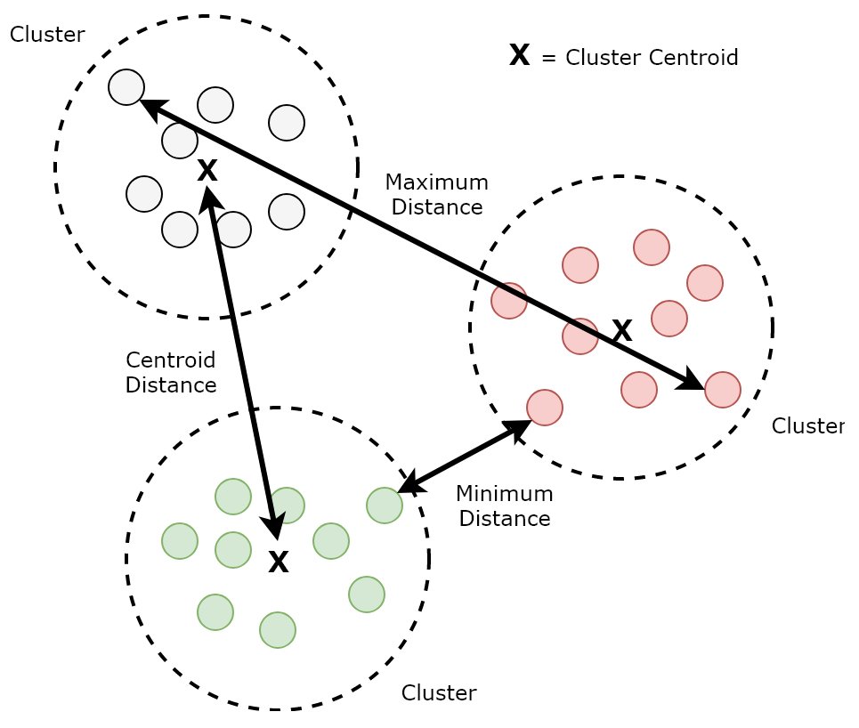
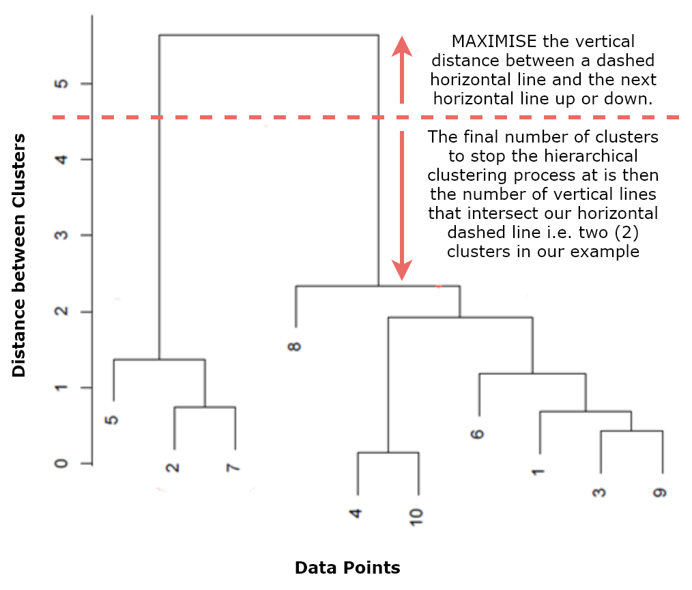
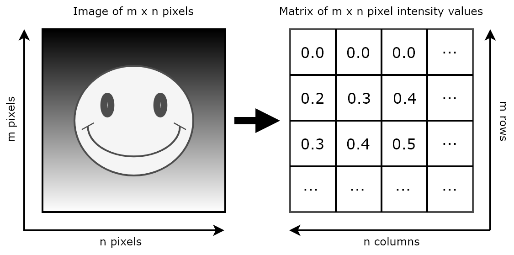
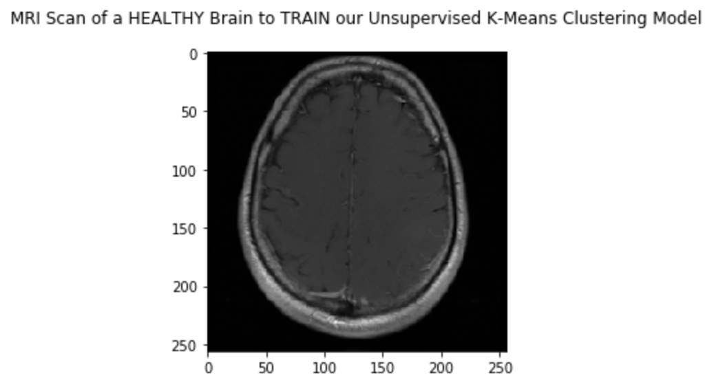
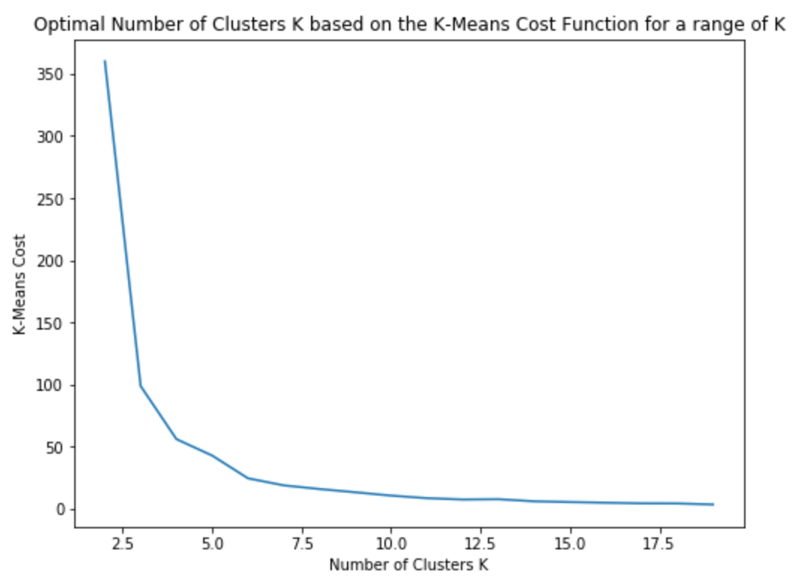
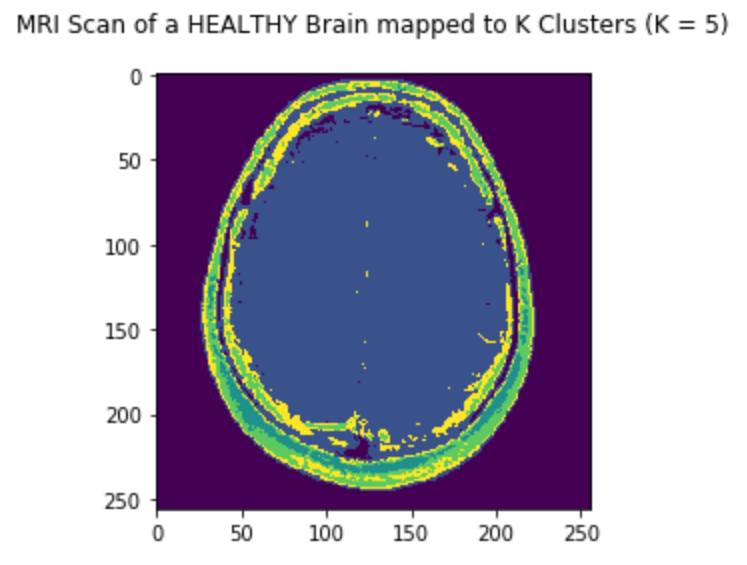
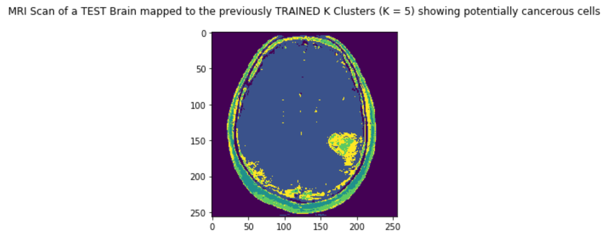
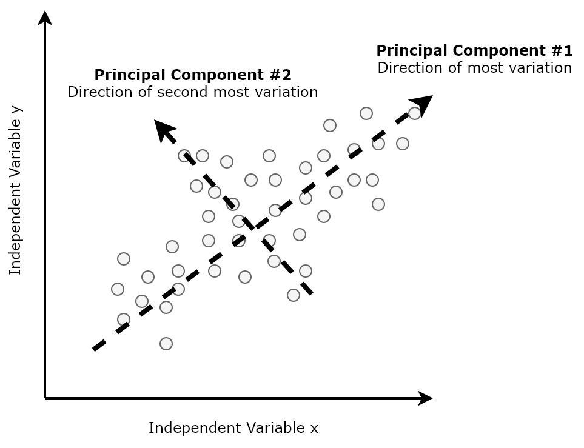

Unsupervised Learning Using Apache Spark
========================================

In this lab, we will train and evaluate unsupervised machine
learning models applied to a variety of real-world use cases, again
using Python, Apache Spark, and its machine learning library, MLlib.
Specifically, we will develop and interpret the following types of
unsupervised machine learning models and techniques:

-   Hierarchical clustering
-   K-means clustering
-   Principal component analysis


Clustering
==========

In unsupervised learning, the goal is to uncover hidden relationships, trends, and
patterns given only the input data, *x~i~*, with no output, *y~i~*. In
other words, our input dataset will be of the following form:


Clustering is a well-known example of a class of unsupervised learning
algorithms where the goal is to segment data points into groups, where
all of the data points in a specific group share similar features or
attributes in common. By the nature of clustering, however, it is
recommended that clustering models are trained on large datasets to
avoid over fitting. The two most commonly used clustering algorithms are
**hierarchical clustering** and **k-means clustering**, which are
differentiated from each other by the processes by which they construct
clusters. We shall study both of these algorithms in this lab.

Euclidean distance
==================

By definition, in order to cluster data points into groups, we require
an understanding of the *distance* between two given data points. A
common measure of distance is the **Euclidean distance**, which is
simply the straight-line distance between two given points in
*k*-dimensional space, where *k* is the number of independent variables
or features. Formally, the Euclidean distance between two points, *p*
and *q*, given *k* independent variables or dimensions is defined as
follows:


Other common measures of distance include the **Manhattan distance**,
which is the sum of the absolute values instead of squares (
) and the
**maximum coordinate distance**, where measurements are only considered
for those data points that deviate the most. For the remainder of this
lab, we will measure the Euclidean distance. Now that we have an
understanding of distance, we can define the following measures between
two clusters, as illustrated in *Figure 5.1*:

-   The *minimum distance* between clusters is the distance between the
    two points that are the closest to each other.
-   The *maximum distance* between clusters is the distance between the
    two points that are furthest away from each other.
-   The *centroid distance* between clusters is the distance between the
    centroids of each cluster, where the centroid is defined as the
    average of all data points in a given cluster:



Figure 5.1: Cluster distance measures

Hierarchical clustering
=======================

In hierarchical clustering, each data point starts off in its own
self-defined cluster—for example, if you have 10 data points in your
dataset, then there will initially be 10 clusters. The two *nearest*
clusters, as defined by the Euclidean centroid distance, for example,
are then combined. This process is then repeated for all distinct
clusters until eventually all data points belong in the same cluster.

This process can be visualized using a **dendrogram**, as illustrated in
*Figure 5.2*:



Figure 5.2: Hierarchical clustering dendrogram

A dendrogram helps us to decide when to stop the hierarchical clustering
process. It is generated by plotting the original data points on the
*x*axis and the distance between clusters on the *y*axis. As new parent
clusters are created, by combining the nearest clusters together, a
horizontal line is plotted between those child clusters. Eventually, the
dendrogram ends when all data points belong in the same cluster. The aim
of the dendrogram is to tell us when to stop the hierarchical clustering
process. We can deduce this by drawing a dashed horizontal line across
the dendrogram, placed at a position that maximizes the vertical
distance between this dashed horizontal line and the next horizontal
line (up or down). The final number of clusters at which to stop the
hierarchical clustering process is then the number of vertical lines the
dashed horizontal line intersects. In *Figure 5.2*, we would end up with
two clusters containing the data points {5, 2, 7} and {8, 4, 10, 6, 1,
3, 9} respectively. However, make sure that the final number of clusters
makes sense in the context of your use case.

K-means clustering
==================

In k-means clustering, a different process is followed in order to
segment data points into clusters. First, the final number of clusters,
*k*, must be defined upfront based on the context of your use case. Once
defined, each data point is randomly assigned to one of these *k*
clusters, after which the following process is employed:

-   The centroid of each cluster is computed
-   Data points are then reassigned to those clusters that have the
    closest centroid to them
-   The centroids of all clusters are then recomputed
-   Data points are then reassigned once more

This process is repeated until no data points can be reassigned—that is,
until there are no further improvements to be had and all data points
belong to a cluster that has the closest centroid to them. Therefore,
since the centroid of a cluster is defined as the mean average of all
data points in a given cluster, k-means clustering effectively
partitions the data points into *k* clusters with each data point
assigned to a cluster with a mean average that is closest to it.

Note that in both clustering processes (hierarchical and k-means), a
measure of distance needs to be computed. However, distance scales
differently based on the type and units of the independent variables
involved—for example, height and weight. Therefore, it is important to
normalize your data first (sometimes called feature scaling) before
training a clustering model so that it works properly. To learn more
about normalization, please visit
[https://en.wikipedia.org/wiki/Feature\_scaling](https://en.wikipedia.org/wiki/Feature_scaling).

Case study – detecting brain tumors
===================================

Let's apply k-means clustering to a very important real-world use case:
detecting brain tumors from **magnetic resonance imaging** (**MRI**)
scans. MRI scans are used across the world to generate detailed images
of the human body, and can be used for a wide range of medical
applications, from detecting cancerous cells to measuring blood flow. In
this case study, we will use grayscale MRI scans of a healthy human
brain as the input for a k-means clustering model. We will then apply
the trained k-means clustering model to an MRI scan of another human
brain to see if we can detect suspicious growths and tumors.

Note that the images we will use in this case study are relatively
simple, in that any suspicious growths that are present will be visible
to the naked eye. The fundamental purpose of this case study is to show
how Python may be used to manipulate images, and how MLlib may be used
to natively train k-means clustering models via its k-means estimator.

Feature vectors from images
===========================

The first challenge for us is to convert images into numerical feature
vectors in order to train our k-means clustering model. In our case, we
will be using grayscale MRI scans. A grayscale image in general can be
thought of as a matrix of pixel-intensity values between 0 (black) and 1
(white), as illustrated in *Figure 5.3*:



Figure 5.3: Grayscale image mapped to a matrix of pixel-intensity values

The dimensions of the resulting matrix is equal to the height (*m*) and
width (*n*) of the original image in pixels. The input into our k-means
clustering model will therefore be (*m* x *n*) observations across one
independent variable—the pixel-intensity value. This can subsequently be
represented as a single vector containing (*m* x *n*) numerical
elements—that is, (0.0, 0.0, 0.0, 0.2, 0.3, 0.4, 0.3, 0.4, 0.5 …).

Image segmentation
==================

Now that we have derived feature vectors from our grayscale MRI image,
our k-means clustering model will assign each pixel-intensity value to
one of the *k* clusters when we train it on our MRI scan of a healthy
human brain. In the context of the real world, these *k* clusters
represent different substances in the brain, such as grey matter, white
matter, fatty tissue, and cerebral fluids, which our model will
partition based on color, a process called image segmentation. Once we
have trained our k-means clustering model on a healthy human brain and
identified *k* distinct clusters, we can then apply those defined
clusters to MRI brain scans of other patients in an attempt to identify
the presence and volume of suspicious growths.

K-means cost function
=====================

One of the challenges when using the k-means clustering algorithm is how
to choose a suitable value for *k* upfront, especially if it is not
obvious from the wider context of the use case in question. One method
to help us is to plot a range of possible values of *k* on the *x*axis
against the output of the k-means cost function on the *y*axis. The
k-means cost function computes the total sum of the squared distance of
every point to its corresponding cluster centroid for that value of *k*.
The goal is to choose a suitable value of *k* that minimizes the cost
function, but that is not so large that it increases the computational
complexity of generating the clusters with only a small return in the
reduction in cost. We will demonstrate how to generate this plot, and
hence choose a suitable value of *k*, when we develop our Spark
application for image segmentation in the next subsection.

K-means clustering in Apache Spark
==================================

The MRI brain scans that we will use for our k-means clustering model
have been downloaded from **The Cancer Imaging Archive** (**TCIA**), a
service that anonymizes and hosts a large archive of medical images of
cancer for public download, and that may be found at
[http://www.cancerimagingarchive.net/](http://www.cancerimagingarchive.net/).

The MRI scan of our healthy human brain may be found in the GitHub
repository accompanying this course, and is called
mri-images-data/mri-healthy-brain.png. The MRI scan of the test human
brain is called mri-images-data/mri-test-brain.png. We will use both in
the following Spark application when training our k-means clustering
model and applying it to image segmentation. Let's begin:

The following subsections describe each of the pertinent cells in the
corresponding Jupyter notebook for this use case, called
chp05-01-kmeans-clustering.ipynb. It can be found in the GitHub
repository accompanying this course.

1.  Let's open the grayscale MRI scan of the healthy human brain and
    take a look at it! We can achieve this using the scikit-learn
    machine learning library for Python as follows:

```
mri_healthy_brain_image = io.imread(
'lab05/data/mri-images-data/mri-healthy-brain.png')
mri_healthy_brain_image_plot = plt.imshow(
mri_healthy_brain_image, cmap='gray')
```

Copy

The rendered image is illustrated in *Figure 5.4*:



Figure 5.4: Original MRI scan rendered using scikit-learn and matplotlib

2.  We now need to turn this image into a matrix of decimal point
    pixel-intensity values between 0 and 1. Conveniently, this function
    is provided out of the box by scikit-learn using the img\_as\_float
    method, as shown in the following code. The dimensions of the
    resulting matrix are 256 x 256, implying an original image of 256 x
    256 pixels:

```
mri_healthy_brain_matrix = img_as_float(mri_healthy_brain_image)
```

Copy

3.  Next, we need to flatten this matrix into a single vector of 256 x
    256 elements, where each element represents a pixel-intensity value.
    This can be thought of as another matrix of dimensions 1 x (256 x
    256) = 1 x 65536. We can achieve this using the numpy Python
    library. First, we convert our original 256 x 256 matrix into a
    2-dimensional numpy array. We then use numpy's ravel() method to
    flatten this 2-dimensional array into a 1-dimensional array.
    Finally, we represent this 1-dimensional array as a specialized
    array, or matrix, of dimensions 1 x 65536 using the np.matrix
    command, as follows:

```
mri_healthy_brain_2d_array = np.array(mri_healthy_brain_matrix)
.astype(float)
mri_healthy_brain_1d_array = mri_healthy_brain_2d_array.ravel()
mri_healthy_brain_vector = np.matrix(mri_healthy_brain_1d_array)
```

Copy

4.  Now that we have our single vector, represented as a matrix of 1 x
    65536 in dimension, we need to convert it into a Spark dataframe. To
    achieve this, we firstly transpose the matrix using numpy's
    reshape() method so that it is 65536 x 1. We then use the
    createDataFrame() method, exposed by Spark's SQLContext, to create a
    Spark dataframe containing 65536 observations/rows and 1 column,
    representing 65536 pixel-intensity values, as shown in the following
    code:

```
mri_healthy_brain_vector_transposed = mri_healthy_brain_vector
.reshape(mri_healthy_brain_vector.shape[1],
mri_healthy_brain_vector.shape[0])
mri_healthy_brain_df = sqlContext.createDataFrame(
pd.DataFrame(mri_healthy_brain_vector_transposed,
columns = ['pixel_intensity']))
```

Copy

5.  We are now ready to generate MLlib feature vectors using
    VectorAssembler, a method that we have seen before. The
    feature\_columns for VectorAssembler will simply be the sole
    pixel-intensity column from our Spark dataframe. The output of
    applying VectorAssembler to our Spark dataframe via the transform()
    method will be a new Spark dataframe called
    mri\_healthy\_brain\_features\_df, containing our 65536 MLlib
    feature vectors, as follows:

```
feature_columns = ['pixel_intensity']
vector_assembler = VectorAssembler(inputCols = feature_columns,
outputCol = 'features')
mri_healthy_brain_features_df = vector_assembler
.transform(mri_healthy_brain_df).select('features')
```

Copy

6.  We can now compute and plot the output of the k-means cost function
    for a range of *k* in order to determine the best value of *k* for
    this use case. We achieve this by using MLlib's KMeans() estimator
    in the Spark dataframe containing our feature vectors, iterating
    over values of k in the range(2, 20). We can then plot this using
    the matplotlib Python library, as shown in the following code:

```
cost = np.zeros(20)
for k in range(2, 20):
kmeans = KMeans().setK(k).setSeed(1).setFeaturesCol("features")
model = kmeans.fit(mri_healthy_brain_features_df
.sample(False, 0.1, seed=12345))
cost[k] = model.computeCost(mri_healthy_brain_features_df)

fig, ax = plt.subplots(1, 1, figsize =(8, 6))
ax.plot(range(2, 20),cost[2:20])
ax.set_title('Optimal Number of Clusters K based on the
K-Means Cost Function for a range of K')
ax.set_xlabel('Number of Clusters K')
ax.set_ylabel('K-Means Cost')
```

Copy

Based on the resulting plot, as illustrated in *Figure 5.5*, a value of
*k* of either 5 or 6 would seem to be ideal. At these values, the
k-means cost is minimized with little return gained thereafter, as shown
in the following graph:



Figure 5.5: K-means cost function

7.  We are now ready to train our k-means clustering model! Again, we
    will use MLlib's KMeans() estimator, but this time using a defined
    value for *k* (5, in our case, as we decided in step 6). We will
    then apply it, via the fit() method, to the Spark dataframe
    containing our feature vectors and study the centroid values for
    each of our 5 resulting clusters, as follows:

```
k = 5
kmeans = KMeans().setK(k).setSeed(12345).setFeaturesCol("features")
kmeans_model = kmeans.fit(mri_healthy_brain_features_df)
kmeans_centers = kmeans_model.clusterCenters()
print("Healthy MRI Scan - K-Means Cluster Centers: \n")
for center in kmeans_centers:
print(center)
```

Copy

8.  Next, we will apply our trained k-means model to the Spark dataframe
    containing our feature vectors so that we may assign each of the
    65536 pixel-intensity values to one of the five clusters. The result
    will be a new Spark dataframe containing our feature vectors mapped
    to a prediction, where in this case the prediction is simply a value
    between 0 and 4, representing one of the five clusters. Then, we
    convert this new dataframe into a 256 x 256 matrix so that we can
    visualize the segmented image, as follows:

```
mri_healthy_brain_clusters_df = kmeans_model
.transform(mri_healthy_brain_features_df)
.select('features', 'prediction')
mri_healthy_brain_clusters_matrix = mri_healthy_brain_clusters_df
.select("prediction").toPandas().values
.reshape(mri_healthy_brain_matrix.shape[0],
mri_healthy_brain_matrix.shape[1])
plt.imshow(mri_healthy_brain_clusters_matrix)
```

Copy

The resulting segmented image, rendered using matplotlib, is illustrated
in *Figure 5.6*:



Figure 5.6: Segmented MRI scan

9.  Now that we have our five defined clusters, we can apply our trained
    k-means model to a *new* image in order to segment it, also based on
    the same five clusters. First, we load the new grayscale MRI brain
    scan belonging to the test patient using the scikit-learn library,
    as we did before using the following code:

```
mri_test_brain_image = io.imread(
'lab05/data/mri-images-data/mri-test-brain.png')
```

Copy

10. Once we have loaded the new MRI brain scan image, we need to follow
    the same process to convert it into a Spark dataframe containing
    feature vectors representing the pixel-intensity values of the new
    test image. We then apply the trained k-means model, via the
    transform() method, to this test Spark dataframe in order to assign
    its pixels to one of the five clusters. Finally, we convert the
    Spark dataframe containing the test image predictions in to a matrix
    so that we can visualize the segmented test image, as follows:

```
mri_test_brain_df = sqlContext
.createDataFrame(pd.DataFrame(mri_test_brain_vector_transposed,
columns = ['pixel_intensity']))
mri_test_brain_features_df = vector_assembler
.transform(mri_test_brain_df)
.select('features')
mri_test_brain_clusters_df = kmeans_model
.transform(mri_test_brain_features_df)
.select('features', 'prediction')
mri_test_brain_clusters_matrix = mri_test_brain_clusters_df
.select("prediction").toPandas().values.reshape(
mri_test_brain_matrix.shape[0], mri_test_brain_matrix.shape[1])
plt.imshow(mri_test_brain_clusters_matrix)
```

Copy

The resulting segmented image belonging to the test patient, again
rendered using matplotlib, is illustrated in *Figure 5.7*:



Figure 5.7: Segmented MRI scan belonging to the test patient

If we compare the two segmented images side by side (as illustrated in
*Figure 5.8*), we will see that, as a result of our k-means clustering
model, five different colors have been rendered representing the five
different clusters. In turn, these five different clusters represent
different substances in the human brain, partitioned by color. We will
also see that, in the test MRI brain scan, one of the colors takes up a
substantially larger area compared to the healthy MRI brain scan,
pointing to a suspicious growth that may potentially be a tumor
requiring further analysis, as shown in the following image:


Figure 5.8: Comparison of segmented MRI scans


Principal component analysis
============================

There are numerous real-world use cases where the number of features
available that may potentially be used to train a model is very large. A
common example is economic data, and using its constituent stock price
data, employment data, banking data, industrial data, and housing data
together to predict the **gross domestic product** (**GDP**). Such types
of data are said to have high dimensionality. Though they offer numerous
features that can be used to model a given use case, high-dimensional
datasets increase the computational complexity of machine learning
algorithms, and more importantly may also result in over fitting. Over
fitting is one of the results of the **curse of dimensionality**, which
formally describes the problem of analyzing data in high-dimensional
spaces (which means that the data may contain many attributes, typically
hundreds or even thousands of dimensions/features), but where that
analysis no longer holds true in a lower-dimensional space.

Informally, it describes the value of additional dimensions at the cost
of model performance. **Principal component analysis** (**PCA**)****is
an *unsupervised* technique used to preprocess and reduce the
dimensionality of high-dimensional datasets while preserving the
original structure and relationships inherent to the original dataset so
that machine learning models can still learn from them and be used to
make accurate predictions.

Case study – movie recommendation system
========================================

To better understand PCA, let's study a movie recommendation use case.
Our aim is to build a system that can make personalized movie
recommendations to users based on historic user-community movie ratings
(note that user viewing history data could also be used for such a
system, but this is beyond the scope of this example).

The historic user-community movie ratings data that we will use for our
case study has been downloaded from GroupLens, a research laboratory
based at the University of Minnesota that collects movie ratings and
makes them available for public download at
[https://grouplens.org/datasets/movielens/](https://grouplens.org/datasets/movielens/).
For the purposes of this case study, we have transformed the individual
*movies* and *ratings* datasets into a single pivot table where the 300
rows represent 300 different users, and the 3,000 columns represent
3,000 different movies. This transformed, pipe-delimited dataset can be
found in the GitHub repository accompanying this course, and is called
movie-ratings-data/user-movie-ratings.csv.

A sample of the historic user-community movie ratings dataset that we
will study looks as follows:

+--------------+--------------+--------------+--------------+--------------+--------------+
|              | **Movie      | **Movie      | **Movie      | **Movie      | **Movie      |
|              | \#1**        | \#2**        | \#3**        | \#4**        | \#5**        |
|              |              |              |              |              |              |
|              | **Toy        | **Monsters   | **Saw**      | **Ring**     | **Hitch**    |
|              | Story**      | Inc.**       |              |              |              |
+--------------+--------------+--------------+--------------+--------------+--------------+
| **User \#1** | 4            | 5            | 1            | NULL         | 4            |
+--------------+--------------+--------------+--------------+--------------+--------------+
| **User \#2** | 5            | NULL         | 1            | 1            | NULL         |
+--------------+--------------+--------------+--------------+--------------+--------------+
| **User \#3** | 5            | 4            | 3            | NULL         | 3            |
+--------------+--------------+--------------+--------------+--------------+--------------+
| **User \#4** | 5            | 4            | 1            | 1            | NULL         |
+--------------+--------------+--------------+--------------+--------------+--------------+
| **User \#5** | 5            | 5            | NULL         | NULL         | 3            |
+--------------+--------------+--------------+--------------+--------------+--------------+

In this case, each movie is a different feature (or dimension), and each
different user is a different instance (or observation). This sample
table, therefore, represents a dataset containing 5 features. However,
our actual dataset contains 3,000 different movies, and therefore 3,000
features/dimensions. Furthermore, in a real-life representation, not all
users would have rated all the movies, and so there will be a
significant number of missing values. Such a dataset, and the matrix
used to represent it, is described as *sparse*. These issues would pose
a problem for machine learning algorithms, both in terms of
computational complexity and the likelihood of over fitting.

To solve this problem, take a closer look at the previous sample table.
It seems that users that rated Movie \#1 highly (Toy Story) generally
also rated Movie \#2 highly (Monsters Inc.) as well. We could say, for
example, that User \#1 is *representative* of all fans of
computer-animated children's films, and so we could recommend to User
\#2 the other movies that User \#1 has historically rated highly (this
type of recommendation system where we use data from other users is
called **collaborative filtering**). At a high level, this is what PCA
does—it identifies *typical representations*, called **principal
components**, within a high-dimensional dataset so that the dimensions
of the original dataset can be reduced while preserving its underlying
structure and still be representative in *lower* dimensions! These
reduced datasets can then be fed into machine learning models to make
predictions as normal, without the fear of any adverse effects from
reducing the raw size of the original dataset. Our formal definition of
PCA can therefore now be extended so that we can define PCA as the
identification of a linear subspace of lower dimensionality where the
largest variance in the original dataset is maintained.

Returning to our historic user-community movie ratings dataset, instead
of eliminating Movie \#2 entirely, we could seek to create a new feature
that combines Movie \#1 and Movie \#2 in some manner. Extending this
concept, we can create new features where each new feature is based on
all the old features, and thereafter order these new features by how
well they help us in predicting user movie ratings. Once ordered, we can
drop the least important ones, thereby resulting in a reduction in
dimensionality. So how does PCA achieve this? It does so by performing
the following steps:

1.  First, we standardize the original high-dimensional dataset.
2.  Next, we take the standardized data and compute a covariance matrix
    that provides a means to measure how all our features relate to each
    other.
3.  After computing the covariance matrix, we then find its
    *eigenvectors* and corresponding *eigenvalues*. Eigenvectors
    represent the principal components and provide a means to understand
    the direction of the data. Corresponding eigenvalues represent how
    much variance there is in the data in that direction.

4.  The eigenvectors are then sorted in descending order based on their
    corresponding eigenvalues, after which the top *k* eigenvectors are
    selected representing the most important representations found in
    the data.
5.  A new matrix is then constructed with these *k* eigenvectors,
    thereby reducing the original *n*-dimensional dataset into reduced
    *k* dimensions.

Covariance matrix
=================

In mathematics, **variance** refers to a measure of how spread out a
dataset is, and is calculated by the sum of the squared distances of
each data point, *x~i~*, from the mean *x-bar*, divided by the total
number of data points, *N*. This is represented by the following
formula:


**Covariance** refers to a measure of how strong the correlation between
two or more random variables is (in our case, our independent
variables), and is calculated for variables *x* and *y* over *i*
dimensions, as follows:


If the covariance is positive, this implies that the independent
variables are positively correlated. If the covariance is negative, this
implies that the independent variables are negatively correlated.
Finally, a covariance of zero implies that there is no correlation
between the independent variables.


The covariance matrix is shown in the following table:

+--------------------+--------------------+--------------------+--------------------+
|                    | **x**              | **y**              | **z**              |
+--------------------+--------------------+--------------------+--------------------+
| **x**              | var(x)             | cov(x, y)          | cov(x, z)          |
+--------------------+--------------------+--------------------+--------------------+
| **y**              | cov(y, x)          | var(y)             | cov(y, z)          |
+--------------------+--------------------+--------------------+--------------------+
| **z**              | cov(z, x)          | cov(z, y)          | var(z)             |
+--------------------+--------------------+--------------------+--------------------+

Identity matrix
===============

An identity matrix is a square matrix in which all the elements along
the main diagonal are 1 and the remaining elements are 0. Identity
matrices are important for when we need to find all of the eigenvectors
for a matrix. For example, a 3 x 3 identity matrix looks as follows:


Eigenvectors and eigenvalues
============================

In linear algebra, eigenvectors are a special set of vectors whose
*direction* remains unchanged when a linear transformation is applied to
it, and only changes by a *scalar* factor. In the context of
dimensionality reduction, eigenvectors represent the principal
components and provide a means to understand the direction of the data.

Consider a matrix, *A*, of dimensions (*m* x *n*). We can multiply *A*
by a vector, *x* (of dimensions *n* x 1 by definition), which results in
a new vector, *b* (of dimensions *m* x 1), as follows:


In other words, .

However, in some cases, the resulting vector, *b*, is actually a scaled
version of the original vector, *x*. We call this scalar factor *λ*, in
which case the formula above can be rewritten as follows:


We say that *λ* is an *eigenvalue* of matrix *A*, and *x* is an
*eigenvector* associated with *λ*. In the context of dimensionality
reduction, eigenvalues represent how much variance there is in the data
in that direction.

In order to find all the eigenvectors for a matrix, we need to solve the
following equation for each eigenvalue, where *I* is an identity matrix
with the same dimensions as matrix *A*:


The process by which to solve this equation is beyond the scope of this
course. However, to learn more about eigenvectors and eigenvalues, please
visit
[https://en.wikipedia.org/wiki/Eigenvalues\_and\_eigenvectors](https://en.wikipedia.org/wiki/Eigenvalues_and_eigenvectors).

Once all of the eigenvectors for the covariance matrix are found, these
are then sorted in descending order by their corresponding eigenvalues.
Since eigenvalues represent the amount of variance in the data for that
direction, the first eigenvector in the ordered list represents the
principal component that captures the most variance in the original
variables from the original dataset, and so on. For example, as
illustrated in *Figure 5.9*, if we were to plot a dataset with two
dimensions or features, the first eigenvector (which will be the first
principal component in order of importance) would represent the
direction of most variation between the two features.

The second eigenvector (the second principal component in order of
importance) would represent the direction of second-most variation
between the two features:



Figure 5.9: Principal components across two dimensions

To help choose the number of principal components, *k*, to select from
the top of the ordered list of eigenvectors, we can plot the number of
principal components on the *x*axis against the cumulative explained
variance on the *y*axis, as illustrated in *Figure 5.10*, where the
explained variance is the ratio between the variance of that principal
component and the total variance (that is, the sum of all eigenvalues):


Figure 5.10: Cumulative explained variance

Using *Figure 5.10* as an example, we would select around the first 300
principal components, as these describe the most variation within the
data out of the 3,000 in total. Finally, we construct a new matrix by
projecting the original dataset into *k*-dimensional space represented
by the eigenvectors selected, thereby reducing the dimensionality of the
original dataset from 3,000 dimensions to 300 dimensions. This
preprocessed and reduced dataset can then be used to train machine
learning models as normal.

PCA in Apache Spark
===================

Let's now return to our transformed pipe-delimited user-community movie
ratings dataset, movie-ratings-data/user-movie-ratings.csv, which
contains ratings by 300 users covering 3,000 movies. We will develop an
application in Apache Spark that seeks to reduce the dimensionality of
this dataset while preserving its structure using PCA. To do this, we
will go through the following steps:

The following subsections describe each of the pertinent cells in the
corresponding Jupyter notebook for this use case, called
chp05-02-principal-component-analysis.ipynb. This can be found in the
GitHub repository accompanying this course.

1.  First, let's load the transformed, pipe-delimited user-community
    movie ratings dataset into a Spark dataframe using the following
    code. The resulting Spark dataframe will have 300 rows (representing
    the 300 different users) and 3,001 columns (representing the 3,000
    different movies plus the user ID column):

```
user_movie_ratings_df = sqlContext.read
.format('com.databricks.spark.csv').options(header = 'true',
inferschema = 'true', delimiter = '|')
.load('<Path to CSV File>')
print((user_movie_ratings_df.count(),
len(user_movie_ratings_df.columns)))
```

Copy

2.  We can now generate MLlib feature vectors containing 3,000 elements
    (representing the 3,000 features) using MLlib's VectorAssembler, as
    we have seen before. We can achieve this using the following code:

```
feature_columns = user_movie_ratings_df.columns
feature_columns.remove('userId')
vector_assembler = VectorAssembler(inputCols = feature_columns,
outputCol = 'features')
user_movie_ratings_features_df = vector_assembler
.transform(user_movie_ratings_df)
.select(['userId', 'features'])
```

Copy

3.  Before we can reduce the dimensionality of the dataset using PCA, we
    first need to standardize the features that we described previously.
    This can be achieved using MLlib's StandardScaler estimator and
    fitting it to the Spark dataframe containing our feature vectors, as
    follows:

```
standardizer = StandardScaler(withMean=True, withStd=True,
inputCol='features', outputCol='std_features')
standardizer_model = standardizer
.fit(user_movie_ratings_features_df)
user_movie_ratings_standardized_features_df =
standardizer_model.transform(user_movie_ratings_features_df)
```

Copy

4.  Next, we convert our scaled features into a MLlib
    RowMatrix**instance. A RowMatrix is a distributed matrix with no
    index, where each row is a vector. We achieve this by converting our
    scaled features data frame into an RDD and mapping each row of the
    RDD to the corresponding scaled feature vector. We then pass this
    RDD to MLlib's RowMatrix() (as shown in the following code),
    resulting in a matrix of standardized feature vectors of dimensions
    300 x 3,000:

```
scaled_features_rows_rdd =
user_movie_ratings_standardized_features_df
.select("std_features").rdd
scaled_features_matrix = RowMatrix(scaled_features_rows_rdd
.map(lambda x: x[0].tolist()))
```

Copy

5.  Now that we have our standardized data in matrix form, we can easily
    compute the top *k* principal components by invoking the
    computePrincipalComponents() method exposed by MLlib's RowMatrix. We
    can compute the top 300 principal components as follows:

```
number_principal_components = 300
principal_components = scaled_features_matrix
.computePrincipalComponents(number_principal_components)
```

Copy

6.  Now that we have identified the top 300 principal components, we can
    project the standardized user-community movie ratings data from
    3,000 dimensions to a linear subspace of only 300 dimensions while
    preserving the largest variances from the original dataset. This is
    achieved by using matrix multiplication and multiplying the matrix
    containing the standardized data by the matrix containing the top
    300 principal components, as follows:

```
projected_matrix = scaled_features_matrix
.multiply(principal_components)
print((projected_matrix.numRows(), projected_matrix.numCols()))
```

Copy

The resulting matrix now has dimensions of 300 x 300, confirming the
reduction in dimensionality from the original 3,000 to only 300! We can
now use this projected matrix and its PCA feature vectors as the input
into subsequent machine learning models as normal.

7.  Alternatively, we can use MLlib's PCA() estimator directly on the
    dataframe containing our standardized feature vectors to generate a
    new dataframe with a new column containing the PCA feature vectors,
    as follows:

```
pca = PCA(k=number_principal_components, inputCol="std_features",
outputCol="pca_features")
pca_model = pca.fit(user_movie_ratings_standardized_features_df)
user_movie_ratings_pca_df = pca_model
.transform(user_movie_ratings_standardized_features_df)
```

Copy

Again, this new dataframe and its PCA feature vectors can then be used
to train subsequent machine learning models as normal.

8.  Finally, we can extract the explained variance for each principal
    component from our PCA model by accessing its explainedVariance
    attribute as follows:

```
pca_model.explainedVariance
```

Copy

The resulting vector (of 300 elements) shows that, in our example, the
first eigenvector (and therefore the first principal component) in the
ordered list of principal components explains 8.2% of the variance, the
second explains 4%, and so on.

In this case study, we have demonstrated how we can reduce the
dimensionality of the user-community movie ratings dataset from 3,000
dimensions to only 300 dimensions while preserving its structure using
PCA. The resulting reduced dataset can then be used to train machine
learning models as normal, such as a hierarchical clustering model for
collaborative filtering.


Summary
=======

In this lab, we have trained and evaluated various unsupervised
machine learning models and techniques in Apache Spark using a variety
of real-world use cases, including partitioning the various substances
found in the human brain using image segmentation and helping to develop
a movie recommendation system by reducing the dimensionality of a
high-dimensional user-community movie ratings dataset.

