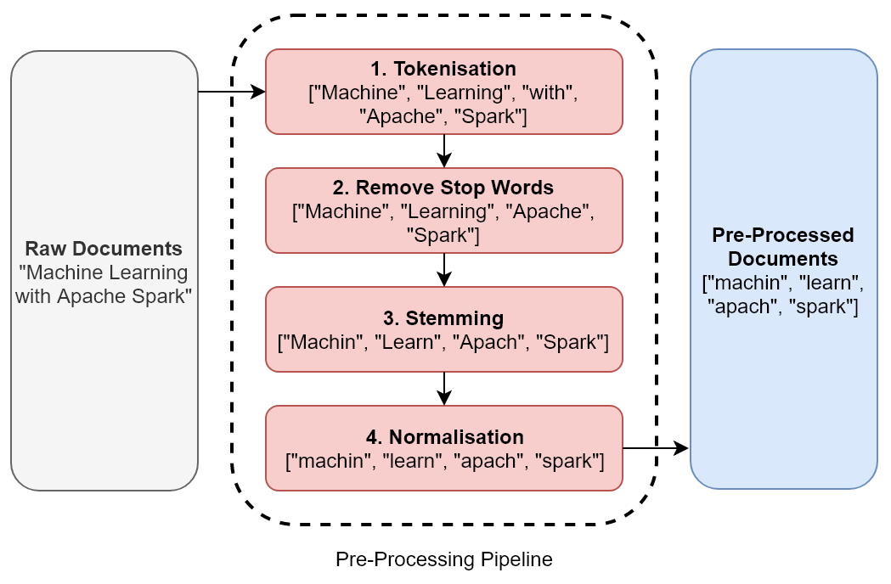
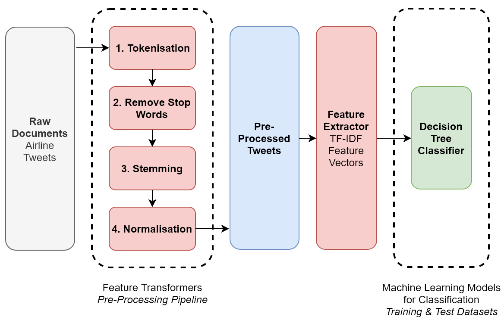

Natural Language Processing Using Apache Spark
==============================================

In this lab, we\'ll study and implement common algorithms that are
used in NLP, which can help us develop machines that are capable of
automatically analyzing and understanding human text and speech in
context. Specifically, we will study and implement the following classes
of computer science algorithms related to NLP:

-   Feature transformers, including the following:
    -   Tokenization
    -   Stemming
    -   Lemmatization
    -   Normalization
-   Feature extractors, including the following :
    -   Bag of words
    -   Term frequency--inverse document frequency

Feature transformers
====================

The fundamental concept behind natural language processing is treating
human text and speech as data---just like the structured and
unstructured numerical and categorical data sources we have encountered
in this course thus far---while preserving its *context*. However, natural
language is notoriously difficult to understand, even for humans, let
alone machines! Not only does natural language consist of hundreds of
different spoken languages, with different writing systems, but it also
poses other challenges, such as different tones, inflections, slang,
abbreviations, metaphors, and sarcasm. Writing systems and communication
platforms in particular provide us with text that may contain spelling
mistakes, unconventional grammar, and sentences that are loosely
structured.

Our first challenge, therefore, is to convert natural language into data
that can be used by a machine while preserving its underlying context.
Furthermore, when applied to machine learning, we also need to convert
natural language into feature vectors in order to train machine learning
models. Well, there are two broad classes of computer science algorithms
that help us with these challenges---**feature extractors**, which help
us extract relevant features from the natural language data, and
**feature transformers**, which help us scale, convert, and/or modify
these features in preparation for subsequent modelling. In this
subsection, we will discuss feature transformers and how they can help
us convert our natural language data into structures that are easier to
process. First, let\'s introduce some common definitions within NLP.


Document
========

In NLP, a document represents a logical container of text. The container
itself can be anything that makes sense within the context of your use
case. For example, one document could refer to a single article, record,
social media posting, or tweet.


Corpus
======

Once you have defined what your document represents, a corpus is defined
as a logical collection of documents. Using the previous examples, a
corpus could represent a collection of articles (for example, a magazine
or blog) or a collection of tweets (for example, tweets with a
particular hashtag).


Preprocessing pipeline
======================

One of the basic tasks involved in NLP is the preprocessing of your
documents in an attempt to standardize the text from different sources
as much as possible. Not only does preprocessing help us to standardize
text, it often reduces the size of the raw text, thereby reducing the
computational complexity of subsequent processes and models. The
following subsections describe common preprocessing techniques that may
constitute a typical ordered preprocessing pipeline.


Tokenization
============

Tokenization refers to the technique of splitting up your text into
individual *tokens* or terms. Formally, a token is defined as a sequence
of characters that represents a subset of the original text. Informally,
tokens are typically just the different words that make up the original
text, and that have been segmented using the whitespace and other
punctuation characters. For example, the sentence \"Machine Learning
with Apache Spark\" may result in a collection of tokens persisted in an
array or list expressed as [\[\"Machine\", \"Learning\", \"with\",
\"Apache\", \"Spark\"\]].


Stop words
==========

Stop words are common words in a given language that are used to
structure a sentence grammatically, but that are not necessarily helpful
in determining its underlying meaning or sentiment. For example, in the
English language, common stop words include *and*, *I*, *there*, *this*,
and *with*. A common preprocessing technique is to therefore remove
these words from the collection of tokens by filtering based on a
language-specific lookup of stop words. Using our previous example, our
filtered list of tokens would be [\[\"Machine\", \"Learning\",
\"Apache\", \"Spark\]].


Stemming
========

Stemming refers to the technique of reducing words to a common base or
*stem*. For example, the words \"connection\", \"connections\",
\"connective\", \"connected\", and \"connecting\" can all be reduced to
their common stem of \"connect\". Stemming is not a perfect process, and
stemming algorithms are liable to make mistakes. However, for the
purposes of reducing the size of a dataset in order to train a machine
learning model, it is a valuable technique. Using our previous example,
our filtered list of stems would be [\[\"Machin\", \"Learn\", \"Apach\",
\"Spark\"\]].


Lemmatization
=============

While stemming quickly reduces words to a base form, it does not take
into account the context, and can therefore not differentiate between
words that have different meanings depending on their position within a
sentence or context. Lemmatization does not crudely reduce words purely
based on a common stem, but instead aims to remove inflectional endings
only in order to return a dictionary form of a word called its *lemma*.
For example, the words *am*, *is*, *being*, and *was* can be reduced to
the lemma *be*, while a stemmer would not be able to infer this
contextual meaning.

While lemmatization can be used to preserve context and meaning to a
better extent, it comes at the cost of additional computational
complexity and processing time. Using our previous example, our filtered
list of lemmas may therefore look like [\[\"Machine\", \"Learning\",
\"Apache\", \"Spark\"\]].


Normalization
=============

Finally, normalization refers to a wide variety of common techniques
that are used to standardize text. Typical normalization techniques
include converting all text to lowercase, removing selected characters,
punctuation and other sequences of characters (typically using regular
expressions), and expanding abbreviations by applying language-specific
dictionaries of common abbreviations and slang terms.

*Figure 6.1* illustrates a typical ordered preprocessing pipeline that
is used to standardize raw written text:





Feature extractors
==================

We have seen how feature transformers allow us to convert, modify, and
standardize our documents using a preprocessing pipeline, resulting in
the conversion of raw text into a collection of tokens. *Feature
extractors* take these tokens and generate feature vectors from them
that may then be used to train machine learning models. Two common
examples of typical feature extractors that are used in NLP are the
**bag of words** and **term frequency--inverse document frequency**
(**TF--IDF**) algorithms.


Bag of words
============

The *bag of words* approach simply counts the number of occurrences of
each unique word in the raw or tokenized text. For example, given the
text \"Machine Learning with Apache Spark, Apache Spark\'s MLlib and
Apache Kafka\", the bag of words approach would provide us with the
following numerical feature vector:

  --------- ---------- ------ -------- ------- ------- -------
  Machine   Learning   with   Apache   Spark   MLlib   Kafka
  1         1          1      3        2       1       1
  --------- ---------- ------ -------- ------- ------- -------

Note that each unique word is a feature or dimension, and that the bag
of words approach is a simple technique that is often employed as a
baseline model with which to compare the performance of more advanced
feature extractors.


Term frequency--inverse document frequency
==========================================

**TF--IDF** aims to improve upon the bag of words approach by providing
an indication of how *important* each word is, taking into account how
often that word appears across the entire corpus.

Let us use *TF(t, d)* to denote the **term frequency**, which is the
number of times that a term, *t*, appears in a document, *d*. Let\'s
also use *DF(t, D)* to denote the **document frequency**, which is the
number of documents in our corpus, *D*, that contain the term *t*. We
can then define the **inverse document frequency** *IDF(t, D)* as
follows:


The IDF provides us with a measure of how important a term is, taking
into account how often that term appears across the entire corpus, where
*\|D\|* is the total number of documents in our corpus, *D*. Terms that
are less common across the corpus have a higher IDF metric. Note,
however, that because of the use of the logarithm, if a term appears in
all documents, its IDF becomes 0---that is, *log(1)*. IDF, therefore,
provides a metric whereby more value is placed on rarer terms that are
important in describing documents.

Finally, to calculate the TF--IDF measure, we simply multiply the term
frequency by the inverse document frequency as follows:


This implies that the TF--IDF measure increases proportionally with the
number of times that a word appears in a document, offset by the
frequency of the word across the entire corpus. This is important
because the term frequency alone may highlight words such as \"a\",
\"I\", and \"the\" that appear very often in a given document but that
do not help us determine the underlying meaning or sentiment of the
text. By employing TF--IDF, we can reduce the impact of these types of
words on our analysis.


Case study -- sentiment analysis
================================

Let\'s now apply these feature transformers and feature extractors to a
very modern real-world use case---sentiment analysis. In sentiment
analysis, the goal is to classify the underlying human sentiment---for
example, whether the writer is positive, neutral, or negative towards
the subject of a text. To many organizations, sentiment analysis is an
important technique that is used to better understand their customers
and target markets. For example, sentiment analysis can be used by
retailers to gauge the public\'s reaction to a particular product, or by
politicians to assess public mood towards a policy or news item. In our
case study, we will examine tweets about airlines in order to predict
whether customers are saying positive or negative things about them. Our
analysis could then be used by airlines in order to improve their
customer service by focusing on those tweets that have been classified
as negative in sentiment.

**Note:**

The corpus of tweets that we will use for our case study has been
downloaded from **Figure Eight**, a company that provides businesses
with high-quality training datasets for real-world machine learning.
Figure Eight also provides a Data for Everyone platform containing open
datasets that are available for download by the public, and which may be
found at <https://www.figure-eight.com/data-for-everyone/>.


If you open [twitter-data/airline-tweets-labelled-corpus.csv] in
any text editor from either the GitHub repository accompanying this course
or from Figure Eight\'s Data for Everyone platform, you will find a
collection of 14,872 tweets about major airlines that were scraped from
Twitter in February 2015. These tweets have also been pre-labelled for
us, with a sentiment classification of positive, negative, or neutral.
The pertinent columns in this dataset are described in the following
table:

  ---------------------------- ---------------- -----------------------------------------------------------
  **Column Name**              **Data Type**    **Description**
  [unit\_id]             [Long]     Unique identifier (primary key)
  [airline\_sentiment]   [String]   Sentiment classification---positive, neutral, or negative
  [airline]              [String]   Name of the airline
  [text]                 [String]   Textual content of the tweet
  ---------------------------- ---------------- -----------------------------------------------------------

Our goal will be to use this corpus of tweets in order to train a
machine learning model to predict whether future tweets about a given
airline are positive or negative in sentiment towards that airline.


NLP pipeline
============

Before we look at the Python code for our case study, let\'s visualize
the end-to-end NLP pipeline that we will construct. Our NLP pipeline for
this case study is illustrated in *Figure 6.2*:





NLP in Apache Spark
===================

Tokenization and stop-word removal feature
transformers (among a wide variety of others), and the TF--IDF feature
extractor is available natively in [MLlib]. Although stemming,
lemmatization, and standardization can be achieved indirectly through
transformations on Spark dataframes in Spark 2.3.2 (via **user-defined
functions** (**UDFs**) and map functions that are applied to RDDs), we
will be using a third-party Spark library called [spark-nlp] to
perform these feature transformations. This third-party library has been
designed to extend the features already available in [MLlib] by
providing an easy-to-use API for distributed NLP annotations on Spark
dataframes at scale.


We then need to tell Spark where it can find the **spark-nlp**
library. We can do this either by setting the
`spark.jars.packages` configuration within our code when instantiating a
Spark context, as follows:

```
conf = SparkConf().set("spark.jars.packages", "com.johnsnowlabs.nlp:spark-nlp_2.12:3.2.1")
.setAppName("Natural Language Processing - Sentiment Analysis")
sc = SparkContext(conf=conf)
```


We are now ready to develop our NLP pipeline in Apache Spark in order to
perform sentiment analysis on our corpus of airline tweets! Let\'s go
through the following steps:

**Note:**

The following subsections describe each of the pertinent cells in the
corresponding Jupyter notebook for this use case, called
[01-natural-language-processing.ipynb]. It can be found in
the GitHub repository accompanying this course.


1.  As well as importing the standard PySpark dependencies, we also need
    to import the relevant [spark-nlp] dependencies, including its
    [Tokenizer], [Stemmer], and [Normalizer] classes,
    as follows:

```
from pyspark import SparkContext, SparkConf
from pyspark.sql import SQLContext
from pyspark.sql.functions import *
from pyspark.sql.types import StructType, StructField
from pyspark.sql.types import LongType, DoubleType, IntegerType, StringType, BooleanType
from pyspark.ml.feature import VectorAssembler
from pyspark.ml.feature import StringIndexer
from pyspark.ml.feature import Tokenizer
from pyspark.ml.feature import StopWordsRemover
from pyspark.ml.feature import HashingTF, IDF
from pyspark.ml import Pipeline, PipelineModel
from pyspark.ml.classification import DecisionTreeClassifier
from pyspark.ml.evaluation import BinaryClassificationEvaluator
from pyspark.mllib.evaluation import MulticlassMetrics

from sparknlp.base import *
from sparknlp.annotator import Tokenizer as NLPTokenizer
from sparknlp.annotator import Stemmer, Normalizer
```


2.  Next, we instantiate a [SparkContext] as usual. Note, however,
    that in this case, we explicitly tell Spark where to find the
    [spark-nlp] library using the [spark-jars] configuration
    parameter. We can then invoke the [getConf()] method on our
    [SparkContext] instance to review the current Spark
    configuration, as follows:

```
conf = SparkConf().set("spark.jars", '/opt/anaconda3/lib/python3.6/site-packages/sparknlp/lib/sparknlp.jar')
.setAppName("Natural Language Processing - Sentiment Analysis")
sc = SparkContext(conf=conf)
sqlContext = SQLContext(sc)
sc.getConf().getAll()
```


3.  After loading our corpus of airline tweets from
    [twitter-data/airline-tweets-labelled-corpus.csv] into a Spark
    dataframe called [airline\_tweets\_df], we generate a new
    label column. The existing dataset already contains a label column
    called [airline\_sentiment], which is either
    [\"positive\"], [\"neutral\"], or [\"negative\"]
    based on a manual pre-classification. Although positive messages are
    naturally always welcome, in reality, the most useful messages are
    usually the negative ones. By automatically identifying and studying
    the negative messages, organizations can focus more efficiently on
    how to improve their products and services based on negative
    feedback. Therefore, we will create a new label column called
    [negative\_sentiment\_label] that is [\"true\"] if the
    underlying sentiment has been classified as [\"negative\"] and
    [\"false\"] otherwise, as shown in the following code:

```
airline_tweets_with_labels_df = airline_tweets_df
.withColumn("negative_sentiment_label",
when(col("airline_sentiment") == "negative", lit("true"))
.otherwise(lit("false")))
.select("unit_id", "text", "negative_sentiment_label")
```


4.  We are now ready to build and apply our preprocessing pipeline to
    our corpus of raw tweets! Here, we demonstrate how to utilize the
    feature transformers native to Spark\'s [MLlib], namely its
    [Tokenizer] and [StopWordsRemover] transformers. First,
    we tokenize the raw textual content of each tweet using the
    [Tokenizer] transformer, resulting in a new column containing
    a list of parsed tokens. We then pass this column containing the
    tokens to the [StopWordsRemover] transformer, which removes
    English language (default) stop words from this list, resulting in a
    new column containing the list of filtered tokens. In the next cell,
    we will demonstrate how to utilize the feature transformers
    available in the [spark-nlp] third-party library. However,
    [spark-nlp] requires a column of a [string] type as its
    initial input, not a list of tokens. Therefore, the final statement
    concatenates the list of filtered tokens back into a
    whitespace-delimited [string] column, as follows:

```
filtered_df = airline_tweets_with_labels_df
.filter("text is not null")
tokenizer = Tokenizer(inputCol="text", outputCol="tokens_1")
tokenized_df = tokenizer.transform(filtered_df)
remover = StopWordsRemover(inputCol="tokens_1",
outputCol="filtered_tokens")
preprocessed_part_1_df = remover.transform(tokenized_df)
preprocessed_part_1_df = preprocessed_part_1_df
.withColumn("concatenated_filtered_tokens",
concat_ws(" ", col("filtered_tokens")))
```


5.  We can now demonstrate how to utilize the feature transformers and
    annotators available in the [spark-nlp] third-party library,
    namely its [DocumentAssember] transformer and
    [Tokenizer], [Stemmer] , and [Normalizer]
    annotators. First, we create annotated documents from our string
    column that are required as the initial input into the
    [spark-nlp] pipelines. Then, we apply the [spark-nlp]
    [Tokenizer] and [Stemmer] annotators to convert our
    filtered list of tokens into a list of *stems*. Finally, we apply
    its [Normalizer] annotator, which converts the stems into
    lowercase by default. All of these stages are defined within a
    *pipeline*, which is an ordered list of
    machine learning and data transformation steps that is executed on a
    Spark dataframe.

We execute our pipeline on our dataset, resulting in a new dataframe
called [preprocessed\_df] from which we keep only the relevant
columns that are required for subsequent analysis and modelling, namely
[unit\_id] (unique record identifier), [text] (original raw
textual content of the tweet), [negative\_sentiment\_label] (our
new label), and [normalised\_stems] (a [spark-nlp] array of
filtered, stemmed, and normalized tokens as a result of our
preprocessing pipeline), as shown in the following code:

```
document_assembler = DocumentAssembler()
.setInputCol("concatenated_filtered_tokens")
tokenizer = NLPTokenizer()
.setInputCols(["document"]).setOutputCol("tokens_2")
stemmer = Stemmer().setInputCols(["tokens_2"])
.setOutputCol("stems")
normalizer = Normalizer()
.setInputCols(["stems"]).setOutputCol("normalised_stems")
pipeline = Pipeline(stages=[document_assembler, tokenizer, stemmer,
normalizer])
pipeline_model = pipeline.fit(preprocessed_part_1_df)
preprocessed_df = pipeline_model.transform(preprocessed_part_1_df)
preprocessed_df.select("unit_id", "text",
"negative_sentiment_label", "normalised_stems")
```


6.  Before we can create feature vectors from our array of stemmed
    tokens using [MLlib]\'s native feature extractors, there is
    one final preprocessing step. The column containing our stemmed
    tokens, namely [normalised\_stems], persists these tokens in a
    specialized [spark-nlp] array structure. We need to convert
    this [spark-nlp] array back into a standard list of tokens so
    that we may apply [MLlib]\'s native TF--IDF algorithms to it.
    We achieve this by first exploding the [spark-nlp] array
    structure, which has the effect of creating a new dataframe
    observation for every element in this array. We then group our Spark
    dataframe by [unit\_id], which is the primary key for each
    unique tweet, before aggregating the stems using the whitespace
    delimiter into a new string column called [tokens]. Finally,
    we apply the [split] function to this column to convert the
    aggregated string into a list of strings or tokens, as shown in the
    following code:

```
exploded_df = preprocessed_df
.withColumn("stems", explode("normalised_stems"))
.withColumn("stems", col("stems").getItem("result"))
.select("unit_id", "negative_sentiment_label", "text", "stems")

aggregated_df = exploded_df.groupBy("unit_id")
.agg(concat_ws(" ", collect_list(col("stems"))),
first("text"), first("negative_sentiment_label"))
.toDF("unit_id", "tokens", "text", "negative_sentiment_label")
.withColumn("tokens", split(col("tokens"), " ")
.cast("array<string>"))
```


7.  We are now ready to generate feature vectors from our list of
    filtered, stemmed, and normalized tokens! As discussed, we will be
    using the TF--IDF feature extractor to generate feature vectors
    rather than the basic bag of words approach. The TF--IDF feature
    extractor is native to [MLlib] and comes in two parts. First,
    we generate the **term frequency** (**TF**) feature vectors by
    passing our list of tokens into [MLlib]\'s [HashingTF]
    transformer. We then *fit* [MLlib]\'s **inverse document
    frequency** (**IDF**) estimator to our dataframe containing the term
    frequency feature vectors, as shown in the following code. The
    result is a new Spark dataframe with our TF--IDF feature vectors
    contained in a column called [features]:

```
hashingTF = HashingTF(inputCol="tokens", outputCol="raw_features",
numFeatures=280)
features_df = hashingTF.transform(aggregated_df)
idf = IDF(inputCol="raw_features", outputCol="features")
idf_model = idf.fit(features_df)
scaled_features_df = idf_model.transform(features_df)
```


8.  Since our label column is
    categorical in nature, we need to apply [MLlib]\'s
    [StringIndexer] to it in order to identify and index all
    possible classifications. The result is a new Spark dataframe with
    an indexed label column called [\"label\"], which is 0.0 if
    [negative\_sentiment\_label] is [true], and 1.0 if
    [negative\_sentiment\_label] is [false], as shown in the
    following code:

```
indexer = StringIndexer(inputCol = "negative_sentiment_label",
outputCol = "label").fit(scaled_features_df)
scaled_features_indexed_label_df = indexer.transform(scaled_features_df)
```


9.  We are now ready to create training and test dataframes in order to
    train and evaluate subsequent machine learning models. We achieve
    this as normal, using the [randomSplit] method (as shown in
    the following code), but in this case, 90% of all observations will
    go into our training dataframe, with the remaining 10% going into
    our test dataframe:

```
train_df, test_df = scaled_features_indexed_label_df
.randomSplit([0.9, 0.1], seed=12345)
```


10. In this example, we will be training a supervised decision tree
    classifier in order to help us
    classify whether a given tweet is positive or negative in sentiment.
    We fit [MLlib]\'s
    [DecisionTreeClassifier] estimator to our training dataframe
    in order to train our classification tree, as shown in the following
    code:

```
decision_tree = DecisionTreeClassifier(featuresCol = 'features',
labelCol = 'label')
decision_tree_model = decision_tree.fit(train_df)
```


11. Now that we have a trained classification tree, we can apply it to
    our test dataframe in order to classify test tweets. We apply our trained
    classification tree to the test dataframe using the
    [transform()] method (as shown in the following code), and
    afterwards study its predicted classifications:

```
test_decision_tree_predictions_df = decision_tree_model
.transform(test_df)
print("TEST DATASET PREDICTIONS AGAINST ACTUAL LABEL: ")
test_decision_tree_predictions_df.select("prediction", "label",
"text").show(10, False)
```


For example, our decision tree classifier has predicted that the
following tweets from our test dataframe are negative in sentiment:

-   \"I need you\...to be a better airline. \^LOL\"
-   \"if you can\'t guarantee parents will sit with their children,
    don\'t sell tickets with that promise\"
-   \"resolved and im sick and tired of waiting on you. I want my refund
    and I\'d like to speak to someone about it.\"
-   \"I would have loved to respond to your website until I saw the
    really long form. In business the new seats are bad\"

A human would also probably classify these tweets as negative in
sentiment! But more importantly, airlines can use this model and the
tweets that it identifies to focus on areas for improvement. Based on
this sample of tweets, such areas would include website usability,
ticket marketing, and the time taken to process refunds.

12. Finally, in order to quantify the accuracy of our trained
    classification tree, let\'s compute its confusion matrix on the test
    data using the following code:

```
predictions_and_label = test_decision_tree_predictions_df
.select("prediction", "label").rdd
metrics = MulticlassMetrics(predictions_and_label)
print("N = %g" % test_decision_tree_predictions_df.count())
print(metrics.confusionMatrix())
```


The resulting confusion matrix looks as follows:

+-----------------------+-----------------------+-----------------------+
|                       | **Predict *y* = 0     | **Predict *y* = 1     |
|                       | (Negative)**          | (Non-Negative)**      |
+-----------------------+-----------------------+-----------------------+
| **Actual *y* = 0**    | 725                   | 209                   |
|                       |                       |                       |
| **(Negative)**        |                       |                       |
+-----------------------+-----------------------+-----------------------+
| **Actual *y* = 1**    | 244                   | 325                   |
|                       |                       |                       |
| **(Non-Negative)**    |                       |                       |
+-----------------------+-----------------------+-----------------------+

We can interpret this confusion matrix as follows---out of a total of
1,503 test tweets, our model exhibits the following properties:

-   Correctly classifies 725 tweets as negative in sentiment that are
    actually negative
-   Correctly classifies 325 tweets as non-negative in sentiment that
    are actually non-negative
-   Incorrectly classifies 209 tweets as non-negative in sentiment that
    are actually negative
-   Incorrectly classifies 244 tweets as negative in sentiment that are
    actually non-negative
-   Overall accuracy = 70%
-   Overall error rate = 30%
-   Sensitivity = 57%
-   Specificity = 78%

So, based on a default threshold value of 0.5 (which in this case study
is fine because we have no preference over what type of error is
better), our decision tree classifier has an overall accuracy rate of
70%, which is quite good!

13. For the sake of completeness, let\'s train a decision tree
    classifier, but using the feature vectors that are derived from the
    bag of words algorithm. Note that we already computed these feature
    vectors when we applied the [HashingTF] transformer to our
    preprocessed corpus to calculate the term frequency (TF) feature
    vectors. Therefore, we can just repeat our machine learning
    pipeline, but based only on the output of the [HashingTF]
    transformer instead, as follows:

```
# Create Training and Test DataFrames based on the Bag of Words Feature Vectors
bow_indexer = StringIndexer(inputCol = "negative_sentiment_label",
outputCol = "label").fit(features_df)
bow_features_indexed_label_df = bow_indexer.transform(features_df)
.withColumnRenamed("raw_features", "features")
bow_train_df, bow_test_df = bow_features_indexed_label_df
.randomSplit([0.9, 0.1], seed=12345)

# Train a Decision Tree Classifier using the Bag of Words Feature Vectors
bow_decision_tree = DecisionTreeClassifier(featuresCol =
'features', labelCol = 'label')
bow_decision_tree_model = bow_decision_tree.fit(bow_train_df)

# Apply the Bag of Words Decision Tree Classifier to the Test DataFrame and generate the Confusion Matrix
bow_test_decision_tree_predictions_df = bow_decision_tree_model
.transform(bow_test_df)
bow_predictions_and_label = bow_test_decision_tree_predictions_df
.select("prediction", "label").rdd
bow_metrics = MulticlassMetrics(bow_predictions_and_label)
print("N = %g" % bow_test_decision_tree_predictions_df.count())
print(bow_metrics.confusionMatrix())
```


Note that the resulting confusion matrix is exactly the same as when we
applied our decision tree classifier that had been trained on the
*scaled* feature vectors using the [IDF] estimator (given the same
random split seed and size of the training dataframe). This is because
of the fact that our corpus of tweets is relatively small at 14,872
documents, and therefore the effect of scaling the term frequency
([TF]) feature vectors based on the frequency across the corpus
will have a negligible impact on the predictive quality of this specific
model.

14. A very useful feature provided by [MLlib] is the ability to
    save trained machine learning models to disk for later use. We can
    take advantage of this feature by saving our trained decision tree
    classifier to the local disk of our single-node development
    environment:

```
bow_decision_tree_model.save('<Target filesystem path to save MLlib Model>')
```


**Note:**

Our trained decision tree classifier for performing sentiment analysis
of airline tweets has also been pushed to the GitHub repository
accompanying this course, and may be found in
[lab06/models/airline-sentiment-analysis-decision-tree-classifier].

Summary
=======

In this lab, we have studied, implemented, and evaluated common
algorithms that are used in natural language processing. We have
preprocessed a corpus of documents using feature transformers and
generated feature vectors from the resulting processed corpus using
feature extractors. We have also applied these common NLP algorithms to
machine learning. We trained and tested a sentiment analysis model that
we used to predict the underlying sentiment of tweets so that
organizations may improve their product and service offerings.