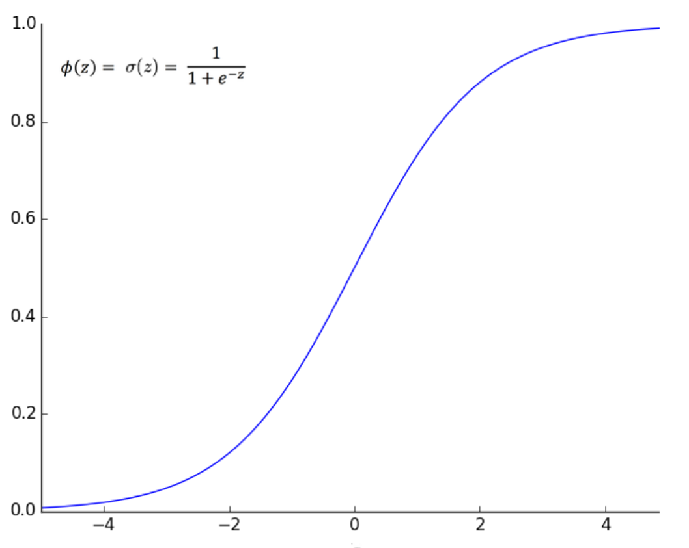
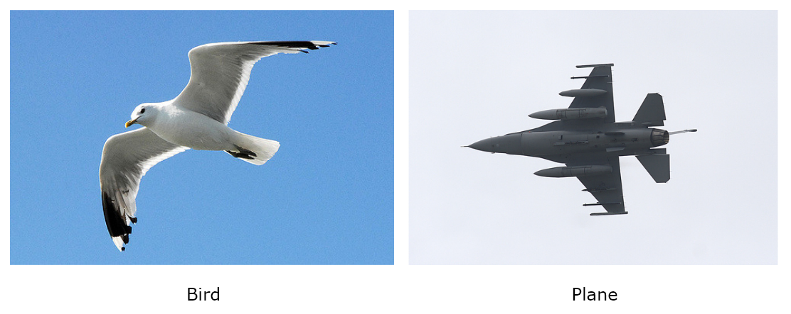
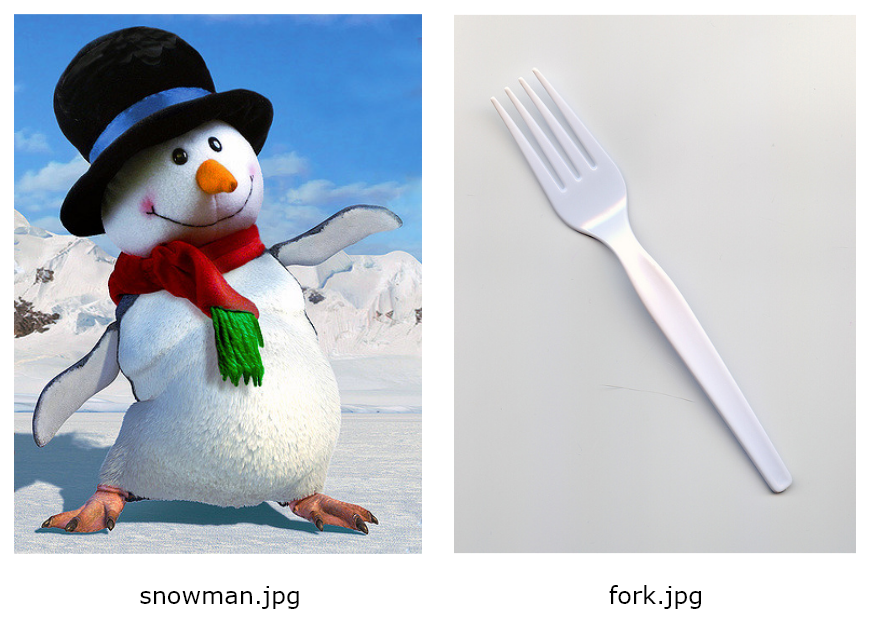

Deep Learning Using Apache Spark
================================

In this lab, we will go on a hands-on exploration of the exciting
and cutting-edge world of deep learning! We will use third-party deep
learning libraries in conjunction with Apache Spark\'s [MLlib] to
perform accurate **optical character recognition** (**OCR**) and
automatically recognize and classify images via the following types of
artificial neural networks and machine learning algorithms:

-   Multilayer perceptrons
-   Convolutional neural networks
-   Transfer learning

Artificial neural networks
==========================

An **artificial neural network** (**ANN**) is a connected group of artificial neurons that is
aggregated into three types of linked neural layers---the input layer,
zero or more hidden layers, and the output layer. A **monolayer** ANN
consists of just *one* layer of links between the input nodes and output
nodes, while **multilayer** ANNs are characterized by the segmentation
of artificial neurons across multiple linked layers.

An ANN where signals are propagated in one direction only---that is, the
signals are received by the input layer and forwarded to the next layer
for processing---are called **feedforward** networks. ANNs where a
signal may be propagated back to artificial neurons or neural layers
that have already processed that signal are called **feedback**
networks.

**Backwards propagation** is a supervised learning process by which
multilayer ANNs can learn---that is, derive an optimal set of weight
coefficients. First, all weights are initially set as random and the
output from the network is calculated. If the predicted output does not
match the desired output, the total error at the output nodes is
propagated back through the entire network in an effort to readjust all
weights in the network so that the error is reduced in the output layer.
In other words, backwards propagation seeks to minimize the difference
between the actual output and the desired output via an iterative weight
adjustment process.


Multilayer perceptrons
======================

A **single-layer perceptron** (**SLP**) is a basic type of ANN that
consists of just two layers of nodes---an input layer containing input
nodes and an output layer containing output nodes. A **multilayer
perceptron** (**MLP**), however, introduces one or more hidden layers
between the input and output layers, giving them the ability to learn
nonlinear functions, as illustrated in *Figure 7.1*:


MLP classifier
==============

Apache Spark\'s machine learning library, [MLlib], provides an
out-of-the-box **multilayer perceptron classifier** (**MLPC**) that can
be applied to classification problems where we are required to predict
from *k* possible classes.


Input layer
===========

In [MLlib]\'s MLPC, the nodes in the input layer represent the
input data. Let\'s denote this input data as a vector, *X*, with *m*
features, as follows:


Hidden layers
=============

The input data is then passed to the hidden layers. For the sake of
simplicity, let\'s say that we have only one hidden layer, *h^1^*, and
that within this one hidden layer, we have *n* neurons, as follows:


The net input, *z*, into the activation function for each of these
hidden neurons is then the input data set vector, *X*, multiplied by a
weight set vector, *W*^n^ (corresponding to the weight sets assigned to
the *n* neurons in the hidden layer), where each weight set vector,
*W*^n^, contains *m* weights (corresponding to the *m* features in our
input data set vector *X*), as follows:


In linear algebra, the product of multiplying one vector by another is
called the **dot product**, and it outputs a scalar (that is, a number)
represented by *z*, as follows:


The **bias** is a *stand-alone* constant analogous to the intercept term in a
regression model, and may be added to non-output layers in feedforward
neural networks. It is called standalone because bias nodes are not
connected to preceding layers. By introducing a constant, we allow for
the output of an activation function to be shifted left or right by that
constant, thereby increasing the flexibility of an ANN to learn patterns
more effectively by providing the ability to shift decision boundaries
based on the data.

Note that in a single hidden layer containing *n* hidden neurons, *n*
dot product calculations will be computed:


In [MLlib]\'s MLPC, the hidden neurons use the **sigmoid**
activation function, as shown in the following formula:


Tthe sigmoid (or
logistic) function is bounded between 0 and 1, and is smoothly defined
for all real input values. By using the sigmoid activation function, the
nodes in the hidden layers actually correspond to a logistic regression
model. If we study the sigmoid curve, as shown in *Figure 7.3*, we can
state that if the net input, *z*, is a large positive number, then the
output of the sigmoid function, and hence the activation function for
our hidden neurons, will be close to 1. Conversely, if the net input, z,
is a negative number with a large absolute value, then the output of the
sigmoid function will be close to 0:




In all cases, each hidden neuron will take the net input, *z*, which is
the dot product of the input data, *X*, and the weight set, *W^n^*, plus
a bias, and apply that to the sigmoid function, finally outputting a
number between 0 and 1. After all hidden neurons have computed the
result of their activation function, we will then have *n* hidden
outputs from our hidden layer *h^1^*, as follows:


Output layer
============

The hidden layer outputs are then used as inputs to calculate the final
outputs in the output layer. In our case, we only have a single hidden
layer, *h^1^*, with outputs
.
These then become *n* inputs into the output layer.

The net input into the activation function for the output layer neurons
is then these *n* inputs computed by the hidden layer and multiplied by
a weight set vector, *W^h^*, where each weight set vector, *W^h^*,
contains *n* weights (corresponding to the *n* hidden layer inputs). For
the sake of simplicity, let\'s assume that we only have one output
neuron in our output layer. The weight set vector for this neuron is
therefore the following:


Again, since we are multiplying vectors together, we use the dot product
calculation, which will compute the following scalar representing our
net input, *z*:


In [MLlib]\'s MLPC, the output neurons use the softmax function as
the activation function, which extends logistic regression by predicting
*k* classes instead of a standard binary classification. This function
takes the following form:


Therefore, the number of nodes in the output layer corresponds to the
number of possible classes that you wish to predict from. For example,
if your use case has five possible classes, then you would train an MLP
with five nodes in the output layer. The final output from the
activation function is therefore the prediction that the output neuron
in question makes, as illustrated in *Figure 7.4*:


Note that *Figure 7.4* illustrates the initial **forward propagation**
of the MLP, whereby input data is propagated to the hidden layer and the
output from the hidden layer is propagated to the output layer where the
final output is computed. [MLlib]\'s MLPC thereafter uses
**backwards propagation** to train the neural network and learn the
model where the difference between the actual output and the desired
output is minimized via an iterative weight adjustment process. MLPC
achieves this by seeking to minimize a **loss function**. A loss
function calculates a measure of the price paid for inaccurate
predictions regarding classification problems. The specific loss
function that MLPC employs is the **logistic loss function**, where
predictions made with a high value of confidence are penalized less. To
learn more about loss functions, please visit
<https://en.wikipedia.org/wiki/Loss_functions_for_classification>.


Case study 1 -- OCR
===================

A great real-world use case to demonstrate the power of MLPs is that of
OCR. In OCR, the challenge is to recognize human writing, classifying
each handwritten symbol as a letter. In the case of the English
alphabet, there are 26 letters. Therefore, when applied to the English
language, OCR is actually a classification problem that has *k* = 26
possible classes!

**Note:**

The dataset that we will be using has been derived from the **University
of California\'s** (**UCI**) Machine Learning Repository, which is found
at <https://archive.ics.uci.edu/ml/index.php>. The specific letter
recognition dataset that we will use, available from both the GitHub
repository accompanying this course and from
<https://archive.ics.uci.edu/ml/datasets/letter+recognition>, was
created by David J. Slate at Odesta Corporation; 1890 Maple Ave; Suite
115; Evanston, IL 60201, and was used in the paper *Letter Recognition
Using Holland-style Adaptive Classifiers* by P. W. Frey and D. J. Slate
(from Machine Learning Vol 6 \#2 March 91).


*Figure 7.5* provides an example illustration of this dataset rendered
visually. We will train an MLP classifier to recognize and classify each
of the symbols, such as those shown in *Figure 7.5*, as a letter of the
English alphabet:


Input data
==========

Before we delve further into the schema of our specific dataset, let\'s
first understand how a MLP will actually help us with this problem.
Firstly, when studying image
segmentation, images can be broken down into a matrix of either
pixel-intensity values (for grayscale images) or pixel RGB values (for
images with color). A single vector containing (*m* x *n*) numerical
elements can then be generated, corresponding to the pixel height (*m*)
and width (*n*) of the image.


Training architecture
=====================

Now, imagine that we want to train an MLP using our entire letter
recognition dataset, as illustrated in *Figure 7.6*:


In our MLP, we have *p* (= *m* x *n*) neurons in our input layer that
represent the *p* pixel-intensity values from our image. A single hidden
layer has *n* neurons, and the output layer has 26 neurons that
represent the 26 possible classes or letters in the English alphabet.
When training this neural network, since we do not know initially what
weights should be assigned to each layer, we initialize the weights
randomly and perform a first iteration of forward propagation. We then
iteratively employ backwards propagation to train the neural network,
resulting in a set of weights that have been optimized so that the
predictions/classifications made by the output layer are as accurate as
possible.

Detecting patterns in the hidden layer
======================================

The job of the neurons in the hidden layer is to learn to detect
patterns within the input data. In our case, the neurons in the hidden
layer(s) will detect the presence of certain substructures that
constitute a wider symbol. This is illustrated in *Figure 7.7*, where we
assume that the first three neurons in the hidden layer learn to
recognize forward slash, back slash and horizontal line type patterns
respectively:


Classifying in the output layer
===============================

In our neural network, the first neuron in the output layer is trained
to decide whether a given symbol is the uppercase English letter *A*.
Assuming that the first three neurons in the hidden layer fire, we would
expect the first neuron in the output layer to fire and the remaining 25
neurons not to fire. Our MLP would then classify this symbol as the
letter *A*!


MLPs in Apache Spark
====================

Let\'s return to our dataset and train an MLP in Apache Spark to
recognize and classify letters from the English alphabet. If you open
[ocr-data/letter-recognition.data] in any text editor, from either
the GitHub repository accompanying this course or from UCI\'s machine
learning repository, you will find 20,000 rows of data, described by the
following schema:

  ----------------- ----------------- ------------------------------------------------
  **Column name**   **Data type**     **Description**
  [lettr]     [String]    English letter (one of 26 values, from A to Z)
  [x-box]     [Integer]   Horizontal position of box
  [y-box]     [Integer]   Vertical position of box
  [width]     [Integer]   Width of box
  [high]      [Integer]   Height of box
  [onpix]     [Integer]   Total number of on pixels
  [x-bar]     [Integer]   Mean *x* of on pixels in the box
  [y-bar]     [Integer]   Mean *y* of on pixels in the box
  [x2bar]     [Integer]   Mean *x* variance
  [y2bar]     [Integer]   Mean *y* variance
  [xybar]     [Integer]   Mean *x y* correlation
  [x2ybr]     [Integer]   Mean of *x* \* *x* \* *y*
  [xy2br]     [Integer]   Mean of *x* \* *y* \* *y*
  [x-ege]     [Integer]   Mean edge count left to right
  [xegvy]     [Integer]   Correlation of [x-ege] with *y*
  [y-ege]     [Integer]   Mean edge count, bottom to top
  [yegvx]     [Integer]   Correlation of [y-ege] with *x*
  ----------------- ----------------- ------------------------------------------------

This dataset describes 16 numerical attributes representing statistical
features of the pixel distribution based on scanned character images,
such as those illustrated in *Figure 7.5*. These attributes have been
standardized and scaled linearly to a range of integer values from 0 to 15. 
For each row, a label column called [lettr] denotes the letter
of the English alphabet that it represents, where no feature vector maps
to more than one class---that is, each feature vector maps to only one
letter in the English alphabet.


Let\'s now use this dataset to train an MLP classifier to recognize
symbols and classify them as letters from the English alphabet:

**Note:**

The following subsections describe each of the pertinent cells in the
corresponding Jupyter notebook for this use case, called
[chp07-01-multilayer-perceptron-classifier.ipynb]. This notebook
can be found in the GitHub repository accompanying this course.


1.  First, we import the prerequisite PySpark libraries as normal,
    including [MLlib]\'s [MultilayerPerceptronClassifier]
    classifier and [MulticlassClassificationEvaluator] evaluator
    respectively, as shown in the following code:

```
import findspark
findspark.init()
from pyspark import SparkContext, SparkConf
from pyspark.sql import SQLContext
from pyspark.ml.feature import VectorAssembler
from pyspark.ml.classification import MultilayerPerceptronClassifier
from pyspark.ml.evaluation import MulticlassClassificationEvaluator
```


2.  After instantiating a Spark context, we are now ready to ingest our
    dataset into a Spark dataframe. Note that in our case, we have
    preprocessed the dataset into CSV format, where we have converted
    the [lettr] column from a [string] datatype to a
    [numeric] datatype representing one of the 26 characters in
    the English alphabet. This preprocessed CSV file is available in the
    GitHub repository accompanying this course. Once we have ingested this
    CSV file into a Spark dataframe, we then generate feature vectors
    using [VectorAssembler], comprising the 16 feature columns, as
    usual. The resulting Spark dataframe, called [vectorised\_df],
    therefore contains two columns---the numeric [label] column,
    representing one of the 26 characters in the English alphabet, and
    the [features] column, containing our feature vectors:

```
letter_recognition_df = sqlContext.read
.format('com.databricks.spark.csv')
.options(header = 'true', inferschema = 'true')
.load('letter-recognition.csv')
feature_columns = ['x-box','y-box','width','high','onpix','x-bar',
'y-bar','x2bar','y2bar','xybar','x2ybr','xy2br','x-ege','xegvy',
'y-ege','yegvx']
vector_assembler = VectorAssembler(inputCols = feature_columns,
outputCol = 'features')
vectorised_df = vector_assembler.transform(letter_recognition_df)
.withColumnRenamed('lettr', 'label').select('label', 'features')
```


3.  Next, we split our dataset into training and test datasets with a
    ratio of 75% to 25% respectively, using the following code:

```
train_df, test_df = vectorised_df
.randomSplit([0.75, 0.25], seed=12345)
```


4.  We are now ready to train our MLP classifier. First, we must define
    the size of the respective layers of our neural network. We do this
    by defining a Python list with the following elements:\
    \
    -   The first element defines the size of the input layer. In our
        case, we have 16 features in our dataset, and so we set this
        element to [16].
    -   The next elements define the sizes of the intermediate hidden
        layers. We shall define two hidden layers of sizes [8] and
        [4] respectively.
    -   The final element defines the size of the output layer. In our
        case, we have 26 possible classes representing the 26 letters of
        the English alphabet, and so we set this element to [26]:

```
layers = [16, 8, 4, 26]
```


5.  Now that we have defined the architecture of our neural network, we
    can train an MLP using [MLlib]\'s
    [MultilayerPerceptronClassifier] classifier and fit it to the
    training dataset, as shown in the following code. Remember that
    [MLlib]\'s [MultilayerPerceptronClassifier] classifier
    uses the sigmoid activation function for hidden neurons and the
    softmax activation function for output neurons:

```
multilayer_perceptron_classifier = MultilayerPerceptronClassifier(
maxIter = 100, layers = layers, blockSize = 128, seed = 1234)
multilayer_perceptron_classifier_model =
multilayer_perceptron_classifier.fit(train_df)
```


6.  We can now apply our trained MLP classifier to the test dataset in
    order to predict which of the 26 letters of the English alphabet the
    16 numerical pixel-related features represent, as follows:

```
test_predictions_df = multilayer_perceptron_classifier_model
.transform(test_df)
print("TEST DATASET PREDICTIONS AGAINST ACTUAL LABEL: ")
test_predictions_df.select("label", "features", "probability",
"prediction").show()

TEST DATASET PREDICTIONS AGAINST ACTUAL LABEL:
+-----+--------------------+--------------------+----------+
|label| features| probability|prediction|
+-----+--------------------+--------------------+----------+
| 0|[1.0,0.0,2.0,0.0,...|[0.62605849526384...| 0.0|
| 0|[1.0,0.0,2.0,0.0,...|[0.62875656935176...| 0.0|
| 0|[1.0,0.0,2.0,0.0,...|[0.62875656935176...| 0.0|
+-----+--------------------+--------------------+----------+
```


7.  Next, we compute the accuracy of our trained MLP classifier on the
    test dataset using the following code. In our case, it performs very
    poorly, with an accuracy rate of only 34%. We can conclude from this
    that an MLP with two hidden layers of sizes 8 and 4 respectively
    performs very poorly in recognizing and classifying letters from
    scanned images in the case of our dataset:

```
prediction_and_labels = test_predictions_df
.select("prediction", "label")
accuracy_evaluator = MulticlassClassificationEvaluator(
metricName = "accuracy")
precision_evaluator = MulticlassClassificationEvaluator(
metricName = "weightedPrecision")
recall_evaluator = MulticlassClassificationEvaluator(
metricName = "weightedRecall")
print("Accuracy on Test Dataset = %g" % accuracy_evaluator
.evaluate(prediction_and_labels))
print("Precision on Test Dataset = %g" % precision_evaluator
.evaluate(prediction_and_labels))
print("Recall on Test Dataset = %g" % recall_evaluator
.evaluate(prediction_and_labels))

Accuracy on Test Dataset = 0.339641
Precision on Test Dataset = 0.313333
Recall on Test Dataset = 0.339641
```


8.  How can we increase the accuracy of our neural classifier? To answer
    this question, we must revisit our definition of what the hidden
    layers do. Remember that the job of the neurons in the hidden layers
    is to learn to detect patterns within the input data. Therefore,
    defining more hidden neurons in our neural architecture should
    increase the ability of our neural network to detect more patterns
    at greater resolutions. To test this hypothesis, we shall increase
    the number of neurons in our two hidden layers to 16 and 12
    respectively, as shown in the following code. Then, we retrain our
    MLP classifier and reapply it to the test dataset. This results in a
    far better performing model, with an accuracy rate of 72%:

```
new_layers = [16, 16, 12, 26]
new_multilayer_perceptron_classifier =
MultilayerPerceptronClassifier(maxIter = 400,
layers = new_layers, blockSize = 128, seed = 1234)
new_multilayer_perceptron_classifier_model =
new_multilayer_perceptron_classifier.fit(train_df)
new_test_predictions_df =
new_multilayer_perceptron_classifier_model.transform(test_df)
print("New Accuracy on Test Dataset = %g" % accuracy_evaluator
.evaluate(new_test_predictions_df
.select("prediction", "label")))
```


Convolutional neural networks
=============================

We have seen how MLPs, which receive a single input vector that is then
transformed through one or more intermediate hidden layers, can be used
to recognize and classify small images such as letters and digits in
OCR. However, one limitation of MLPs is their ability to scale with
larger images, taking into account not just individual pixel intensity
or RGB values, but the height, width, and depth of the image itself.

**Convolutional neural networks** (**CNNs**) assume that the input data
is of a grid-like topology, and so they are predominantly used to
recognize and classify objects in images since an image can be
represented as a grid of pixels.


End-to-end neural architecture
==============================

The end-to-end architecture of a convolutional neural network is
illustrated in *Figure* *7.8*:


In the following subsections, we will describe each of the layers and
transformations that constitute a CNN.


Input layer
===========

Given that CNNs are predominantly used to classify images, the input
data into CNNs consists of image matrices of the dimensions *h* (height
in pixels), *w* (width in pixels) and *d* (depth). In the case of RGB
images, the depth would be three corresponding, to the three color
channels, **red**, **green**, and **blue** (**RGB**). This is
illustrated in *Figure 7.9*:


Convolution layers
==================

The next transformations that occur in the CNN are processed in
*convolution* layers. The purpose of the convolution layers is to detect
features in the image, which is achieved through the use of **filters**
(also called kernels). Imagine taking a magnifying glass and looking at
an image, starting at the top-left of the image. As we move the
magnifying glass from left to right and top to bottom, we detect the
different features in each of the locations that our magnifying glass
moves over. At a high level, this is the job of the convolution layers,
where the magnifying glass represents the filter or kernel and the size
of each step that the filter takes, normally pixel by pixel, is referred
to as the **stride** size. The output of a convolution layer is called a
**feature map**.

Let\'s look at an example to understand the processes undertaken within
a convolution layer better. Imagine that we have an image that is 3
pixels (height) by 3 pixels (width). For the sake of simplicity, we will
overlook the third dimension representing the image depth in our
example, but note that real-world convolutions are computed in three
dimensions for RGB images. Next, imagine that our filter is a matrix of
2 pixels (height) by 2 pixels (width) and that our stride size is 1
pixel.

These respective matrices are illustrated in *Figure 7.10*:


First, we place our filter matrix at the top-left corner of our image
matrix and perform a **matrix multiplication** of the two at that
location. We then move the filter matrix to the right by our stride
size---1 pixel---and perform a matrix multiplication at that location.
We continue this process until the filter matrix has traversed the
entire image matrix. The resulting feature map matrix is illustrated in
*Figure 7.11*:


Note that the feature map is smaller in its dimensions than the input
matrix of the convolution layer. To ensure that the dimensions of the
output match the dimensions of the input, a layer of zero-value pixels
is added in a process called **padding**. Also note that the filter must
have the same number of channels as the input image---so in the case of
RGB images, the filter must also have three channels.

So, how do convolutions help a neural network to learn? To answer this
question, we must revisit the concept of filters. Filters themselves are
matrices of *weights* that are trained to detect specific patterns
within an image, and different filters can be used to detect different
patterns, such as edges and other features. For example, if we use a
filter that has been pretrained to detect simple edges, as we pass this
filter over an image, the convolution computation will output a
high-valued real number (as a result of matrix multiplication and
summation) if an edge is present and a low-valued real number if an edge
is not present.

As the filter finishes traversing the entire image, the output is a
feature map matrix that represents the convolutions of this filter over
all parts of the image. By using different filters during different
convolutions per layer, we get different feature maps, which form the
output of the convolution layer.


Rectified linear units
======================

As with other neural networks, an activation function defines the output
of a node and is used so that our neural network can learn nonlinear
functions. Note that our input data (the RGB pixels making up the
images) is itself nonlinear, so we need a nonlinear activation function.
**Rectified linear units** (**ReLUs**) are commonly used in CNNs, and
are defined as follows:


In other words, the ReLU function returns 0 for every negative value in
its input data, and returns the value itself for every positive value in
its input data. This is shown in *Figure 7.12*:


The ReLU function can be plotted as shown in *Figure 7.13*:


Pooling layers
==============

The next transformations that occur in the CNN are processed in
*pooling* layers. The goal of the pooling layers is to reduce the
dimensionality of the feature maps output by the convolution layers (but
not their depth) while preserving the spatial variance of the original
input data. In other words, the size of the data is reduced in order to
reduce computational complexity, memory requirements, and training times
while overcoming over fitting so that patterns detected during training
can be detected in test data even if their appearance varies. There are
various pooling algorithms available, given a specified window size,
including the following:

-   **Max pooling**: Takes the maximum value in each window
-   **Average pooling**: Takes the average value across each window
-   **Sum pooling**: Takes the sum of values in each window

Following image shows the effect of performing max pooling on a 4 x 4
feature map using a 2 x 2 window size:


Fully connected layer
=====================

After the 3-D input data has been transformed through a series of
convolution and pooling layers, a fully connected layer flattens the
feature maps output by the last convolution and pooling layer into a
long 1-D feature vector, which is then used as the input data for a
regular ANN in which all of the neurons in each layer are connected to
all of the neurons in the previous layer.


Output layer
============

The output neurons in this ANN then use an activation function such as
the softmax function (as seen in the MLP classifier) to classify the
outputs and thereby recognize and classify the objects contained in the
input image data!


Case study 2 -- image recognition
=================================

In this case study, we will use a pretrained CNN to recognize and
classify objects in images that it has never encountered before.


InceptionV3 via TensorFlow
==========================

The pretrained CNN that we will use is called **Inception-v3**. This
deep CNN has been trained on the **ImageNet** image database (an
academic benchmark for computer vision algorithms containing a vast
library of labelled images covering a wide range of nouns) and can
classify entire images into 1,000 classes found in everyday life, such
as \"pizza\", \"plastic bag\", \"red wine\", \"desk\", \"orange\", and
\"basketball\", to name just a few.

The Inception-v3 deep CNN was developed and trained by **TensorFlow**
^TM^, an open source machine learning framework and software library for
high-performance numerical computation originally developed within
Google\'s AI organization.

To learn more about TensorFlow, Inception-v3, and ImageNet, please visit
the following links:

-   **ImageNet:** <http://www.image-net.org/>
-   **TensorFlow:** <https://www.tensorflow.org/>
-   **Inception-v3:**
    <https://www.tensorflow.org/tutorials/images/image_recognition>


Deep learning pipelines for Apache Spark
========================================

In this case study, we will access the Inception-v3 TensorFlow deep CNN
via a third-party Spark package called [sparkdl]. This Spark
package has been developed by Databricks, a company formed by the
original creators of Apache Spark, and provides high-level APIs for
scalable deep learning within Apache Spark.

To learn more about Databricks and [sparkdl], please visit the
following links:


-   **Databricks**: <https://databricks.com/>
-   **sparkdl**: <https://github.com/databricks/spark-deep-learning>


Image library
=============

The images that we will use to test the pretrained Inception-v3 deep CNN
have been selected from the **Open Images v4** dataset, a collection of
over 9 million images that have been released under the Creative Common
Attribution license, and which may be found at
<https://storage.googleapis.com/openimages/web/index.html>.

In the GitHub repository accompanying this course, you can find 30 images
of birds ([image-recognition-data/birds]) and 30 images of planes
([image-recognition-data/planes]) respectively. *Figure 7.15*
shows a couple of examples of the images that you might find in these
test datasets:





Our goal in this case study will be to apply the pretrained Inception-v3
deep CNN to these test images and quantify the accuracy of a trained
classifier model when it comes to distinguishing between images of birds
and planes within a single test dataset.


PySpark image recognition application
=====================================

Note that for the purposes of this case study, we will not be using
Jupyter notebooks for development but rather standard Python code files
with the [.py] file extension. This case study provides a first
glimpse into how a production-grade pipeline should be developed and
executed; rather than instantiating a [SparkContext] explicitly
within our code, we will instead submit our code and all its
dependencies to [spark-submit] (including any third-party Spark
packages, such as [sparkdl]) via the Linux command line.

Let\'s now take a look at how we can use the Inception-v3 deep CNN via
PySpark to classify test images. In our Python-based image-recognition
application, we perform the following steps (numbered to correspond to
the numbered comments in our Python code file):

**Note:**

The following Python code file, called
[chp07-02-convolutional-neural-network-transfer-learning.py], can
be found in the GitHub repository accompanying this course.


1.  First, using the following code, we import the required Python
    dependencies, including the relevant modules from the third-party
    [sparkdl] package and the [LogisticRegression]
    classifier native to [MLlib]:

```
from sparkdl import DeepImageFeaturizer
from pyspark.sql.functions import *
from pyspark.sql import SparkSession
from pyspark.ml.image import ImageSchema
from pyspark.ml import Pipeline
from pyspark.ml.classification import LogisticRegression
from pyspark.ml.evaluation import MulticlassClassificationEvaluator
```


2.  Unlike our Jupyter notebook case studies, there is no need to
    instantiate a [SparkContext], as this will be done for us when
    we execute our PySpark application via [spark-submit] on the
    command line. In this case study, we will create a
    [SparkSession], as shown in the following code, that acts as
    an entry point into the Spark execution environment (even if it is
    already running) that subsumes SQLContext. We can therefore use
    [SparkSession] to undertake the same SQL-like operations over
    data that we have seen previously while still using the Spark
    Dataset/DataFrame API:

```
spark = SparkSession.builder.appName("Convolutional Neural Networks - Transfer Learning - Image Recognition").getOrCreate()
```


3.  As of Version 2.3, Spark provides native support for image data
    sources via its [MLlib] API. In this step, we invoke the
    [readImages] method on [MLlib]\'s [ImageSchema]
    class to load our bird and plane test images from the local
    filesystem into Spark dataframes called [birds\_df] and
    [planes\_df] respectively. We then label all images of birds
    with the [0] literal and label all images of planes with the
    [1] literal, as follows:

```
path_to_img_directory = 'lab07/data/image-recognition-data'
birds_df = ImageSchema.readImages(path_to_img_directory + "/birds")
.withColumn("label", lit(0))
```


```
planes_df = ImageSchema.readImages(path_to_img_directory +
"/planes").withColumn("label", lit(1))
```


4.  Now that we have loaded our test images into separate Spark
    dataframes differentiated by their label, we consolidate them into
    single training and test dataframes accordingly. We achieve this by
    using the [unionAll] method via the Spark dataframe API, which
    simply appends one dataframe onto another, as shown in the following
    code:

```
planes_train_df, planes_test_df = planes_df
.randomSplit([0.75, 0.25], seed=12345)
birds_train_df, birds_test_df = birds_df
.randomSplit([0.75, 0.25], seed=12345)
train_df = planes_train_df.unionAll(birds_train_df)
test_df = planes_test_df.unionAll(birds_test_df)
```


5.  As with previous case studies, we need to generate feature vectors
    from our input data. However, rather than training a deep CNN from
    scratch---which could take many days, even with distributed
    technologies---we will take advantage of the pretrained Inception-v3
    deep CNN. To do this, we will use a process called **transfer
    learning**. In this process, knowledge gained while solving one
    machine learning problem is applied to a different but related
    problem. To use transfer learning in our case study, we employ the
    [DeepImageFeaturizer] module of the third-party
    [sparkdl] Spark package. The [DeepImageFeaturizer] not
    only transforms our images into numeric features, it also performs
    fast transfer learning by peeling off the last layer of a pretrained
    neural network and then uses the output from all the previous layers
    as features for a standard classification algorithm. In our case,
    the [DeepImageFeaturizer] will be peeling off the last layer
    of the pretrained Inception-v3 deep CNN, as follows:

```
featurizer = DeepImageFeaturizer(inputCol = "image",
outputCol = "features", modelName = "InceptionV3")
```


6.  Now that we have the features from all previous layers of the
    pretrained Inception-v3 deep CNN extracted via transfer learning, we
    input them into a classification algorithm. In our case, we will use
    [MLlib]\'s [LogisticRegression] classifier, as follows:

```
logistic_regression = LogisticRegression(maxIter = 20,
regParam = 0.05, elasticNetParam = 0.3, labelCol = "label")
```


7.  To execute the transfer learning and logistic regression model
    training, we build a standard [pipeline] and [fit] that
    pipeline to our training dataframe, as follows:

```
pipeline = Pipeline(stages = [featurizer, logistic_regression])
model = pipeline.fit(train_df)
```


8.  Now that we have a trained classification model, using the features
    derived by the Inception-v3 deep CNN, we apply our trained logistic
    regression model to our test dataframe to make predictions as
    normal, as shown in the following code:

```
test_predictions_df = model.transform(test_df)
test_predictions_df.select("image.origin", "prediction")
.show(truncate=False)
```


9.  Finally, we quantify the accuracy of our model on the test dataframe
    using [MLlib]\'s [MulticlassClassificationEvaluator], as
    follows:

```
accuracy_evaluator = MulticlassClassificationEvaluator(
metricName = "accuracy")
print("Accuracy on Test Dataset = %g" % accuracy_evaluator
.evaluate(test_predictions_df.select("label", "prediction")))
```


Spark submit
============

We are now ready to run our image recognition application! Since it is a
Spark application, we can execute it via [spark-submit] on the
Linux command line. We can execute the
[spark-submit] program by passing it the following command-line
arguments:


```
> spark-submit --master local --packages databricks:spark-deep-learning:1.2.0-spark2.3-s_2.11 lab07/chp07-02-convolutional-neural-network-transfer-learning.py
```


Image-recognition results
=========================

Assuming that the image-recognition application ran successfully, you
should see the following results output to the console:

  ------------------------------ ----------------
  **Origin**                     **Prediction**
  [planes/plane-005.jpg]   [1.0]
  [planes/plane-008.jpg]   [1.0]
  [planes/plane-009.jpg]   [1.0]
  [planes/plane-016.jpg]   [1.0]
  [planes/plane-017.jpg]   [0.0]
  [planes/plane-018.jpg]   [1.0]
  [birds/bird-005.jpg]     [0.0]
  [birds/bird-008.jpg]     [0.0]
  [birds/bird-009.jpg]     [0.0]
  [birds/bird-016.jpg]     [0.0]
  [birds/bird-017.jpg]     [0.0]
  [birds/bird-018.jpg]     [0.0]
  ------------------------------ ----------------

The [Origin] column refers to the absolute filesystem path of the
image, and the value in the [Prediction] column is [1.0] if
our model predicts that the object in the image is a plane and
[0.0] if our model predicts that the object in the image is a
bird. Our model has an astonishingly high accuracy of 92% when run on
the test dataset. The only mistake that our model made was on
[plane-017.jpg], illustrated in *Figure* *7.16*, which was
incorrectly classified as a bird when it was in fact a plane:


If we look at [plane-017.jpg] in *Figure 7.16*, we can quickly
understand why the model made this mistake. Though it is a man-made
plane, it has been physically modeled to look like a bird for increased
efficiency and aerodynamic purposes.

In this case study, we used a pretrained CNN to featurize images. We
then passed the resulting features to a standard logistic regression
algorithm to predict whether a given image is a bird or a plane.


Case study 3 -- image prediction
================================

In case study 2 (image recognition), we still explicitly labelled our
test images before training our final logistic regression classifier. In
this case study, we will simply send random images to the pretrained
Inception-v3 deep CNN without labeling them and let the CNN itself
classify the objects contained within the images. Again, we will take
advantage of the third-party [sparkdl] Spark package to access the
pretrained Inception-v3 CNN.

The assortment of random images that we will use have again been
downloaded from the **Open Images v4 dataset**, and may be found in the
GitHub repository accompanying this course under
[image-recognition-data/assorted]. *Figure 7.17* shows a couple of
typical images that you may find in this test dataset:




PySpark image-prediction application
====================================

In our Python-based image-prediction application, we go through the
following steps (numbered to correspond to the numbered comments in our
Python code file):

**Note:**

The following Python code file, called
[chp07-03-convolutional-neural-network-image-predictor.py], can be
found in the GitHub repository accompanying this course.


1.  First, we import the required Python dependencies as usual,
    including the [DeepImagePredictor] class from the third-party
    [sparkdl] Spark package, as shown in the following code:

```
from sparkdl import DeepImagePredictor
from pyspark.sql import SparkSession
from pyspark.ml.image import ImageSchema
```


2.  Next, we create a [SparkSession] that acts as an entry point
    into the Spark execution environment, as follows:

```
spark = SparkSession.builder.appName("Convolutional Neural Networks - Deep Image Predictor").getOrCreate()
```


3.  We then load our assortment of random images into a Spark dataframe
    using the [readImages] method of the [ImageSchema] class
    that we first encountered in the previous case study, as shown in
    the following code:

```
assorted_images_df = ImageSchema.readImages(
"lab07/data/image-recognition-data/assorted")
```


4.  Finally, we pass our Spark dataframe containing our assortment of
    random images to [sparkdl]\'s [DeepImagePredictor],
    which will apply a specified pretrained neural network to the images
    in an effort to classify the objects found within them. In our case,
    we will be using the pretrained Inception-v3 deep CNN. We also tell
    the [DeepImagePredictor] to return the top 10
    ([topK=10]) predicted classifications for each image in
    descending order of confidence, as follows:

```
deep_image_predictor = DeepImagePredictor(inputCol = "image",
outputCol = "predicted_label", modelName = "InceptionV3",
decodePredictions = True, topK = 10)
predictions_df = deep_image_predictor.transform(assorted_images_df)
predictions_df.select("image.origin", "predicted_label")
.show(truncate = False)
```


To run this PySpark image-prediction application, we again invoke
[spark-submit] via the command line, as follows:

```
> cd {SPARK_HOME}
> bin/spark-submit --master local --packages databricks:spark-deep-learning:1.2.0-spark2.3-s_2.11 lab07/chp07-03-convolutional-neural-network-image-predictor.py
```


Image-prediction results
========================

Assuming that the image-prediction application ran successfully, you
should see the following results output to the console:

  -------------------------------- ------------------------------
  **Origin**                       **First Predicted Label**
  [assorted/snowman.jpg]     [Teddy]
  [assorted/bicycle.jpg]     [Mountain Bike]
  [assorted/house.jpg]       [Library]
  [assorted/bus.jpg]         [Trolley Bus]
  [assorted/banana.jpg]      [Banana]
  [assorted/pizza.jpg]       [Pizza]
  [assorted/toilet.jpg]      [Toilet Seat]
  [assorted/knife.jpg]       [Cleaver]
  [assorted/apple.jpg]       [Granny Smith (Apple)]
  [assorted/pen.jpg]         [Ballpoint]
  [assorted/lion.jpg]        [Lion]
  [assorted/saxophone.jpg]   [Saxophone]
  [assorted/zebra.jpg]       [Zebra]
  [assorted/fork.jpg]        [Spatula]
  [assorted/car.jpg]         [Convertible]
  -------------------------------- ------------------------------

As you can see, the pretrained Inception-v3 deep CNN has an astonishing
ability to recognize and classify the objects found in images. Though
the images provided in this case study were relatively simple, the
Inception-v3 CNN has a top-five error rate--- how often the model fails
to predict the correct answer as one of its top five guesses---of just
3.46% on the ImageNet image database. Remember that the Inception-v3 CNN
attempts to classify entire images into 1,000 classes, hence a top-5
error rate of just 3.46% is truly impressive, and clearly demonstrates
the learning ability and power of not only convolution neural networks
but ANNs in general when detecting and learning patterns!

Summary
=======

In this lab, we went on a hands-on exploration through the exciting
and cutting-edge world of deep learning. We developed applications to
recognize and classify objects in images with astonishingly high rates
of accuracy, and demonstrated the truly impressive learning ability of
ANNs to detect and learn patterns in input data.

