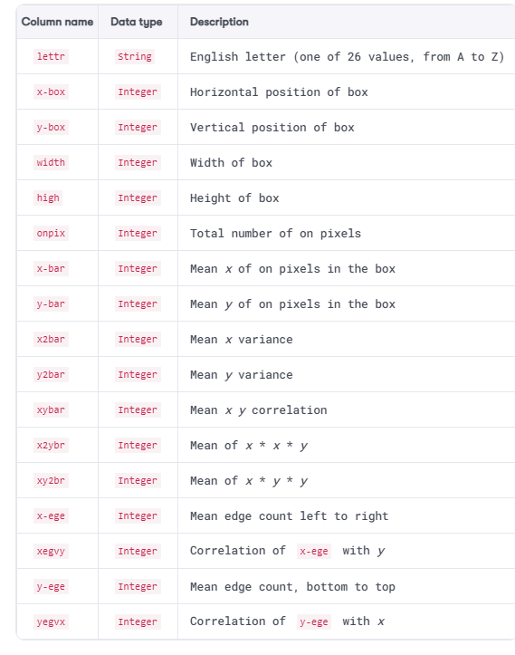
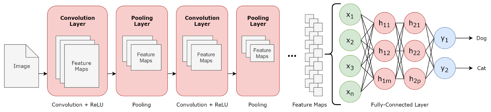
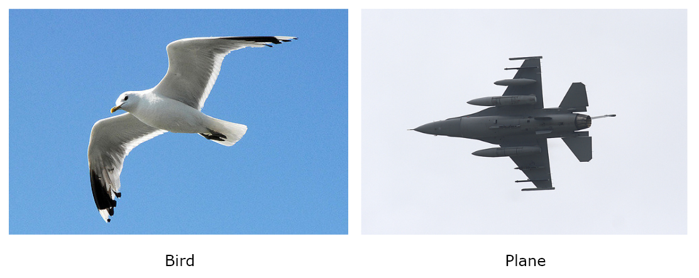
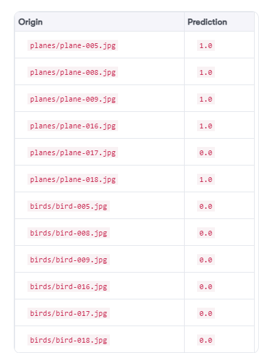
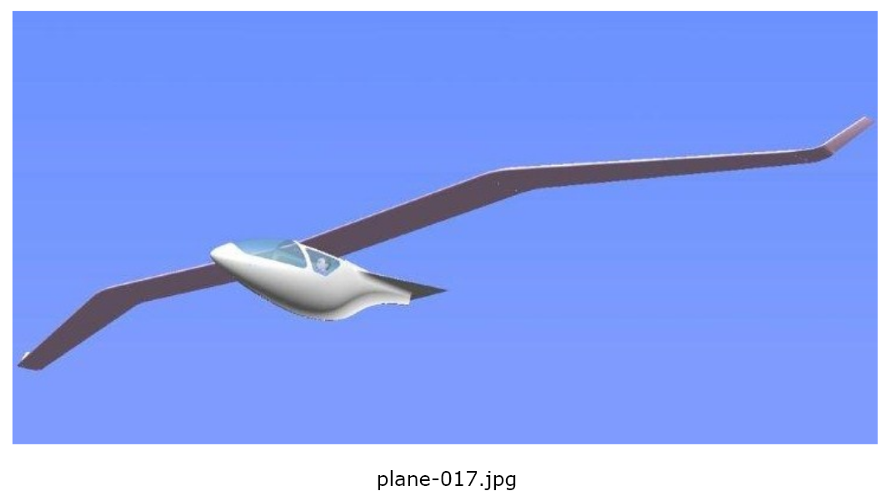
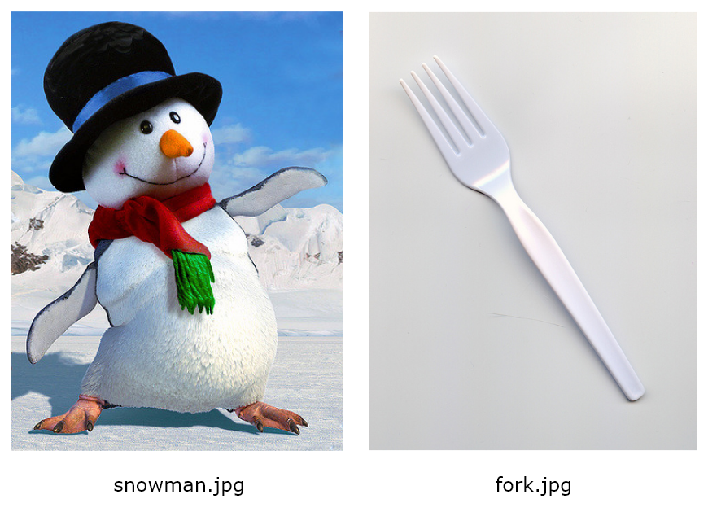
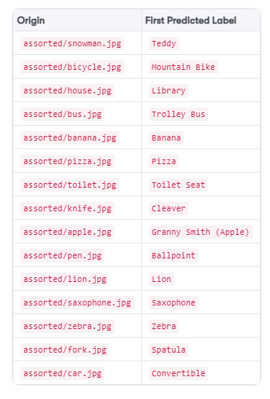

Deep Learning Using Apache Spark
================================

In this lab, we will go on a hands-on exploration of the exciting
and cutting-edge world of deep learning! We will use third-party deep
learning libraries in conjunction with Apache Spark\'s [MLlib] to
perform accurate **optical character recognition** (**OCR**) and
automatically recognize and classify images via the following types of
artificial neural networks and machine learning algorithms:

-   Multilayer perceptrons
-   Convolutional neural networks
-   Transfer learning


Case study 1 -- OCR
===================

A great real-world use case to demonstrate the power of MLPs is that of
OCR. In OCR, the challenge is to recognize human writing, classifying
each handwritten symbol as a letter. In the case of the English
alphabet, there are 26 letters. Therefore, when applied to the English
language, OCR is actually a classification problem that has *k* = 26
possible classes!

**Note:**

The dataset that we will be using has been derived from the **University
of California\'s** (**UCI**) Machine Learning Repository, which is found
at <https://archive.ics.uci.edu/ml/index.php>. The specific letter
recognition dataset that we will use, available from both the GitHub
repository accompanying this course and from
<https://archive.ics.uci.edu/ml/datasets/letter+recognition>, was
created by David J. Slate at Odesta Corporation; 1890 Maple Ave; Suite
115; Evanston, IL 60201, and was used in the paper *Letter Recognition
Using Holland-style Adaptive Classifiers* by P. W. Frey and D. J. Slate
(from Machine Learning Vol 6 \#2 March 91).


MLPs in Apache Spark
====================

Let\'s return to our dataset and train an MLP in Apache Spark to
recognize and classify letters from the English alphabet. If you open
[ocr-data/letter-recognition.data] in any text editor, from either
the GitHub repository accompanying this course or from UCI\'s machine
learning repository, you will find 20,000 rows of data, described by the
following schema:



This dataset describes 16 numerical attributes representing statistical
features of the pixel distribution based on scanned character images,
such as those illustrated in *Figure 7.5*. These attributes have been
standardized and scaled linearly to a range of integer values from 0 to 15. 
For each row, a label column called [lettr] denotes the letter
of the English alphabet that it represents, where no feature vector maps
to more than one class---that is, each feature vector maps to only one
letter in the English alphabet.


Let\'s now use this dataset to train an MLP classifier to recognize
symbols and classify them as letters from the English alphabet:

**Note:**

The following subsections describe each of the pertinent cells in the
corresponding Jupyter notebook for this use case, called
[01-multilayer-perceptron-classifier.ipynb]. This notebook
can be found in the GitHub repository accompanying this course.


1.  First, we import the prerequisite PySpark libraries as normal,
    including [MLlib]\'s [MultilayerPerceptronClassifier]
    classifier and [MulticlassClassificationEvaluator] evaluator
    respectively, as shown in the following code:

```
from pyspark import SparkContext, SparkConf
from pyspark.sql import SQLContext
from pyspark.ml.feature import VectorAssembler
from pyspark.ml.classification import MultilayerPerceptronClassifier
from pyspark.ml.evaluation import MulticlassClassificationEvaluator
```


2.  After instantiating a Spark context, we are now ready to ingest our
    dataset into a Spark dataframe. Note that in our case, we have
    preprocessed the dataset into CSV format, where we have converted
    the [lettr] column from a [string] datatype to a
    [numeric] datatype representing one of the 26 characters in
    the English alphabet. This preprocessed CSV file is available in the
    GitHub repository accompanying this course. Once we have ingested this
    CSV file into a Spark dataframe, we then generate feature vectors
    using [VectorAssembler], comprising the 16 feature columns, as
    usual. The resulting Spark dataframe, called [vectorised\_df],
    therefore contains two columns---the numeric [label] column,
    representing one of the 26 characters in the English alphabet, and
    the [features] column, containing our feature vectors:

```
letter_recognition_df = sqlContext.read
.format('com.databricks.spark.csv')
.options(header = 'true', inferschema = 'true')
.load('letter-recognition.csv')
feature_columns = ['x-box','y-box','width','high','onpix','x-bar',
'y-bar','x2bar','y2bar','xybar','x2ybr','xy2br','x-ege','xegvy',
'y-ege','yegvx']
vector_assembler = VectorAssembler(inputCols = feature_columns,
outputCol = 'features')
vectorised_df = vector_assembler.transform(letter_recognition_df)
.withColumnRenamed('lettr', 'label').select('label', 'features')
```


3.  Next, we split our dataset into training and test datasets with a
    ratio of 75% to 25% respectively, using the following code:

```
train_df, test_df = vectorised_df
.randomSplit([0.75, 0.25], seed=12345)
```


4.  We are now ready to train our MLP classifier. First, we must define
    the size of the respective layers of our neural network. We do this
    by defining a Python list with the following elements:\
    \
    -   The first element defines the size of the input layer. In our
        case, we have 16 features in our dataset, and so we set this
        element to [16].
    -   The next elements define the sizes of the intermediate hidden
        layers. We shall define two hidden layers of sizes [8] and
        [4] respectively.
    -   The final element defines the size of the output layer. In our
        case, we have 26 possible classes representing the 26 letters of
        the English alphabet, and so we set this element to [26]:

```
layers = [16, 8, 4, 26]
```


5.  Now that we have defined the architecture of our neural network, we
    can train an MLP using [MLlib]\'s
    [MultilayerPerceptronClassifier] classifier and fit it to the
    training dataset, as shown in the following code. Remember that
    [MLlib]\'s [MultilayerPerceptronClassifier] classifier
    uses the sigmoid activation function for hidden neurons and the
    softmax activation function for output neurons:

```
multilayer_perceptron_classifier = MultilayerPerceptronClassifier(
maxIter = 100, layers = layers, blockSize = 128, seed = 1234)
multilayer_perceptron_classifier_model =
multilayer_perceptron_classifier.fit(train_df)
```


6.  We can now apply our trained MLP classifier to the test dataset in
    order to predict which of the 26 letters of the English alphabet the
    16 numerical pixel-related features represent, as follows:

```
test_predictions_df = multilayer_perceptron_classifier_model
.transform(test_df)
print("TEST DATASET PREDICTIONS AGAINST ACTUAL LABEL: ")
test_predictions_df.select("label", "features", "probability",
"prediction").show()

TEST DATASET PREDICTIONS AGAINST ACTUAL LABEL:
+-----+--------------------+--------------------+----------+
|label| features| probability|prediction|
+-----+--------------------+--------------------+----------+
| 0|[1.0,0.0,2.0,0.0,...|[0.62605849526384...| 0.0|
| 0|[1.0,0.0,2.0,0.0,...|[0.62875656935176...| 0.0|
| 0|[1.0,0.0,2.0,0.0,...|[0.62875656935176...| 0.0|
+-----+--------------------+--------------------+----------+
```


7.  Next, we compute the accuracy of our trained MLP classifier on the
    test dataset using the following code. In our case, it performs very
    poorly, with an accuracy rate of only 34%. We can conclude from this
    that an MLP with two hidden layers of sizes 8 and 4 respectively
    performs very poorly in recognizing and classifying letters from
    scanned images in the case of our dataset:

```
prediction_and_labels = test_predictions_df
.select("prediction", "label")
accuracy_evaluator = MulticlassClassificationEvaluator(
metricName = "accuracy")
precision_evaluator = MulticlassClassificationEvaluator(
metricName = "weightedPrecision")
recall_evaluator = MulticlassClassificationEvaluator(
metricName = "weightedRecall")
print("Accuracy on Test Dataset = %g" % accuracy_evaluator
.evaluate(prediction_and_labels))
print("Precision on Test Dataset = %g" % precision_evaluator
.evaluate(prediction_and_labels))
print("Recall on Test Dataset = %g" % recall_evaluator
.evaluate(prediction_and_labels))

Accuracy on Test Dataset = 0.339641
Precision on Test Dataset = 0.313333
Recall on Test Dataset = 0.339641
```


8.  How can we increase the accuracy of our neural classifier? To answer
    this question, we must revisit our definition of what the hidden
    layers do. Remember that the job of the neurons in the hidden layers
    is to learn to detect patterns within the input data. Therefore,
    defining more hidden neurons in our neural architecture should
    increase the ability of our neural network to detect more patterns
    at greater resolutions. To test this hypothesis, we shall increase
    the number of neurons in our two hidden layers to 16 and 12
    respectively, as shown in the following code. Then, we retrain our
    MLP classifier and reapply it to the test dataset. This results in a
    far better performing model, with an accuracy rate of 72%:

```
new_layers = [16, 16, 12, 26]
new_multilayer_perceptron_classifier =
MultilayerPerceptronClassifier(maxIter = 400,
layers = new_layers, blockSize = 128, seed = 1234)
new_multilayer_perceptron_classifier_model =
new_multilayer_perceptron_classifier.fit(train_df)
new_test_predictions_df =
new_multilayer_perceptron_classifier_model.transform(test_df)
print("New Accuracy on Test Dataset = %g" % accuracy_evaluator
.evaluate(new_test_predictions_df
.select("prediction", "label")))
```


Convolutional neural networks
=============================

We have seen how MLPs, which receive a single input vector that is then
transformed through one or more intermediate hidden layers, can be used
to recognize and classify small images such as letters and digits in
OCR. However, one limitation of MLPs is their ability to scale with
larger images, taking into account not just individual pixel intensity
or RGB values, but the height, width, and depth of the image itself.

**Convolutional neural networks** (**CNNs**) assume that the input data
is of a grid-like topology, and so they are predominantly used to
recognize and classify objects in images since an image can be
represented as a grid of pixels.


End-to-end neural architecture
==============================

The end-to-end architecture of a convolutional neural network is
illustrated below:





Case study 2 -- image recognition
=================================

In this case study, we will use a pretrained CNN to recognize and
classify objects in images that it has never encountered before.


Deep learning pipelines for Apache Spark
========================================

In this case study, we will access the Inception-v3 TensorFlow deep CNN
via a third-party Spark package called [sparkdl]. This Spark
package has been developed by Databricks, a company formed by the
original creators of Apache Spark, and provides high-level APIs for
scalable deep learning within Apache Spark.

To learn more about Databricks and [sparkdl], please visit the
following links:

-   **Databricks**: <https://databricks.com/>
-   **sparkdl**: <https://github.com/databricks/spark-deep-learning>


Image library
=============

The images that we will use to test the pretrained Inception-v3 deep CNN
have been selected from the **Open Images v4** dataset, a collection of
over 9 million images that have been released under the Creative Common
Attribution license, and which may be found at
<https://storage.googleapis.com/openimages/web/index.html>.

In the GitHub repository accompanying this course, you can find 30 images
of birds ([image-recognition-data/birds]) and 30 images of planes
([image-recognition-data/planes]) respectively. below image
shows a couple of examples of the images that you might find in these
test datasets:





Our goal in this case study will be to apply the pretrained Inception-v3
deep CNN to these test images and quantify the accuracy of a trained
classifier model when it comes to distinguishing between images of birds
and planes within a single test dataset.


PySpark image recognition application
=====================================

Let\'s now take a look at how we can use the Inception-v3 deep CNN via
PySpark to classify test images. In our Python-based image-recognition
application, we perform the following steps (numbered to correspond to
the numbered comments in our Python code file):

**Note:**

The following Python code file, called
[chp07-02-convolutional-neural-network-transfer-learning.py], can
be found in the GitHub repository accompanying this course.


1.  First, using the following code, we import the required Python
    dependencies, including the relevant modules from the third-party
    [sparkdl] package and the [LogisticRegression]
    classifier native to [MLlib]:

```
from sparkdl import DeepImageFeaturizer
from pyspark.sql.functions import *
from pyspark.sql import SparkSession
from pyspark.ml.image import ImageSchema
from pyspark.ml import Pipeline
from pyspark.ml.classification import LogisticRegression
from pyspark.ml.evaluation import MulticlassClassificationEvaluator
```


2.  Unlike our Jupyter notebook case studies, there is no need to
    instantiate a `SparkContext`, as this will be done for us when
    we execute our PySpark application via `spark-submit` on the
    command line. In this case study, we will create a
    [SparkSession], as shown in the following code, that acts as
    an entry point into the Spark execution environment (even if it is
    already running) that subsumes SQLContext. We can therefore use
    [SparkSession] to undertake the same SQL-like operations over
    data that we have seen previously while still using the Spark
    Dataset/DataFrame API:

```
spark = SparkSession.builder.appName("Convolutional Neural Networks - Transfer Learning - Image Recognition").getOrCreate()
```


3.  As of Version 2.3, Spark provides native support for image data
    sources via its [MLlib] API. In this step, we invoke the
    [readImages] method on [MLlib]\'s [ImageSchema]
    class to load our bird and plane test images from the local
    filesystem into Spark dataframes called [birds\_df] and
    [planes\_df] respectively. We then label all images of birds
    with the [0] literal and label all images of planes with the
    [1] literal, as follows:

```
path_to_img_directory = './data/image-recognition-data'
birds_df = ImageSchema.readImages(path_to_img_directory + "/birds")
.withColumn("label", lit(0))
```


```
planes_df = ImageSchema.readImages(path_to_img_directory + "/planes").withColumn("label", lit(1))
```


4.  Now that we have loaded our test images into separate Spark
    dataframes differentiated by their label, we consolidate them into
    single training and test dataframes accordingly. We achieve this by
    using the [unionAll] method via the Spark dataframe API, which
    simply appends one dataframe onto another, as shown in the following
    code:

```
planes_train_df, planes_test_df = planes_df
.randomSplit([0.75, 0.25], seed=12345)
birds_train_df, birds_test_df = birds_df
.randomSplit([0.75, 0.25], seed=12345)
train_df = planes_train_df.unionAll(birds_train_df)
test_df = planes_test_df.unionAll(birds_test_df)
```


5.  As with previous case studies, we need to generate feature vectors
    from our input data. However, rather than training a deep CNN from
    scratch---which could take many days, even with distributed
    technologies---we will take advantage of the pretrained Inception-v3
    deep CNN. To use transfer learning in our case study, we employ the
    [DeepImageFeaturizer] module of the third-party
    [sparkdl] Spark package. The [DeepImageFeaturizer] not
    only transforms our images into numeric features, it also performs
    fast transfer learning by peeling off the last layer of a pretrained
    neural network and then uses the output from all the previous layers
    as features for a standard classification algorithm. In our case,
    the [DeepImageFeaturizer] will be peeling off the last layer
    of the pretrained Inception-v3 deep CNN, as follows:

```
featurizer = DeepImageFeaturizer(inputCol = "image",
outputCol = "features", modelName = "InceptionV3")
```


6.  Now that we have the features from all previous layers of the
    pretrained Inception-v3 deep CNN extracted via transfer learning, we
    input them into a classification algorithm. In our case, we will use
    [MLlib]\'s [LogisticRegression] classifier, as follows:

```
logistic_regression = LogisticRegression(maxIter = 20,
regParam = 0.05, elasticNetParam = 0.3, labelCol = "label")
```


7.  To execute the transfer learning and logistic regression model
    training, we build a standard [pipeline] and [fit] that
    pipeline to our training dataframe, as follows:

```
pipeline = Pipeline(stages = [featurizer, logistic_regression])
model = pipeline.fit(train_df)
```


8.  Now that we have a trained classification model, using the features
    derived by the Inception-v3 deep CNN, we apply our trained logistic
    regression model to our test dataframe to make predictions as
    normal, as shown in the following code:

```
test_predictions_df = model.transform(test_df)
test_predictions_df.select("image.origin", "prediction")
.show(truncate=False)
```


9.  Finally, we quantify the accuracy of our model on the test dataframe
    using [MLlib]\'s [MulticlassClassificationEvaluator], as
    follows:

```
accuracy_evaluator = MulticlassClassificationEvaluator(
metricName = "accuracy")
print("Accuracy on Test Dataset = %g" % accuracy_evaluator
.evaluate(test_predictions_df.select("label", "prediction")))
```


Spark submit
============

We are now ready to run our image recognition application! Since it is a
Spark application, we can execute it via `spark-submit` on the
Linux command line. We can execute the
`spark-submit` program by passing it the following command-line
arguments:


```
> cd ~/Desktop/next-level-python-big-data/machine-learning-apache-spark/Lab06

> spark-submit --master local --packages databricks:spark-deep-learning:1.2.0-spark2.3-s_2.11 02-convolutional-neural-network-transfer-learning.py
```


Image-recognition results
=========================

Assuming that the image-recognition application ran successfully, you
should see the following results output to the console:




The [Origin] column refers to the absolute filesystem path of the
image, and the value in the [Prediction] column is [1.0] if
our model predicts that the object in the image is a plane and
[0.0] if our model predicts that the object in the image is a
bird. Our model has an astonishingly high accuracy of 92% when run on
the test dataset. The only mistake that our model made was on
[plane-017.jpg], illustrated in *Figure* *7.16*, which was
incorrectly classified as a bird when it was in fact a plane:





If we look at [plane-017.jpg] in *Figure 7.16*, we can quickly
understand why the model made this mistake. Though it is a man-made
plane, it has been physically modeled to look like a bird for increased
efficiency and aerodynamic purposes.

In this case study, we used a pretrained CNN to featurize images. We
then passed the resulting features to a standard logistic regression
algorithm to predict whether a given image is a bird or a plane.


Case study 3 -- image prediction
================================

In case study 2 (image recognition), we still explicitly labelled our
test images before training our final logistic regression classifier. In
this case study, we will simply send random images to the pretrained
Inception-v3 deep CNN without labeling them and let the CNN itself
classify the objects contained within the images. Again, we will take
advantage of the third-party [sparkdl] Spark package to access the
pretrained Inception-v3 CNN.

The assortment of random images that we will use have again been
downloaded from the **Open Images v4 dataset**, and may be found in the
GitHub repository accompanying this course under
[image-recognition-data/assorted]. *Figure 7.17* shows a couple of
typical images that you may find in this test dataset:




PySpark image-prediction application
====================================

In our Python-based image-prediction application, we go through the
following steps (numbered to correspond to the numbered comments in our
Python code file):

**Note:**

The following Python code file, called
[03-convolutional-neural-network-image-predictor.py], can be
found in the GitHub repository accompanying this course.


1.  First, we import the required Python dependencies as usual,
    including the [DeepImagePredictor] class from the third-party
    [sparkdl] Spark package, as shown in the following code:

```
from sparkdl import DeepImagePredictor
from pyspark.sql import SparkSession
from pyspark.ml.image import ImageSchema
```


2.  Next, we create a [SparkSession] that acts as an entry point
    into the Spark execution environment, as follows:

```
spark = SparkSession.builder.appName("Convolutional Neural Networks - Deep Image Predictor").getOrCreate()
```


3.  We then load our assortment of random images into a Spark dataframe
    using the [readImages] method of the [ImageSchema] class
    that we first encountered in the previous case study, as shown in
    the following code:

```
assorted_images_df = ImageSchema.readImages(
"./data/image-recognition-data/assorted")
```


4.  Finally, we pass our Spark dataframe containing our assortment of
    random images to [sparkdl]\'s [DeepImagePredictor],
    which will apply a specified pretrained neural network to the images
    in an effort to classify the objects found within them. In our case,
    we will be using the pretrained Inception-v3 deep CNN. We also tell
    the [DeepImagePredictor] to return the top 10
    ([topK=10]) predicted classifications for each image in
    descending order of confidence, as follows:

```
deep_image_predictor = DeepImagePredictor(inputCol = "image",
outputCol = "predicted_label", modelName = "InceptionV3",
decodePredictions = True, topK = 10)
predictions_df = deep_image_predictor.transform(assorted_images_df)
predictions_df.select("image.origin", "predicted_label")
.show(truncate = False)
```


To run this PySpark image-prediction application, we again invoke
`spark-submit` via the command line, as follows:

```
> cd ~/Desktop/next-level-python-big-data/machine-learning-apache-spark/Lab06

> spark-submit --master local --packages databricks:spark-deep-learning:1.2.0-spark2.3-s_2.11 03-convolutional-neural-network-image-predictor.py
```


Image-prediction results
========================

Assuming that the image-prediction application ran successfully, you
should see the following results output to the console:



As you can see, the pretrained Inception-v3 deep CNN has an astonishing
ability to recognize and classify the objects found in images. Though
the images provided in this case study were relatively simple, the
Inception-v3 CNN has a top-five error rate--- how often the model fails
to predict the correct answer as one of its top five guesses---of just
3.46% on the ImageNet image database. Remember that the Inception-v3 CNN
attempts to classify entire images into 1,000 classes, hence a top-5
error rate of just 3.46% is truly impressive, and clearly demonstrates
the learning ability and power of not only convolution neural networks
but ANNs in general when detecting and learning patterns!

Summary
=======

In this lab, we went on a hands-on exploration through the exciting
and cutting-edge world of deep learning. We developed applications to
recognize and classify objects in images with astonishingly high rates
of accuracy, and demonstrated the truly impressive learning ability of
ANNs to detect and learn patterns in input data.

